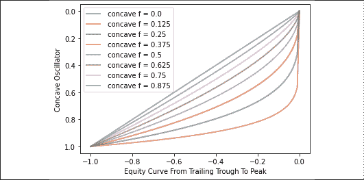
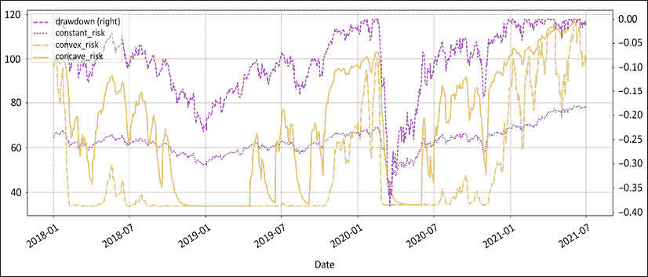
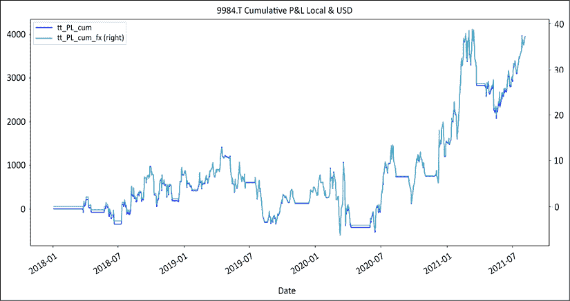

# 八、头寸规模：资金是在资金管理模块中产生的

传奇投资者一直强调同一件事:风险管理是长期卓越回报的关键。选股很性感，但被大大高估了。风险管理很无聊，但却被大大低估了。在执行交易者英语中，市场专家专注于挑选正确的原料，市场奇才专注于获得正确的配方。

最终，长期几何回报的主要决定因素是头寸规模。多头的扩张性质不会迫使市场参与者考虑头寸规模。毕竟，一个好的 AAPL 可以让一篮子烂苹果看起来更好。尽管头寸规模算法不好，它们也能存活。卖空者没有对数价格下跌的奢侈。在这一章中，我们将考虑一些坏的头寸规模算法的经典例子。这些是末日仓位估算的四骑士。

在我们仔细研究了常见的陷阱之后，我们将考虑一个不仅有效，而且能最大限度地减少错误决策的破坏性影响的策略。

我们将讨论以下主题:

*   导入库
*   启示录仓位大小的四骑士
*   头寸规模是情感资本和金融资本之间的纽带
*   比较位置调整算法
*   完善您的风险预算

您可以通过以下链接访问本章所有图片的彩色版本:[https://static . packt-cdn . com/downloads/9781801815192 _ color images . pdf](https://static.packt-cdn.com/downloads/9781801815192_ColorImages.pdf)。你也可以通过这本书的 GitHub 资源库获得本章的源代码:[https://GitHub . com/Packt publishing/algorithm-Short-Selling-with-Python-Published-by-Packt](https://github.com/PacktPublishing/Algorithmic-Short-Selling-with-Python-Published-by-Packt)

# 导入库

对于这一章和本书的其余部分，我们将使用`pandas`、`numpy`、`yfinance`和`matplotlib`库。因此，请记住首先导入它们:

```py
# Import Libraries
import pandas as pd
import numpy as np
import yfinance as yf
%matplotlib inline
import matplotlib.pyplot as plt 
```

# 启示录仓位大小的四骑士

> “只听你想看起来像的人的建议。”
> 
> 吉尔伯特·伯努特，父亲，超级英雄，20 世纪默默无闻的哲学家

在富达的时候，我曾经在其他经理的投资组合中运行我的算法。我无拘无束的雄心是帮助我的同事们一次提高 0.01%的业绩。虽然这看起来不算多，但即使是每笔交易在一年内复合增长 1 个基点，也足以将排名从第二个四分位数提升至前十名的稀薄氛围中。

我很快意识到，同样的股票不断出现在所有的投资组合中。将聪明、热情的人放在一个大学氛围中，健康的异花授粉自然随之而来。

更耐人寻味的是，尽管持股分散程度较低，但表现却不尽相同。人们会认为类似的持股会产生类似的业绩。然而，在业绩和跟踪误差方面存在差异，即回报率相对于基准的波动性。由于同样的问题存在于大多数投资组合中，选股显然不是业绩的主要驱动力。真正起作用的是职位大小。钱是在钱管理模块里赚的。

现在，在市场上赚钱的悖论是:能赚钱的模块也是策略中最无聊的部分。每个人都想向世界大喊，他们几年前买了网飞或亚马逊。然而，没有人会承认他们只有边际头寸，也不知道他们应该买多少。然后，他们想知道为什么尽管他们挑选了优秀的股票，但他们的表现却一直不佳。

因此，金钱管理的原则被放到了一个遥远的事后，一些需要做的琐事，比如倒垃圾或者支付水电费。这导致市场参与者推广灾难性的资金管理做法。在 execution trader English 中，由于无知的下注规模，通过选择正确的股票而获得的所有潜在收益都化为乌有。

让我们来看看这个行业目前采用的四种最具破坏性的资金管理技术。

## 骑手 1:流动性是熊市的货币

> "你可以随时退房，但你永远不能离开。"
> 
> –加州唐·亨利酒店

流动性差的股票的大量头寸让许多有才华的基金经理损失惨重。小盘股和流动性差的股票就像船只和豪华玩具。你可以随时购买，但你永远不能离开。如果你不能在不损害市场影响的情况下平仓，你就不拥有它。它拥有你。

流动性是熊市的货币。当“救赎之歌”开始播放时，经理们被迫清算他们能清算的一切，而不一定是他们愿意清算的。

这给它们留下了流动性不足的碎片，从而延续了赎回的恶性循环。小型股在熊市中尤其脆弱。流动性蒸发，买卖价差扩大。那些在金融大危机(GFC)期间试图套现非流动性资产的人很快意识到，买卖价差之大，足以让一艘超级油轮毫发无损地停靠码头。

关于容量的补充说明。投资者的第一个问题是关于能力:在回报开始减少之前，一个经理可以持有多少资产。投资者知道，最强劲的回报出现在早期，那时基金规模较小，经理们也很饥渴。然而，他们希望在扣动扳机之前看到一些记录。因此，他们尽可能地观望，但不要太多，以确保他们仍将享受一些体面的回报。不仅仅是数学上的近似，现实生活中的严峻考验是惰性。当经理们因为市场影响而放弃交易时，他们已经达到了饱和点。正如我的导师 June-Yon Kim 经常说的那样:“当惰性蔓延时，能力就产生了。”如果你发现自己因为惯性而传递信号，这似乎是正确的做法，要么你很懒，要么你的资产规模太大。不管怎样，这都是一记警钟。

## 骑士 2:平均下降

> “失败者一般的失败者。”
> 
> 保罗·都铎·琼斯

平均向下仍然是基本面市场参与者中流行的方法。随着价格下跌，估值看起来更便宜，所以他们增加了现有的亏损头寸。增加亏损头寸会恶化交易优势公式中四个变量中的三个:亏损率和平均亏损增加，盈利率下降。唯一不受影响的变量是平均利润，这是任何人都无法控制的。此外，分配给输家的额外资本必须有来源。它要么来自新的现金注入，要么来自获利头寸的缩减。总之，向下平均可以总结为:“砍你的赢家，跑你的输家。”成功的秘诀难道不是“砍掉失败者，管理成功者”吗？

金融服务业充斥着由一系列回溯测试、优化和令人昏昏欲睡的白皮书支持的神秘理论。与其停留在抽象的世界里，一个简单的评估它们有效性的方法是与现实世界进行比较。在赌博的世界里，平均下降被称为鞅 T2。每一个新手赌徒都想出了一个打破赌场的迭代。每输一次，就把你的赌注增加一倍，然后你最终会拿回你的钱。首先，这种策略忽略了游程理论。

从长远来看，掷硬币有 50%的可能性。然而，这并不是整齐的首尾相接。每一轮都独立于前一轮。有时正面会连续出现 8、9 或 10 次。这需要无限的资本。其次，最有利的结果是收支平衡。这意味着在此之前的任何结果都有一个有趣的统计特性，叫做**毁灭的确定性**。总而言之，赌场里有大理石、油画和免费的酒，新手赌徒们开着他们的破车一文不名地回家，这是有原因的。

如果平均下跌在统计学上显然是破产了，那么为什么它在专业投资者中仍然如此流行？在他引人入胜的自传《所有市场的人》中，爱德华·索普将向下平均描述为锚定偏差。市场参与者在他们进入一个位置的时候，锚定了一个关于股票价值的假设。价值是他们赋予估值的主观意义，或者如沃伦·巴菲特所说:“价格是你付出的东西。价值就是你得到的。”随后，他们的判断将总是受到初始成本的影响。如果一只股票在他们第一次以 10 美元买入时看起来很便宜，那么它在 9 美元时一定很便宜。市场参与者假设他们的分析是正确的，而市场暂时是错误的。在市场纠正这种低效率之前再增加一部分可能会带来更大的利润。理论上讲，是有道理的。

实际上，“这很复杂。”当赌注很小时，情感投入仍然很少。增加另一部分会增加压力。大脑突然从 1 美元的买入费跳到了高辊道上。一大堆在劫持思考大脑之前并不存在的情感。现在风险很高，自我不能犯错。正如我们在*第 7 章*、*中看到的，提高你的交易优势*，有了止损的心理，在这里表现为“需要正确”的自我总是取代盈利的义务。

传奇投资者强调风险管理的重要性。他们还在市场面前谈论谦逊。市场奇才综合了数学和自我。鞅的拥护者遵循统计破产方法；简短统计。他们还通过双倍下注来揭穿市场先生的虚张声势。数学短，自我长听起来像是金融服务业短期职业生涯的秘诀。

## 骑士 3:坚定的信念

> “我感觉很好！”
> 
> 詹姆斯·布朗，教父

信念是最差和最好的投资者都使用的仓位调整算法。最差的投资者会提出一个投资论点。然后，他们用一些“大胆”的赌注向世界传播他们的信念:“要么做大，要么回家。”

不幸的是，t-stat，一种统计稳健性的度量，不提供心理稳健性。当市场参与者大举押注时，他们会失去公正性。他们的自我渴望得到认可。高确信度是一个没有统计有效性“感觉良好”的赌注大小。果然，感觉良好的明显交易很少是最赚钱的交易。

现在，最成功的投资者也会下大赌注。不同之处在于他们用风险单位来表达信念。这意味着他们开发一个论题，首先量化风险，然后相应地调整头寸。乔治·索罗斯以豪赌闻名。虽然每个人都记得做空英镑的交易，但很少有人知道长期资本管理**T2**LTCM**的故事。据当时在索罗斯店里工作的传奇交易员尼德霍夫(Victor Niederhoffer)说，在 LTCM 股市崩盘期间，他通过减少亏损获得了大量交易员奖金。这些都是经过计算的风险单位。**

## 骑士 4:同等重量

同等权重是基本面选股者的基本要求。他们依靠自己的选股能力来创造业绩。所有的选股大致都一样好，所以他们不认为有必要对仓位进行不同的调整。

投资组合管理不是民主的实践。平等的机会不会带来毁灭，但它可能会阻止你实现你的长期目标。不是所有的股票都有相同的贝塔系数。不景气的公用事业公司没有活跃的网络股那样的波动特征。通过在头寸规模级别忽略 beta，波动性在投资组合级别重新出现。波动的股票将推动整体投资组合的波动。由于投资者对波动性做出反应，因此建议根据他们的波动性或 Beta 来确定仓位。在执行交易者英语中，请记住，如果你给你的想法同等的权利，你的资金曲线也会同等的左转。

这将我们引向一条有趣的道路。有没有一个机构投资者知道的最优头寸规模算法？

# 头寸规模是情感资本和金融资本之间的纽带

> “这是一个伟大的实验，原因有很多。它应该成为任何对金融或赌博感兴趣的人的基础教育的一部分。”
> 
> –爱德华·索普，所有市场的(超级)人

Elm 的创始人、LTCM 的前交易员维克多·哈格尼对 61 名志愿者进行了一项实验，这些志愿者包括金融专业的高材生和经验丰富的投资专业人士。参与者获得 25 美元的启动资金，并被告知投掷一枚虚拟硬币 30 分钟，并被告知，“硬币有 60%的概率出现正面，你可以在每枚硬币上下注正面或反面。”你赌多少？似乎有一个公式可以计算出能使长期几何回报最大化的最佳下注规模。凯利准则公式为:

```py
def kelly(win_rate,avg_win,avg_loss):  
    # Kelly = win% / abs(avg_loss%) - loss% / avg_win% 
    return win_rate / np.abs(avg_loss) - (1-win_rate) / avg_win 
```

尽管参与者的血统和所谓的复杂程度不同，结果却大相径庭...平淡无奇。只有 21%的球员达到了最高限额。尽管有 60%的几率对他们有利，但那些无畏的专业金融人士中有高达 28%的人设法破产了！有些人注定要在破产基金经理称为**管理**的避难所里寻求庇护...

现在，让我们玩同样的游戏，但这次增加赌注。让我们从你一生的积蓄开始。上次，在 300 次翻转后，微薄的 25 美元的预期回报超过了 300 万美元。现在，你知道几率和公式。这一次，赌上你一生的积蓄会让你远远领先于比尔盖茨、沃伦巴菲特和杰夫·贝索斯。

如果这么容易，为什么没有人能那么快变得富有？这里有一个陷阱:连败。扔硬币没有记忆。每次翻转都独立于前一次。即使长期概率是 60%，也会出现一些连续亏损的条纹。

如果你每次下注 20%的资金，这就是你一生的积蓄在连败中的样子。


图 8.1:每次押 20%的风险时的资本消耗

3 次亏损后，你一生的积蓄将会减半。五次失败后，只有三分之一会留下。在不到 1 分钟的时间里，你辛辛苦苦攒下的一半积蓄(或者对于金融专业人士来说，是不义之财)化为乌有，你还会坚持数学上正确的计划吗？很有可能，在某些时候，你的大脑会说停止。

这里有四个重要的教训:

1.  61 名参与者中只有 5 人知道凯利标准。这引发了关于金融课程的令人不安的问题。如果从来没有人教过学生如何下注，他们怎么可能赢得一个叫做股票市场的概率游戏呢？教授有效市场假说**(**EMH**)就像在青霉素被发现很久之后，给医学生教授希波克拉底体液一样。正如对冲基金经理爱德华索普(Edward Thorp)所写的那样:“从许多方面来看，这都是一项伟大的实验。它应该成为任何对金融或赌博感兴趣的人的基础教育的一部分。”**
***   仓位大小决定了任何策略的长期几何收益。赌得太保守，你最终会赚得比你能赚的少。赌得太激进，你最终会输得比你应该输的多得多。在执行交易者英语中，下注太小，你就没有生意。赌注太大，你会失去你的生意。*   凯利标准或*最优 f* 可能是将产生最高长期几何回报的头寸规模算法。这并不意味着专业基金经理应该无条件采用它们。一级方程式赛车可能是最快的车辆，但它们不是用来在当地杂货店买牛奶的。正如我们将在*第三部分*、*中看到的，多空博弈:构建多空产品*，投资者用业绩换取回报。因此，市场参与者通常使用分数凯利或者更简单的算法进行交易。*   头寸规模不仅仅是一个数学练习。头寸规模是金融资本和情感资本之间的关键连接。耗尽前者，需要时间和努力来重建资本。这是一个复杂的问题，但并不复杂。有一个最优解。另一方面，打破后者和*的游戏超过*。实际上，心理学取代了数学。每个市场参与者都遇到过“害怕扣动扳机”或者在暴跌之前下了太多的大赌注。资本保值是最重要的，尤其是它的情感方面。**

 **这很好地引导我们进入下一部分。

# 你的大脑可以交易的仓位大小

> “我不怕，我天生就是干这个的。”
> 
> -圣女贞德，自由战士

定位算法是数学家为功能性精神病患者设计的。他们没有意识到坐在驾驶座上的内心白痴。我们偏离理性下注规模的原因与逻辑无关。在本章开始的有偏见的硬币游戏中，在连续第二次失败后，你可能会更保守地赌上你一生的积蓄，即使理性的选择是在整个实验中坚持下去。

圣女贞德是法国自由战士，也是英国退出欧盟的最初发明者。年仅 16 岁的她就有了将英国人赶出法兰西王国的想法。在法国人的集体想象中，圣女贞德因两件事而被铭记。第一个是如此悲惨，以至于一直困扰着法国人。

她被抓获，遭受酷刑，最终在鲁昂的一个公共场所被烤。不太好，但是众所周知，中世纪有点像中世纪。其次，她以幻听出名。当股票开始钻足够深的洞，以打击投资组合中的页岩气时，我们内心的圣女贞德就醒了。我们开始听到声音。我们被恐惧麻痹了。皮质醇充斥着前额叶皮层，或者说“思考大脑”，我们甚至放弃了“免费”交易。

底线是，我们内心的白痴只理解两种仓位大小:太少或太多。当一切都很好的时候，好东西永远不够。当一切似乎都不起作用时，总是有太多的坏事。

这就引出了第一个要点:风险必须有边界。

## 建立风险等级

风险需要在最小值和最大值之间振荡。这些界限可以是上带的凯利分数，例如 30-50%。可变上波段的优点是流动性。除非你尝试一下，否则你不知道你的系统能承受多大的风险。也许你冒了太多或太少的风险。两个考虑因素:波动性是集中度的函数，头寸数量本身是每笔交易风险的函数。如果你的目标是拥有一个多样化的低波动性投资组合，设定上限可能也是明智的。

另一方面，较低的带可以是严格的最小值，例如 0.10%-0.15%。确保您的系统在连续亏损期间继续交易。可变的较低波段可能导致头寸规模为负值。这导致交易暂停。如果系统不能产生新的交易，它就不能通过交易摆脱困境。

我们内心的白痴总是欺骗我们在顶部赌得太多，在底部赌得太少。我们都经历过。停止疯狂的方法是在内心的白痴醒来之前让思考的大脑参与进来。做到这一点的方法是设定界限:

*   最小风险:如果你不买至少一张彩票，赢得彩票就不容易。你必须继续交易来摆脱亏损。经典的“害怕扣动扳机”本质上是一个头寸规模问题。有一个足够小的尺寸，你会说“嘿，为什么不呢？”最小风险介于系统运行的最小规模和“害怕扣动扳机”发生前的最大规模之间。
*   **Maximum risk**: This is a function of the risk appetite of your investors. When they say they can stomach a -20% drop, what they really mean is you will enter a Bob Marley market, that is, a "redemption song", after a -10% drawdown.

    无论你认为投资者的容忍度有多高，这个数字的三分之一都是一个合理的近似值。最大风险也是你操作的股票数量和你的平均胜率的函数。

如果你的策略保持在这些范围内，它将是安全的。下一步是制造一个变速器，让你在最小和最大风险之间换档。

在这个关头，我们明白需要将一些来自市场的反馈机制纳入我们的风险偏好，这将引导我们进入下一部分。

## 股票曲线振荡器——避免经典股票曲线交易的二元效应

你会如何看待只在一档开车的人？几乎不是诺贝尔奖的材料。欢迎来到金融服务行业，在这里，天才们会在牛市和熊市中以一档或五档的速度驱动自己的投资组合。持续的风险就像兰博基尼卡在第一档一样有效。当你的风格奏效时，多冒一些有计划的风险。如果没有，就专注于资本保护。

根据业绩调整风险被称为**权益曲线交易**。经典的股票曲线交易使用移动平均线交叉或突破等方法。当股票曲线穿过均线或创出新高时，风险会突然从胆小变为大胆。

这种方法落后于市场。它从权益基础水平衡量进展。例如，当股本水平从 100 升至 105 时，则可增加 0.1%的额外风险。为了说明这种机制，想象一下带某人去一辆只有一档和五档的车约会。一旦你在一档直线上行驶了一段时间，你就会换到五档，可能正好赶上下一个弯道。

如果你想增加遗传基因的机会，你和你的旅伴可能会喜欢更平稳的旅程。简化的凸位置尺寸算法中的振荡器是自动变速箱，它将确保从最小风险到最大风险的平稳而舒适的过渡。

滞后是经典股票曲线交易的主要问题。避免滞后的最简单方法是测量从峰值的下降，而不是从底部的上升。基本上，你会一直以最佳速度推动投资组合，但只有在必要时才会减速。

方法如下:

*   **提款容忍度**:这是如果有 *X* 的提款，将部署的资本的最小部分。例如，一家著名的对冲基金有-5%的提款容忍度，在此之后，其管理的资产将减少 50%。分配一小部分资本就像减少风险一样。这个系统要么承担更少的风险，要么投入更少的资金。综合来看，结果是一样的。
*   **压降振荡器**:使用上述公差重设压降基准。建立一个振荡指标，跟踪当前的股票曲线和它的波峰和波谷...
*   **振荡器的形状**:凹形或凸形。把这个精致的小珠宝想象成汽车中的自动变速器。经典的股票曲线交易有一个固有的滞后。风险下降的速度不够快，不足以减少冲击。相反，在下降之后，恢复是缓慢的。

凸面和凹面加速下降和恢复，如以下理论示例所示:

```py
def concave(ddr, floor):
    '''
    For demo purpose only
    '''
    if floor == 0:
        concave = ddr
    else:
        concave = ddr ** (floor)
    return concave

# obtuse 
def convex(ddr, floor):
    '''
    obtuse = 1 - acute
    '''
    if floor == 0:
        convex = ddr
    else:
        convex = ddr ** (1/floor)
    return convex

# instantiate minimum Kapital 
floor = np.arange(0,1,0.125)
# print('floor', floor)

x = -np.linspace(0, 1, 100)

fig, ax = plt.subplots()
for i,f in enumerate(floor):
    y = concave(ddr=-x, floor=f)
    current_label = f' concave f = {f:.3}'
    ax.plot(x, y, linewidth=2, alpha=0.6, label=current_label)

ax.legend()
plt.ylabel('Concave Oscillator')
plt.xlabel('Equity Curve From Trailing Trough To Peak')
ax.set_ylim(ax.get_ylim()[::-1])
plt.show()

fig, ax = plt.subplots()
for i,f in enumerate(floor):
    y = convex(ddr=-x, floor=f)
    current_label = f' convex f = {f*10:.3}'
    ax.plot(x, y, linewidth=2, alpha=0.6, label=current_label)
ax.legend()

plt.ylabel('Convex Oscillator')
plt.xlabel('Equity Curve From Trailing Trough To Peak')
ax.set_ylim(ax.get_ylim()[::-1])
plt.figure(figsize=(20,8))
plt.show() 
```

该函数的输出如下图所示:



图 8.2:不同水平的凹面振荡器


图 8.3:不同级别的凸振荡器

凸是对角线上方的和对角线下方的凹。这条 45 度线是直线下降。当加上压降容差时，这已经足够好了。当最小风险与最大风险之比很高时，凹度和凸度就能真正发挥作用。例如，如果最小风险为–0.25%，最大风险为–1%，那么凹度或凸度都会有助于传递。

接下来，让我们来说明这个振荡器在实践中是如何工作的。我们将通过使用雅虎财经下载德国 DAX 指数调整后的收盘数据来模拟股票曲线。接下来，我们实例化一个数据框架，并使用`cummax()`方法计算峰值权益。我们继续计算从峰值的下降。

`dd_tolerance`在降低风险之前，我们愿意容忍的提款容忍度。对于良好的测量，我们绘制数据帧。这为我们的工作提供了一个良好的起点:

```py
ticker = '^GDAXI'
dd_tolerance = -0.1

equity = pd.DataFrame()
start = '2017-12-31'
end = None
equity['equity'] =  yf.download(tickers= ticker,start= start, end = end,
                        interval = "1d",group_by = 'column',
                        auto_adjust = True, prepost = True,
                        treads = True, proxy = None)['Close']

equity['peak_equity'] = equity['equity'].cummax()
equity['tolerance'] = equity['peak_equity'] * (1 + dd_tolerance )
equity['drawdown'] = equity['equity'] /equity['equity'].cummax() -1

equity.plot(style = ['k','g-.','r-.','m:'] ,
            secondary_y=['drawdown'], figsize=(20,8),grid=True)
equity.columns 
```

您应该观察如下图表:


图 8.4:权益曲线、权益峰值、提款和提款容差带

一个观察从一开始就影响了它。如果这条权益曲线接近你真实的权益曲线，那就坚持周日烧烤，给容易上当的游客写时事通讯，或者给无聊的富家子弟讲授**有效市场假说** ( **EMH** )。这张图表显示了冒名顶替综合症。

图表顶部的虚线是下降。画在副 *y* 轴上。权益曲线上方和下方的两条虚线是最高权益和提款容忍度。如果权益曲线低于较低的线，那么风险应该降低。如下面的虚线所示，权益曲线在容差曲线下花费了相当多的时间。因此，我们预计将在一段时间内以最低风险进行交易。

接下来，我们将计算沿着这条权益曲线我们应该承担多大的风险。根据前面的理论讨论，风险的范围介于最小值和最大值之间。下面这个小功能是有经验的交易者最好的安眠药。它的价值是这本书的好几倍:

```py
def risk_appetite(eqty, tolerance, mn, mx, span, shape):
    '''
    eqty: equity curve series
    tolerance: tolerance for drawdown (<0)
    mn: min risk
    mx: max risk
    span: exponential moving average to smoothe the risk_appetite
    shape: convex (>45 deg diagonal) = 1, concave (<diagonal) = -1, else: simple risk_appetite
    '''
    # drawdown rebased
    eqty = pd.Series(eqty)
    watermark = eqty.expanding().max() 
    # all-time-high peak equity
    drawdown = eqty / watermark - 1 
    # drawdown from peak
    ddr = 1 - np.minimum(drawdown / tolerance,1) 
    # drawdown rebased to tolerance from 0 to 1
    avg_ddr = ddr.ewm(span = span).mean() 
    # span rebased drawdown

    # Shape of the curve
    if shape == 1: # 
        _power = mx/mn # convex 
    elif shape == -1 :
        _power = mn/mx # concave
    else:
        _power = 1 # raw, straight line
    ddr_power = avg_ddr ** _power # ddr 

    # mn + adjusted delta
    risk_appetite = mn + (mx - mn) * ddr_power 

    return risk_appetite 
```

这就是的工作方式:

1.  从`eqty`系列计算峰值权益，金融克理奥尔语中的水印。
2.  使用压降容差计算压降和再基准压降。使用指数移动平均平滑平均重计基数的下降。
3.  选择曲线的形状:凹形(`-1`)、凸形(`1`)或线形(其他任何形状)。
4.  计算风险偏好振荡器。

接下来，我们通过股权曲线运行几行代码来计算整个期间的风险预算。风险预算是我们准备承担风险的股本的一部分。例如，如果我们使用-0.50%的不变风险权益，它将是当前权益乘以-0.50%。

在下面的例子中，我们使用了三个风险级别:最低为-0.25，最高为-0.75%，平均为-0.50%。出于练习的目的，平均风险是恒定的处于风险中的权益。下面是源代码:

```py
eqty= equity['equity']
tolerance= dd_tolerance
mn= -0.0025 
mx= -0.0075 
avg = (mn + mx)/2
span= 5 
shape = 1
equity['constant_risk'] = -equity['equity'] * avg
equity['convex_risk'] = -risk_appetite(eqty, tolerance, mn, mx, span, shape=1) * equity['peak_equity'] 
equity['concave_risk'] = -risk_appetite(eqty, tolerance, mn, mx, span, shape=-1) * equity['peak_equity'] 

equity[['equity', 'peak_equity', 'tolerance',
        'constant_risk','convex_risk','concave_risk']].plot(figsize= (20,8),grid=True,
    secondary_y=['constant_risk','convex_risk','concave_risk'],
    style= ['k','g-.','r-.','b:','y-.', 'orange'])

equity[['drawdown','constant_risk','convex_risk','concave_risk']].plot(grid=True,
    secondary_y=['drawdown'],style= ['m--','b:','y-.', 'orange'], figsize= (20,8) ) 
```

请注意，恒定风险乘以当前权益水平，而凹和凸都使用峰值权益。最后两项在计算中纳入了提款。

我们有和以前一样的权益曲线，还有峰值和容忍度。然后，我们有两张风险预算图。


图 8.5:权益曲线、峰值和提款容忍度。凹的、凸的和不变的风险资产

实线表示的凹面是迄今为止反应最灵敏的风险预算。它反映了权益曲线。凸形虚线是三者中最保守的。它将在最小的风险下停留更长时间，但将在持续上升趋势中做出积极反应。不变的风险，虚线，完全没有太大波动。虽然从表面上看，这似乎不是一件坏事，但它可能会对股票曲线造成严重损害。例如，中间部分会更明显。归根结底，当事情出错时，选择不降低风险也是一个风险管理决策，只是不是一个好的决策。

下一张图描绘了风险预算和提款。



图 8.6:下降、凹入、凸出和不变权益风险

上图显示了振荡器如何响应压降。相比之下，持续风险资产看起来既生硬又简单。随着中段水位下降加深和恶化，持续风险变得过于冒险。相反，当提款很少时，持续风险无法利用这些机会。与等权或鞅相比，这种头寸规模算法并不差。它只是不成熟。

现在，你应该选择凹面还是凸面？对你来说，最佳的数学答案可能不是正确的。波尔多、勃艮第、还是罗讷北部的葡萄酒更好？对于那些自古以来就困扰着人类的深刻的存在主义问题，没有正确或错误的答案。

# 比较位置调整算法

我们举一个的例子来进一步说明原理。让我们使用完全相同的信号和启动资金。然后，让我们使用各种位置调整算法。让我们计算每个头寸规模算法的权益曲线。目标是了解头寸规模对回报的影响程度。

出于演示的目的，我们将使用海龟来循环使用我们的软银，以及第五章*中的`regime_breakout()`函数。同样，请不要在家里这样做，因为这太简单了，无法部署到专业投资产品中:*

 *```py
def regime_breakout(df,_h,_l,window):
    hl =  np.where(df[_h] == df[_h].rolling(window).max(),1,
                                np.where(df[_l] == df[_l].rolling(window).min(), -1,np.nan))
    roll_hl = pd.Series(index= df.index, data= hl).fillna(method= 'ffill')
    return roll_hl

def turtle_trader(df, _h, _l, slow, fast):
#### removed for brevity: check GitHub repo for full code ####
    return turtle
# CHAPTER 8

ticker = '9984.T' # Softbank
start = '2017-12-31'
end = None
df =  round(yf.download(tickers= ticker,start= start, end = end, 
                        interval = "1d",group_by = 'column',auto_adjust = True, 
                              prepost = True, treads = True, proxy = None),0)

ccy_ticker = 'USDJPY=X'
ccy_name = 'JPY'
ccy_df = np.nan

df[ccy_name] =  round(yf.download(tickers= ccy_ticker,start= start, end = end, 
                        interval = "1d",group_by = 'column',auto_adjust = True, 
                              prepost = True, treads = True, proxy = None)['Close'],2)
df[ccy_name] = df[ccy_name].fillna(method='ffill')
slow = 50
fast = 20 
df['tt'] = turtle_trader(df, _h= 'High', _l= 'Low', slow= slow,fast= fast)
df['tt_chg1D'] = df['Close'].diff() * df['tt'].shift()
df['tt_chg1D_fx'] = df['Close'].diff() * df['tt'].shift() / df[ccy_name]

df['tt_log_returns'] = np.log(df['Close'] / df['Close'].shift()) * df['tt'].shift()
df['tt_cumul_returns'] = df['tt_log_returns'].cumsum().apply(np.exp) - 1 

df['stop_loss'] = np.where(df['tt'] == 1, df['Low'].rolling(fast).min(),
                    np.where(df['tt'] == -1, df['High'].rolling(fast).max(),np.nan))# / df[ccy_name]
df['tt_PL_cum'] = df['tt_chg1D'].cumsum()
df['tt_PL_cum_fx'] = df['tt_chg1D_fx'].cumsum()

df[['Close','stop_loss','tt','tt_cumul_returns']].plot(secondary_y=['tt','tt_cumul_returns'],
                                  figsize=(20,10),style= ['k','r--','b:','b'],
                       title= str(ticker)+' Close Price, Turtle L/S entries')

df[['tt_chg1D','tt_chg1D_fx']].plot(secondary_y=['tt_chg1D_fx'],
                                  figsize=(20,10),style= ['b','c'],
                                 title= str(ticker) +' Daily P&L Local & USD')

df[['tt_PL_cum','tt_PL_cum_fx']].plot(secondary_y=['tt_PL_cum_fx'],
                                  figsize=(20,10),style= ['b','c'],
                                 title= str(ticker) +' Cumulative P&L Local & USD') 
```

这是我们的榜样。通常，今天我们在一天结束时有一个信号。明天我们将进入或退出。使用移位法，进场和出场信号滞后一天。我们计算累计收益(`tt_cumul_returns`)和每日盈亏(`tt_chg1D`)。这为我们提供了以下图表:


图 8.7:软银收盘价，多头/空头头寸，用海龟做绝对系列的假人

上图总结了这个策略。黑色实线表示收盘价，紧随其后的是红色虚线止损线。然后，我们用+/-1 虚线来表示多头/空头头寸。最后，蓝色实线代表累积收益。


图 8.8:以当地货币和美元表示的策略每日损益

上图显示了以当地货币和美元调整后的每日损益。当没有活动位置时，扁平线显示。



图 8.9:以当地货币和美元计算的策略累计损益

上图显示了以当地货币和美元计算的累计损益。我们在相同的工具上使用相同的策略，没有额外的功能，如基准或流动性调整。一切都是严格相同的。唯一的区别是位置大小算法。

让我们定义一些标准的仓位调整算法。同等权重在下文中没有定义，因为它是一个数值常数，为权益的 3%。与其用更奇特的位置大小算法把事情复杂化，不如让它简单一些。我们将使用两种最流行的头寸规模算法:同等权重和风险权益。然后，我们将它们与这种凹凸不平的风险资产进行比较。后两者是游戏新手。首先，风险权益的源代码如下:

```py
def eqty_risk_shares(px,sl,eqty,risk,fx,lot):
    r = sl - px
    if fx > 0:
        budget = eqty * risk * fx
    else:
        budget = eqty * risk
    shares = round(budget // (r *lot) * lot,0)
#     print(r,budget,round(budget/r,0))
    return shares

px = 2000
sl = 2222

eqty = 100000
risk = -0.005
fx = 110
lot = 100

eqty_risk_shares(px,sl,eqty,risk,fx,lot) 
```

这会产生以下输出:

```py
-300.0 
```

上面的函数使用价格(`px`)、以当地货币表示的止损(`sl`)、股权(`eqty`)、以基金货币表示的`risk`、`fx`、基金运作的货币和`lot`大小返回一些股票。在上面的例子中，这将返回`-300`股。

接下来，我们用 4 种头寸规模算法进行模拟:等权重、常数、凹和凸风险资产:

```py
starting_capital = 1000000
lot = 100
mn = -0.0025
mx = -0.0075
avg = (mn + mx) / 2
tolerance= -0.1
equal_weight = 0.05
shs_fxd = shs_ccv = shs_cvx = shs_eql = 0
df.loc[df.index[0],'constant'] = df.loc[df.index[0],'concave'] = starting_capital
df.loc[df.index[0],'convex'] = df.loc[df.index[0],'equal_weight'] = starting_capital

for i in range(1,len(df)):
    df['equal_weight'].iat[i] = df['equal_weight'].iat[i-1] + df['tt_chg1D_fx'][i] * shs_eql
    df['constant'].iat[i] = df['constant'].iat[i-1] + df['tt_chg1D_fx'][i] * shs_fxd
    df['concave'].iat[i] = df['concave'].iat[i-1] + df['tt_chg1D_fx'][i] * shs_ccv
    df['convex'].iat[i] = df['convex'].iat[i-1] + df['tt_chg1D_fx'][i] * shs_cvx

    ccv = risk_appetite(eqty= df['concave'][:i], tolerance=tolerance, 
                        mn= mn, mx=mx, span=5, shape=-1)
    cvx = risk_appetite(eqty= df['convex'][:i], tolerance=tolerance, 
                        mn= mn, mx=mx, span=5, shape=1)

    if (df['tt'][i-1] ==0) & (df['tt'][i] !=0):
        px = df['Close'][i]
        sl = df['stop_loss'][i]
        fx  = df[ccy_name][i]
        shs_eql = (df['equal_weight'].iat[i]  * equal_weight  *fx//(px * lot)) * lot
        if px != sl:
            shs_fxd = eqty_risk_shares(px,sl,eqty= df['constant'].iat[i],
                                        risk= avg,fx=fx,lot=100)
            shs_ccv = eqty_risk_shares(px,sl,eqty= df['concave'].iat[i],
                                            risk= ccv[-1],fx=fx,lot=100)
            shs_cvx = eqty_risk_shares(px,sl,eqty= df['convex'].iat[i],
                                            risk= cvx[-1],fx=fx,lot=100)

df[['constant','concave','convex','equal_weight', 'tt_PL_cum_fx']].plot(figsize = (20,10), grid=True,
    style=['y.-','m--','g-.','b:', 'b'],secondary_y='tt_PL_cum_fx',
title= 'cumulative P&L, concave, convex, constant equity at risk, equal weight ') 
```

代码采取以下步骤:

1.  首先，我们实例化的参数，如启动资金，货币，最小和最大风险，提款公差和同等重量。
2.  我们初始化每个`posSizer`的份额数。我们也为每个`posSizer`初始化启动资金。
3.  我们遍历每一根棒线，通过将以前的值加上当前的股票数量乘以每日利润来重新计算每一条权益曲线。
4.  我们重新计算每个棒线的凹凸风险振荡器。
5.  如果有进场信号，我们计算每个`posSizer`的股数。`//`运算符是模运算。它返回除法的舍入整数。这是一个快速计算整数的巧妙方法。注意，凹凸的唯一区别是符号:`–1`或`+1`。

然后我们打印股票曲线，瞧。顶部的虚线是凹形的。下面，点划线是凸的，后面是常数。次纵轴表示权重调整前的累计损益:


图 8.10:使用各种头寸规模算法的权益曲线

让我们简单回顾一下。我们使用同样的策略，上面的蓝色实线表示根据货币调整后的累计回报率。唯一的区别是资金管理。在一个遥远的星系中，远远落后于行业标准的等重。在这种情况下，我们使用 5%的权益，这一头寸规模被经验丰富的机构经理称为“高信念”押注。一个好的倒数第二是持续的风险资产。要么是一档，要么是五档。令人惊讶的是，处于风险中的凹形股票排在第一位。凸形往往在波动的市场表现更好，因为它的反应灵敏，而凹形在趋势市场表现良好。

结构要点是，资金是在资金管理模块中产生的。你赌得有多聪明决定了你能赚多少钱。最好的投资回报并不是来自多去一家公司，多打一个电话，多读一份分析师报告，或者多检查一份图表分析。最好的投资回报来自于完善资金管理模块。

# 完善您的风险预算

资金管理算法中的一点技巧大有帮助。这导致我们对风险预算进行小的改进，比如分期偿还和误报。

## 风险摊销

> “金字塔指示出现在一美元钞票上。往上加越来越小。在上面睁大眼睛。”
> 
> 艾德·塞科塔

空头面临着一系列独特的挑战。成功的短裤缩水了。头寸需要定期补足。在现有头寸上加仓被称为**加仓**。金字塔是一件微妙的事情。

一方面，趋势成熟了。逆转的概率随着时间的推移而增加。因此，每笔交易的风险应该随着每笔额外头寸的增加而降低。另一方面，消息流恶化验证了最初的看跌立场。市场参与者经常被诱惑大幅增加他们的赌注。以我的个人经验来看，每当市场评论员开始认同我的立场，我开始觉得自己聪明时，总会有一轮糟糕的熊市反弹。

降低进入成熟趋势风险的一个简单方法是为每个新头寸分摊风险。下面的代码片段是给通常加仓的市场参与者的建议。随着时间的推移，风险增加，应该减少仓位。

```py
def pyramid(position, root=2):
    '''
    position is the number of positions
    power is root n. 
    Conservative = 1, aggressive = position, default = 2
    '''
    return 1 / (1+position) ** (1/root)
def amortized_weight(raw_weight, amortization):
    '''
    raw_weight is the initial position size
    amortization is pyramid(position,root=2)
    '''
    return raw_weight * amortization
weight = 0.05
position = np.arange(1,4)
print('position', position)
print('linear',pyramid(position, root=1)* weight)
print('square root',pyramid(position, root=2)* weight)
print('position n',pyramid(position, root=position)* weight) 
```

下面是一个数值例子。我们从 5%的仓位大小(`weight`)开始。我们使用`np.arange`方法重新进入三次。然后，我们使用各种摊销方法计算原始头寸 3 次增加的建议权重大小，得到以下结果:

```py
position [1 2 3]
linear [0.025      0.01666667 0.0125    ]
square root [0.03535534 0.02886751 0.025     ]
position n [0.025      0.02886751 0.03149803] 
```

`linear`代表没有力量。在第一个附加部分中，仓位大小是原始仓位的(`0.025`),第二个部分是，以此类推。使用`square root`表示第一个额外份额是原始头寸(`0.3535`)的倍，第二个头寸是原始头寸的倍。`position n`建议第一个额外部分乘以原始头寸的大小，与线性部分相同，第二个部分乘以原始头寸的大小，与平方根摊销相同，以此类推。

平方根可能是一个很好的折中方案。它允许市场参与者承担重大风险，而不会面临破产的风险。再说一遍，卖空是一种头寸调整练习，而不是选股比赛。小仓位没有贡献。大仓位有风险。有一个最佳数字，无论如何，我们内心的白痴对这个数字完全没有反应。市场参与者再次面临保守或激进的选择。有老交易员，也有大胆交易员。很少有老大胆的交易者。

## 假阳性

不是所有的交易第一次都能成功。有时，一只股票需要两到三次尝试才能最终表现出预期。这给权益曲线带来了损失。市场参与者经常试图检修和调整他们的信号引擎，以减少误报的频率。虽然在产生不良交易的盲点上工作可能有一些价值，但接受假阳性也是旅程的一部分无疑是更健康的做法。随机性是无法消除的。

我们通常擅长处理生活中其他方面的失望。当某样东西不起作用时，我们投入较少的时间和精力。类似地，解决方案可能不是信号引擎的另一个调整。当股票表现不如预期时，继续尝试，只是少投资。这归结为上面定义的风险摊销函数。为每一次失败的尝试分摊风险。

## 订单优先级和交易拒绝

在某个时候，你会有比钱更多的信号去投资。你将不得不做出艰难的选择，并对信号进行优先排序。最简单的订单优先级算法是规模:规模越大，风险/回报越高。按绝对规模降序排列所有头寸。不要因为你坐在办公桌前，市场是开放的，你就应该尽情交易。选择不交易是一个重要的交易决定。

拒绝交易是卖空者的重要武器。从长期来看，小股可以发展成强大的头寸。1997 年 8 月，比尔·盖茨以每股 12 美元的价格买下了 AAPL。另一方面，在空头方面，在-0.50%的位置上下跌-10%，只会贡献-0.05%。这种回报很难吸引投资者。当头寸太小而无法造成伤害时，它们也太小而无法做出贡献。

导致小仓位的原因可能是:

*   业绩遇到了“软肋”
*   这种特殊的策略现在已经失宠了
*   这边(多头/空头)坏了
*   该工具本身具有令人沮丧的低胜率
*   已经有一些条目了

不管是什么原因，这都不是一个好主意，所以你要让 T1 保持冷静。

## 头寸调整中的博弈论

> “通过观察可以观察到很多。”
> 
> 伟大的美国哲学家约吉·贝拉

最近计算技术的进步鼓励市场参与者涉足博弈论，尤其是在选股层面。博弈论也非常适合头寸规模。不同的是，使用博弈论的条目归结为一个二元结果:要么加入，要么不加入。那里几乎没有学习的可能，因为没有人对没有做出的选择进行统计。除非你是一个令人毛骨悚然的跟踪者，否则你不会密切关注你没有结婚的前任。

权益曲线侵蚀的主要原因之一是误报。一些股票在最终起飞前可能会有两三次错误的开始。然后，需要时间来偿还那些错误的开始。与此同时，一些股票在首次尝试中表现良好。在被称为股票市场的概率游戏中，没有办法事先知道哪个会是哪个。奖励那些做得好的人，分摊那些做得不好的人的风险是一个简单的启发。这就是博弈论和一个可爱的小故事的由来。

这是我们用来奖励表现良好的股票的算法背后的故事。有一次我早早去学校接孩子。我的女儿在玩一个我们小时候都玩过的游戏，所以我只是坐在那里看着。有趣的是，她最终获胜并不是因为她试图预测任何事情，而是因为她在每一轮之后都有条不紊地做出反应。她反映了每个参与者的行为:对那些对她好的人好，反之亦然，针锋相对。这让我想到了一个简单的博弈论启发。

快进几天对谷歌的研究，结果是针锋相对的启发式在博弈论算法竞赛中一再出现。不用说，这个博弈论模块很快就进入了我们的头寸估算方法，我女儿的名字叫“艾莉婕”(发音为 *Alizay* ，法语是*信风*)。针锋相对的是扎实的算法。惩罚不良行为，奖励良好行为。

# 摘要

每个人都想选择下一个[在此插入 buzz 股票代码...].选股很性感。然而，如果你选择在市场上赚钱，那就做一个枯燥艺术的学生。钱是在钱管理模块里赚的。在这一章中，我们揭示了一个将风险设置委托给市场的小功能，它将持久地改变经验丰富的市场参与者的睡眠质量。

接下来，我们将探讨风险。从短期来看，市场并不配合。市场达尔文主义表明幸存的卖空者表现出卓越的风险管理。***