# 三、公式和函数——使用单个公式完成建模任务

使 Excel 不仅仅是一个美化了的电子计算器的第一件事是它对函数和公式的使用。该功能允许 Excel 将许多数学任务(其中一些可能非常复杂)合并到一个函数中。在本章中，您将学习如何使用公式，并了解一些最常用的函数。

本章将涵盖以下主题:

*   理解函数和公式
*   使用查找函数
*   效用函数
*   数据透视表和图表
*   要避免的陷阱

# 理解函数和公式

为了输入公式或函数，您必须首先键入`=`。**公式**是包含一个或多个操作数(+、-、/、*和^)的语句，如`=34+7`或`=A3-G5`(该公式从单元格`A3`的内容中减去单元格`G5`的内容)。函数也可以作为公式的一部分，例如`=SUM(B3:B7)*A3`。

一个**函数**是一个包含一系列 Excel 要执行的指令的命令。函数包含一个或多个参数，邀请用户指定要执行指令的输入单元格或单元格范围，例如`MATCH(A5, F4:F23,false)`。

函数可以包含一个公式作为参数的一部分，例如`=IF(A4*B4>C4,D4,E4)`。

然而，它们之间的区别经常被忽略，术语公式被用来表示公式或函数。

要输入一个公式，我们以`=`符号开始，后面跟着一个函数名，然后是左括号。在编辑模式下，屏幕指南显示在文本下方，显示要指定的参数。每个参数之间用逗号分隔，第一个参数以粗体显示，因为它是活动参数。一旦指定了参数的输入，按下逗号(*、*)键。粗体突出显示移动到下一个参数，因为它现在是活动参数。当所有输入都被指定后，我们关闭括号以结束公式。

# 使用查找函数

查找函数是 Excel 中使用最广泛的函数之一。通常，目的是从一个表格(源)中提取一个值到您正在键入公式的活动单元格(目标)。本质上，该函数指导 Excel 识别源表中的行和列。该行和该列的交集将为您提供要提取其值的源单元格。例如，假设您有一个销售报表，其中包含了在指定时间段内销售的各种产品的数据，您希望在字段`Product Cost`中填充报表中每种产品的成本。

下面的屏幕截图是一个示例销售报告，显示了每日销售的详细信息，包括`Product`、`Salesperson`和其他详细信息:


`Unit Cost`可从产品数据库中获得每种产品。

您可以使用查找函数在产品数据库中查找各个产品，然后检索相关的成本。我们还将这个表`Products Database`称为我们的源表。下面的截图是一个示例`Products Database`表，显示了每个产品的产品代码和单位成本:

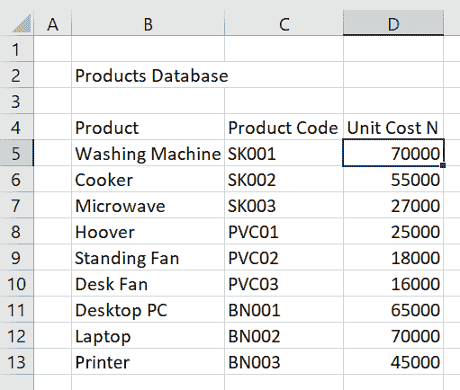

为了确保您的查找选择正确的项目，您必须使用出现在两个表中的唯一查找值，该值将唯一标识每条记录。人们可能有相同的名字，所以你应该使用雇员 id 而不是雇员名字；类似地，产品名称可能会重复，所以您应该使用`Product Code`来代替。

有许多查找函数，每种函数都有最适合的特定场景。我们将看看一些更受欢迎的。

# VLOOKUP 函数

`VLOOKUP`的参数如下图所示:


方括号中的任何参数`[]`都是可选的；因此，如果没有为该参数输入值，将采用默认值。必须为所有其他参数输入值；否则，公式将导致错误。

对于`VLOOKUP`函数，可选参数为`range_lookup`。这要求您选择`True`(如果您正在寻找查找值的近似匹配)或`False`(如果您正在寻找精确匹配)。Excel 允许你用`1`代替`True`，用`0`代替`False`。如果没有选择值，那么参数默认为`False`。

该函数告诉 Excel 在指定的查找数组中从左数第一列中查找查找值。请注意，这可能不是源表的第一列。

在我们的例子中，查找值是一个产品代码；因此，对于我们销售报告中的第一条记录，查找值是`BN001`，它在单元格 **D5** 中。下面的截图显示了`Sales Report`表中`VLOOKUP`公式的构造:


我们的查找数组必须从`Products Database`表中的 **C** 列开始，因为这是`Product Code`字段所在的位置——注意，这是`Products Database`表的第二列。然后，Excel 将在第一列中定位查找值的位置，如下面的屏幕截图所示:


从前面的截图中，我们可以看到产品`BN001`在`Products Database`表的第 **11** 行的`Product Code`字段中。

下一个参数是`column_index_num`(列索引号)值，它表示源字段在查找数组中的位置，从作为列 **1** 的唯一字段开始。**源字段**是您要从中检索数据的字段。在我们的例子中，源字段是`Unit Cost`，它是列 **D** ，我们的查找数组的第二列。这给了我们`2`的`col_index_num`:


这样，我们为源单元格确定了列 **D** 和行 **11** 。然后，Excel 将从单元格 **D11** ( `65,000`)中检索数据，并将其放入`Sales Report`表的目标单元格中:


一旦您完成了公式并成功提取了我们的`Sales Report`表中第一条记录的单位成本，请将公式复制到`Sales Report`表中其他记录的列中。

# 指数函数

`INDEX`和`MATCH`功能通常一起使用。`INDEX`函数有指定源单元格的行和列的参数。为了使公式动态，可以用`MATCH`代替`INDEX`参数、行和/或列。这是一个非常强大的公式，包含数组和简单公式的参数:


`INDEX`公式的第一行参数是数组范围。数组公式返回一系列值，而不是像简单公式那样只返回一个值。我们将在本书的后面触及数组公式，但是现在，我们将集中讨论简单的公式。

第二行论证是针对参考形式的。第一个参数需要类似于`VLOOKUP`中查找数组的引用。在简单的索引公式中，这可以限制在一列(或一行)中的单元格范围内。

如果将索引引用限制为一列，则可以有效地识别源单元格的列。在我们的例子中，我们选择了单元格`D5`到`D13`作为我们的参考:


下一个论点是`row_num`。为了用它代替`row`参数，您需要将`MATCH`函数嵌入到`INDEX`函数中，后者仍然是活动的。为此，只需在逗号后输入新函数。只要您尚未输入函数的最后一个括号，Excel 就会识别出该公式仍处于活动状态，因此无需再次键入`=`。

# 匹配功能

`MATCH`函数中的第一个参数是`lookup_value`参数，您要在查找数组中查找它。然而，在这种情况下，对于查找数组的位置没有限制。我们在`Sales Report`工作表的单元格 **D5** 中使用了与`VLOOKUP`示例中的`BN001`相同的查找值。

这里，如下面的屏幕截图所示，您可以将查找数组限制为一列。在我们的例子中，我们知道查找值的匹配在工作表`Products Database`的列 **C** 的`Product Code`字段下。因此，我们选择单元格`C5`到`C13`作为我们的查找数组:


注意，`MATCH`查找数组必须从与`INDEX`函数中的引用相同的工作表行开始。在我们的示例中，它们都从工作表的第 **5** 行开始。你用`match_type`结束匹配公式，和`VLOOKUP`函数中的`range_lookup`一样。您需要指定是想要近似匹配、小于(`1`)、大于查找值(`-1`)还是精确匹配(`0`)。

`MATCH`函数返回一个整数，该整数对应于查找数组中查找值所在行的位置。这不应被误认为是工作表的行号。

在我们的示例中，`MATCH`函数将返回数字`7`，因为查找值`BN001`位于查找数组的第 7 <sup>行</sup>中，即工作表的第 **11** 行。一旦您关闭了`MATCH`公式的最后一个括号，Excel 就会将您带回到`INDEX`函数。

下一个论点是`column_num`。由于我们已经通过将引用限制为一列来确定列号，因此可以忽略此参数。最后一个参数`area_num`是针对更复杂的情况，我们在行和列之后引入了第三个维度，比如具有相同字段布局的多个表。同样，我们可以忽略这个参数，因为我们不会用到它。

确定了行 **7** 和列 **D** 之后，我们现在有了源单元格 **D11** ，它返回`65000`的值。您会注意到`INDEX`和`MATCH`克服了`VLOOKUP`中的限制，其中惟一字段必须是查找数组的第一列。

因此，许多用户更喜欢使用`INDEX`和`MATCH`，即使在`VLOOKUP`可以工作的地方。那些被`INDEX`和`MATCH`的功能组合吓倒的人，宁愿坚持`VLOOKUP`，宁愿改变表格列的顺序，让它适合`VLOOKUP`。

# 选择功能

`CHOOSE`功能允许您创建一个要执行的值或动作的列表，然后通过选择与列表中值或动作的位置相对应的数字来选择要使用的值或要执行的动作。如下面的截图所示，`CHOOSE`的语法有两个参数:`index_num`，然后是显示为`value1`、`value2`等的值或动作列表。

该屏幕截图显示了`CHOOSE`函数的参数:


在此处显示的示例中，我们希望在`Products Database`工作表中分别显示产品单位成本的平均值和中值。我们首先在一个空单元格中设置数据验证，这样就可以通过单击单元格旁边的下拉箭头来选择`1`或`2`的值。进行数据验证的单元格将是`CHOOSE`公式的`index_num`。这是数据验证的屏幕截图:


然后我们列出可供选择的行动。在这种情况下，我们有平均值或中间值。如果我们按这个顺序列出它们，那么如果`index_num`显示`1`，那么将选择平均值，如果它显示`2`，那么将选择中位数。下面的截图显示了完整的`CHOOSE`公式:

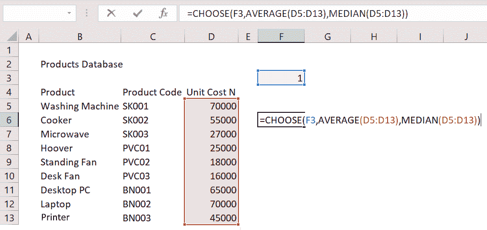

当索引号为`1`时，选择`AVERAGE`函数，返回值`43,444.44`。这是`Index_Num`为`1`的`CHOOSE`功能截图:

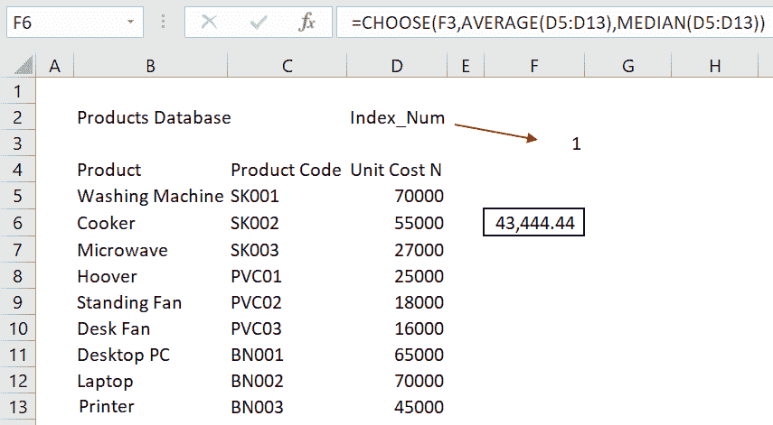

当索引号为`2`时，选择`MEDIAN`函数，返回值`45,000.00`。这是`Index_Num`为`2`的`CHOOSE`功能截图:


# 实现选择功能

假设您正在跟踪公司的财务记录，您的老板希望您每周提交两份报告，其中包含您在某一周的销售总额以及您在公司商店的采购总额。你会怎么做？

您总是可以选择所有的销售实例，然后计算它们的总和。完成后，您必须再次选择所有购买的实例，并找到购买的总数。不得不经常这样做将会非常耗时和无聊。这里是`CHOOSE`函数发挥作用的地方！我们可以实施一个简单的模型，通过以下步骤，一键为您完成所有工作:

1.  加载您需要考虑的所有必需值，并将它们编译到一个表中，如下所示:


2.  我们现在将开始编写`CHOOSE`函数:


3.  我们需要输入的第一个值是我们放置选项的单元格，在我们的例子中是`F4`:


4.  现在，我们将使用数据验证为`F4`、`1`和`2`分配两个选项。我们现在将编辑公式，这样，如果我们选择`1`，输入公式的单元格将显示该周所有销售额的总和，如果我们选择`2`，它将显示所有采购的总和。因此，首先我们将选择`Sales`列中的所有单元格`C6`到`C14`，并将其作为`SUM(C6:C14)`输入到公式单元格中，如下所示:


5.  接下来，我们将选择`Purchases`列中的所有单元格，并将它们作为`SUM(D6:D14)`输入到公式的下一个字段中，如下所示:


6.  这会产生以下输出:


现在，如前面的截图所示，当选择`1`时，销售成本变得可见，在我们的例子中，它是`315,455.00`。

7.  如果我们选择`2`，我们将获得采购成本，如下所示:

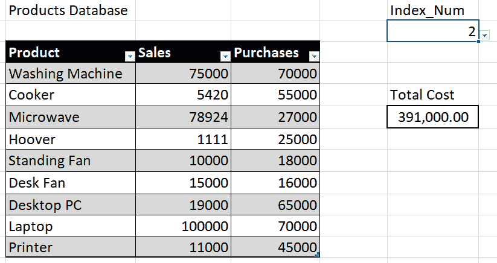

这只是一个函数派上用场的基本场景。当您有大量数据需要过滤和排序时，这将特别有用。

# 效用函数

效用函数可以单独使用。然而，当嵌入到其他更复杂的函数中时，它们会发挥自己的作用。在这种情况下，它们通过提供对更多条件或变量的访问来扩展封闭函数的范围和功能。

效用函数的一些例子是`IF`、`AND`、`OR`、`MAX`、`MIN`和`MATCH`。我们现在来看看其中的一些。

# IF 函数

这是 Excel 中使用最广泛的函数之一。它可以单独使用，也可以作为另一个公式的一部分。`IF`函数检查条件是否满足，如果满足则返回一个值，否则返回另一个值。语法包含三个参数:

*   `logical_test`:逻辑测试是一个语句，如果条件满足，返回值`true`，如果条件不满足，返回值`false`。
*   `value_if_true`:该参数允许您指定当条件满足且逻辑测试结果为`true`时，您希望返回哪个值。
*   `value_if_false`:该参数允许您指定如果条件不满足且逻辑测试的结果为`false`，您希望返回哪个值。

假设每当利润超过`300,000`时，您希望奖励您的销售人员`2%`的销售额。你可以写一个`IF`公式来实现自动化。逻辑测试应该是这样的陈述——利润大于`300,000`。在下面的例子中，对于第一条记录，这是`K5>K2`。该语句将是`true`或`false`。如果结果是`true`，那么返回值就是`Sales` × `Commission` ( `2%`)。在我们的例子中，这是`H5*H2`。如果结果是`false`，那么返回值将是`0`。以下截图是对`IF`公式的说明:


# 最大值和最小值函数

这些功能用于从值列表中选择最大值(`MAX`)或最小值(`MIN`)。只要有点想象力，你就能非常有效地运用`MAX`或`MIN`公式。

例如，在你的财务模型中，`Cash Balance`可能是正数，也可能是负数。正的余额将被过账到资产负债表资产侧的`Cash In Hand`账户，而负的余额将被显示为流动负债下的`Overdraft`。如果我们简单地将`Cash In Hand`或`Overdraft`与`Cash Balance`联系起来，那么我们要么将负余额显示为`Cash In Hand`，要么将正余额显示为`Overdraft`。

一种解决方法是使用`MAX`和`MIN`公式，如下图所示:


在前面的截图中，我们要求`MAX`公式显示`Cash Balance`和`0`中较大的值。正的现金余额将总是大于`0`，因此将显示为`Cash In Hand`。然而，每当现金余额为负时，由于这将总是小于`0`，`Cash In Hand`将显示`0`。

以下截图是对`MIN`功能的说明:

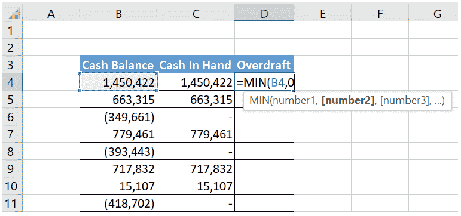

在这种情况下，我们使用`MIN`公式来确保只有负的现金余额才会显示为`Overdraft`，因为负的现金余额总是小于`0`。

通过复制公式，我们可以看到现金余额是如何被整齐准确地分类为`Cash In Hand`和`Overdraft`的，如下图所示，该图显示了应用`MAX`和`MIN`公式后的完整结果:


# 实现功能

我们现在将应用 Excel 中的引用框架对[第 4 章](04.html)、*中使用的`Marks.xlsx`文件实现`MAX`和`MIN`函数。我们将使用以下步骤，使用`MAX`函数查找班级中的最高分，使用`MIN`函数查找最低分:*

1.  首先，我们将创建两个独立的单元格，用于显示最高分和最低分，如下所示:


2.  现在，为了找到分数最高的学生，我们将使用以下公式找到`Percentage`列中的最大值:

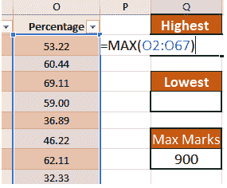

这会产生以下输出:


3.  同样，我们需要使用下面的公式找出学生的最低分数:

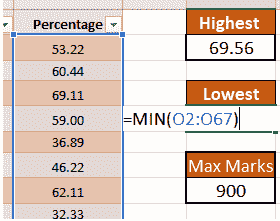

这会产生以下输出:


这显示了这些函数有多有用，尤其是当您有大量条目需要排序时。

# 数据透视表和图表

数据透视表是 Excel 中最强大的工具之一。数据透视表可以将少量或大量的数据汇总到一个紧凑的表格中，从而揭示从原始数据中看不到的趋势和关系。

数据透视表允许您根据原始数据引入条件，以便您可以从不同的角度查看汇总数据。它可以做到所有这些，而不需要你输入任何公式。大多数用户的印象是数据透视表复杂且难以准备；但实际上，复杂性在幕后，由 Excel 负责。你所要做的就是遵循一些简单的指导方针，你将能够轻松地生成复杂的数据透视表。

第一步是确保您的数据是正确的 Excel 表格格式，请记住您可能必须使用其他人准备的数据。

Excel 标识和导航快捷方式取决于表格的格式是否正确。大多数操作都需要指定目标范围。Excel 可以正确识别所需的范围并隔离字段标题，但前提是数据采用正确的表格格式，这可以在下面的屏幕截图中看到:


在数据库术语中，表的每一列代表一个字段，每一行(除了第一行)代表一条记录。表格的第一行应该包含字段标题。表格中不应有空单元格，也不应有重复记录。

Excel 在检测数据类型和处理不同形式的日期格式方面非常高效，包括`15/01/2019`、`15-Jan-19`、`15-01-2019`、`01-15-2019`和`2019-01-15`等等。但是，Excel 非常敏感，数据中的任何微小异常都可能产生不稳定的结果。例如，如果您不小心在日期前键入了一个前导空格(如下图左侧的图像所示)，Excel 会将其视为`General`数据类型。

以下屏幕截图右侧的图像显示了没有前导空格的相同文本；因此，Excel 正确地将其识别为日期，并自动将`Date`格式分配给单元格:


详细解释这一点的原因是因为数据透视表与日期和其他数据类型有着特殊的关系。如果您的表中包含日期字段，数据透视表将识别它，并允许您将日期分组为天、月、季度和年。但是，如果“日期”字段中只有一个单元格出现异常(如上例所示)，数据透视表将不会将其识别为日期，并且“分组”选项将不可用。一旦清理和准备好数据，就可以创建数据透视表了。确保光标位于表格中的任意单元格，然后按下 *Insert* 并从表格组中选择数据透视表。将启动“创建数据透视表”对话框。您需要为数据透视表选择一个范围，然后选择一个位置。Excel 通常会智能地猜测数据透视表的正确范围；但如果没有，可以手动选择需要的范围。

尽管可以将数据透视表与源数据放在同一张工作表上，但这有时会变得拥挤。默认情况下，Excel 将在新工作表上创建数据透视表。同样，如果愿意，您可以覆盖它，并在同一个或另一个工作表上指定一个位置:

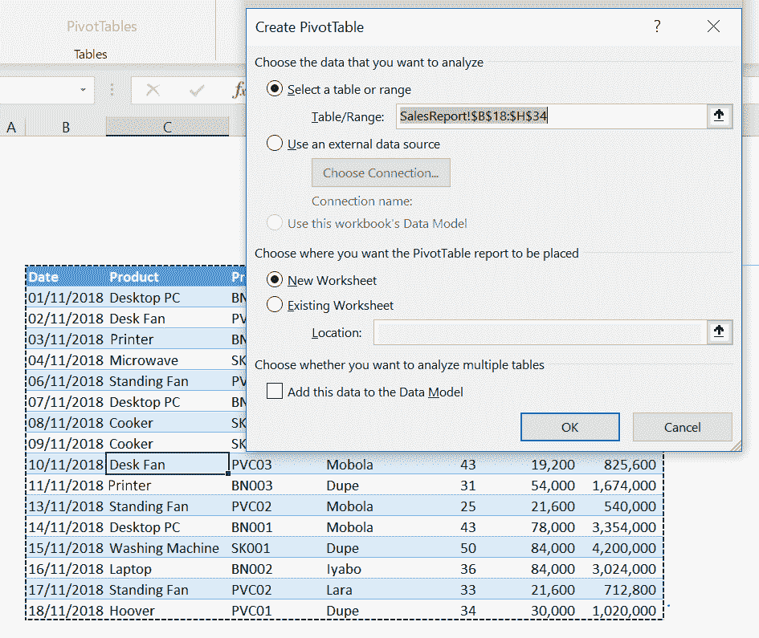

当您按“确定”时，将创建一个数据透视表。最初，只有字段列表会填充表中所有字段的名称，这些字段将垂直排列，旁边有复选框。在那下面，有四个框，标题分别是**过滤器**、**列**、**行**和**值**。您可以根据需要通过将字段名称拖到框中来构建表格。

在你开始建造你的桌子之前，如果你试着想象一下你想要的布局会有所帮助。**值**框最适合于数值字段，因此您可以将`Sales`字段拖到该框中，从而得到如下截图所示的更新后的表格，该图显示了**值**字段在数据透视表中的显示方式:


由于您尚未指定条件或标准，Excel 只是对**值**字段求和，并将其命名为`Sum of Sales`。然后，您可能希望显示每个销售人员对每种产品的销售额。下面的屏幕截图显示了每个销售人员的销售额:

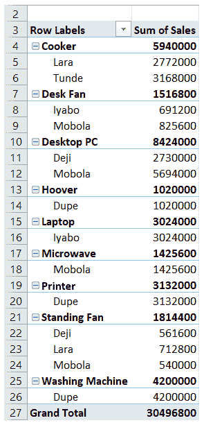

对于前面的屏幕截图，字段列表如下所示:


或者，您可能希望显示每个销售人员的产品销售额，如下面的屏幕截图所示:


请注意,`Product`和`Salesperson`字段在“行”框中的位置颠倒了，如下面的屏幕截图所示:


可以通过水平展示产品来实现另一种布局。这可以通过将产品字段拖动到**列**框而不是**行**框来完成:


这样做的结果是:


布局的另一种变化是按产品显示销售额，然后将销售人员显示为筛选器:


这将导致以下结果:


通过单击`Salesperson (All)`过滤器旁边的下拉箭头，您可以有选择地显示任何销售人员、他们的任意组合或所有销售人员的结果。

除了显示销售总额之外，您还可以显示销售额占总销售额或平均销售额的百分比。这样，你就可以展示一个产品或销售人员对整体销售额的贡献。

下面的屏幕截图显示了产品销售总额以及占总销售额的百分比。为了实现这一点，只需将`Sales`字段再次拖动到**值**框中，使其出现两次。右键单击`Sum of Sales 2`栏显示下拉菜单，然后选择**显示值**，最后从出现的第二个菜单中选择**总计**。下面的屏幕截图显示了产品总销售额和占总销售额的百分比:

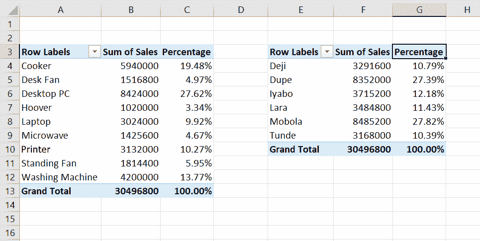

上表显示了销售人员的销售额和占总销售额的百分比。这实际上是第二个数据透视表，它使用了相同的范围，但是使用了包含原始数据透视表的工作表的单元格`E3`上的表。**显示值为...**菜单有广泛的选项，展示了数据透视表的灵活性。

如果在尝试各种选项时，你弄乱了你的桌子，你可以简单地丢弃它并创建另一个。希望这一次，您已经从错误中吸取了教训，并且在创建和使用数据透视表的经验上提升了一个档次。有时，当有图表支持时，人们会更好地理解报告。

要创建数据透视表，选择您的数据透视表，从数据透视表工具上下文菜单中选择**分析**，然后选择**数据透视表**。将显示各种图表类型。选择一个，数据透视表旁边会出现一个数据透视表:


该图表是动态的，因此如果您过滤您的表以反映，比如说，一个销售人员，`Iyabo`，该图表会自动更新以仅反映 Iyabo 的结果。此屏幕截图显示了一个数据透视表和一个数据透视表图表，它们已经过筛选，只显示了 Iyabo 的销售额:


# 实现数据透视表

在`Marks.xlsx`文件中，我们有所有学生的百分比。现在，假设我们想找出前 10 名学生是谁，这样我们就可以在班级活动期间奖励他们。使用以下步骤进入数据透视表:

1.  导航到文件中的`Top scores`工作表，该工作表在一个表格中包含所有学生及其百分比。
2.  现在，为了创建一个数据透视表，我们将选择表中的所有列，并使用菜单中的**数据透视表**选项创建一个数据透视表:

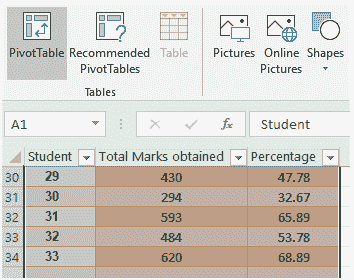

这导致了下表:


3.  因为我们想找出前 10 名的分数，我们可以在**数据透视表**过滤器中使用内置过滤器。点击**行标签**列角落的过滤器图标，显示如下下拉列表:


4.  导航至**价值过滤器**并选择**前 10 名...**从那里选择，如下:


这将显示以下窗口:


在这里，您可以选择要显示多少个值，从哪一列过滤前 10 个值，以及更多选项。

5.  确保窗口中的所有内容看起来与前面的截图相似，然后单击 **OK** 。这样做会产生以下输出:


如此处所示，我们可以看到得分最高的学生。但是我们需要他们按百分比降序排列，这样最高分的人会首先显示。

6.  为此，我们将再次单击过滤器图标并导航至**更多分类选项...**，如下图所示:


这会产生以下窗口:

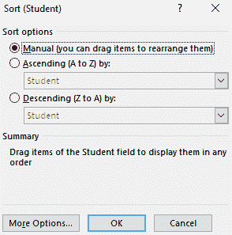

7.  在这里，我们现在将根据百分比总和按降序对学生进行排序，如下所示:

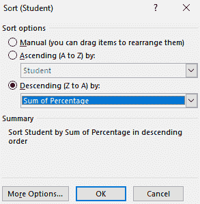

这会产生以下输出:


于是，我们有了班上前 10 名学生的成绩！由此可见，如果使用得当，数据透视表的功能是多么强大。

# 要避免的陷阱

在构建你的公式时，很容易被冲昏头脑，很快，公式变得非常复杂和不友好。虽然保持公式简洁是可取的，但它们应该简单，易于第三方遵循。如果有必要，将公式分成两个或多个部分，这样在保留原始效果的同时更容易理解。

或者，您可以使用 *Alt + Enter* 将公式的一部分强制到下一行。这不会影响公式的结果，但会让公式更容易理解。考虑下面的例子:

```
=INDEX(C5:G10,MATCH(J20,C5:C10,0),MATCH(K19,C5:G5,0))
```

使用 *Alt + Enter* 可以将这个复杂的公式分解为三个部分，如下所示:

```
=INDEX(C5:G10,
MATCH(J20,C5:C10,0),
MATCH(K19,C5:G5,0))
```

正如我们所见，这使得破译变得更加容易。

# 保护工作表

如果您要与其他人共享您的模型，保护您的公式免受可能导致模型无用的无意修改是很重要的。为此，首先突出显示要修改的没有公式的单元格，按 *Ctrl + 1* 打开**单元格格式**对话框，转到保护选项卡，选中锁定，然后单击确定。这将解锁可能被修改的单元格。

现在，转到“审阅”选项卡，然后选择“保护工作表”。出现“保护工作表”对话框。如果需要，输入密码取消保护，然后单击确定。现在，受保护的包含公式的单元格只能查看，不能修改。您应该只输入一次特定值。如果您需要在另一个位置输入相同的值，只需引用第一次输入的原始单元格。相同值的任何后续出现也应该引用原始条目，而不是包含相同值的任何辅助单元格。

例如，首先在工作表 1 的单元格 **B5** 中输入 15%的利率。如果在第 2 张表的单元格 **D16** 中需要利息，您不必再次键入 15%，只需参考第 1 张表的单元格 **B5** ，键入`=`，然后输入第 1 张表的单元格 **B5** 。如果利息再次出现在工作表 3 的单元格 **J13** 中，理论上可以参考工作表 2 的单元格 **D16** 。但是，为了保留简单的审计线索，应该引用该值的原始条目，即工作表 1，单元格 **B5** 。尝试每行只使用一个公式。

使用您的相对、绝对和混合单元格引用知识来构建公式，以便您可以在一个单元格中输入公式，然后跨其他年份复制或填充公式。输入公式的次数越少，出错的几率就越低。

# 摘要

在这一章中，我们学习了公式和函数的强大功能，以及如何使用它们来加速我们的建模并使之更有趣。我们还研究了一些更常见的函数的例子，比如`VLOOKUP`、`MATCH`和`CHOOSE`函数。

在下一章，我们将研究构成 Excel 主干的特性之一——引用框架。理解这个框架并知道如何应用它的原则将有助于你加快工作速度并提高生产力。