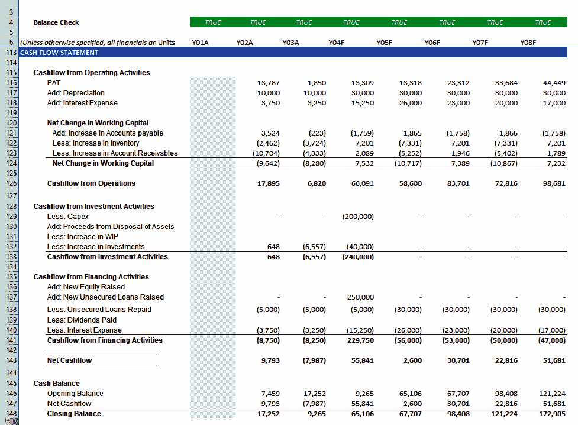
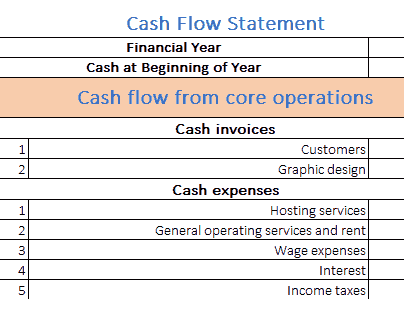
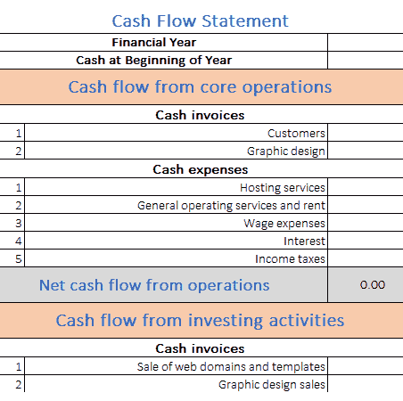

# 七、现金流量表

下表显示了我们的议程，下一阶段是现金流量表的编制:

*   记录历史损益和资产负债表
*   计算历史增长驱动因素
*   预测损益表和资产负债表的增长动力
*   建立预计的损益账户和资产负债表
*   准备资产和折旧清单
*   准备债务清单
*   **编制现金流量表**
*   比率分析
*   DCF 估价
*   其他估价
*   情况分析

在这个阶段，我们已经完成了损益账，剩下来完成资产负债表的唯一项目是现金，它仍然是不平衡的。在这一章，我们将看看如何为我们的项目准备现金流量表。

在本章中，我们将讨论以下主题:

*   现金流量表简介
*   不涉及现金流动的项目
*   营运资本的净变化
*   平衡资产负债表
*   创建快速现金流量表

# 现金流量表简介

损益表与现金流量表的不同之处在于，在确认交易之前，损益表不会等待交易的现金影响得到解决。例如，如果你做了一笔 100，000 元的销售，而客户已经收到货物或服务，但尚未付款，则没有现金流动。

然而，你和客户都认识到销售已经完成——事实上，货物的所有权和保管权已经转移，所以损益账户将记录为赊销，增加营业额 100，000 纳元，为了完成复式记账，在该客户名下创建一笔应收款，表示他们欠你 100，000 纳元。这就是会计的权责发生制，即收入应在赚取收入的期间记录，费用应与他们帮助产生的收入相匹配。

这渗透到整个账户中，影响到诸如预付租金之类的事情(只有今年的租金应该通过损益账户)；用了电但账单还没到(在损益账户里充电费)；采购必须通过期初和期末存货进行调整，这样只有销售成本才能反映在损益账户中。

在所有这些例子中，实际现金流量将不同于损益表中包含的金额。这具有很好的经济意义，并且对于得出每个时期的真实利润或损失是必不可少的。但是，如前所述，营业额是虚荣，利润是理智，但现金是现实。无论一家公司赚了多少钱，如果没有现金支持，公司迟早会破产。这就是现金流量表如此重要的原因。

您还记得，我们在模型中创建了一个可视化检查，以指示资产负债表是平衡还是失衡。因此，如果它们失去平衡，检查单元格将是红色的，但当它们达到平衡时，单元格将变成绿色，如下面的截图所示。历史资产负债表当然会保持平衡。下面的屏幕截图显示了预测年份失衡的情况:


在编制财务报表时，现金流量表通常是由资产负债表和损益表编制的。然后将现金净流入或净流出加上或减去现金期初余额，得出现金和现金等价物的期末余额，该余额应与资产负债表上的相应数字一致。对于预测年份，资产负债表上没有现金数字，因此我们需要利用资产负债表-现金流关系来预测现金数字。

像往常一样准备现金流量表，以期末现金余额的数字结束。然后，我们将这个数字作为现金和现金等价物记入资产负债表。如果资产负债表现在平衡，这表明我们的模型到目前为止在数学上是正确的。否则，我们将开始繁琐的故障排除过程来跟踪错误:



前面的屏幕截图显示了完整的现金流量表，其中期末现金余额现在已经过帐到相应的资产负债表，余额检查显示它们现在都处于平衡状态。编制现金流量表的逻辑起点是当年的利润。

# 不涉及现金流动的项目

在得出`PAT`时，已经考虑了许多不涉及现金流动的项目，现在必须对这些项目进行冲销，以得出现金流的准确数字，如下所示:


这种情况的明显候选是贬值。相关的现金流发生在购买资产的时候。然而，我们并不将总成本一次性计入损益账户；正确的会计处理是在资产的使用寿命内分配原始成本。

这种周期性的成本分配被称为**折旧**，显然不涉及现金的流动。因为在得出我们的利润时，它已经被作为费用扣除，所以我们需要将它添加回 PAT，如前面的屏幕截图所示。我们还把利息加回给 PAT。虽然这是现金流，但它是债务融资的成本，因此，在融资活动下处理更合适。

# 营运资本的净变化

让我们看看下面的营运资本净变化截图:


本节将我们的利润从权责发生制转换为现金制利润。简单地说，以我们之前的例子为例，我们记录了一笔 100，000 奈拉的销售，即使没有收到现金，我们的利润也增加了这个数额。本节研究了相应的应收账款增加额 100，000 奈拉，并将其视为在得出经营活动现金流之前应扣除的流出额，因此冲销了赊销记录的流入额。

总之，在这一部分，我们增加营运资本负债，减少营运资本资产。当我们假设今年的数字高于上一年的数字，从上一年的数字中减去今年的数字时，增长就显现出来了。

注意，如果你坚持使用这种语言，减号会自动出现。

让我们看看下表:

|  | **YR2** | 第一年 |
| **1。应付账款** | Fifty thousand | Thirty thousand |
| **2。应付账款** | Fifty thousand | Seventy thousand |

如果你认为增加是( **YR2** - **YR1** )，那么在例 1 中，`Add: Increase in Accounts payable`将给出如下:

*+(50000–30000)= 20000 一次流入*

在示例 2 中，如果有减少，我们将得到以下结果:

*+ (5 万–7 万)= +(-2 万)= -2 万流出*

营运资本资产也是如此，如下表所示:

|  | **YR2** | 第一年 |
| **1。应收账款** | Forty thousand | Thirty-five thousand |
| **2。应收账款** | Fifty thousand | Sixty thousand |

如前所述，增量为( **YR2** - **YR1** )，因此在示例 1 中，`Less: Increase in Accounts Receivable`将给出以下内容:

*- (40，000–35，000) = - 5，000 流出量*

在示例 2 中，如果有减少，我们将得到以下结果:

*- (5 万–6 万)= -(-1 万)= +1 万一次流入*

到目前为止，所有项目的小计给了我们经营活动的现金流。

# 投资活动的现金流量

让我们看看下面这张投资活动现金流的截图:


这一部分相当简单明了。它涉及投资的购买或出售，包括其他公司的股份、资本支出等等。

# 融资活动产生的现金流量

让我们看看下面这张融资活动现金流的截图:


到目前为止，我们应该对融资来源于内部来源、股权(股份)或债务形式的外部来源这一事实感到满意。这里处理这些余额的增加和减少。您会记得，我们在 PAT 中添加了利息费用。这是为了在筹资活动下处理这个问题。我们还将扣除作为流出支付的股息。

在融资和投资活动中，偶尔会有对净现金流有重大影响的大型一次性交易；例如，出售固定资产。然而，经营活动反映的是公司的日常业务活动。这是投资者判断一家公司是否有足够的现金来偿还债务和实现增长的依据。

# 平衡资产负债表

期末现金余额将作为流动资产项下的现金和现金等价物记入资产负债表。然而，重要的是要注意，余额可能是负数，在这种情况下，它应该反映为流动负债下的透支。由于您不知道它将会是哪一个，特别是因为它可能会由于后续的修改而改变，所以您需要以这样的方式构建您的模型:如果现金余额为正，则将其过帐到现金和现金等价物，如果为负，则将其过帐到透支。

通常，当你需要对一个依赖于逻辑问题(一个导致真或假答案的问题)的情况建模时，首先想到的是`IF`语句。例如，假设光标位于单元格 **J35** 、现金和现金等价物中，您希望将此与单元格 **J86** 中现金流量表的计算现金余额相关联。

你可以输入`=J86`，当你按下*回车*时，现金余额就会出现在单元格 **J35** 中。

要将前一节中解释的不确定性与`IF`语句结合起来，您应该键入`=IF(J86>0,J86,"")`。这表示如果现金余额为正，大于 0，则将现金余额放入单元格**J35**；否则，将单元格留空。

在相应的透支单元格中，比如说单元格 **J45** ，您应该键入`=IF(J86>0,"",-J86)`。这表示如果现金余额是正数，大于 0，那么将单元格留空；否则，将现金余额符号从负变为正，并将其放入单元格 **J45** 中。

然而，使用`MIN`和`MAX`公式有一个更好的方法来处理这个问题。

在单元格 **J35** 中，您只需输入`= MAX(J86,0)`。这个公式将确保现金余额和 0 的最大值总是出现在单元格 **J35** 中。

仔细想想，正数总是大于 0，因此总是被视为现金和现金等价物。在单元格 **J45** 、`Overdraft`中，您应该键入`=MIN(J86,0)`。

这将确保每当现金余额为负时，它将总是被过账到单元格 **J45** 中；否则单元格将为 0。一旦这个过账完成，资产负债表应该平衡，我们的平衡检查单元格应该都变成绿色。如果不是这种情况，那么您将需要进行故障排除，以找到错误的来源。

# 解决纷争

第一步是检查你的现金流量表的准确性。由于历史年份已经有现金或透支余额，您可以根据资产负债表上的现金检查这些年份的现金流现金余额。

如果他们不一致，你需要再次检查你的现金流项目:

1.  首先，检查你的总数是否有铸造错误。
2.  接下来，确定差值是多少，然后除以 2。查看你的现金流，看看是否有与这个数字相等的金额。这个测试检查你是否把一个数字错贴为负数而不是正数，或者反之亦然。
3.  浏览资产负债表，损益账户的金额等于第一步中计算的全部差额。这项测试检查你是否从现金流中遗漏了一笔金额。
4.  浏览资产负债表和损益，看看是否有任何账户或余额没有计入你的现金流。这种情况经常发生在你有不规则账户或流动的地方；例如，股份溢价、特别准备金和前一年调整。
5.  一旦你将历史现金流量表与历史资产负债表进行了核对，你的余额支票现在应该都是绿色的。如果不是，那么您需要将您的故障诊断扩展到模型的其余部分。

# 循环引用

假设您在单元格 **A1** 到 **A4** 中有数据，您在单元格 **A5** — `=SUM(A1:A6)`中键入以下公式。这将被 Excel 标记为循环引用错误，因为您在求和范围中包含了答案单元格 **A5** 。在一般情况下，公司会将任何剩余现金用于投资以赚取利息。另一方面，当现金透支时，就会产生利息。

如果我们想扩展我们的模型来包括这个场景，我们需要扩展我们的现金流量表来包括现金余额的利息收入或费用。然后从损益账户中的现有利息费用中减去或加上该利息，这就改变了 PAT。由于 PAT 与现金流量表相关联，这也将导致期末现金余额的变化，这将影响该余额的利息收入或费用，并且循环继续，形成循环引用。

随着每一次循环或迭代，现金流量表期末现金余额的利息变化越来越小，最终趋于零。为了有意创建一个循环引用，您需要通过进入**选项**并选中**启用迭代计算**来请求 Excel 允许它。您可以将最大迭代次数保留为 100。

**我不建议除了专家用户之外的任何人这样做，即使这样，也只是在你不会与其他用户分享你的模型的时候**，原因如下:

不幸的是，当启用循环引用时，众所周知它是不可靠的，会导致 Excel 变得不稳定。发生这种情况时，Excel 会在工作表中填入错误。然后，您需要花时间梳理模型，手动清除作为圆形源的像元。或者，您可以还原不包含循环的备份。

除了 Excel 的专家用户之外，这可能会引起所有人的警觉，并导致建模时间的损失。最好的解决方法是从一开始就包含一个**断路器**，如下面的截图所示:


为此，指定一个空单元，比如单元 **E5** ，作为断路器，然后键入`OFF`或`1`，以允许循环引用；或`ON`或`0`，将圆形单元格清零。

然后用一个`IF`语句将包含循环引用的单元格括起来。逻辑问题应该是`E5=1`。如果这是真的，那么允许公式带有循环引用；否则，将该值设置为`0`。

断路器的默认值应为`OFF`；然后，如果公式出错，只需在断路器单元格中键入`ON`来触发`IF`语句中的`0`并清除循环。

请记住，Excel 会不断重新计算公式单元格，因此这可能是经常发生的事情。同样，这只能由不会共享其模型的专家用户来完成。

# 创建快速现金流量表

现在你已经学会了如何创建现金流量表和你需要做的一切，让我们继续为一个特定的场景准备一个简单的报表。让我们假设你是一家网页设计公司的创始人，你需要密切关注你花钱买的所有东西，因为作为一家初创公司，资本对公司的发展至关重要。我们将创建一个简单的现金流量表来跟踪第一年的费用，以便我们可以了解以后继续经营该公司是否有利可图:

1.  我们将首先在顶部创建两个单元格，分别显示财政年度和当年年初投入的现金，如下所示:


2.  正如我们在本章中所了解的，现金流将被分为三个主要部分，第一部分是经营活动。因此，让我们创建一个包含核心业务下所有费用和现金流入的表。网站设计公司的运营流入将主要来自两个地方:
    *   客户请求网站
    *   由员工承担的自由职业平面设计

因此，我们的**现金发票**选项卡将如下所示:


3.  至于业务费用，可以分类如下:
    *   网站托管服务
    *   网站工作所需的资源
    *   员工工资
    *   所得税等等

将所有这些内容编译到一个表格中后，它应该类似于下面的屏幕截图:



4.  最后，我们将添加一个净现金流量行来显示来自运营的总现金流量。在分配给它的单元格中，我们将输入以下公式:

```py
=SUM(D8:D15)
```

我们现在已经完成了现金流量表的运营部分。

5.  现在，我们将创建一个类似于 operations 表的表；这次是为了投资活动。在此表中，我们将使用以下内容作为现金发票:
    *   出售网络域名和模板
    *   平面设计销售

因此，我们的现金流量表现在看起来类似于下面的截图:



6.  投资活动的费用包括以下各项:
    *   购买电脑和其他设备
    *   员工娱乐活动
    *   员工欣赏

我们将把它们添加到一个表中，如下所示:


7.  然后，类似于 operations 表，我们将创建一行显示投资活动的总现金流。到目前为止，我们的现金流量表应该如下所示:


8.  我们现在将对融资活动重复相同的过程，修改元素，如下面的屏幕截图所示:


9.  我们的最后一个任务是创建一个单元格，该单元格将显示扣除项目后全年获得的现金总额，如下所示:


为了计算赚得的现金总额，我们需要做的就是找出所有三项活动的净现金流单元格中的值之和，以及年初投入的现金。在这种情况下，公式如下:

```py
=D16+D27+D38+D4
```

当您有一系列中间没有间断的数字时,`SUM`函数会更有用。当添加不同位置的值时，最好使用直接单元格引用。

因此，我们的最终现金流量表如下:


现在，我们将在所有必需的单元格中输入一些值，并查看年末的最终现金:


嘿，那还不错！看起来这家公司做得很好，正在走上创业的正确道路！我们已经创建了一个简单的现金流量表，可以在很多情况下派上用场。在这里创建的模板可以在 GitHub 资源库中找到，该书的名称为`CashFlowCompany.xlsx`。

# 摘要

在本章中，我们学习了如何使用 Excel 中的各种函数创建现金流量表。我们学习了如何将各种因素考虑在内，例如不涉及现金流动的项目，来自投资和金融等各种活动的现金流，等等。我们还学习了如何平衡表，以便一切都是准确的。我们还了解了如何解决这里可能出现的任何错误。最后，我们为特定场景创建了一个示例现金流量表。

在下一章，我们将研究各种比率分析。