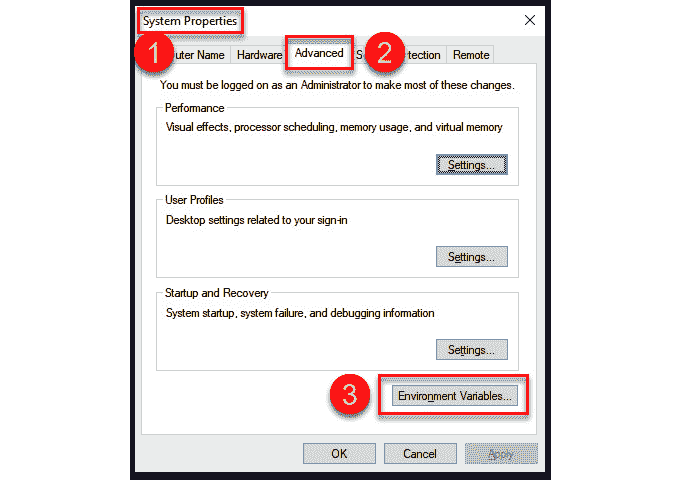

# 十、附录 A：如何设置 Python 环境

本书的 GitHub 存储库([http://GitHub . com/packt publishing/Hands-On-Financial-Trading-with-Python/](http://github.com/PacktPublishing/Hands-On-Financial-Trading-with-Python/))包含 Jupyter 笔记本，可以帮助您复制这里显示的输出。

该环境是通过手动选择所有包含的包的兼容版本创建的。

# 技术要求

本书中的代码可以在 Windows、Mac 或 Linux 操作系统上运行。

# 初始设置

要设置 Python 环境，请遵循以下步骤:

1.  如果您还没有安装 Anaconda Python，请从 https://www.anaconda.com/products/individual 下载并安装它。
2.  `git clone`储存库:

    ```py
    git clone XXXXX
    ```

3.  将当前目录更改为克隆的 GitHub 存储库。
4.  运行下面的代码:

    ```py
    conda env create -f handson-algorithmic-trading-with-python\environment.yml -n handson-algorithmic-trading-with-python
    ```

5.  改变活动环境:

    ```py
    conda activate handson-algorithmic-trading-with-python
    ```

6.  Set the global environmental variables for market access:

    

    图 1–各种变量名和从哪里获得免费令牌的表格

7.  Using Window's Control Panel, set the system environment:

    

    图 2–如何在 MS Windows 中找到环境对话框

    然后，选择**编辑系统环境变量**:

    

    图 3–设置 MS Windows 环境变量的步骤

    然后，在**环境变量中指定变量...**对话框。

    在 Mac/Linux 上，对于基于用户的操作，向`~/.bash_profile`添加以下命令；对于非登录交互式 shells，向`~/.bashrc`添加以下命令:

    ```py
    Export QUANDL_API_KEY=xxxx
    ```

    关闭命令提示符，以便可以激活全局环境变量。

8.  Proceed with the **Download the Complimentary Quandl Data Bundle** and **Once Installed Setup** stages.

    注意:

    在一个软件包的元文件由于打字错误被修复后，使用`conda env export > environmenmt.yml`命令生成了`environment.yml`文件。

# 下载免费的 Quandl 数据包

步骤如下:

1.  改变活动环境:

    ```py
    conda activate handson-algorithmic-trading-with-python
    ```

2.  Set the `QUANDL_API_KEY` value if you have not set it up yet via Window's Control Panel or by using `.bash_profile` or `.bashrc`.

    对于 Windows，请使用以下命令:

    ```py
    SET QUANDL_API_KEY=XXXXXXXX
    ```

    对于 Mac/Linux，使用以下命令:

    ```py
    export QUANDL_API_KEY=XXXXXXXX
    ```

3.  Ingest the data:

    ```py
    zipline ingest -b quandl
    ```

    注意

    不需要反复下载这个捆绑包。数据不再被更新。

设置好环境后，请按照以下步骤操作:

1.  将当前目录更改为克隆的 GitHub 存储库。
2.  改变活动环境:

    ```py
    conda activate handson-algorithmic-trading-with-python
    ```

3.  启动 Jupyter 实验室，像这样:

    ```py
    jupyter lab 
    ```