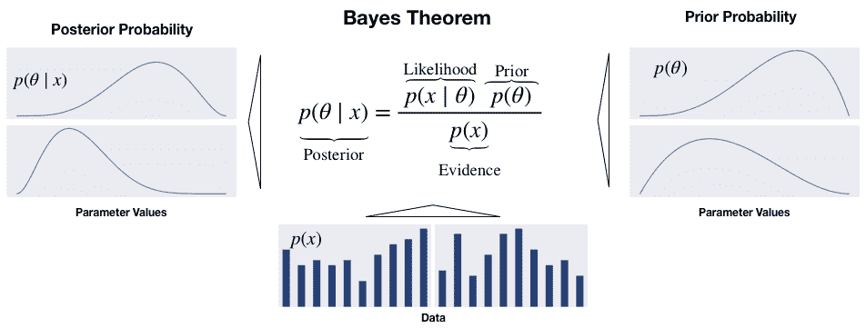
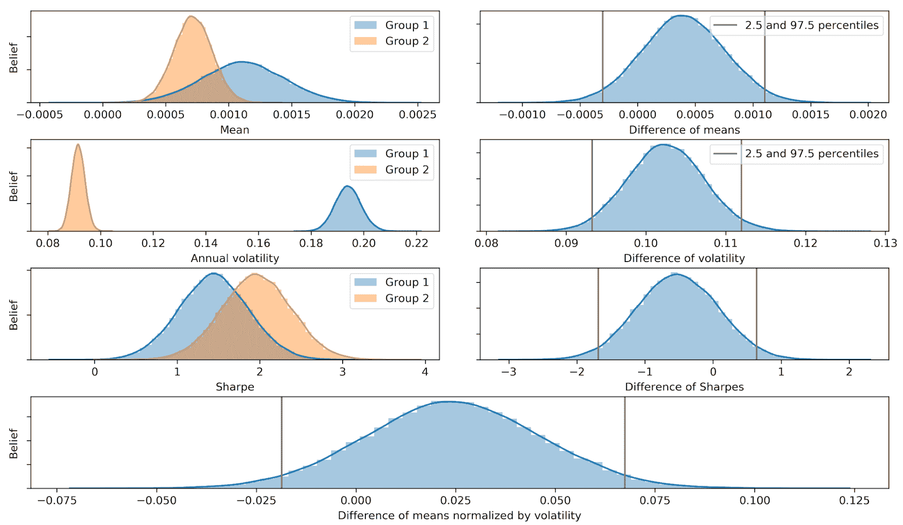

# 九、贝叶斯机器学习

在这一章中，我们将介绍机器学习的贝叶斯方法，以及它们对不确定性的不同观点如何在开发和评估算法交易策略时增加价值。

贝叶斯统计允许我们量化未来事件的不确定性，并在新信息到来时以有原则的方式改进我们的估计。这种动态方法很好地适应了金融市场不断演变的本质。当相关数据较少，并且我们需要系统地整合先验知识或假设的方法时，它特别有用。

我们将看到，机器学习的贝叶斯方法允许对统计指标、参数估计和预测的不确定性有更丰富的见解。应用范围从更精细的风险管理到结合市场环境变化的预测模型的动态更新。布莱克-利特曼的资产配置方法(见[第 5 章](05.html)、*策略评估*)可以解释为贝叶斯模型。它将预期回报计算为市场均衡和投资者观点的平均值，并根据每项资产的波动性、跨资产相关性和对每项预测的信心进行加权。

更具体地说，在本章中，我们将讨论以下主题:

*   贝叶斯统计如何应用于机器学习
*   如何在 PyMC3 中使用概率编程
*   如何定义和训练机器学习模型
*   如何运行最先进的采样方法进行近似推断
*   如何应用贝叶斯机器学习计算动态夏普比率，建立贝叶斯分类器，并估计随机波动

参考资料、附加资料的链接以及本章的代码示例都在 GitHub 资源库的相应目录中。请遵循[第 1 章](01.html)、*交易机器学习*中提供的安装说明。

# 贝叶斯机器学习如何工作

经典统计学也被称为频率主义者，因为它将概率解释为事件在长期内，即在观察大量试验后的相对频率。在概率的上下文中，事件是实验的一个或多个基本结果的组合，例如掷两个骰子的六个相同结果中的任何一个，或者某一天资产价格下跌 10%或更多。

相反，贝叶斯统计将概率视为对事件发生的信心或信念的度量。概率的贝叶斯观点给主观观点留下了更多的空间，因此，比频率主义者的解释有更多的不同意见。对于那些发生频率不足以客观衡量长期频率的事件，这种差异最为显著。

换句话说，frequentist 统计假设数据是来自总体的随机样本，旨在确定生成数据的固定参数。反过来，贝叶斯统计将数据视为给定的，并将参数视为随机变量，其分布可以从数据中推断出来。因此，frequentist 方法至少需要与要估计的参数一样多的数据点。另一方面，贝叶斯方法与较小的数据集兼容，非常适合在线学习，一次一个样本。

贝叶斯观点对于许多罕见或独特的现实世界事件非常有用，至少在重要方面是如此。例子包括下次选举的结果或者市场是否会在三个月内崩溃的问题。在每种情况下，既有相关的历史数据，也有随着事件的临近而展现的独特情况。

首先，我们将介绍贝叶斯定理，它通过将先前的假设与新的经验证据相结合，并将得到的参数估计与频率主义者的对应参数相比较，使更新信念的概念具体化。然后，我们将展示贝叶斯统计推断的两种方法，这两种方法可以洞察潜在的后验分布，即不同情况下未观察到的参数，如它们的期望值:

1.  共轭先验通过提供闭合形式的解来促进更新过程，但是精确的分析方法并不总是可用的。
2.  近似推断模拟由假设和数据组合而成的分布，并使用来自该分布的样本来计算统计见解。

# 如何根据经验证据更新假设

托马斯·贝叶斯牧师在 250 多年前提出的定理使用基本概率论来规定当相关的新信息到来时，概率或信念应该如何变化。约翰·梅纳德·凯恩斯的以下引述抓住了贝叶斯思维模式:

“当事实改变时，我会改变主意。你是做什么的，先生？”

它依赖于条件概率和总概率以及链式法则；查看 GitHub 上的参考资料，了解这些概念的回顾。

信念涉及参数θ的单个或向量(也称为假设)。每个参数可以是离散的，也可以是连续的。θ可以是一维统计数据，如分类变量的(离散)模式或(连续)均值，也可以是一组更高维的值，如协方差矩阵或深度神经网络的权重。

频率统计的一个关键区别是贝叶斯假设被表示为概率分布而不是参数值。因此，虽然频率主义者的推理侧重于点估计，贝叶斯推理产生概率分布。

贝叶斯定理通过根据以下输入计算后验概率分布来更新关于感兴趣参数的信念，如下图所示:

*   **先验**分布表明我们考虑每个可能假设的可能性。
*   **似然度** **函数**在给定θ参数的特定值的情况下，输出观察到数据集的概率。
*   **证据**测量观察到的数据在所有可能假设下的可能性。因此，它对所有参数值都是相同的，并用于归一化分子:



贝叶斯定理

后验概率是先验概率和似然概率的乘积，除以证据，反映了假设的更新概率分布，同时考虑了先验假设和数据。从不同的角度来看，先验和似然的乘积来自于应用链式法则来分解数据和参数的联合分布。

对于更高维的连续变量，公式变得更加复杂，涉及(多重)积分。另一种公式使用比值比将后验比值比表示为先前比值比乘以似然比的乘积(详见参考文献)。

# 精确推断:最大后验估计

贝叶斯规则在精确计算后验概率方面的实际应用非常有限，因为分母中证据项的计算非常具有挑战性。证据反映了在所有可能的参数值上观察到的数据的概率。它也被称为边际可能性，因为它要求*通过在参数分布上相加或积分来边缘化*参数分布。这通常只可能发生在简单的情况下，其中少量的离散参数采用很少的值。

**最大后验概率(MAP)** 估计利用了证据是一个常数因子，该常数因子缩放后验概率以满足概率分布的要求。由于证据不依赖于θ，后验分布与似然和先验的乘积成正比。因此，在给定观测数据和先验信念的情况下，MAP 估计选择使后验最大化的θ值，即后验的模式。

MAP 方法与参数的**最大似然估计** ( **MLE** )形成对比，后者定义了概率分布。MLE 挑选最大化观测训练数据的似然函数的参数值θ。

看一下定义就可以发现 MAP 与 MLE 的不同之处在于它包含了先验分布。换句话说，除非先验是常数，否则 MAP 估计θ将不同于其 MLE 对应物:


MLE 解倾向于反映频率主义者的观点，即概率估计应该反映观察到的比率。另一方面，先验对 MAP 估计的影响通常对应于将反映先验假设的数据添加到 MLE。例如，通过添加偏斜的试验数据，可以将硬币有偏差的强先验纳入 MLE 上下文中。

先验分布是贝叶斯模型的重要组成部分。我们现在将介绍一些便于分析推理的方便选择。

# 如何选择先验知识

先验应该反映参数分布的知识，因为它影响 MAP 估计。如果先验不确定，我们需要做出选择，通常是从几个合理的选项中。一般来说，通过测试备选方案是否导致相同的结论来证明先验并检查稳健性是一种好的做法。

有几种类型的前科:

*   **目的**先验最大化数据对后验的影响。如果参数分布未知，我们可以在参数值的相关范围内选择一个无信息先验，如均匀分布，也称为平坦先验。
*   相比之下，**主观的**先验旨在将模型之外的信息整合到评估中。
*   一个**经验**先验结合了贝叶斯和频率主义方法，并使用历史数据来消除主观性，例如通过估计各种时刻来拟合标准分布。

在机器学习模型的上下文中，先验可以被视为正则化子，因为它限制了后验可以采用的值。例如，先验概率为零的参数就不是后验分布的一部分。一般来说，更好的数据允许更强的结论，并减少了先验的影响。

# 如何保持推理简单——共轭先验

当除了不同的参数之外，所得的后验分布与先验分布是相同类型的分布时，先验分布相对于似然性是共轭的。当先验和似然都是正态分布时，那么后验也是正态分布。

先验和似然的共轭意味着后验的封闭形式的解决方案，其促进了更新过程并且避免了使用数值方法来近似后验的需要。此外，所得到的后验可以用作下一个更新步骤的先验。

让我们用一个股票价格变动的二元分类例子来说明这个过程。

# 如何动态估计资产价格变动的概率

当数据由二进制伯努利随机变量组成，且阳性结果具有一定的成功概率时，重复试验的成功次数遵循二项式分布。共轭先验是β分布，支持区间[0，1]和两个形状参数，以模拟成功概率上的任意先验分布。因此，后验分布也是贝塔分布，我们可以通过直接更新参数来导出。

我们将收集不同大小的二值化每日标准普尔 500 回报样本，其中正面结果是价格上涨。从为区间[0，1]中每个可能的成功概率分配相等概率的无信息先验开始，我们计算不同证据样本的后验概率。

以下代码示例显示，更新只需将观察到的成功和失败次数添加到先验分布的参数中，即可获得后验概率:

```
n_days = [0, 1, 3, 5, 10, 25, 50, 100, 500]
outcomes = sp500_binary.sample(n_days[-1])
p = np.linspace(0, 1, 100)

# uniform (uninformative) prior
a = b = 1
for i, days in enumerate(n_days):
    up = outcomes.iloc[:days].sum()
    down = days - up
    update = stats.beta.pdf(p, a + up , b + down)
```

得到的后验分布绘制在下图中。它们说明了从将所有成功概率视为同等可能性的一致先验到逐渐达到峰值的分布的演变。

在 500 个样本之后，概率集中在 2010 年至 2017 年正向移动的实际概率附近，为 54.7%。它还显示了最大似然估计和最大似然估计之间的微小差异，后者倾向于稍微偏向于均匀先验的期望值，如下图所示:


后验概率

实际上，共轭先验的使用仅限于低维情况。此外，简化的 MAP 方法避免了计算证据项，但是即使它是可用的，也有几个缺点；它不返回一个分布，因此我们可以得到一个不确定性的度量，或使用它作为先验。因此，我们需要使用数值方法和随机模拟来进行近似推理，而不是精确推理，这将在下面介绍。

# 近似推理:随机与确定性方法

对于大多数具有实际相关性的模型，不可能通过分析得出精确的后验分布并计算潜在参数的期望值。模型可能有太多的参数，或者后验分布对于解析解来说可能太复杂。对于连续变量，积分可能没有封闭形式的解决方案，而空间的维数和被积函数的复杂性可能会阻止数值积分。对于离散变量，边缘化涉及对隐藏变量的所有可能配置求和，尽管这在原则上总是可能的，但我们在实践中经常发现可能存在指数级的许多隐藏状态，因此精确的计算非常昂贵。

尽管在某些应用中，对未观测参数的后验分布会感兴趣，但更多的时候，它主要用于评估期望值，例如，进行预测。在这种情况下，我们可以依靠近似的推论:

*   **基于**马尔可夫链蒙特卡罗(MCMC)** 抽样的随机**技术已经在许多领域推广了贝叶斯方法的使用。他们通常有能力收敛到精确的结果。在实践中，采样方法在计算上要求很高，并且通常局限于小规模问题。
*   **确定性**方法，被称为变分推理或变分贝叶斯，基于对后验分布的解析近似，可以很好地扩展到大型应用。他们做出简化的假设，例如，后验因子以特定的方式分解，或者它具有特定的参数形式，如高斯。因此，它们不会产生精确的结果，可以作为取样方法的补充。

# 基于抽样的随机推理

抽样就是抽取样本， *X=(x <sub>1</sub> ，...，x <sub>n</sub> )* ，从给定的分布中， *p(x)* 。假设样本是独立的，大数定律确保对于越来越多的样本，样本中给定实例的分数 *x <sub>i</sub>* (对于离散情况)对应于其概率 *p(x=x <sub>i</sub> )* 。在连续的情况下，类似的推理适用于样本空间的给定区域。因此，样本的平均值可以用作分布参数期望值的无偏估计量。

一个实际的挑战在于确保独立抽样，因为分布是未知的。从属样本可能仍然是无偏的，但往往会增加估计的方差，因此需要更多的样本才能得到与独立样本同样精确的估计。

从多元分布中采样在计算上要求很高，因为状态的数量随着维度的数量呈指数增长。许多算法促进了这一过程(参见参考文献中的概述)。现在，我们将介绍几种流行的基于 MCMC 的方法。

# 马尔可夫链蒙特卡罗抽样

马尔可夫链是一种动态随机模型，它描述了通过转移概率连接的一组状态的随机移动。马尔可夫性规定进程没有记忆，下一步只取决于当前状态。换句话说，它的条件是现在、过去和未来是独立的，也就是说，关于过去状态的信息无助于预测超出我们从现在所知的未来。

蒙特卡罗方法依赖于重复的随机抽样来逼近可能是确定性的结果，但这不允许精确的解析解。它是在曼哈顿计划期间开发的，用于估计原子水平的能量，并获得了持久的代号以确保保密性。

许多算法将蒙特卡罗方法应用于马尔可夫链，并且通常如下进行:

1.  从当前位置开始。
2.  从建议分配中提取新职位。

3.  根据数据和先验分布评估新位置的概率:
    1.  如果有足够的可能性，就跳槽到新的职位
    2.  否则，保持在当前位置
4.  从步骤 1 开始重复。
5.  在给定的迭代次数后，返回所有接受的位置。

MCMC 旨在识别和探索关注显著概率密度的后部有趣区域。当无记忆过程持续通过接受率增加的后验概率附近的高概率状态时，称其收敛。一个关键的挑战是平衡随机探索样本空间的需要和降低接受率的风险。

该过程的初始步骤可能比后续步骤更能反映起始位置，并且通常作为**老化**样本被丢弃。MCMC 的一个关键特性是，经过一定(但未知)次数的迭代后，该过程应该忘记其初始位置。

剩下的样本称为过程的痕迹。假设收敛，样本的相对频率接近后验概率，可用于根据大数定律计算期望值。

如前所述，估计的精度取决于通过随机行走收集的样本的序列相关性，每个样本通过设计仅取决于先前的状态。更高的相关性限制了对后部的有效探测，并且需要经受诊断测试。

设计这种马尔可夫链的一般技术包括 Gibbs 抽样、Metropolis-Hastings 算法以及性能更好的最近的 Hamiltonian MCMC 方法。

# 吉布斯采样

吉布斯采样将多元采样简化为一维绘制序列。从起点开始，它迭代地保持 *n* -1 个变量不变，同时对第 *n <sup>个</sup>T5】变量进行采样。它包含这个样本并重复。*

该算法非常简单且易于实现，但是产生的高度相关的样本会减慢收敛。它的顺序性质也阻止了并行化。

# 大都会-黑斯廷斯抽样

Metropolis-Hastings 算法基于其当前状态随机地提出新的位置，以有效地探索样本空间并降低样本相对于 Gibbs 采样的相关性。为了确保从后验样本中进行采样，它使用先验和似然的乘积来评估提议，该乘积与后验成比例。它以取决于结果的概率接受，该结果相对于当前样本的相应值。

提案评估方法的一个主要优点是，它采用比例评估，而不是后验评估的精确评估。然而，收敛可能需要很长时间，因为与后验概率无关的随机移动会降低接受率，因此大量的步骤仅产生少量(潜在相关的)样本。可以通过减少建议分布的方差来调整接受率，但是由此产生的较小的步骤意味着较少的探索。

# 哈密尔顿蒙特卡罗–快疯了

**哈密顿蒙特卡罗(HMC)** 是一种混合方法，它利用似然梯度的一阶导数信息来提出新的探索状态，并克服 MCMC 的一些挑战。此外，它还结合了动量，以有效地在臀部周围跳跃。因此，它比更简单的随机游走 Metropolis 或 Gibbs 采样更快地收敛到高维目标分布。

无 U 形转弯采样器是一种自调整 HMC 扩展，在选择方案之前，自适应地调节后验概率的大小和移动次数。它在高维和复杂的后验分布上工作得很好，并且允许许多复杂的模型在没有关于拟合算法本身的专业知识的情况下被拟合。正如我们将在下一节中看到的，它是 PyMC3 中的默认采样器。

# 变分推理

**变分推理(VI)** 是一种通过优化逼近概率密度的机器学习方法。在贝叶斯上下文中，它近似后验分布如下:

1.  选择一个参数化的概率分布族
2.  根据 Kullback-Leibler 散度，找出这个家族中最接近目标的成员

与 MCMC 相比，变分贝叶斯往往收敛得更快，并且可以更好地扩展到大数据。虽然 MCMC 使用来自链的样本来近似后验概率，这些样本最终将任意收敛到目标附近，但是变分算法使用优化的结果来近似后验概率，这并不保证与目标一致。

变分推理更适合于大型数据集和快速探索许多模型。相比之下，MCMC 将在较小的数据集上或在时间和计算资源构成较少限制的情况下提供更准确的结果。

# 自动微分变分推理

变分推理的缺点是需要特定模型的推导和定制优化例程的实现，这减缓了广泛采用。

最近的**自动微分变分推理(ADVI)** 算法将这一过程自动化，使得用户只需指定模型，表示为程序，ADVI 自动生成相应的变分算法(实现细节参见 GitHub 上的参考文献)。

我们会看到 PyMC3 支持各种变分推理技术，包括 ADVI。

# 用 PyMC3 进行概率编程

概率编程提供了一种语言来描述和拟合概率分布，以便我们可以设计、编码、自动估计和评估复杂的模型。它旨在抽象掉一些计算和分析的复杂性，使我们能够专注于贝叶斯推理和推断在概念上更直接和直观的方面。

自从新语言出现以来，这个领域变得相当活跃。优步开源的 Pyro(基于 PyTorch)和 Google 最近在 TensorFlow 中增加了一个概率模块(参见 GitHub 上的参考资料链接)。

因此，贝叶斯方法在机器学习中的实际相关性和使用可能会增加，以产生对不确定性的见解，特别是对于需要透明而不是黑盒模型的用例。

在本节中，我们将介绍流行的 PyMC3 库，它使用 Python 实现了高级 MCMC 采样和机器学习模型的变分推理。它与 Stan 一起，以发明蒙特卡罗方法的 Stanislaw Ulam 命名，并由哥伦比亚大学的 Andrew Gelman 从 2012 年开始开发，是最受欢迎的概率编程语言。

# 基于蚁群算法的贝叶斯机器学习

PyMC3 于 2017 年 1 月发布，将哈密顿 MC 方法添加到 pymc 2(2012 年发布)中使用的 Metropolis-Hastings 采样器中。PyMC3 使用 Theano 作为其计算后端，用于动态 C 编译和自动微分。Theano 是一个专注于矩阵并支持 GPU 的优化库，由 Yoshua Bengio 的蒙特利尔学习算法研究所(MILA)开发，并受到 TensorFlow 的启发。由于更新的深度学习库的成功，MILA 最近停止了进一步开发 Theano(详见第 16 章*深度学习*)。计划于 2019 年发布的 PyMC4 将改用 TensorFlow，想必对 API 的影响有限。

# PyMC3 工作流程

PyMC3 的目标是直观、易读、功能强大的语法，反映统计学家如何描述模型。建模过程通常遵循以下五个步骤:

1.  通过定义以下内容对概率模型进行编码:
    1.  量化潜在变量的知识和不确定性的先验分布
    2.  根据观测数据调整参数的似然函数
2.  使用上一节中描述的选项之一分析后部:
    1.  使用映射推理获得点估计
    2.  使用 MCMC 方法从后部取样
3.  用变分贝叶斯近似后验概率。
4.  使用各种诊断工具检查您的模型。
5.  生成预测。

产生的模型可用于推断，以获得对参数值的详细了解，以及预测新数据点的结果。

我们将使用简单的逻辑回归来说明这个工作流(参见笔记本贝叶斯逻辑回归)。随后，我们将使用 PyMC3 计算和比较贝叶斯夏普比率，估计动态对交易比率，并实现贝叶斯线性时间序列模型。

# 模型定义–贝叶斯逻辑回归

正如在[第 6 章](06.html)、*机器学习工作流程*中所讨论的，逻辑回归估计一组特征和二元结果之间的线性关系，它由一个 sigmoid 函数作为中介，以确保模型产生概率。frequentist 方法产生了参数的点估计，这些参数用于测量每个特征对数据点属于正类的概率的影响，置信区间基于对参数分布的假设。

相反，贝叶斯逻辑回归估计参数本身的后验分布。后验概率允许对每个参数进行更稳健的估计，即所谓的贝叶斯可信区间，其好处是模型的不确定性更加透明。

概率程序由可观察和不可观察的随机变量(RVs)组成。正如我们所讨论的，我们通过似然分布定义了观察到的 RVs，通过先验分布定义了未观察到的 RVs。PyMC3 为此包含了大量的概率分布。

我们将使用一个简单的数据集，按照年收入 5 万美元的门槛对 30，000 人进行分类。该数据集将包含年龄、性别、工作时间和教育年限等信息。因此，我们正在模拟一个人使用这些功能赚取超过 5 万美元的概率。

PyMC3 库使得为逻辑回归执行近似贝叶斯推断变得非常简单。逻辑回归根据 *k* 的特征对个人 *i* 获得高收入的概率进行建模，如下图左侧所示:


我们将使用上下文管理器`with`来定义一个`manual_logistic_model`，稍后我们可以将其称为概率模型:

1.  截距和两个特征的未观察参数的随机变量使用无信息先验表示，假设正态分布的平均值为 0，标准差为 100。
2.  根据逻辑回归的规范，似然性将参数与数据相结合。
3.  结果被建模为伯努利 RV，成功概率由可能性给出:

```
with pm.Model() as manual_logistic_model:
    # coefficients as rvs with uninformative priors
    intercept = pm.Normal('intercept', 0, sd=100)
    b1 = pm.Normal('beta_1', 0, sd=100)
    b2 = pm.Normal('beta_2', 0, sd=100)

    # Likelihood transforms rvs into probabilities p(y=1)
    # according to logistic regression model.    
    likelihood = pm.invlogit(intercept + b1 * data.hours + b2 * data.educ)

    # Outcome as Bernoulli rv with success probability 
    # given by sigmoid function conditioned on actual data 
    pm.Bernoulli(name='logit', p=likelihood, observed=data.income)
```

# 可视化和图版符号

`pm.model_to_graphviz(manual_logistic_model)`命令产生如右图所示的板符号。它将未观察到的参数显示为浅色，将观察到的元素显示为黑色圆圈。矩形表示由模型定义中包含的数据所暗示的观察到的模型元素的重复次数。

# 广义线性模型模块

PyMC3 包括许多常见的模型，因此我们通常可以将手工规范留给定制的应用程序。以下代码使用公式格式将相同的逻辑回归定义为**广义线性模型** ( **GLM** )家族的成员，该公式格式受统计语言 R 的启发，由`patsy`库移植到 Python:

```
with pm.Model() as logistic_model:  
    pm.glm.GLM.from_formula('income ~ hours + educ', 
                            data, 
                            family=pm.glm.families.Binomial())
```

# 地图推理

我们使用刚刚定义的模型的`.find_MAP()`方法获得三个参数的点阵图估计值:

```
with logistic_model:
    map_estimate = pm.find_MAP()
print_map(map_estimate)
Intercept   -6.561862
hours        0.040681
educ         0.350390
```

PyMC3 使用拟牛顿**Broyden-Fletcher-goldf ARB-Shanno(BFGS)**算法解决了寻找具有最高密度的后点的优化问题，但提供了几个备选方案，这些方案由 sciPy 库提供。结果实际上与相应的 statsmodels 估计值相同(有关更多信息，请参见笔记本)。

# 近似推断–MCMC

我们将用一个稍微复杂一点的模型来说明马尔可夫链蒙特卡罗推断:

```
formula = 'income ~ sex + age+ I(age ** 2) + hours + educ'
```

Patsy 的函数`I()`，允许我们使用常规 Python 表达式动态创建新变量。在这里，我们平方`age`来捕捉经验越多，以后收入越少的非线性关系。

请注意，在非常不同的尺度上测量的变量会减慢采样过程。因此，我们首先应用 sklearn 的`scale()`函数来标准化`age`、`hours`和`educ`变量。

一旦我们用新的公式定义了我们的模型，我们就可以进行推断来逼近后验分布。MCMC 采样算法可通过`pm.sample()`功能获得。

默认情况下，PyMC3 会自动选择最有效的采样器，并初始化采样过程以实现高效收敛。对于连续模型，PyMC3 选择我们在上一节中讨论过的 NUTS 采样器。它还通过 ADVI 运行变分推断，以找到采样器的良好启动参数。几种选择之一是使用 MAP 估计。

为了看看收敛是什么样子，我们首先在针对`1000`次迭代调整采样器之后，仅绘制`100`个样本。这将在以后被丢弃。可以使用`cores`参数为多个链并行化采样过程(使用 GPU 时除外):

```
with logistic_model:
    trace = pm.sample(draws=100, tune=1000,
                      init='adapt_diag', # alternative initialization
                      chains=4, cores=2,
                      random_seed=42)
```

结果轨迹包含每个随机变量的采样值。我们可以通过提供先前运行的轨迹作为输入来继续采样(更多信息请参见笔记本)。

# 可信区间

我们可以计算可信区间——置信区间的贝叶斯对应——作为轨迹的百分位数。得到的边界反映了对于给定概率阈值的参数值范围的置信度，与大量试验中参数在该范围内的次数相反。笔记本展示了计算和可视化。

# 近似推理–变分贝叶斯

变分推理的接口与 MCMC 实现非常相似。我们只是使用`fit()`函数而不是`sample()`函数，如果分布拟合过程收敛到给定的容差，我们可以选择包含提前停止的`CheckParametersConvergence`回调:

```
with logistic_model:
    callback = CheckParametersConvergence(diff='absolute')
    approx = pm.fit(n=100000, 
                    callbacks=[callback])
```

我们可以从近似分布中抽取样本，以获得跟踪对象，就像我们之前对 MCMC 采样器所做的那样:

```
trace_advi = approx.sample(10000)
```

对跟踪摘要的检查表明，结果稍微不太准确。

# 模型诊断

贝叶斯模型诊断包括验证采样过程已经收敛，并且从后验概率高的区域一致采样，并确认模型很好地代表了数据。

# 趋同；聚集

我们可以可视化样本随时间的变化及其分布，以检查结果的质量。下图分别显示了初始 100 个样本和额外 100，000 个样本后的后验分布，并说明了收敛意味着多个链如何识别同一分布。`pm.trace_plot()`功能也显示了样本的演变(更多信息请参见笔记本):


后验分布

PyMC3 为采样器生成各种汇总统计数据。这些可以作为 stats 模块中的单个函数使用，或者通过提供对`pm.summary()`函数的跟踪来使用:

|  | **状态模型** | **表示** | **标清** | **hpd_2.5** | **hpd_97.5** | **n_eff** | **Rhat** |
| 拦截 | -1.97 | -1.97 | Zero point zero four | -2.04 | -1.89 | Sixty-nine thousand four hundred and ninety-two point one seven | One |
| 性[T .男性] | One point two | One point two | Zero point zero four | One point one two | One point two eight | Seventy-two thousand three hundred and seventy-four point one | One |
| 年龄 | One point one | One point one | Zero point zero three | One point zero five | One point one five | Sixty-eight thousand four hundred and forty-six point seven three | One |
| 我(年龄** 2) | -0.54 | -0.54 | Zero point zero two | -0.58 | -0.50 | Sixty-six thousand five hundred and thirty-nine point six six | One |
| 小时 | Zero point three two | Zero point three two | Zero point zero two | Zero point two eight | Zero point three five | Ninety-three thousand and eight point eight six | One |
| 训练 | Zero point eight four | Zero point eight four | Zero point zero two | Zero point eight | Zero point eight seven | Ninety-eight thousand one hundred and twenty-five point two six | One |

前面的表格在第一列包括(单独计算的)statsmodels `logit`系数，以表明在这个简单的例子中，两个模型是一致的，因为样本均值非常接近系数。

剩余的列包含最小宽度可信区间的**最高后验密度** ( **HPD** )估计值，置信区间的贝叶斯版本，这里是在 95%水平上计算的。`n_eff`统计汇总了从约 100K 次抽取中产生的有效(未剔除)样本的数量。

R-hat，也称为 Gelman-Rubin 统计，通过比较链之间的方差和每个链内的方差来检查收敛性。如果采样器收敛，这些方差应该是相同的，也就是说，链应该看起来相似。因此，统计值应该接近 1。`pm.forest_plot()`函数还总结了多个链的统计数据(更多信息见笔记本)。

对于具有许多变量的高维模型，检查大量的轨迹变得很麻烦。使用 NUTS 时，能量图有助于评估收敛问题。它总结了随机过程探索后验概率的效率。该图显示了能量和能量转换矩阵，它们应该很好地匹配，如下例所示(概念细节见参考文献):


# 后验预测检查

**后验预测检验** ( **PPCs** )对于检查模型与数据的吻合程度非常有用。他们这样做是通过使用来自后验的参数从模型中生成数据。为此，我们使用`pm.sample_ppc`函数，并为每次观察获得 *n 个*样本(GLM 模块自动命名结果`'y'`):

```
ppc = pm.sample_ppc(trace_NUTS, samples=500, model=logistic_model)
ppc['y'].shape
(500, 29170)
```

例如，我们可以使用 auc 分数来评估样本内拟合，以比较不同的模型:

```
roc_auc_score(y_score=np.mean(ppc['y'], axis=0), 
              y_true=data.income)
0.8294958565103577

```

# 预言；预测；预告

在运行后验预测检查之前，预测使用 Theano 的共享变量将训练数据替换为测试数据。为了便于可视化，我们创建一个具有单个预测小时数的变量，创建训练和测试数据集，并将前者转换为共享变量。注意，我们需要使用 numPy 数组，并提供一个列标签列表(详见笔记本):

```
X_shared = theano.shared(X_train.values
with pm.Model() as logistic_model_pred:
    pm.glm.GLM(x=X_shared, labels=labels,
               y=y_train, family=pm.glm.families.Binomial())
```

然后，我们像以前一样运行采样器，并在用测试数据替换序列后将`pm.sample_ppc`函数应用于结果轨迹:

```
X_shared.set_value(X_test)
ppc = pm.sample_ppc(pred_trace, model=logistic_model_pred,
                    samples=100)
```

具有单一特征的该模型的 AUC 分数是 0.65。下图显示了每个采样预测值的实际结果和预测的不确定性:


我们现在将说明如何将贝叶斯分析应用于交易相关的用例。

# 实际应用

贝叶斯机器学习方法在投资中有许多应用。概率估计产生的透明性对于风险管理和性能评估自然是有用的。我们将举例说明夏普比率等指标的计算和比较。GitHub 知识库还包括下面引用的两本笔记本，介绍了贝叶斯 ML 在建模线性时间序列和随机波动性中的应用。

这些笔记本改编自在 Quantopian 创建的教程，Thomas Wiecki 在 quanto pian 领导数据科学，并为推广贝叶斯方法的使用做出了重大贡献。参考资料还包括一个使用贝叶斯最大似然估计对交易套期保值比率的教程。

# 贝叶斯夏普比率和性能比较

在本节中，我们将说明如何将夏普比率定义为一个概率模型，并比较不同收益序列的后验分布。两组的贝叶斯估计提供了效应大小、组均值及其差、标准差及其差以及数据正态性的可信值的完整分布。

关键用例包括备选策略之间的差异分析，或策略的样本内回报与其样本外回报之间的差异分析(详见`bayesian_sharpe_ratio`笔记本)。贝叶斯夏普比率也是 pyfolio 的贝叶斯撕裂表的一部分。

# 模型定义

为了将夏普比率建模为一个概率模型，我们需要关于收益分布的先验知识以及控制这种分布的参数。学生 t 分布表现出相对于低**自由度** ( **df** )的正态分布的厚尾，是捕捉这方面回报的合理选择。

因此，我们需要对这种分布的三个参数建模，即回报率的均值和标准差，以及自由度。我们将假设均值和标准差分别为正态和均匀分布，df 为指数分布，期望值足够低以确保厚尾。回报基于这些概率输入，年度夏普比率来自标准计算，忽略无风险率(使用每日回报):

```
mean_prior = data.stock.mean()
std_prior = data.stock.std()
std_low = std_prior / 1000
std_high = std_prior * 1000

with pm.Model() as sharpe_model:
    mean = pm.Normal('mean', mu=mean_prior, sd=std_prior)
    std = pm.Uniform('std', lower=std_low, upper=std_high)
    nu = pm.Exponential('nu_minus_two', 1 / 29, testval=4) + 2.
    returns = pm.StudentT('returns', nu=nu, mu=mean, sd=std, observed=data.stock)

    sharpe = returns.distribution.mean / returns.distribution.variance ** .5 * np.sqrt(252)
    pm.Deterministic('sharpe', sharpe)
```

笔记本包含了对一只股票进行采样和评估夏普比率的细节。

# 性能比较

为了比较两个回报序列的表现，我们分别对每组的夏普比率进行建模，并计算波动性调整后回报之间的差异的影响大小。可视化跟踪可揭示对每个指标分布的粒度性能洞察，如下图所示:



配对交易的贝叶斯线性回归

在上一章中，我们介绍了配对交易，这是一种流行的算法交易策略，依赖于两个或更多资产的协整。鉴于此类资产，我们需要估计对冲比率，以决定多头和空头头寸的相对规模。一种基本的方法是使用线性回归。

`linear_regression`笔记本展示了贝叶斯线性回归如何跟踪两个资产之间的关系随时间的变化。

# 贝叶斯时间序列模型

PyMC3 包括 AR(p)模型，与之前的模型一样，允许我们获得对参数不确定性的类似见解。`bayesian_time_series`笔记本展示了一个或多个滞后的时间序列模型。

# 随机波动模型

正如上一章所讨论的，资产价格具有时变性。在某些时期，回报变化很大，而在其他时期，回报非常稳定。随机波动率模型用一个潜在波动率变量对此建模，该变量被建模为随机过程。禁止掉头采样器就是使用这样的模型引入的，`stochastic_volatility`笔记本展示了这个用例。

# 摘要

在这一章中，我们探索了机器学习的贝叶斯方法。我们看到它们有几个优势，包括对先验知识或观点进行编码的能力，对围绕模型估计和预测的不确定性的更深入的见解，以及在线学习的适用性，其中每个训练样本都会逐渐影响模型的预测。

我们学习了使用 PyMC3 将贝叶斯工作流从模型规范应用到估计、诊断和预测，并探索了几个相关的应用。我们将在第 14 章、*主题建模*和关于无监督深度学习的第 19 章中遇到更多贝叶斯模型，在这些章节中，我们将介绍变型自动编码器。

接下来两章介绍基于树的非线性集合模型，即随机森林和梯度提升机器。