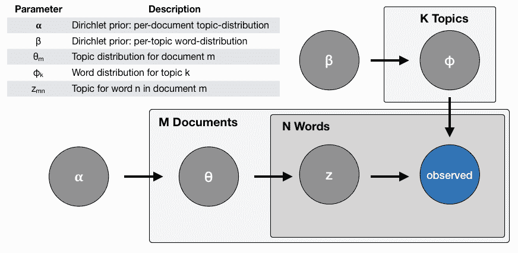

# 十四、主题建模

在上一章中，我们使用单词袋模型将非结构化文本数据转换为数字格式。该模型从词序中抽象出来，将文档表示为词向量，其中每个条目表示一个标记与文档的相关性。

由此产生的**文档-术语矩阵** ( **DTM** )，(您也可能遇到转置的术语-文档矩阵)对于将文档相互比较或者与基于其标记内容的查询向量进行比较是有用的，并且可以快速地在大海捞针或者相应地对文档进行分类。

然而，这个文档模型既高维又非常稀疏。因此，它对总结内容或更接近理解它是关于什么的作用很小。在这一章中，我们将使用主题建模形式的无监督机器学习来从文档中提取隐藏主题。这些主题可以自动产生对大量文档的详细见解。因为使用了主题和文档的关联度，所以它们对于理解干草堆本身和允许文档的简洁标记是非常有用的。

主题模型允许提取复杂的、可解释的文本特征，这些特征可以以各种方式用于从大量文档中提取交易信号。它们加速文档的审阅，帮助识别和聚集相似的文档，并且可以作为预测建模的基础进行注释。应用包括识别公司披露、盈利电话会议记录、客户评论或合同中的关键主题，例如使用情绪分析或直接标记后续资产回报进行注释。

更具体地说，在本章中，我们将讨论以下主题:

*   主题建模实现了什么，为什么它很重要，以及它是如何发展的
*   **潜在语义索引** ( **LSI** )如何降低 DTM 的维度
*   **概率潜在语义分析** ( **pLSA** )如何使用生成模型提取主题
*   潜在狄利克雷分配如何提炼 pLSA，为什么它是最流行的主题模型
*   如何可视化和评估主题建模结果
*   如何使用 sklearn 和 gensim 实现 LDA
*   如何将主题建模应用于收益电话和 Yelp 商业评论的收集

以下部分的代码示例位于本章的 GitHub 资源库目录中，参考资料列在主自述文件中。

# 学习潜在主题:目标和方法

主题建模旨在发现文档中隐藏的主题或主题，这些主题或主题捕获了单个单词之外的语义信息。它旨在解决构建机器学习算法的一个关键挑战，该算法通过超越已写内容的词汇层到预期内容的语义层来从文本数据中学习。得到的主题可用于根据它们与各种主题的关联来注释文档。

换句话说，主题建模旨在自动总结大量文档，以便于组织和管理，以及搜索和推荐。同时，它可以使文档的理解达到人类可以解释主题描述的程度。

主题模型旨在解决困扰单词袋模型的维数灾难。基于高维稀疏向量的文档表示会使相似性度量带有噪声，导致距离度量不准确和文本分类模型过拟合。

此外，单词袋模型忽略了词序，并且丢失了上下文以及语义信息，因为它不能捕捉同义性(几个单词具有相同的意思)和多义性(一个单词具有几个意思)。因此，当文档没有被用于搜索或比较的术语索引时，文档检索或相似性搜索可能会错过要点。

这些缺点提出了这样一个问题:我们如何建模和学习有意义主题，以便与文本数据进行更有效的交互？

# 从线性代数到分层概率模型

主题模型对向量空间模型(在 20 世纪 70 年代中期开发)进行改进的最初尝试应用线性代数来降低文档-术语矩阵的维度。这种方法类似于我们在第 12 章、*无监督学习*中作为主成分分析讨论的算法，关于无监督学习。虽然有效，但在没有基准模型的情况下，很难评估这些模型的结果。

作为回应，概率模型出现了，它假设一个显式的文档生成过程，并提供算法来逆向工程这个过程，并恢复潜在的主题。

此表强调了模型发展过程中的关键里程碑，我们将在以下章节中更详细地介绍这些里程碑:

| **型号** | **年** | **描述** |
| **潜在语义索引** ( **LSI** ) | One thousand nine hundred and eighty-eight | 通过以下方式减少单词空间维度以捕获语义文档-术语关系 |
| **概率潜在语义分析** ( **pLSA** | One thousand nine hundred and ninety-nine | 对一个过程进行反向工程，该过程假设单词生成一个主题，而文档是多个主题的混合 |
| **潜在狄利克雷分配** ( **LDA** | Two thousand and three | 为文档添加一个生成过程:一个三级分层贝叶斯模型 |

# 潜在语义索引

潜在语义索引(LSI，也称为潜在语义分析)旨在改善省略了包含查询术语同义词的相关文档的查询结果。它旨在对文档和术语之间的关系进行建模，以便能够预测术语应该与文档相关联，即使由于单词使用的可变性，没有观察到这种关联。

LSI 使用线性代数，通过分解 DTM 找到给定数量的 *k* 潜在主题。更具体地说，它使用**奇异值分解** ( **SVD** )来寻找使用 k 个奇异值和向量的最佳低秩 DTM 近似。换句话说，LSI 是我们在[第 12 章](12.html)、*无监督学习*中遇到的降维的无监督学习技术在文本表示中的应用，我们在[第 13 章](13.html)、*中讨论了如何处理文本数据*。作者对层次聚类进行了实验，但发现它限制太多，无法明确地对文档-主题和主题-术语关系进行建模，也无法捕捉文档或术语与几个主题的关联。

在这种情况下，SVD 的目的是识别一组不相关的索引变量或因子，允许我们通过因子值的向量来表示每个术语和文档。

下图说明了 SVD 如何将 DTM 分解为三个矩阵，两个矩阵包含正交奇异向量，一个矩阵包含作为比例因子的奇异值。假设原始数据中存在某种相关性，奇异值的值会衰减，因此仅选择最大的 *T* 奇异值会产生原始 DTM 的低维近似，从而损失相对较少的信息。因此，在简化版本中，具有 *N* 项的行或列只有 *T < N* 项。

这种简化的分解可以解释为如下所示，其中第一个*M×T*矩阵表示文档和主题之间的关系，对角矩阵根据它们的语料库强度来缩放主题，第三个矩阵对术语-主题关系进行建模:


由前两个矩阵的乘积产生的矩阵的行，*U<sub>T</sub>σ<sub>T</sub>*<sub>，</sub> 对应于投影到潜在主题空间中的原始文档的位置。

# 如何用 sklearn 实现 LSI

我们将使用上一章介绍的 BBC 文章数据来说明 LSI 的应用，因为它足够小，允许快速训练，并允许我们将主题分配与类别标签进行比较。查看`latent_semantic_indexing`笔记本，了解更多实施细节:

1.  我们首先加载文档，并创建一个包含 50 篇文章的训练和(分层)测试集。
2.  然后，我们使用`TfidfVectorizer`对数据进行矢量化，以获得加权 DTM 计数，并过滤掉出现在少于 1%或多于 25%的文档中的单词，以及通用停用词，从而获得大约 2，900 个单词的词汇表:

```py
vectorizer = TfidfVectorizer(max_df=.25, min_df=.01,
stop_words='english',
binary=False)
train_dtm = vectorizer.fit_transform(train_docs.article)
test_dtm = vectorizer.transform(test_docs.article)
```

3.  我们使用`sklearn`的`TruncatedSVD`类，该类只计算 *k* 个最大奇异值来降低文档术语矩阵的维数。确定性 arpack 算法提供了精确的解决方案，但默认的随机化实现对于大型矩阵更有效。
4.  我们计算五个主题来匹配这五个类别，这五个类别仅解释了总 DTM 方差的 5.4%，因此更高的值是合理的:

```py
svd = TruncatedSVD(n_components=5, n_iter=5, random_state=42)
svd.fit(train_dtm)
svd.explained_variance*ratio* array([0.00187014, 0.01559661, 0.01389952, 0.01215842, 0.01066485])
```

5.  LSI 为文档术语矩阵确定了一个新的正交基，它将排序降低到所需主题的数量。
6.  被训练的`svd`对象的`.transform()`方法将文档投影到新的主题空间中，该主题空间是降低文档向量的维度的结果，并且对应于前面说明的*U<sub>T</sub>σ<sub>T</sub>*变换:

```py
train_doc_topics = svd.transform(train_dtm)
train_doc_topics.shape
(2175, 5)
```

7.  我们可以对一篇文章进行抽样，以查看它在主题空间中的位置。我们绘制了一篇与主题 1 和 2 最(积极)相关的`Politics`文章:

```py
i = randint(0, len(train_docs))
train_docs.iloc[i, :2].append(pd.Series(doc_topics[i], index=topic_labels))
Category Politics
Heading What the election should really be about?
Topic 1 0.33
Topic 2 0.18
Topic 3 0.12
Topic 4 0.02
Topic 5 0.06
```

8.  本示例的主题分配与下面说明的每个类别的平均主题权重一致(`Politics`在最左边)。它们说明了 LSI 如何将 k 个主题表示为 k 维空间中的方向(笔记本包括每个类别的平均主题分配到二维空间的投影)。
9.  每个类别都有明确的定义，测试任务与培训任务相匹配。然而，权重既有正的也有负的，这使得解释主题变得更加困难:


10.  我们还可以显示与每个主题最密切相关的单词(绝对数量)。这些主题似乎捕捉了一些语义信息，但没有区分:


# 利弊

LSI 的好处包括消除噪音和减少维数灾难，同时还捕获一些语义并对文档和术语进行聚类。

然而，LSI 的结果很难解释，因为主题是既有正面条目又有负面条目的词向量。也没有潜在的模型允许评估适合度，并在选择维度或主题的数量时提供指导。

# 概率潜在语义分析

概率潜在语义分析(pLSA) 从统计学的角度研究 LSA，并创建了一个生成模型来解决 LSA 缺乏理论支撑的问题。

pLSA 显式地将由 DTM 描述的文档 *d* 和单词 *w* 的每个共现概率建模为涉及主题 *t* 的条件独立多项式分布的混合。

单词-文档共现的这种生成过程的对称公式假设单词和文档都是由潜在主题类生成的，而非对称模型假设主题是在给定文档的情况下选择的，单词是由给定主题的第二步骤产生的:


主题的数量是在训练之前选择的超参数，而不是从数据中学习的。

概率模型通常使用以下图版符号来表示依赖性。下图编码了刚才描述的不对称模型的关系。每个矩形代表多个项目，例如外部块的 M 个文档和内部块的每个文档的 N 个单词。我们只观察文档及其内容，模型推断隐藏或潜在的主题分布:


使用概率模型的好处是，我们现在可以通过评估模型分配给新文档的概率来比较模型，给定训练期间学习的参数。

# 如何使用 sklearn 实现 pLSA

pLSA 相当于使用 Kullback-Leibler 散度目标的非负矩阵分解(参见 GitHub[https://GitHub . com/packt publishing/Hands-On-Machine-Learning-for-Algorithmic-Trading](https://github.com/PacktPublishing/Hands-On-Machine-Learning-for-Algorithmic-Trading)上的参考资料)。因此，我们可以按照 LSA 的例子，使用`sklearn.decomposition.NM`类来实现这个模型。

使用与`TfidfVectorizer`生产的 DTM 相同的列车测试分割，我们将 pLSA 拟合如下:

```py
nmf = NMF(n_components=n_components,
random_state=42,
solver='mu',
beta_loss='kullback-leibler',
max_iter=1000)
nmf.fit(train_dtm)
```

我们获得了重建误差的度量，它替代了之前解释的方差度量:

```py
nmf.reconstruction_err_
316.2609400385988
```

由于其概率性质，pLSA 只产生正的主题权重，从而为测试和训练集产生更直接的主题类别关系:


我们还可以看到，描述每个话题的词表开始变得更有意义；例如，娱乐类别与主题 4 最直接相关，主题 4 包括单词电影、开始等:


# 潜在狄利克雷分配

**潜在狄利克雷分配** ( **LDA** )通过增加主题的生成过程来扩展 pLSA。

它是最流行的主题模型，因为它倾向于产生人类可以理解的有意义的主题，可以将主题分配给新文档，并且是可扩展的。LDA 模型的变体可以包括元数据，如作者、图像数据或学习分层主题。

# LDA 如何工作

LDA 是一种分层贝叶斯模型，它假设主题是词的概率分布，文档是主题的分布。更具体地说，该模型假设主题遵循稀疏狄利克雷分布，这意味着文档仅覆盖一小部分主题，并且主题仅频繁使用一小部分单词。

# 狄利克雷分布

狄利克雷分布产生可用于离散分布的概率向量。也就是说，它随机生成给定数量的正值，其和为 1，这是概率的预期值。它有一个控制概率集中的正实值参数。更接近零的值意味着只有几个值是正的，并且得到最大的概率质量。下面的屏幕截图显示了三个大小为 10 的绘图，其中α*= 0.1*(`dirichlet_distribution`笔记本包含一个模拟，因此您可以使用不同的参数值进行实验):


狄利克雷分配

# 生成模型

Dirichlet 分布在 LDA 主题模型中占有重要地位，当作者将文章添加到文档主体时，该模型假设以下生成过程:

1.  根据话题概率随机混合共享话题的一个小子集 *K*
2.  根据文档主题概率，为每个单词选择一个主题
3.  根据主题词概率，从主题词表中选择一个词

因此，文章内容取决于每个主题的权重以及组成每个主题的术语。狄利克雷分布控制文档的主题和主题的单词的选择，并编码文档仅覆盖少数主题，而每个主题仅频繁使用少量单词的思想。

LDA 模型的图版符号总结了这些关系:



# 对流程进行逆向工程

生成过程是虚构的，但结果证明是有用的，因为它允许恢复各种分布。LDA 算法对虚构作者的工作进行反向工程，并得出文档-主题-单词关系的概要，该概要简明地描述了以下内容:

*   每个主题对文档的贡献百分比
*   每个单词与一个主题的概率关联

LDA 通过对假定的内容生成过程进行逆向工程，解决了从文档体及其包含的单词中恢复分布的贝叶斯推理问题。原论文用**变分贝叶斯** ( **VB** )来近似后验分布。替代方法包括吉布斯抽样和期望传播。稍后，我们将使用 sklearn 和 gensim 库来说明实现。

# 如何评价 LDA 话题

无监督的主题模型不能保证结果是有意义的或可解释的，也没有像有监督学习那样的客观标准来评估结果。人类话题评估被认为是黄金标准，但是潜在地昂贵并且不容易大规模获得。

更客观地评估结果的两个选项包括困惑，它在看不见的文档上评估模型，以及主题一致性度量，它旨在评估未发现模式的语义质量。

# 困惑

当应用于 LDA 时，困惑度量由模型恢复的主题词概率分布预测样本(例如，看不见的文本文档)的程度。它基于这个分布 *p* 的熵 *H* ( *p* )并且相对于记号集合 *w* 计算:


接近零的测量值意味着分布更好地预测样本。

# 话题连贯性

主题一致性衡量主题模型结果的语义一致性，即人类是否会认为与主题相关联的单词及其概率是有意义的。

为此，它通过测量与主题最相关的单词之间的语义相似度来为每个主题评分。更具体地说，连贯性测量是基于观察到一起定义主题的一组单词 *W* 的概率。

我们使用了两种为 LDA 设计的一致性度量，即 UMass 和 UCI 度量，它们与人类对话题质量的判断一致。

UCI 度量将单词对的得分定义为两对不同的(顶部)主题单词*w<sub>I</sub>T7、*wj*∈*w*和平滑因子 *ε* 之间的**逐点互信息** ( **PMI** )的总和:*


概率是从外部语料库(如维基百科)的滑动窗口中的单词共现频率计算的，因此这种度量可以被认为是与语义基础事实的外部比较。

相反，UMass 度量使用来自训练语料库的多个文档 *D* 中的同现来计算一致性分数:


这一措施反映了内在的一致性，而不是与外在的基本事实进行比较。这两种方法都被评估为与人类的判断一致。在这两种情况下，值越接近零意味着主题越连贯。

# 如何使用 sklearn 实现 LDA

如前所述，使用 BBC 数据，我们使用`sklearn.decomposition.LatentDirichletAllocation`训练具有五个主题的 LDA 模型(关于参数的详细信息，请参见 sklearn 文档，关于实现的详细信息，请参见笔记本`lda_with_sklearn`):

```py
lda = LatentDirichletAllocation(n_components=5, 
                                    n_jobs=-1, 
                                    max_iter=500,
                                    learning_method='batch', 
                                    evaluate_every=5,
                                    verbose=1, 
                                    random_state=42)
ldat.fit(train_dtm)
LatentDirichletAllocation(batch_size=128, doc_topic_prior=None,
             evaluate_every=5, learning_decay=0.7, learning_method='batch',
             learning_offset=10.0, max_doc_update_iter=100, max_iter=500,
             mean_change_tol=0.001, n_components=5, n_jobs=-1,
             n_topics=None, perp_tol=0.1, random_state=42,
             topic_word_prior=None, total_samples=1000000.0, verbose=1)
```

该模型在训练期间跟踪样本内的困惑，并且一旦该度量停止改善就停止迭代。我们可以像往常一样用 sklearn 对象持久化和加载结果:

```py
joblib.dump(lda, model_path / 'lda.pkl')
lda = joblib.load(model_path / 'lda.pkl')
```

# 如何使用 pyLDAvis 可视化 LDA 结果

主题可视化有助于使用人类判断来评估主题质量。pyLDAvis 是 LDAvis 的 Python 端口，用 R 和`D3.js`开发。我们将介绍关键概念；每个 LDA 实施笔记本都包含示例。

pyLDAvis 显示了主题之间的全局关系，同时通过检查与每个主题最密切相关的术语以及与每个术语相关的主题，促进了主题的语义评估。它还解决了语料库中频繁出现的术语倾向于支配定义主题的词的多项式分布的挑战。LDAVis 引入了术语 *w* 与主题 *t* 的相关性 *r* ，使用权重参数 *0 < =ƛ < =1* 对关键术语进行灵活排序。

用作为模型对主题 *t* 观察到词语 w 的概率估计，并作为 w 在语料库中的边际概率:


第一个术语测量术语 *t* 与主题 *w* 的关联程度，第二个术语测量提升或显著性，即术语对于主题的可能性比在语料库中的可能性大多少。


话题 14

该工具允许用户交互式地改变 *ƛ* 来调整相关性，从而更新术语的排名。用户研究发现 *ƛ=0.6* 产生最合理的结果。

# 如何使用 gensim 实现 LDA

是一个专门的 NLP 库，具有快速 LDA 实现和许多附加功能。我们还将在下一章的单词向量中使用它(详见`latent_dirichlet_allocation_gensim`笔记本)。

它有助于将 sklearn 生成的 DTM 转换为 gensim 数据结构，如下所示:

```py
train_corpus = Sparse2Corpus(train_dtm, documents_columns=False)
test_corpus = Sparse2Corpus(test_dtm, documents_columns=False)
id2word = pd.Series(vectorizer.get_feature_names()).to_dict()
```

Gensim LDA 算法包括许多设置，如下所示:

```py
LdaModel(corpus=None, 
         num_topics=100, 
         id2word=None, 
         distributed=False, 
         chunksize=2000, # No of doc per training chunk.
         passes=1,       # No of passes through corpus during training
         update_every=1, # No of docs to be iterated through per update
         alpha='symmetric', 
         eta=None,       # a-priori belief on word probability
         decay=0.5,    # % of lambda forgotten when new doc is examined
         offset=1.0,   # controls slow down of first few iterations.
         eval_every=10,   # how often estimate log perplexity (costly)
         iterations=50,         # Max. of iterations through the corpus
         gamma_threshold=0.001, # Min. change in gamma to continue
         minimum_probability=0.01, # Filter topics with lower 
                                     probability
         random_state=None, 
         ns_conf=None, 
         minimum_phi_value=0.01, # lower bound on term probabilities
         per_word_topics=False,  #  Compute most word-topic 
                                    probabilities
         callbacks=None, 
         dtype=<class 'numpy.float32'>)
```

Gensim 还为并行训练提供了一个`LdaMulticore`模型，该模型可以使用 Python 的并行计算多处理特性来加速训练。

模型训练只需要实例化`LdaModel`对象，如下所示:

```py
lda = LdaModel(corpus=train_corpus,
num_topics=5,
id2word=id2word)
```

主题连贯性衡量一个主题中的单词是否倾向于同时出现。它为每对不同的排名靠前的单词加一个分数。分数是包含至少一个较高排序单词实例的文档也包含至少一个较低排序单词实例的概率的对数。

较大的负值表示不经常同现的单词；越接近零的值表示单词往往更频繁地同时出现。`gensim`允许话题连贯性评估，产生话题连贯性并显示每个话题最重要的单词:

```py
coherence = lda_gensim.top_topics(corpus=train_corpus,  coherence='u_mass')
```

我们可以将结果显示如下:

```py
topic_coherence = []
topic_words = pd.DataFrame()
for t in range(len(coherence)):
    label = topic_labels[t]
    topic_coherence.append(coherence[t][1])
    df = pd.DataFrame(coherence[t][0], columns=[(label, 'prob'), (label, 'term')])
    df[(label, 'prob')] = df[(label, 'prob')].apply(lambda x: '{:.2%}'.format(x))
    topic_words = pd.concat([topic_words, df], axis=1)

topic_words.columns = pd.MultiIndex.from_tuples(topic_words.columns)
pd.set_option('expand_frame_repr', False)
print(topic_words.head())
pd.Series(topic_coherence, index=topic_labels).plot.bar();
```

这显示了每个主题的以下热门词汇:

| **话题 1** |  | **话题二** |  | **话题三** |  | **话题四** |  | **话题五** |  |
| 可能性 | 学期 | 可能性 | 学期 | 可能性 | 学期 | 可能性 | 学期 | 可能性 | 学期 |
| 0.55% | 在线的 | 0.90% | 最好的 | 1.04% | 可动的 | 0.64% | 市场 | 0.94% | 劳动 |
| 0.51% | 位置 | 0.87% | 比赛 | 0.98% | 电话 | 0.53% | 增长 | 0.72% | 布莱尔 |
| 0.46% | 比赛 | 0.62% | 玩 | 0.51% | 音乐 | 0.52% | 销售 | 0.72% | 棕色 |
| 0.45% | 网 | 0.61% | 获胜 | 0.48% | 电影 | 0.49% | 经济 | 0.65% | 选举 |
| 0.44% | 二手的 | 0.56% | 胜利 | 0.48% | 使用 | 0.45% | 价格 | 0.57% | 一致的 |

以及相应的连贯性分数，这些分数突出了主题质量的衰减(至少部分是由于相对较小的数据集):


话题质量的下降

# 收益电话的主题建模

在[第 3 章](03.html)、*金融替代数据*中，我们学习了如何从 SeekingAlpha 网站收集收益电话数据。在这一节中，我们将使用这个资源来说明主题建模。我正在使用 2018 年下半年约 500 份收益电话会议记录的样本。对于实际应用，更大的数据集将是非常理想的。`earnings_calls`目录包含几个文件，后面会提到例子。

有关加载、探索和预处理数据以及训练和评估单个模型的详细信息，请参见`lda_earnings_calls`笔记本，此处描述的实验请参见`run_experiments.py`文件。

# 数据预处理

文字记录包括公司代表、经营者的个人陈述，通常还有与分析师的问答环节。我们将把这些语句作为单独的文档，忽略操作符语句，得到 22，766 个条目，平均字数为 144，中值字数为 64:

```py
documents = []
for transcript in earnings_path.iterdir():
    content = pd.read_csv(transcript / 'content.csv')
    documents.extend(content.loc[(content.speaker!='Operator') & (content.content.str.len() > 5), 'content'].tolist())
len(documents)
22766
```

我们使用`spaCy`对这些文档进行预处理，如[第 13 章](13.html)、*处理文本数据*(见笔记本)所示，并将清理和词条化的文本存储为一个新的文本文件。

数据探索揭示了特定领域的停用词，例如我们在第二步中删除的 year 和 quarter，在第二步中，我们还过滤掉了少于 10 个单词的语句，从而保留了大约 16，150 个。

# 模型训练和评估

举例来说，我们将创建一个文档术语矩阵，其中包含大约 1，560 个特征中出现在 0.5%到 50%的文档中的术语。在四核 i7 上，使用 25 遍语料库来训练 15 个主题的模型需要两分钟多一点。

每个主题的前 10 个词确定了几个不同的主题，从显而易见的金融信息到临床试验(主题 4)和供应链问题(12):


使用 pyLDAvis 的相关性指标，无条件频率相对于 lift 的权重为 0.6，主题定义变得更加直观，如关于销售业绩的主题 14 所示:


主题 14 的销售业绩

该笔记本还说明了如何通过主题关联查找文档。在这种情况下，分析师可以检查相关语句的细微差别，使用情感分析来进一步处理特定于主题的文本数据，或者分配从市场价格得出的标签。

# 运行实验

为了说明不同参数设置的影响，我们对不同的 DTM 约束和模型参数进行了数百次实验。更具体地说，我们让`min_df`和`max_df`参数的范围从 50-500 个单词和 10%到 100%的文档，分别交替使用二进制和绝对计数。然后，我们用 3 到 50 个主题训练 LDA 模型，在语料库上使用 1 和 25 遍。

下图显示了主题连贯性(越高越好)和困惑度(越低越好)方面的结果。在 25-30 个主题之后，连贯性下降，困惑类似地增加:


笔记本包括量化参数和结果之间关系的回归结果。我们通常使用绝对计数和较小的词汇表会得到更好的结果。

# Yelp 商业评论的主题建模

这个笔记本包含了一个 LDA 应用于 Yelp 上 600 万条商业评论的例子。评论在长度上比从收益电话会议记录中摘录的声明更加统一。像以前一样清洗后，第 10 个<sup>个</sup>和第 90 个<sup>个</sup>百分位的范围从 14 到 90 个代币。

我们基于 *min_df=0.1%* 和 *max_df=25%* 使用 3，800 个标记的词汇表显示一个模型的结果，以避免 20 个主题的冗长训练时间。我们可以使用`pyldavis topic_info`属性来计算 *lambda=0.6* 的相关性值，从而生成下面的单词列表(详见笔记本):


Gensim 提供了一个`LdaMultiCore`实现，允许使用 Python 的多处理模块进行并行训练，并在使用四个工人时将性能提高了 50%。由于 I/O 瓶颈，更多的工人并没有进一步减少培训时间。

# 摘要

在这一章中，我们探讨了如何使用主题建模来深入了解大量文档的内容。我们讨论了潜在语义分析，它使用 DTM 的维度缩减将文档投射到潜在的主题空间。虽然有效地解决了由高维单词向量引起的维数灾难，但它没有捕获太多的语义信息。概率模型对文档、主题和单词的相互作用做出明确的假设，允许算法对文档生成过程进行逆向工程，并评估模型是否适合新文档。我们看到，LDA 能够提取合理的主题，使我们能够以自动化的方式获得对大量文本的高层次理解，同时也以有针对性的方式识别相关文档。

在下一章中，我们将学习如何训练神经网络，这些网络将单个词嵌入到高维向量空间中，该空间可以捕捉重要的语义信息，并允许我们将得到的单词向量用作高质量的文本特征。