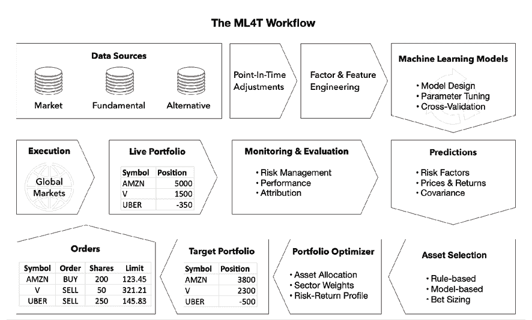

# 一、用于交易的机器学习——从理念到实践

算法交易依赖于执行算法的计算机程序来自动化交易策略的部分或全部要素。**算法**是为实现目标而设计的一系列步骤或规则。它们可以采取多种形式，并在整个投资过程中促进优化，从创意产生到资产配置、交易执行和风险管理。

**机器学习****ML**涉及从数据中学习规则或模式的算法，以实现最小化预测误差等目标。本书中的示例将说明 ML 算法如何从数据中提取信息，以支持或自动化关键投资活动。这些活动包括观察市场和分析数据，形成对未来的预期，决定是否下买卖订单，以及管理由此产生的投资组合，以产生相对于风险的有吸引力的回报。

最终，积极投资管理的目标是产生阿尔法，即超过评估基准的投资组合回报。主动管理的**基本定律**假设，生成阿尔法的关键是拥有准确的回报预测，并能够根据这些预测采取行动（Grinold 1989；Grinold 和 Kahn 2000）。

该法律定义了**信息比率**（**IR**）来表示积极管理的价值，即投资组合和基准之间的收益差异与这些收益波动性的比率。它进一步将 IR 近似为以下各项的乘积：

*   **信息系数**（**IC**），通过预测与结果的等级相关性来衡量预测的质量
*   策略的**宽度的平方根，表示为对这些预测的独立下注数量**

成熟投资者在金融市场上的竞争意味着，做出精确的预测以生成阿尔法需要更高的信息，要么通过获得更好的数据，要么通过更高的处理能力，要么两者兼而有之。

这就是 ML 的作用：将**ML 应用于交易**（**ML4T**）通常旨在更有效地利用快速多样化的数据范围，以产生更好、更具可操作性的预测，从而提高投资决策和结果的质量。

历史上，算法交易曾被狭义地定义为交易执行的自动化，以最小化卖方提供的成本。本书采用了更全面的视角，因为算法的使用，特别是 ML，已经影响到更广泛的活动范围，从产生想法和从数据中提取信号到资产分配、头寸大小以及测试和评估策略。

本章着眼于导致 ML 成为投资行业竞争优势来源的行业趋势。我们还将研究 ML 在投资过程中的适用性，以实现算法交易策略。更具体地说，我们将涵盖以下主题：

*   投资行业 ML 增长背后的主要趋势
*   利用 ML 的交易策略的设计和执行
*   交易中 ML 的常用用例

您可以在 GitHub 存储库（[中的本章自述文件中找到指向其他资源和参考的链接 https://github.com/PacktPublishing/Machine-Learning-for-Algorithmic-Trading-Second-Edition](https://github.com/PacktPublishing/Machine-Learning-for-Algorithmic-Trading-Second-Edition) ）。

# ML 在投资行业的崛起

在过去几十年中，投资行业发生了巨大的变化，并在竞争加剧、技术进步和充满挑战的经济环境中继续如此。本节回顾了影响整体投资环境的关键趋势，以及算法交易和 ML 使用的背景。

将算法交易和 ML 推向当前显著地位的趋势包括：

*   **市场微观结构**的变化，如电子交易的传播以及跨资产类别和地域的市场整合
*   根据**风险因子敞口**制定投资策略，与资产类别相反
*   **计算能力**、**数据生成和****管理**、**统计方法**的革命，包括深度学习的突破
*   在算法交易方面，先驱者**相对于人类自由裁量投资者的表现优于**

此外，2001 年和 2008 年的金融危机影响了投资者如何进行多样化和风险管理。一个结果是以**交易所买卖基金**（**ETF**的形式出现的低成本**被动投资工具**的增加。

2008 年危机引发了主要央行的大规模资产购买，在这场危机之后，低收益率和低波动性的情况下，成本意识强的投资者将超过 3.5 万亿美元的资金从积极管理的共同基金转移到被动管理的 ETF。

竞争压力也反映在**较低的对冲基金费用**上。2017 年，对冲基金费用从传统的 2%的年度管理费和 20%的利润回收率分别下降到平均 1.48%和 17.4%。

## 从电子交易到高频交易

自 20 世纪 60 年代网络开始将价格路由到计算机终端以来，电子交易在能力、交易量、资产类别覆盖范围和地理位置等方面都有了显著的进步。股票市场一直处于全球这一趋势的前沿。有关金融市场相关变化的全面报道，请参见 Harris（2003）和 Strumeyer（2017）；在下一章介绍如何使用市场和基础数据时，我们将回到这个主题。

SEC 1997 年的订单处理规则通过**电子通信网络**（**ECNs**向交易所引入了竞争。ECN 是自动**替代交易系统**（**ATS**），它以指定价格匹配买卖订单，主要针对股票和货币，并注册为经纪交易商。它允许不同地理位置的重要券商和个体交易员在交易所和交易结束后直接进行交易，而无需中介机构。

**暗池**是另一种私人 ATS，允许机构投资者在不公开披露其信息的情况下交易大额订单，这与交易所在与 ECN 竞争之前管理其订单簿的方式相反。暗池不会公布交易前的出价和出价，交易价格只有在执行后一段时间才会公开。自 2000 年代中期以来，由于担心大额订单价格的不利波动以及高频交易员的订单前沿，这些股票在美国交易的股票中占比大幅增长，达到 40%。它们通常被安置在大型银行内，并受 SEC 监管。

随着电子交易的兴起，**成本效益执行算法**迅速发展，采用率迅速从卖方传播到买方，并跨越资产类别。2000 年左右，自动交易作为一种卖方工具出现，旨在以经济高效的方式执行订单，将订单分解成更小、有序的部分，以限制其市场影响。这些工具扩展到买方，并通过考虑交易成本和流动性以及短期价格和交易量预测等因子变得越来越复杂。

**直接市场准入**（**DMA**）允许交易者使用基础设施和作为交易所成员的经纪人的市场参与者身份直接向交易所发送订单，从而使交易者对执行有更大的控制权。发起访问消除了经纪人的交易前风险控制，并形成了**高频交易**（**HFT**的基础。

高频交易是指金融工具中的自动交易，在微秒范围内以极低的延迟执行，参与者在很短的时间内持仓。目标是发现并利用交易场所制度基础设施市场微观结构中的**低效率。**

高频交易在过去 10 年中大幅增长，估计约占美国股市交易量的 55%，欧洲股市交易量的 40%。HFT 在期货市场也已增长到约 80%的外汇期货交易量，以及利率和 10 年期国债期货交易量的三分之二（Miller 2016）。

高频交易策略旨在通过**被动或主动策略**在每笔交易中赚取微利。被动策略包括套利交易，从同一资产或其衍生品在不同场所交易的微小价差中获利。攻击性策略包括订单预期或动量点火。订单预期，也称为流动性检测，涉及提交小型探索性订单的算法，以检测大型机构投资者隐藏的流动性，并在大额订单之前交易，以从随后的价格变动中获益。动量点火意味着执行和取消一系列订单的算法，以欺骗其他 HFT 算法更积极地购买（或出售），并从由此产生的价格变化中获益。

监管机构对某些激进 HFT策略与**市场脆弱性和波动性增加**之间的潜在联系表示担忧，例如 2010 年 5 月的闪电崩盘、2014 年 10 月的国债市场波动，2015 年 8 月 24 日，道琼斯工业平均指数暴跌 1000 多点。与此同时，由于高频交易的存在，市场流动性随着交易量的增加而增加，从而降低了整体交易成本。

在波动性降低、技术成本上升以及数据和交易场所访问成本上升的情况下，交易量减少，导致了金融压力。2017 年，来自美国股票的 HFT 总收入预计自 2008 年以来首次降至 10 亿美元以下，低于 2009 年的 79 亿美元。这一趋势导致了**行业整合**，例如，最大的上市自营交易公司 Virtu Financial 进行了各种收购，并进行了共享基础设施投资，如芝加哥和东京之间新的向西超低延迟路线。与此同时，阿尔法交易实验室（Alpha Trading Labs）等初创企业正在通过众包算法提供 HFT 交易基础设施和数据，以实现 HFT 的民主化，从而获得一定的利润份额。

## 因子投资和智能贝塔基金

资产提供的回报是与投资相关的不确定性或风险的函数。例如，股权投资意味着承担公司的业务风险，而债券投资意味着违约风险。在**特定风险特征预测收益**的范围内，识别和预测这些风险因子的行为成为设计投资策略时的主要关注点。它产生有价值的交易信号，是取得卓越主动管理成果的关键。随着时间的推移，行业对风险因子的理解有了很大的发展，并影响了 ML 用于交易的方式。*第 4 章*、*金融特征工程——如何研究阿尔法因子*、*第 5 章*、*投资组合优化与表现评估*将深入探讨本文所述概念的实际应用；综合报道见 Ang（2014）。

**现代投资组合理论****MPT**引入了对特定资产的特殊风险源和系统风险源的区分。特殊风险可以通过多样化来消除，但系统风险不能。20 世纪 60 年代初，资本资产定价模型**（**资本资产定价模型**）确定了一个单一因子驱动所有资产收益：市场投资组合的收益超过国库券。市场投资组合由所有可交易证券组成，按其市场价值加权。资产对市场的系统性风险敞口通过**β**来衡量，这是资产回报与市场投资组合之间的相关性。**

 **认识到一项资产的风险不是孤立地取决于该资产，而是取决于它相对于其他资产和整个市场的移动方式，这是一个重大的概念突破。换句话说，资产赚取的**风险溢价**是基于其对所有资产所经历的基础**普通风险**的敞口，而不是由于其特定的特质。

随后，学术研究和行业经验提出了许多关于资本资产定价模型（CAPM）预测的关键问题，即资产的风险溢价仅取决于资产贝塔系数衡量的单一因子。取而代之的是，许多额外的危险因子已经被发现。因子是一个可量化的信号、属性或任何变量，在历史上与未来股票收益率相关，并预计在未来保持相关。

这些风险因子被标记为异常，因为它们与**有效市场假说**（**有效市场假说**）相矛盾。EMH认为，市场均衡将始终根据 CAPM 对证券进行定价，因此其他因子不应具有预测能力（Malkiel 2003）。因子背后的经济理论既可以是理性的，因子风险溢价可以补偿糟糕时期的低回报，也可以是行为的，代理人无法套利掉超额回报。

众所周知的异常包括价值、规模和动量效应，这些效应有助于预测收益，同时控制 CAPM 市场因子。**规模效应**取决于小公司系统性地优于大公司（Banz 1981；Reinganum 1981）。**价值效应**（Basu et al.1981）指出，估值指标较低的公司表现优于具有相反特征的同行。它表明，低市盈率（如市盈率或市盈率）的公司比其他更昂贵的公司表现更好（正如价值投资发明家本杰明·格雷厄姆和大卫·多德所建议的，并由沃伦·巴菲特推广）。

20 世纪 80 年代末，AQR 创始合伙人 Clifford Asness 等人发现了**动量效应**，指出就最近 6-12 个月的回报而言，动量良好的股票比具有类似市场风险的动量较差的股票具有更高的未来回报。研究人员还发现，价值和动量因子解释了美国以外股票以及债券、货币和大宗商品等其他资产类别的回报，以及其他风险因子（Jegadeesh 和 Titman 1993；Asness、Moskowitz 和 Pedersen 2013）。

在固定收益中，价值策略是称为**乘收益率曲线**，是期限溢价的一种形式。在商品中，它被称为滚动收益，向上倾斜的期货曲线为正收益，反之为负收益。在外汇中，价值策略称为**携带**。

还有一个**非流动性溢价**。相对于流动性更强的证券，流动性较差的证券以低价交易，平均超额回报率较高。违约风险较高的债券平均回报率较高，反映出信用风险溢价。由于投资者愿意在回报率趋于崩溃时为高波动性购买保险，期权市场中波动性保护的卖家往往会获得高回报。

**多因子模型**以更广泛、更多样的术语定义风险，而不仅仅是市场投资组合。1976 年，Stephen Ross提出了**套利定价理论**，该理论主张投资者因无法分散的多种系统性风险来源而获得补偿（Roll 和 Ross，1984）。除了生产率、人口和政治风险外，三个最重要的宏观因子是增长、通胀和波动。1993 年，尤金·法马（Eugene Fama）和肯尼斯·弗伦奇（Kenneth French）将股票风险因子的规模和价值与市场因子结合起来，形成了一个单一的三因子模型，更好地解释了横向股票回报。他们后来添加了一个模型，该模型还包括债券风险因子，以同时解释这两种资产类别的回报（Fama 和 French 1993；2015）。

风险因子的一个特别吸引人的方面是它们的**低或负相关**。例如，价值和动量风险因子是负相关的，降低了风险，增加了风险调整后的回报，超出了风险因子所隐含的利益。此外，利用杠杆和多空策略，因子策略可以组合成**市场中性方法**。暴露于正风险的证券多头头寸与暴露于负风险的证券减持或空头头寸的组合允许收取动态风险溢价。

因此，解释 CAPM 以上和以外回报的因子被纳入投资风格，使投资组合倾向于一个或多个因子，资产开始迁移到基于因子的投资组合中。2008 年金融危机突显出，随着资产类别一起崩溃，当投资者不关注潜在因子风险时，资产类别标签可能具有高度误导性，并产生虚假的多元化意识。

在过去的几十年中，定量因子投资已经从基于两种或三种风格的简单方法发展到**多因子智能或奇异贝塔产品**。智能贝塔基金在 2017 年已突破 1 万亿美元的资产管理规模，证明了结合主动和被动管理的混合投资策略的受欢迎程度。**智能贝塔基金**采取被动策略，但根据一个或多个因子进行修改，如股票价格较低或根据股息支付进行筛选，以产生更好的回报。在这种增长的同时，对传统活跃经理人收取高额费用的批评越来越多，对其业绩的审查也越来越严格。

正在进行的风险因子的发现和成功预测，无论是单独的还是与其他风险因子结合，都会对资产类别的未来资产回报产生重大影响，这是投资行业 ML 激增的一个关键驱动因子，也是本书的一个关键主题。

## 算法先驱的表现胜过人类

率先进行算法交易的公司的**资产**（**资产管理规模**）的业绩记录和增长在激发投资者兴趣和后续行业复制成功的努力中发挥了关键作用。**系统基金与 HFT**的不同之处在于，在寻求套利机会的同时，交易可能会持续更长的时间，而不是纯粹的速度优势。

主要或完全依赖算法决策的系统策略最著名的是数学家詹姆斯·西蒙斯（James Simons），他于 1982 年创立了**文艺复兴科技**，并将其打造为首屈一指的量化公司。自 1982 年以来，该公司秘密设立的奖章基金（Medallion Fund）获得了 35%的年化回报率。

**D.E.Shaw、Citadel 和二西格玛**这三家使用基于算法的系统化策略的最著名的量化对冲基金，在 2017 年首次以投资者的总收入、扣除费用和自成立以来的表现跻身前 20 名。

D.E.Shaw 成立于 1988 年，2019 年拥有 500 亿美元的资产管理规模，名列第三。Citadel 由 Kenneth Griffin 于 1990 年创立，管理着 320 亿美元，排名第 5。二西格玛由 D.E.Shaw 的校友约翰·奥德贝克（John Overdeck）和大卫·西格尔（David Siegel）于 2001 年创立，其资产管理规模从 2011 年的 80 亿美元增长到 2019 年的 600 亿美元。**Bridgewater**由 Ray Dalio 于 1975 年创立，2019 年拥有超过 1600 亿美元的资产管理规模，并凭借其纯阿尔法基金（Pure Alpha fund）继续保持领先地位，该基金还包括系统性战略。

类似地，在机构投资者 2018 年对冲基金 100 强排行榜上，四大公司和前六大公司中的五家公司在很大程度上或完全依靠计算机和交易算法做出投资决策，而且所有这些公司都在一个充满挑战的环境中增加了资产。一些以数量为重点的公司爬上了这一行列，在某些情况下，他们的资产以两位数的百分比增长。排名第二的**应用定量研究**（**AQR**）在 2017 年将其对冲基金资产增长了 48%，2018 年增长了 29%，达到近 900 亿美元。

### ML 驱动型基金吸引了 1 万亿美元的资产管理规模

计算能力、数据可用性和统计方法的三次革命使得采用系统化、数据驱动的战略不仅更具吸引力和成本效益，而且成为竞争优势的关键来源。

因此，算法方法不仅在开创这些策略的对冲基金行业中得到了更广泛的应用，而且在更广泛的资产管理公司，甚至是 ETF 等被动管理工具中也得到了更广泛的应用。特别是，使用 ML 和算法自动化的**预测分析**在跨资产类别的投资过程的所有步骤中发挥着越来越突出的作用，从创意生成和研究到战略制定和投资组合构建、交易执行和风险管理。

对**行业规模**的估计有所不同，因为没有定量或算法基金的客观定义。许多传统对冲基金，甚至共同基金和 ETF 都在引入计算机驱动的策略，或以人机结合的方式将其整合到自由裁量环境中。

根据*经济学家*的说法，2016 年，系统基金成为美国股市机构交易的最大驱动力（忽略 HFT，它主要充当中间商）。2019 年，它们占机构交易量的 35%以上，高于 2010 年的 18%；只有 10%的交易仍由传统股票基金完成。以罗素 3000 指数衡量，美国股票的价值约为 31 万亿美元。三种类型的**计算机管理基金**——指数基金、ETF 和定量基金**的管理率约为 35%**，而传统对冲基金和其他共同基金的人力管理者管理率仅为 24%。

市场研究公司 Preqin 估计，近 1500 家对冲基金在计算机模型的帮助下完成了大部分交易。量化对冲基金目前在投资者进行的所有美国股票交易中占 27%，高于 2013 年的 14%。但许多人使用数据科学家或量子学家，他们反过来又使用机器来建立大型统计模型。

然而，近年来，基金已经转向了真正的 ML，即人工智能系统可以快速分析大量数据，并通过这种分析自我改进。最近的例子包括 Rebession Research、Sentent 和 Aidyia，它们依靠进化算法和深度学习来设计全自动**人工智能**（**AI**）驱动的投资平台。

从核心对冲基金行业开始，算法策略的采用已经扩散到共同基金，甚至以智能贝塔基金的形式被动管理的 EFT，以及以量化方法的形式扩散到全权委托基金。

### 量子基金的出现

在积极投资管理中，有两种截然不同的方法已经演变为：**系统性**（**或定量**）和**自由裁量投资**。系统方法依赖于可重复和数据驱动的方法的算法来识别许多证券的投资机会。相反，自由裁量方法涉及对少数证券的基本面进行深入分析。随着基础管理者采用更多数据科学驱动的方法，这两种方法变得越来越相似。

根据巴克莱银行的数据，即使是基本面交易者现在也用定量技术武装自己，占系统资产的 550 亿美元。量化基金对特定的公司不可知，它基于各种证券的模式和动态进行交易。巴克莱（Barclays）2018 年汇编的数据显示，此类数量约占对冲基金总资产的 17%。

拥有 140 亿美元资产的**Point72**已经将其大约一半的投资组合经理转向了人机结合的方法。Point72 也在向一个分析大量备选数据并将结果传递给交易员的小组投资数千万美元。

### 战略能力投资

三种趋势促进了算法交易策略中数据的使用，并可能进一步将投资行业从自由裁量型转向定量型：

*   数字数据可用性的指数级增长
*   以较低的成本增加计算能力和数据存储容量
*   分析复杂数据集的统计方法进展

在相关能力、技术、数据以及（最重要的）熟练人员方面不断增加的投资突显了使用 ML 进行算法交易对于竞争优势的重要性，特别是考虑到自 2008 年金融危机以来 ETF 等被动指数化投资工具的日益普及。

摩根士丹利指出，只有 23%的定量客户表示他们没有考虑使用或尚未使用 ML，低于 2016 年的 44%。**古根海姆合作伙伴**在加利福尼亚州劳伦斯伯克利国家实验室耗资 100 万美元建造了一个被称为超级计算集群，以帮助计算古根海姆定量投资基金的数据。电脑的电费每年还要花费 100 万美元。

**AQR**是一家定量投资集团，依靠学术研究来识别并系统地交易因子，随着时间的推移，这些因子已被证明优于大盘。该公司过去避免采用复兴科技（Renaissance Technologies）或德肖（DE Shaw）等定量同行的纯计算机驱动战略。然而，最近，AQR 已经开始在市场上寻找盈利模式，使用 ML 解析新的数据集，如油井和油轮投射的阴影卫星图片。

拥有超过 5 万亿美元资产管理规模的领先公司贝莱德（BlackRock）也通过大量投资于 SAE（一家在金融危机期间收购的系统性交易公司）来押注算法，以击败全权委托基金经理。富兰克林·邓普顿（Franklin Templeton）以未披露的金额收购了以债务为中心、以数据为导向的投资公司 Random Forest Capital，希望其技术能够支持更广泛的资产管理公司。

## ML 和备选数据

长期以来，对冲基金一直通过**信息优势**和发现新的不相关信号的能力来寻找阿尔法。历史上，这包括对购物者或选举或公投前选民的专有调查。

偶尔，利用公司内部人士、医生和专家网络扩大对行业趋势或公司的了解会跨越法律界限：2010 年后，一系列针对交易员、投资组合经理和分析师使用**内幕信息**的起诉震动了行业。

相比之下，使用 ML 开发传统和备选数据源的信息优势与专家和行业网络或访问公司管理无关，而是与收集大量不同数据源并实时分析它们的能力有关。

常规数据包括经济统计数据、交易数据或公司报告。**备选数据**范围更广，包括卫星图像、信用卡销售、情感分析、移动地理定位数据、网站抓取等来源，以及将正常业务过程中产生的数据转换为有价值的情报。原则上包括**任何包含（潜在）交易信号**的数据源。

例如，来自一家保险公司的新车保险单销售数据不仅可以捕获新车销量，还可以细分为品牌或地区。许多供应商从网站上获取有价值的数据，从应用程序下载、用户评论到航空公司和酒店预订。社交媒体网站也可以搜集消费者观点和趋势的线索。

通常，数据集很大，需要使用**可伸缩数据解决方案**进行并行处理（如 Hadoop 和 Spark）来存储、访问和分析。据德意志银行（Deutsche Bank）的数据，目前有超过 10 亿个网站拥有超过 10 万亿的个人网页，其中包含 500 EB（或 5000 亿 GB）的数据。每年互联网上新增的网站超过 1 亿个。

**实时洞察**在公司业绩公布之前很久，就可以从公司网站上的职位列表下降、招聘网站 Glassdoor 上员工对公司首席执行官的内部评级、或公司网站上衣服平均价格的下降中获得对公司前景的洞察。这样的信息可以与停车场的卫星图像和手机的地理位置数据相结合，显示有多少人在逛商店。另一方面，战略行动可以从特定职能领域或特定地区的职位空缺中学习。

其中最有价值的来源是直接揭示消费者支出的数据，其中**信用卡信息**是主要来源。该数据仅提供销售趋势的部分视图，但与其他数据结合使用时，可提供重要的见解。例如，第 72 点分析了每天 8000 万笔信用卡交易。我们将在*第 3 章*、*金融备选数据–类别和用例*中详细探讨各种来源、它们的用例以及如何对它们进行评估。

在过去两年中，随着资产管理行业试图重振日渐衰落的财富，投资集团在另类产品和数据科学家方面的支出增加了一倍多。2018 年 12 月，[alternativedata.org](http://alternativedata.org)（提供商 Yipit 赞助）上列出了 375 家备选数据提供商。

[alternativedata.org](http://alternativedata.org)对投资者的调查显示，2017 年，资产管理公司在数据集和雇佣新员工解析数据集方面共花费了 3.73 亿美元，较 2016 年增长了 60%，今年可能总共花费 6.16 亿美元。它预测，到 2020 年，总开支将攀升至 10 亿美元以上。有些估计甚至更高：咨询公司 Optimus 估计，投资者每年在备选数据上的支出约为 50 亿美元，并预计未来几年该行业每年将增长 30%。

随着对有价值数据源的竞争加剧，排他性安排是数据源合同的一个关键特征，以保持信息优势。与此同时，隐私问题日益严重，监管机构已开始关注目前基本不受监管的数据提供商行业。

## 众包交易算法

最近，几家算法交易公司开始提供投资平台，为众包风险因子提供数据访问和编程环境，这些风险因子成为投资策略或整个交易算法的一部分。主要例子包括 WorldQuant、Quantopian，以及最近的 Alpha 交易实验室（于 2018 年推出）。

**WorldQuant**于 2007 年由 Millennium Management（资产管理规模：410 亿美元）剥离出来，为其管理约 50 亿美元。阿尔法工厂在全球雇佣了数百名科学家和更多的兼职工人，该工厂将投资过程组织为一条定量装配线。这家工厂声称已经生产了 400 万个成功测试的阿尔法因子，用于更复杂的交易策略，目标是 1 亿个。每个阿尔法系数都是一种算法，旨在预测未来资产价格的变化。其他团队则将阿尔法因子组合成策略，将策略组合成投资组合，在投资组合之间分配资金，并在避免相互蚕食的策略的同时管理风险。参见*附录**阿尔法因子库*，了解 WorldQuant 使用的数十个定量因子示例。

# 设计和执行 ML 驱动的策略

在本书中，我们展示了**ML 如何融入**、**执行和****评估交易策略**的整个过程。为此，我们假设基于 ML 的策略由数据源驱动，包含目标范围和策略的预测信号，经过适当的预处理和特征工程，允许 ML 模型预测资产回报或其他策略输入。模型预测反过来转化为基于人工判断或自动规则的买卖订单，而这些订单又可以通过端到端方法手动编码或由另一个 ML 算法学习。

*图 1.1*描述了该工作流程中的关键步骤，这也形成了本书的组织结构：

图 1.1:ML4T 工作流程

第 1 部分介绍了跨不同策略和 ML 用例应用的重要技能和技术。这些包括以下内容：

*   如何获取和管理重要数据源
*   如何设计信息特征或提取信号内容的阿尔法因子
*   如何管理投资组合并跟踪战略表现

此外，*第 8 章**第 2 部分中的 ML4T 工作流–从模型到策略回溯测试*涵盖了策略回溯测试。在转向相关的 ML 用例之前，我们将简要概述这些领域，它们构成了本书第 2、3 和 4 部分的大部分内容。

## 寻找和管理数据

数据可用性在数量、种类和速度方面的巨大变化是 ML 应用于交易的一个关键补充，这反过来又促进了行业在获取新数据源方面的支出。然而，数据的激增需要仔细选择和管理，以发现潜在价值，包括以下步骤：

1.  识别和评估市场、基本面和备选数据源，这些数据源包含不会快速衰减的阿尔法信号。
2.  部署或访问基于云的可扩展数据基础架构和分析工具（如 Hadoop 或 Spark），以促进快速、灵活的数据访问。
3.  通过在时间点上将数据调整到所需频率，仔细管理和整理数据，以避免前瞻性偏差。这意味着数据应仅反映给定时间可用和已知的信息。在实时交易过程中，根据扭曲的历史数据训练的 ML 算法几乎肯定会失败。

我们将在*第 2 章*、*市场和基础数据–来源和技术*和*第 3 章*、*金融备选数据–类别和用例*中详细介绍这些方面。

## 从α因子研究到投资组合管理

阿尔法因子设计用于从数据中提取信号，预测给定投资领域在交易周期内的回报。当在给定的时间点进行评估时，一个典型的因子对每项资产都有一个单一的价值，但它可以组合一个或多个输入变量或时间段。如果您已经熟悉 ML 工作流（请参见*第 6 章*、*机器学习过程*，您可以将 alpha factors 视为针对特定策略设计的领域特定功能。使用阿尔法因子需要一个研究阶段和一个执行阶段，如*图 1.2*所示：

图 1.2：阿尔法因子研究过程

### 研究阶段

**研究阶段**包括α因子的设计和评估。**预测因子**捕获了数据源与资产回报等重要战略输入之间系统关系的某些方面。优化预测能力需要以有效数据转换的形式进行创造性的特征工程。

由于**数据挖掘**导致的错误发现是一个关键风险，需要谨慎管理。降低风险的一种方法是遵循几十年来的学术研究的指导，专注于搜索过程，这些研究已经产生了好几项诺贝尔奖。许多投资者仍然喜欢与金融市场和投资者行为理论相一致的因子。阐述这些理论超出了本书的范围，但参考文献强调了深入探讨这一重要框架方面的途径。

验证α因子的信号内容需要在代表性上下文中对其预测能力进行**稳健估计。有许多方法上和实际上的缺陷破坏了可靠的估计。除了数据挖掘和未能纠正多重测试偏差外，这些陷阱还包括使用受生存或前瞻偏差污染的数据，这些数据没有反映真实的**本金、利息和税收**（**PIT**信息。*第 4 章**金融特征工程——如何研究阿尔法因子*，讨论了如何成功管理这一过程。**

### 执行阶段

在**执行阶段**期间，阿尔法因子发出信号，导致买入或卖出订单。相应地，由此产生的投资组合持有量具有特定的风险状况，这些风险状况相互作用，并对投资组合的总风险作出贡献。投资组合管理涉及优化头寸规模，以实现与投资目标一致的投资组合回报和风险平衡。

*第 5 章**投资组合优化和表现评估*介绍了适用于交易策略工作流这一阶段的关键技术和工具，从投资组合优化到表现衡量。

## 策略回溯测试

将投资理念纳入现实生活中的算法策略意味着一个重大风险，需要**科学方法**。这种方法涉及广泛的实证测试，目的是根据其在样本外市场情景中的表现拒绝该想法。测试可能涉及模拟数据，以捕获认为可能但未反映在历史数据中的场景。

为了获得候选策略的无偏性能估计，我们需要一个**回溯测试引擎**，以真实的方式模拟其执行。除了数据带来的潜在偏差或统计数据的错误使用之外，回溯测试引擎还需要根据市场条件准确地表示交易信号评估、订单安排和执行的实际方面。

*第 8 章**ML4T 工作流–从模型到策略回溯测试*展示了如何使用 backtrader 和 Zipline，以及如何应对多种方法学挑战，并完成了对端到端 ML4T 工作流的介绍。

# 用于交易的 ML–策略和用例

在实践中，我们将 ML 应用于特定战略背景下的交易，以实现特定的业务目标。在本节中，我们简要描述了交易策略是如何演变和多样化的，并概述了真实世界中的 ML 应用程序示例，重点介绍了它们与本书所涵盖内容的关系。

## 算法策略的演变

量化战略在三次浪潮中不断演变并变得更加复杂：

1.  在 20 世纪 80 年代和 90 年代，信号通常来自**学术研究**，并使用来自市场和基础数据的单一或极少数输入。AQR 是当今最大的定量对冲基金之一，成立于 1998 年，旨在大规模实施此类策略。这些信号现在大部分商品化，可作为 ETF 使用，如基本均值回归策略。
2.  21 世纪初，在尤金·法马（Eugene Fama）和肯尼斯·弗伦奇（Kenneth French）等人的开创性工作的基础上，**基于要素的投资**激增。基金使用算法识别暴露于价值或动量等风险因子的资产，以寻求套利机会。金融危机初期的赎回引发了 2007 年 8 月的量化地震，这场地震波及了基于要素的基金行业。这些策略现在也只适用于根据给定的一组风险因子倾斜投资组合的智能贝塔基金。
3.  第三个时代是由对**ML 能力和替代**数据的投资推动的，以产生可重复交易策略的盈利信号。因子衰减是一个重大挑战：新异常的超额收益从发现到发表下降了四分之一，由于竞争和拥挤，在发表后下降了 50%以上。

如今，交易员在使用算法执行规则时追求一系列不同的目标：

*   旨在实现优惠定价的交易执行算法
*   例如，通过套利从价格的微小波动中获利的短期交易
*   旨在预测其他市场参与者行为的行为策略
*   基于绝对和相对价格及回报预测的交易策略

**交易执行计划**旨在限制交易的市场影响，范围从简单的交易切片到匹配时间加权或成交量加权平均定价。简单的算法利用历史模式，而更复杂的版本考虑交易成本、实现不足或预测的价格变动。

**HFT 基金**最主要的是依靠非常短的持有期，从基于的买卖或统计套利的微小价格变动中获益。**行为算法**通常在流动性较低的环境下运行，旨在预测具有重大价格影响的大型参与者的行动，例如，基于能够洞察其他市场参与者策略的嗅探算法。

在本书中，我们将重点介绍基于对不同时间段内的相对价格变化的预期而进行交易的策略，这些预测超出了非常短期的范围，主要是延迟优势，因为它们都被广泛使用，并且非常适合 ML 的应用。

## 用于交易的 ML 用例

ML 能够从广泛的市场、基本面和备选数据中提取可交易信号，因此适用于针对一系列资产类别和投资范围的策略。但是，更一般地说，它是一种灵活的工具，可以支持或自动化具有可量化目标和与实现这些目标相关的数字数据的决策。因此，它可以应用于交易过程的几个步骤。不同类别中有许多用例，包括：

*   数据挖掘用于识别模式、提取特征和生成见解
*   监督学习，以产生风险因子或阿尔法，并创造交易理念
*   将单个信号聚合成一个策略
*   根据通过算法学习的风险状况分配资产
*   战略的测试和评估，包括通过使用合成数据
*   使用强化学习的交互式、自动策略优化

我们将简要介绍其中的一些应用程序，并确定我们将在后面的章节中演示它们的使用。

### 用于特征提取和洞察的数据挖掘

大型复杂数据集的成本效益评估需要大规模检测信号。本书中有几个示例：

*   **信息论**有助于估计候选特征的信号内容，因此有助于为 ML 模型提取最有价值的输入。在*第 4 章**金融特征工程——如何研究阿尔法因子*中，我们使用互信息来比较单个特征的潜在价值，以便使用监督学习算法预测资产回报。De Prado（2018）第 18 章估计了价格序列的信息含量，以此作为决定替代交易策略的基础。
*   **无监督学习**提供了广泛的方法来识别数据结构，以获得见解或帮助解决下游任务。我们提供了几个例子：
    *   在*第 13 章*、*数据驱动的风险因子和无监督学习的资产配置*中，我们引入了聚类和降维，从高维数据集生成特征。
    *   在*第 15 章**主题建模——财经新闻综述*中，我们应用贝叶斯概率模型对财经文本数据进行了总结。
    *   在*第 20 章**条件风险因子和资产定价自编码器*中，我们基于 Kelly et al.（2020）利用深度学习提取基于资产特征的非线性风险因子并预测股票收益。
*   **模型透明度**强调特定于模型的方法，以洞察单个变量的预测能力，并引入一种新的博弈论方法，称为**SHapley 加法解释**（**SHAP**。我们在*第 12 章*、*提升您的交易策略*和*附录*、*阿尔法因子库*中，将其应用于具有大量输入变量的梯度提升机。

### α因子生成的监督学习

将 ML 应用于交易的最常见原理是获得对资产基本面、价格变动或市场状况的预测。策略可以利用多个相互构建的 ML 算法：

*   **下游模型**可以通过整合个人资产的前景预测、资本市场预期以及证券之间的相关性，在投资组合层面产生信号。
*   或者，ML 预测可以通知**自由裁量交易**，正如前面概述的定量方法一样。

ML 预测还可以**针对特定的风险因子**，如价值或波动性，或实施技术方法，如趋势跟踪或均值回归：

*   在*第 3 章**金融备选数据–类别和用例*中，我们说明了如何使用基础数据为 ML 驱动的估值模型创建输入。
*   在*第 14 章*、*交易文本数据–情感分析*、*第 15 章*、*主题建模–总结财经新闻*、*第 16 章*、*盈利电话和 SEC 备案的单词嵌入*，我们在业务审查中使用可用于预测公司收入的备选数据，作为评估工作的输入。
*   在*第 9 章*、*波动性预测和统计套利时间序列模型*中，我们演示了如何预测宏观变量作为市场预期的输入，以及如何预测波动性等风险因子。
*   在*第 19 章*、*多变量时间序列 RNNs 和情感分析*中，我们介绍了递归神经网络，该网络在处理非线性时间序列数据时具有优异的性能。

### 资产配置

ML 已被用于基于决策树模型分配投资组合，该模型计算风险平价的分层形式。因此，风险特征由资产价格模式而非资产类别驱动，并实现了卓越的风险回报特征。

在*第 5 章*、*投资组合优化与表现评估*、*第 13 章*、*数据驱动风险因子与无监督学习资产配置*中，我们举例说明了分层聚类如何提取数据驱动的风险类别，这些风险类别比传统的资产类别定义更能反映相关性模式（参见 De Prado 2018 年的*第 16 章*。

### 测试贸易理念

回溯测试是选择成功的算法交易策略的关键步骤。使用合成数据进行交叉验证是一项关键的 ML 技术，当与适当的方法结合以纠正多次测试时，可生成可靠的样本外结果。金融数据的时间序列性质要求对标准方法进行修改，以避免前瞻性偏差或以其他方式污染用于培训、验证和测试的数据。此外，历史数据的有限可用性导致了使用合成数据的替代方法。

我们将演示使用市场、基本面和备选数据源测试 ML 模型的各种方法，这些数据源可获得样本外误差的合理估计。

在*第 21 章**合成时间序列数据生成对抗网络*中，我们介绍了**生成对抗网络**（**GANs**），它们能够生成高质量的合成数据。

### 强化学习

交易在一个竞争激烈、互动的市场中进行。强化学习旨在训练智能体学习基于奖励的策略函数；它通常被认为是金融市场最有希望的领域之一。例如，参见 Hendricks 和 Wilcox（2014 年）和 Nevmyvaka、Feng 和 Kearns（2006 年）关于交易执行的申请。

在*第 22 章**深度强化学习–构建交易智能体*中，我们介绍了关键强化算法，如 Q-Learning，以演示使用 OpenAI 健身房环境训练强化学习算法进行交易。

# 总结

在本章中，我们回顾了围绕算法交易策略、备选数据的出现以及利用 ML 开发这些新的信息优势来源的关键行业趋势。此外，我们还介绍了 ML4T 工作流程的关键要素，并概述了在不同策略背景下进行交易的重要 ML 用例。

在接下来的两章中，我们将更深入地了解为任何算法交易策略提供燃料的石油——市场、基本面和使用 ML 的备选数据源。**