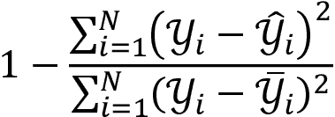
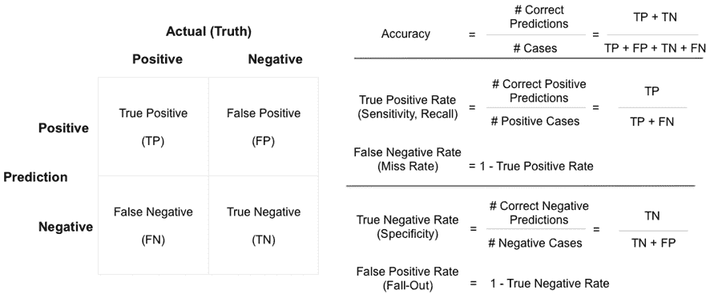
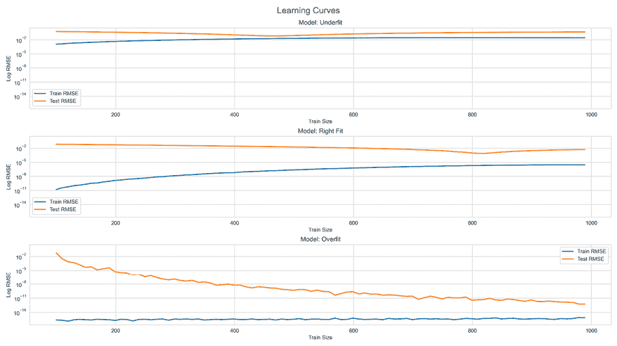

# 六、机器学习过程

本章从本书的第 2 部分开始，我们将说明如何使用一系列有监督和无监督的**机器学习**（**ML**模型）进行交易。在演示使用各种 Python 库的相关应用程序之前，我们将解释每个模型的假设和用例。我们将在第 2-4 部分中介绍的模型类别包括：

*   横断面、时间序列和面板数据回归和分类的线性模型
*   广义加性模型，包括基于非线性树的模型，如决策树
*   集成模型，包括随机森林和梯度提升机
*   无监督线性和非线性降维和聚类方法
*   神经网络模型，包括递归和卷积结构
*   强化学习模型

我们将把这些模型应用于本书第一部分介绍的市场、基本面和备选数据源。我们将通过演示如何将这些模型嵌入到将模型信号转换为交易的交易策略中，如何优化投资组合，以及如何评估策略表现，来构建到目前为止涵盖的材料。

这些模型及其应用有许多共同之处。本章将介绍这些常见方面，以便我们在接下来的章节中重点讨论特定于模型的用法。它们包括通过优化目标函数或损失函数从数据中学习函数关系的总体目标。它们还包括测量模型性能的密切相关的方法。

我们将区分无监督学习和有监督学习，并概述算法交易的用例。我们将对比监督回归和分类问题，以及使用监督学习对输入和输出数据之间的关系进行统计推断，以及使用监督学习预测未来的输出。

我们还将说明预测误差是如何由模型的偏差或方差，或是由于数据中的高噪声信号比造成的。最重要的是，我们将介绍诊断错误源（如过度拟合）的方法，并改进模型的性能。

在本章中，我们将介绍与在实践中应用 ML 工作流相关的以下主题：

*   有监督和无监督的数据学习是如何工作的
*   回归和分类任务的监督学习模型的训练和评估
*   偏差-方差权衡如何影响预测性能
*   如何诊断和解决过度拟合导致的预测错误
*   使用交叉验证优化超参数，重点关注时间序列数据
*   为什么在进行样本外测试时需要额外注意金融数据

如果您已经非常熟悉 ML，请跳过前面的内容，直接学习如何使用 ML 模型为算法交易策略生成和组合 alpha 因子。GitHub 存储库中本章的目录包含代码示例并列出了其他资源。

# 数据机器学习的工作原理

ML 的许多定义都围绕着自动检测数据中有意义的模式。两个突出的例子包括：

*   人工智能先驱 Arthur Samuelson 在 1959 年将 ML 定义为计算机科学的一个分支领域，使计算机能够在不进行明确编程的情况下进行学习。
*   **汤姆·米切尔**是该领域当前的领导者之一，他在 1998 年更具体地指出了一个摆在面前的学习问题：一个计算机程序从与任务相关的经验中学习，以及一个衡量任务表现是否随经验而提高的表现指标（米切尔 1997）。

经验以训练数据的形式呈现给算法。与以往尝试制造解决问题的机器的主要区别在于，算法用于决策的规则是从数据中学习的，而不是像 20 世纪 80 年代著名的专家系统那样由人类编程。

推荐的教科书涵盖了广泛的算法和一般应用，包括 James 等人（2013 年）、Hastine、Tibshirani 和 Friedman（2009 年）、Bishop（2006 年）和 Mitchell（1997 年）。

## 挑战–将算法与任务匹配

自动学习的关键挑战是在将模型学习推广到新数据时，识别训练数据中有意义的模式。模型可以识别大量的潜在模式，而训练数据只构成算法在未来执行任务时可能遇到的更大一组现象的样本。

无限多的函数可以从给定的输入生成观察到的输出，这使得在不限制合格候选集的情况下，不可能搜索真实函数。算法能够学习的模式类型受到其包含其可能表示的函数的**假设空间**的大小的限制。它还受到样本数据提供的信息量的限制。

假设空间的大小在不同的算法之间有很大的差异，我们将在下面的章节中看到。一方面，这种限制使搜索得以成功，另一方面，它意味着当算法从训练样本推广到新数据时，可能会导致性能不佳的归纳偏差。

因此，关键的挑战是如何选择一个假设空间大到足以包含学习问题的解决方案，但又小到足以确保可靠的学习和泛化（给定训练数据的大小）的模型。信息量越大，假设空间越大的模型成功的几率越大。

**无免费午餐定理**指出没有通用的学习算法。相反，学习者的假设空间必须使用关于任务域的先验知识针对特定任务进行定制，以便搜索能够很好地概括成功的有意义模式（Gómez 和 Rojas 2015）。

在本章中，我们将密切关注模型对特定任务的数据关系所做的假设，并强调将这些假设与从数据探索中收集的经验证据相匹配的重要性。

有几类机器学习任务因目的、可用信息以及学习过程本身而不同。主要类别有监督学习、非监督学习和强化学习，我们将在接下来回顾它们的主要区别。

## 监督学习-通过示例进行教学

**监督学习**是最常用的 ML 类型。我们将在本书的大部分章节中专门介绍这一类别的应用。术语*监督*意味着存在一个指导学习过程的结果变量，也就是说，它向算法传授手头任务的正确解决方案。监督学习的目的是从反映这种关系的单个样本中获取功能性输入-输出关系，并通过对新数据做出有效陈述来应用其学习。

根据字段的不同，输出变量也可以互换地称为标签、目标或结果，以及内生变量或左侧变量。我们将使用*y*<sub class="Subscript--PACKT-">i</sub>进行结果观察*i*=1、*N*或*y*作为结果的（列）向量。有些任务会产生多种结果，称为多标签问题。

有监督学习问题的输入数据也称为特征，以及外部变量或右侧变量。我们使用*x*<sub class="Subscript--PACKT-">i</sub>作为观察值为*i*=1、*N*或矩阵表示法中的*x*的特征向量，其中每列包含一个特征，每行包含一个观察值。

监督学习问题的解决方案是一个函数，它表示模型从样本中了解到的关于输入输出关系的内容，并近似于真实关系，由表示。此函数可能用于推断样本以外的感兴趣变量之间的统计关联，甚至因果关系，也可以用于预测新输入数据的输出。

从能够准确预测新投入产出的数据中学习投入产出关系的任务面临着重要的权衡。更复杂的模型具有更多能够表示更细微关系的运动部件。然而，他们也更有可能学习特定于训练样本的随机噪声，而不是代表一般模式的系统信号。当这种情况发生时，我们说模型**过度拟合**训练数据。此外，复杂模型也可能更难检查，从而更难理解所学关系的性质或特定预测的驱动因子。

另一方面，过于简单的模型会错过复杂的信号，产生有偏差的结果。这种权衡被称为监督学习中的偏差-方差权衡，但从概念上讲，这也适用于其他形式的 ML，其中过于简单或过于复杂的模型可能在训练数据之外表现不佳。

## 无监督学习–发现有用的模式

当解决**无监督学习**问题时，我们只观察特征，而没有测量结果。无监督算法的目的不是预测未来的结果或推断变量之间的关系，而是识别输入中的结构，从而允许数据中包含的信息的新表示。

通常，成功的衡量标准是结果对解决其他问题的贡献。这包括识别观察结果中的共性或簇，或转换特征以获得捕获相关信息的压缩摘要。

关键的挑战是，无监督算法必须在没有结果信息提供指导的情况下完成其任务。因此，我们通常无法根据监督案例中的基本事实评估结果，其质量可能在旁观者眼中。然而，有时，我们可以评估它对下游任务的贡献，例如，当降维可以实现更好的预测时。

有很多方法，从成熟的集群算法到尖端的深度学习模型，以及几个相关的用例。

### 用例–从风险管理到文本处理

有许多无监督学习的交易用例，我们将在后面的章节中介绍：

*   对具有相似风险和收益特征的证券进行分组（参见*第 13 章*中的**层次风险平价**、*数据驱动风险因子和无监督学习的资产配置*）
*   使用**主成分分析**（*第 13 章*、*数据驱动的风险因子和资产配置以及无监督学习*或**自编码器**（*第 19 章*来发现驱动大量证券表现的少量风险因子，*用于多元时间序列和情感分析的 RNN*
*   在包含文档的最重要方面的文档（例如，收入调用转录本）中识别潜在主题（第 14 章第 2 章，第 2 章，交易文本数据-情感分析）

在较高的层次上，这些应用程序依赖于识别集群的方法和降低数据维度的方法。

### 聚类算法——寻找相似的观测值

聚类算法应用相似性的概念来识别包含可比较信息的观测值或数据属性。它们通过将大量数据点分配给数量较少的集群来汇总数据集。它们这样做是为了使集群成员之间的关系比其他集群成员之间的关系更密切。

聚类算法的不同之处在于它们对不同分组是如何生成的以及是什么使它们相似的假设。因此，它们往往会产生其他类型的聚类，因此应根据数据的特征进行选择。一些突出的例子是：

*   **K-均值聚类**：数据点属于大小相等的*K*聚类中的一个，呈椭圆形。
*   **高斯混合模型**：数据点由任何一种多元正态分布生成。
*   **基于密度的簇**：簇具有任意形状，且仅通过存在最少数量的附近数据点来定义。
*   **层次聚类**：数据点属于组的各种超集，这些超集是通过依次合并较小的聚类而形成的。

### 降维-压缩信息

**降维**生成新数据，捕获源数据中包含的最重要信息。这些算法不是在保留原始数据的同时将数据分组成簇，而是转换数据，目的是使用较少的特征来表示原始信息。

算法在转换数据的方式以及由此产生的压缩数据集的性质方面有所不同，如下表所示：

*   **主成分分析（PCA）**：找到捕获现有数据集中大部分方差的线性变换
*   **流形学习**：识别一个非线性变换，该变换产生数据的低维表示
*   **自编码器**：使用神经网络以最小的信息损失对数据进行非线性压缩

我们将在以下几章中深入探讨这些无监督学习模型，包括主题建模和 Word2vec 特征提取在**自然语言处理**（**NLP**中的重要应用。

## 强化学习–通过尝试和错误进行学习

**强化学习**（**RL**）是第三种类型的 ML。它以需要在每个时间步根据环境提供的信息选择动作的 agent 为中心。智能体可以是自动驾驶汽车、玩棋盘游戏或视频游戏的程序，也可以是在某个证券市场上运行的交易策略。您可以在*萨顿和巴托（2018）*中找到一篇精彩的介绍。

智能体的目标是根据描述环境当前状态的一组观察结果，选择随时间产生最高回报的行动。它是动态的和互动的：积极和消极的奖励流影响算法的学习，现在采取的行动可能会影响环境和未来的奖励。

智能体需要从一开始就采取行动，并以“在线”的方式学习，一次一个例子。学习过程遵循试错法。这是因为智能体需要在利用过去产生一定回报的行动过程和探索未来可能增加回报的新行动之间进行权衡。RL 算法利用动态系统理论优化智能体的学习，特别是不完全信息下马尔可夫决策过程的最优控制。

RL 与监督学习不同，监督学习中的训练数据同时列出了算法的上下文和正确决策。它是为交互式环境量身定制的，在这种环境中，结果只会随着时间的推移而变得可用，并且随着智能体获得新的经验，学习必须以持续的方式进行。

然而，在**人工智能**（**人工智能**中最显著的进展涉及 RL，它使用深度学习来近似行动、环境和未来奖励之间的功能关系。它也不同于无监督学习，因为行动反馈将是可用的，尽管会有延迟。

RL 特别适用于算法交易，因为不确定动态环境中的收益最大化智能体模型与投资者或与金融市场互动的交易策略有很多共同之处。我们将在*第 21 章*、*合成时间序列数据生成对抗网络*中介绍构建算法交易策略的 RL 方法。

# 机器学习工作流

为算法交易策略开发 ML解决方案需要一种系统的方法，在节约资源的同时最大化成功的机会。为了促进协作、维护和以后的改进，使流程透明和可复制也是非常重要的。

下表概述了从问题定义到部署预测解决方案的关键步骤：


图 6.1：机器学习工作流的关键步骤

整个过程是迭代的，不同阶段所需的工作将因项目而异。但是，该过程通常应包括以下步骤：

1.  确定问题框架，确定目标指标，并定义成功。
2.  获取、清理和验证数据。
3.  了解您的数据并生成信息性特征。
4.  选择一个或多个适合您的数据的机器学习算法。
5.  训练、测试和调整您的模型。
6.  使用您的模型来解决原始问题。

我们将在以下各节中使用一个简单的示例来演示这些步骤，以说明一些关键点。

## 基本演练–k-最近邻

本书 GitHub 存储库中本章文件夹中的`machine_learning_workflow.ipynb`笔记本包含几个示例，说明了使用房价数据集的机器学习工作流程。

我们将使用非常简单的**k-最近邻**（**KNN**算法），该算法允许我们处理回归和分类问题。在其默认的 scikit 学习实现中，它识别*k*最近的数据点（基于欧几里德距离）进行预测。它分别预测邻域中最频繁的类别或分类或回归案例中的平均结果。

本章关于 GitHub 的`README`链接到其他资源；见 Bhatia 和 Vandana（2010）的简要调查。

## 制定问题——从目标到指标

任何机器学习项目的起点都是它最终要解决的用例。有时，这一目标将是统计推断，以确定变量之间的关联甚至因果关系。然而，最常见的情况是，目标是预测结果以产生交易信号。

推理和预测任务都依赖于度量来评估模型实现其目标的程度。由于它们在实践中的突出性，我们将重点讨论预测模型的通用目标函数和相应的误差度量。

我们根据输出的性质区分预测任务：连续输出变量提出**回归**问题，分类变量暗示**分类**，有序分类变量的特例代表**排序**问题。

您通常可以用不同的方式构建给定的问题。手头的任务可能是如何有效地结合几个阿尔法因子。您可以将此任务定义为一个旨在预测回报的回归问题、一个旨在预测未来价格变动方向的二元分类问题，或一个旨在将股票分配给各种表现类别（如回报五分位数）的多类别问题。

在下一节中，我们将介绍这些目标，并了解如何度量和解释相关的错误度量。

### 预测与推理

监督学习算法产生的功能关系可用于推理，即深入了解结果是如何产生的。或者，您可以使用它来预测未知输入的输出。

对于算法交易，我们可以使用推断来估计资产收益与风险因子的统计关联。例如，这意味着评估这种观察结果是由噪声引起的可能性，而不是风险因子的实际影响。反过来，预测可用于预测风险因子，这有助于预测资产回报和价格，并转化为交易信号。

统计推断是从样本数据中得出关于潜在概率分布或总体参数的结论。潜在结论包括关于单个变量分布特征的假设检验，或变量之间数值关系的存在或强度的假设检验。它们还包括度量的点或区间估计。

推断取决于对最初生成数据的过程的假设。我们将回顾这些假设和用于线性模型推断的工具，这些假设和工具已经建立。更复杂的模型对输入和输出之间的结构关系的假设更少。相反，它们以较少的限制来完成函数近似的任务，同时将数据生成过程视为一个黑箱。

这些模型，包括决策树、集成模型和神经网络，因其在预测任务上的表现往往优于其他模型而广受欢迎。然而，我们将看到，最近有许多努力来提高复杂模型的透明度。例如，随机森林最近获得了一个统计推断框架（Wager 和 Athey 2019）。

#### 因果推理——相关性并不意味着因果关系

因果推理的目的是确定某些输入值意味着某些输出的关系，例如，导致给定资产价格以某种方式移动的特定宏观变量组合，同时假设所有其他变量保持不变。

关于两个或多个变量之间关系的统计推断产生相关性的度量。相关性只能在满足其他几个条件时解释为因果关系，例如，排除了替代解释或反向因果关系。

满足这些条件需要一个实验环境，在这个环境中，所有相关的感兴趣的变量都可以被完全控制，以隔离因果关系。或者，准实验设置以随机方式将观察单位暴露于输入的变化中。它这样做是为了排除其他可观察或不可观察的特征对环境变化的观察影响负责。

这些条件很少满足，因此推断结论需要谨慎对待。这同样适用于预测模型的性能，预测模型也依赖于特征和输出之间的统计关联，这可能会随着不属于模型一部分的其他因子而变化。

KNN 模型的非参数性质不适合进行推断，因此我们将推迟工作流中的这一步骤，直到我们在*第 7 章*、*线性模型中遇到线性模型——从风险因子到回报预测*为止。

### 回归–流行的损失函数和误差度量

回归问题旨在预测连续变量。**均方根误差**（**RMSE**）是最流行的损失函数和误差度量，尤其是因为它是可微的。损失是对称的，但较大的误差在计算中更为重要。使用平方根的优点是，我们可以测量目标变量单位的误差。

当目标指数增长时，误差（**RMSLE**的**对数均方根是合适的。它的非对称惩罚对负错误的权重小于对正错误的权重。您还可以在训练模型之前对目标进行日志转换，然后使用 RMSE，我们将在本节后面的示例中这样做。**

绝对误差的**平均值****MAE**和**绝对误差的中位数****MedAE**是对称的，但对较大的误差不给予更多的权重。MedAE 对异常值具有鲁棒性。

**解释方差得分**计算模型所占目标方差的比例，该比例在 0 到 1 之间变化。**R2 评分**也被称为确定系数，如果残差的平均值为 0，则产生相同的结果，但在其他方面可能不同。特别是，当根据样本外数据（或无截距的线性回归）计算时，它可能为负值。

下表定义了用于计算的公式以及可从 metrics 模块导入的相应 scikit 学习函数。`scoring`参数与自动列车试验功能（如`cross_val_score`和`GridSearchCV`等）结合使用，我们将在本节后面介绍，并在随附的笔记本中说明：

<colgroup><col> <col> <col> <col></colgroup> 
| 名称 | 公式 | scikit 学习功能 | 评分参数 |
| 均方误差 |  | `mean_squared_error` | `neg_mean_squared_error` |
| 均方对数误差 |  | `mean_squared_log_error` | `neg_mean_squared_log_error` |
| 平均绝对误差 |  | `mean_absolute_error` | `neg_mean_absolute_error` |
| 中位绝对误差 |  | `median_absolute_error` | `neg_median_absolute_error` |
| 解释差异 |  | `explained_variance_score` | `explained_variance` |
| R<sup class="Superscript--PACKT-">2</sup>分数 |  | `r2_score` | `r2` |

*图 6.2*显示了我们将在笔记本中计算的房价回归的各种误差指标：


图 6.2：样本内回归误差

`sklearn`功能还支持多标签评估，即为单个观察分配多个结果值；有关更多详细信息，请参阅 GitHub 上引用的文档。

### 分类–理解混淆矩阵

分类问题具有分类结果变量。大多数预测者都会输出一个分数，以指示观察结果是否属于某个类别。在第二步中，使用阈值将这些分数转换为实际预测。

在二进制情况下，使用正类标签和负类标签，分数通常在 0 到 1 之间变化，或者相应地进行归一化。一旦分数被转换成一个或另一个类别的预测，可能会有四个结果，因为两个类别中的每一个都可能被正确或错误地预测。对于两个以上的类，如果区分几个潜在的错误，可能会出现更多的情况。

所有误差指标都是通过 2×2 混淆矩阵的四个字段中预测的细分来计算的，该矩阵将实际和预测的类别关联起来。

下表中列出的指标（如准确性）评估给定阈值的模型：



图 6.3：混淆矩阵和相关错误度量

分类器通常不输出校准的概率。相反，用于区分积极和消极情况的阈值本身是一个决策变量，应加以优化，同时考虑正确和错误预测的成本和收益。

在所有条件相同的情况下，较低的阈值往往意味着更积极的预测，假阳性率可能会上升，而较高的阈值则可能相反。

#### 接收器工作特性曲线下的区域

**接收机工作特性**（**ROC**曲线允许我们根据分类器的性能可视化、比较和选择分类器。它计算**真阳性率**（**TPR**）和**假阳性率**（**FPR**）的对使用所有预测分数作为阈值来生成类预测。它将这些对显示在一个边长为单位的正方形内。

平均而言，随机预测（加权以考虑阶级不平衡）产生的 TPR 和 FPR 相等，出现在对角线上，这成为基准情况。由于表现不佳的分类器将受益于重新标记预测，因此该基准也将成为最小值。

曲线（**AUC**下的**面积被定义为 ROC 图下的面积，该面积在 0.5 和最大值 1 之间变化。它是对分类器的分数能够根据其类成员对数据点进行排序的程度的汇总度量。更具体地说，分类器的 AUC 具有重要的统计特性，即表示分类器将随机选择的正实例排名高于随机选择的负实例的概率，这相当于 Wilcoxon 排名测试（Fawcett 2006）。此外，AUC 的好处是对阶级失衡不敏感。**

#### 精确回忆曲线–放大一个类

当类的预测特别重要时，精度和召回曲线显示了不同阈值的这些误差度量之间的权衡。这两种方法都评估特定类别预测的质量。下面的列表显示了它们如何应用于阳性类：

*   **回忆**测量分类器在给定阈值下预测为阳性的实际阳性类成员的份额。它起源于信息检索，并测量通过搜索算法成功识别的相关文档的份额。
*   **精度**相反，衡量正确的积极预测份额。

召回率通常随着阈值的降低而增加，但精确度可能会降低。鉴于遗漏大量相关案例或产生低质量预测的成本和收益，精确召回曲线将可实现的组合可视化，并允许优化阈值。

**F1 分数**是给定阈值的精度和召回率的调和平均值，可用于数值优化阈值，同时考虑这两个指标应假设的相对权重。

*图 6.4*显示了 ROC 曲线和相应的 AUC，以及精确召回曲线和 F1 分数，使用精确性和召回的等权重，得出了 0.37 的最佳阈值。图表取自随附的笔记本，您可以在笔记本中找到对二值化房价进行操作的 KNN 分类器的代码：


图 6.4：接收器工作特性、精度召回曲线和 F1 分数图表

## 收集和准备数据

我们已经在*第 2 章*、*市场和基础数据–来源和技术、*和*第 3 章*、*金融备选数据–类别和用例*中阐述了如何获取市场、基本面和备选数据的重要方面。在说明各种模型的应用时，我们将继续使用这些源的各种示例。

除了市场和基础数据外，我们还将在研究自然语言处理和图像处理与识别时获取和转换文本数据。除了获取、清理和验证数据外，我们可能还需要为新闻文章或时间戳指定标签，以使其与通常以时间序列格式提供的交易数据保持一致。

同样重要的是，将其存储为能够快速探索和迭代的格式。我们推荐 HDF 和拼花地板格式（参见*第 2 章*、*市场和基础数据–来源和技术*。对于不适合内存且需要在多台机器上进行分布式处理的数据，Apache Spark 通常是交互式分析和机器学习的最佳解决方案。

## 探索、提取和工程特征

了解个体变量的分布以及结果和特征之间的关系是选择合适算法的基础。这通常从**可视化**开始，例如散点图，如随附笔记本所示，如*图 6.5*所示：


图 6.5：结果和特征的成对散点图

它还包括**数值评估**范围从线性度量（如相关性）到非线性统计，例如我们在*第 4 章*、*中引入信息系数时遇到的斯皮尔曼秩相关系数金融特征工程——如何研究阿尔法因子*。还有一些信息论度量，例如互信息，我们将在下一小节中加以说明。

系统的探索性分析也是成功预测模型最重要的组成部分的基础：提取数据中包含的信息，但算法不一定能够以原始形式访问这些信息的特征**工程**。特征工程得益于领域专业知识、统计和信息理论的应用以及创造力。

它依靠智能数据转换，有效地梳理出输入和输出数据之间的系统关系。有很多选择，包括异常值检测和处理、功能转换以及多个变量的组合，包括无监督学习。我们将全程举例说明，但将强调，ML 工作流的这一核心方面最好通过经验来学习。Kaggle 是向其他与社区分享经验的数据科学家学习的好地方。

### 用信息论评价特征

特征和结果之间的**互信息**（**MI**）是两个变量之间相互依赖性的度量。它将相关性的概念扩展到非线性关系。更具体地说，它量化了通过另一个随机变量获得的关于一个随机变量的信息。

MI 的概念与随机变量熵的基本概念密切相关。熵量化了随机变量中包含的信息量。形式上，两个随机变量*X*和*Y*的互信息*I*（*X*、*Y*）定义如下：


sklearn 函数实现`feature_selection.mutual_info_regression`，计算所有特征和连续结果之间的互信息，以选择最可能包含预测信息的特征。还有一个分类版本（有关更多详细信息，请参阅 sklearn 文档）。`mutual_information.ipynb`笔记本包含我们在*第 4 章*、*金融特征工程——如何研究阿尔法因子*中创建的金融数据应用程序。

## 选择 ML 算法

本书的剩余部分将介绍几个模型系列，从线性模型（对输入和输出变量之间的函数关系的性质做出了相当强的假设）到深度神经网络（做出了很少的假设）。如介绍部分所述，更少的假设需要更多关于关系的重要信息的数据，这样学习过程才能成功。

在介绍这些模型时，我们将概述关键假设以及如何在适用的情况下对其进行测试。

## 设计并调整模型

ML 过程包括基于模型泛化误差的估计来诊断和管理模型复杂性的步骤。ML 过程的一个重要目标是使用统计上合理且有效的程序获得该误差的无偏估计。管理模型设计和调整过程的关键是理解偏差-方差权衡与欠拟合和过拟合之间的关系。

### 偏差-方差权衡

ML模型的预测误差可以分解为可约部分和不可约部分。不可约部分是由于数据中的随机变化（噪声），例如，由于缺少相关变量、自然变化或测量误差。归纳误差的可减少部分又可分解为由于**偏差**和**方差**而产生的误差。

两者都是由于真实的功能关系与机器学习算法所做假设之间的差异造成的，如下表所示：

*   **偏差导致的错误**：假设过于简单，无法捕捉真实功能关系的复杂性。因此，每当模型试图学习真正的函数时，就会犯系统性错误，平均而言，预测也会有类似的偏差。这也称为*不适配*。
*   **方差误差**：考虑到真实关系，算法过于复杂。它不是捕捉真实的关系，而是过度拟合数据并从噪声中提取模式。因此，它从每个样本中学习不同的函数关系，样本外预测将有很大差异。

### 装配不足与装配过度–一个直观的示例

*图 6.6*通过测量*正弦*函数通过日益复杂的多项式逼近的样本内误差来说明过度拟合。更具体地说，我们抽取一个带有一些附加噪声的随机样本（*n*=30）来学习一个复杂度不同的多项式（参见笔记本中的代码，`bias_variance.ipynb`。该模型预测新的数据点，我们捕获这些预测的均方误差。

*图 6.6*左侧面板显示一个 1 次的多项式；直线显然不符合真正的功能。但是，从真实函数中提取的一个样本到下一个样本的估计线不会有显著差异。

中间的面板显示，一个 5 次多项式在从到的区间内相当好地逼近了真实关系。另一方面，15 次多项式几乎完美地拟合了小样本，但对真实关系的估计很差：它过度拟合了样本数据点的随机变化，学习函数将随着样本的变化而变化很大：


图 6.6：多项式过拟合的直观示例

### 如何管理偏差-方差权衡

为了进一步说明过拟合与欠拟合的影响，我们将尝试学习第九阶*正弦*函数的泰勒级数近似，并添加一些噪声。*图 6.7*显示了样本内误差和样本外误差以及多项式的样本外预测，这些多项式对 100 个真函数的随机样本分别进行了欠拟合、过拟合，并提供了阶数为 1、15 和 9 的近似正确的灵活性水平。

左侧面板显示了从预测中减去真函数值后产生的误差分布。1 次欠拟合多项式的高偏差但低方差与 15 次过拟合多项式的低偏差但极高方差相比。欠拟合多项式产生一条样本内拟合差的直线，该直线明显偏离样本外的目标。过拟合模型显示样本内的最佳拟合和最小的误差分散，但价格是样本外的较大方差。与真实模型的函数形式相匹配的适当模型在样本外数据上的平均性能最好。

*图 6.7*的右侧面板显示了实际预测，而不是错误，以便在实践中可视化不同类型的拟合：


图 6.7：不同阶多项式的误差和样本外预测

### 学习曲线

学习曲线根据用于学习函数关系的数据集的大小绘制训练和测试误差的演变。它有助于诊断给定模型的偏差-方差权衡，并回答增加样本量是否可能改善预测性能的问题。具有高偏差的模型在样本内和样本外都会有较高但相似的训练误差。过度拟合模型的训练量很低，但测试误差要高得多。

*图 6.8*显示了过度拟合模型的样本外误差如何随着样本量的增加而下降，这表明它可能受益于其他数据或工具来限制模型的复杂性，如正则化。正则化将数据驱动的约束添加到模型的复杂性中；我们将在*第 7 章*、*线性模型中介绍这种技术——从风险因子到回报预测*。

相比之下，不合身的车型需要更多的功能，或者需要增加其捕捉真实关系的能力：



图 6.8：学习曲线和偏差-方差权衡

## 如何使用交叉验证选择模型

您的用例通常有几个候选模型，选择其中一个的任务称为模型选择问题。目标是确定在给定新数据时产生最低预测误差的模型。

一个好的选择需要对这种泛化误差进行无偏估计，这反过来又需要在不属于模型训练的数据上测试模型。否则，该模型将已经能够窥视“解决方案”，并提前了解预测任务，从而提高其性能。

为了避免这种情况，我们只使用部分可用数据来训练模型，并留出另一部分数据来验证其性能。只有在绝对没有验证集信息泄漏到训练集中时，模型对新数据的预测误差的结果估计才会是无偏的，如*图 6.9*所示：


图 6.9：培训和测试集

**交叉验证**（**CV**）是流行的模型选择策略。CV 背后的主要思想是将数据拆分一次或几次。这样做的目的是，每个分割一次用作验证集，其余部分用作训练集：部分数据（训练样本）用于训练算法，其余部分（验证样本）用于估计算法的预测性能。然后，CV 选择估计误差或风险最小的算法。

有几种方法可用于分割可用数据。它们在用于训练的数据量、误差估计的方差、计算强度以及在分割数据时是否考虑数据的结构方面（例如保持类标签之间的比率）方面有所不同。

虽然数据分割启发式非常普遍，但 CV 的关键假设是数据**独立且相同地分布**（**IID**）。在下一节和本书中，我们将强调**时间序列数据**需要一种不同的方法，因为它通常不符合这一假设。此外，我们需要确保拆分尊重时间顺序，以避免**前瞻性偏差**。我们将通过在历史培训集中包含一些我们希望预测的未来信息来实现这一点。

模型选择通常涉及超参数调整，这可能导致许多 CV 迭代。最佳执行模型的结果验证分数将受到**多重测试偏差**的影响，该偏差反映了 CV 过程中固有的采样噪声。因此，它不再是泛化误差的良好估计。对于错误率的无偏估计，我们必须从新的数据集估计分数。

因此，我们使用了数据的三向分割，如*图 6.10*所示：一部分用于交叉验证，并重复分割为一个训练和验证集。剩余部分作为保留集保留，仅在交叉验证完成后使用一次，以生成无偏测试误差估计。

我们将在下一章中开始构建 ML 模型时说明此方法：


图 6.10：训练、验证和保持测试集

## 如何在 Python 中实现交叉验证

我们将说明将数据拆分为训练和测试集的各种选项。我们将通过显示包含 10 个观察值的模拟数据集的索引如何分配给列车和测试集来实现这一点（详细信息请参见`cross_validation.py`，如以下代码所示：

```py
data = list(range(1, 11))
[1, 2, 3, 4, 5, 6, 7, 8, 9, 10] 
```

Scikit learn 的 CV 功能（我们将在本节中演示）可以从`sklearn.model_selection`导入。

对于将数据分为训练集和测试集的单个分割，请使用`train_test_split`，其中默认情况下，`shuffle`参数确保随机选择观察值。您可以通过设置`random_state`来设定随机数生成器的种子，以确保可复制性。还有一个`stratify`参数，用于确保列车和测试集包含的每个类别的比例大致相同。结果如下：

```py
train_test_split(data, train_size=.8)
[[8, 7, 4, 10, 1, 3, 5, 2], [6, 9]] 
```

在这种情况下，我们使用除行编号`6`和`9`之外的所有数据来训练模型，这些数据将用于生成预测并测量已知标签上给出的误差。该方法有助于快速评估，但对分割敏感，性能度量估计的标准误差将更高。

### KFold 迭代器

`KFold`迭代器生成多个分离拆分，并将这些拆分分配给验证集一次，如下代码所示：

```py
kf = KFold(n_splits=5)
for train, validate in kf.split(data):
    print(train, validate)
[2 3 4 5 6 7 8 9] [0 1]
[0 1 4 5 6 7 8 9] [2 3]
[0 1 2 3 6 7 8 9] [4 5]
[0 1 2 3 4 5 8 9] [6 7]
[0 1 2 3 4 5 6 7] [8 9] 
```

除了分割的数量外，大多数 CV 对象都使用一个`shuffle`参数来确保随机化。要使结果重现，请按如下方式设置`random_state`：

```py
kf = KFold(n_splits=5, shuffle=True, random_state=42)
for train, validate in kf.split(data):
    print(train, validate)
[0 2 3 4 5 6 7 9] [1 8]
[1 2 3 4 6 7 8 9] [0 5]
[0 1 3 4 5 6 8 9] [2 7]
[0 1 2 3 5 6 7 8] [4 9]
[0 1 2 4 5 7 8 9] [3 6] 
```

### 删去一份简历

最初的 CV实现使用了**省去方法**，每次观察一次作为验证集，如下代码所示：

```py
loo = LeaveOneOut()
for train, validate in loo.split(data):
    print(train, validate)
[1 2 3 4 5 6 7 8 9] [0]
[0 2 3 4 5 6 7 8 9] [1]
...
[0 1 2 3 4 5 6 7 9] [8]
[0 1 2 3 4 5 6 7 8] [9] 
```

这将最大限度地增加训练的模型数量，从而增加计算成本。虽然验证集不重叠，但训练集的重叠最大化，从而提高了模型的相关性及其预测误差。因此，对于折叠次数较多的模型，预测误差的方差较高。

### 遗漏 CV

与遗漏一个 CV 类似的版本是**遗漏一个 CV**，它生成`p`数据行的所有可能组合，如下代码所示：

```py
lpo = LeavePOut(p=2)
for train, validate in lpo.split(data):
    print(train, validate)
[2 3 4 5 6 7 8 9] [0 1]
[1 3 4 5 6 7 8 9] [0 2]
...
[0 1 2 3 4 5 6 8] [7 9]
[0 1 2 3 4 5 6 7] [8 9] 
```

### 洗牌

`ShuffleSplit`类创建具有潜在重叠验证集的独立拆分，如下代码所示：

```py
ss = ShuffleSplit(n_splits=3, test_size=2, random_state=42)
for train, validate in ss.split(data):
    print(train, validate)
[4 9 1 6 7 3 0 5] [2 8]
[1 2 9 8 0 6 7 4] [3 5]
[8 4 5 1 0 6 9 7] [2 3] 
```

## 金融领域交叉验证的挑战

迄今为止讨论的交叉验证方法的一个关键假设是可用于训练的样本的 IID 分布。

对于金融数据而言，情况往往并非如此。相反，由于序列相关性和时变标准差，金融数据既不是独立分布，也不是完全相同分布，也称为**异方差**（参见*第 7 章*、*线性模型——从风险因子到回报预测，*和*第 9 章*，*波动预测和统计套利的时间序列模型*，了解更多详细信息）。`sklearn.model_selection`模块中的`TimeSeriesSplit`旨在处理时间序列数据的线性顺序。

### 时间序列交叉验证与 scikit 学习

数据的时间序列性质意味着交叉验证产生了一种情况，即未来的数据将用于预测过去的数据。这在最好的情况下是不现实的，在最坏的情况下是数据窥探，因为未来的数据反映了过去的事件。

为了解决时间依赖性，`TimeSeriesSplit`对象使用扩展的训练集实现一个向前走测试，其中后续训练集是过去训练集的超集，如下代码所示：

```py
tscv = TimeSeriesSplit(n_splits=5)
for train, validate in tscv.split(data):
    print(train, validate)
[0 1 2 3 4] [5]
[0 1 2 3 4 5] [6]
[0 1 2 3 4 5 6] [7]
[0 1 2 3 4 5 6 7] [8]
[0 1 2 3 4 5 6 7 8] [9] 
```

您可以使用`max_train_size`参数实现前向交叉验证，其中训练集的大小随时间保持不变，类似于 Zipline 测试交易算法的方式。Scikit learn 使用**子类化**促进定制交叉验证方法的设计，我们将在以下章节中实现。

### 清除、禁运和组合 CV

对于金融数据，标签通常来自重叠的数据点，因为回报是从多个时期的价格计算出来的。在交易策略的背景下，模型预测的结果（可能意味着持有资产头寸）只能在稍后评估该决策时才能知道，例如，当头寸平仓时。

风险包括测试中的信息泄露到训练集中，这很可能会人为地夸大成绩。我们需要通过确保所有数据在用作模型输入时都是真实可用和已知的时间点来解决这一风险。例如，金融披露可能涉及某一特定时间段，但只能在以后提供。如果我们过早地包含这些信息，我们的模型在事后看来可能会比在现实情况下做得更好。

该领域领先的实践者和学者之一马科斯·洛佩兹·德·普拉多（Marcos Lopez de Prado）在其著作《金融机器学习的进展》（2018）中提出了几种应对这些挑战的方法。使交叉验证适应金融数据和交易环境的技术包括：

*   **吹扫**：消除在预测验证集中的时间点数据点后进行评估的训练数据点，以避免前瞻性偏差。
*   **禁运**：进一步剔除测试周期后的训练样本。
*   **组合交叉验证**：向前走 CV 严重限制了可测试的历史路径。相反，给定*T*观测值，计算*N*<*T*组的所有可能列车/测试拆分，每个组保持其顺序，并清除和禁止可能重叠的组。然后，在*N*-*k*组的所有组合上训练模型，同时在剩余的*k*组上测试模型。其结果是大量可能的历史路径。

普拉多的*金融机器学习进展*包含实现这些方法的示例代码；该代码也可以通过新的 Python 库 timeseriescv 获得。

## 使用 scikit learn 和 Yellowbrick 进行参数调整

模型选择通常涉及使用不同算法（如线性回归和随机森林）或不同配置对模型的样本外性能进行重复交叉验证。不同的配置可能涉及对超参数的更改或包含或排除不同的变量。

Yellowbrick 库扩展了 scikit 学习 API，以生成诊断可视化工具，从而简化模型选择过程。这些工具可用于调查特征之间的关系、分析分类或回归错误、监控聚类算法性能、检查文本数据的特征以及帮助选择模型。我们将演示在参数调整阶段提供有价值信息的验证和学习曲线。有关实施细节，请参见`machine_learning_workflow.ipynb`笔记本。

### 验证曲线–绘制超参数的影响

验证曲线（参见*图 6.11*中的左侧面板）显示了单个超参数对模型交叉验证性能的影响。这有助于确定模型是否与给定数据集拟合不足或过拟合。

在我们的例子`KNeighborsRegressor`中，只有一个超参数，邻居的数量是*k*。请注意，模型复杂度随着邻居数量的减少而增加，因为模型现在可以预测特征空间中更明显的区域。

我们可以看到，对于大于 20 的*k*值，该模型拟合不足。当我们减少邻居的数量并使我们的模型更复杂时，验证错误就会下降。对于低于 20 的值，随着培训和验证错误的偏离，模型开始过度拟合，平均样本外性能迅速恶化：


图 6.11：验证和学习曲线

### 学习曲线–诊断偏差-方差权衡

学习曲线（参见*图 6.11*的右侧面板了解我们的房价回归示例）有助于确定模型的交叉验证性能是否会受益于额外数据，以及预测误差是否更多地由偏差或方差驱动。

如果培训和交叉验证分数趋于一致，更多的数据不太可能提高表现。在这一点上，评估模型性能是否符合预期是很重要的，这是由人工基准确定的。如果不是这样，则应修改模型的超参数设置，以更好地捕获特征和结果之间的关系，或者选择具有更高容量的不同算法来捕获复杂性。

此外，阴影置信区间显示的训练和测试误差的变化提供了有关预测误差的偏差和方差来源的线索。交叉验证误差的可变性是方差的证据，而训练集的可变性则表明存在偏差，这取决于训练误差的大小。

在我们的示例中，交叉验证性能持续下降，但增量改进有所减少，错误趋于平稳，因此不太可能从更大的培训集中获得很多好处。另一方面，数据显示，与训练误差相比，验证误差范围存在很大差异。

### 使用 GridSearchCV 和管道进行参数调整

由于超参数调整是机器学习工作流程的一个关键组成部分，因此有工具将此过程自动化。scikit 学习库包括一个`GridSearchCV`接口，该接口并行交叉验证所有参数组合，捕获结果，并使用在整个数据集交叉验证期间表现最佳的参数设置自动训练模型。

在实践中，培训和验证集通常需要在交叉验证之前进行一些处理。Scikit learn 提供了在使用`GridSearchCV`时自动执行任何功能处理步骤的`Pipeline`。

您可以查看随附的`machine_learning_workflow.ipynb`笔记本中的实现示例，以了解这些工具的使用情况。

# 总结

在本章中，我们介绍了从数据中学习的挑战，并将监督、非监督和强化模型视为学习的主要形式，我们将在本书中研究这些学习形式，以构建算法交易策略。我们讨论了有监督学习算法对其试图学习的函数关系进行假设的必要性。他们这样做是为了限制搜索空间，同时产生可能导致过度概括错误的归纳偏见。

我们介绍了机器学习工作流程的关键方面，介绍了回归和分类模型最常见的错误度量，解释了偏差-方差权衡，并说明了使用交叉验证管理模型选择过程的各种工具。

在下一章中，我们将深入研究回归和分类的线性模型，以开发我们第一个使用机器学习的算法交易策略。