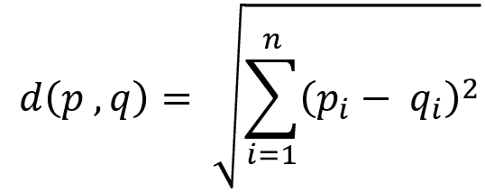
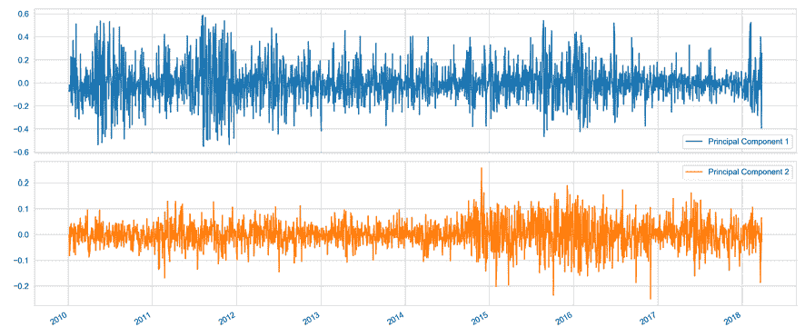
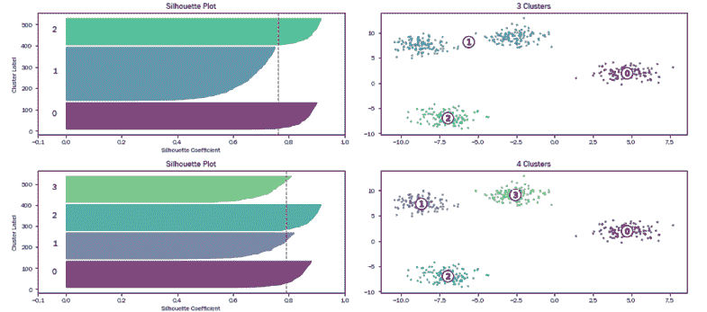
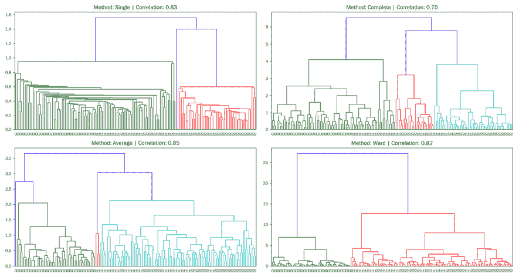
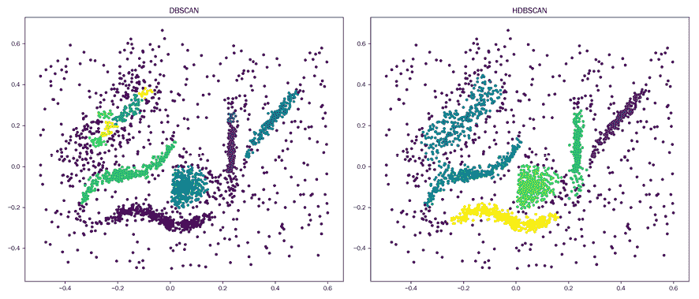

# 十三、基于无监督学习的数据驱动风险因子与资产配置

*第 6 章**机器学习过程*介绍了无监督学习如何通过发现数据中的结构而增加价值，而不需要结果变量来指导搜索过程。这与监督学习形成对比，监督学习是最后几章的重点：非监督学习的目的不是预测未来的结果，而是学习数据的信息表示，帮助探索新数据、发现有用的见解或更有效地解决其他任务。

降维和聚类是无监督学习的主要任务：

*   **降维**将现有特征转换为新的、更小的特征集，同时最大限度地减少信息损失。算法的不同之处在于它们测量信息损失的方式，无论它们是应用线性变换还是非线性变换，或者它们对新特征集施加了哪些约束。
*   **聚类算法**识别并分组相似的观察或特征，而不是识别新的特征。算法的不同之处在于它们如何定义观测的相似性以及它们对结果组的假设。

当**数据集不包含结果**时，这些无监督算法非常有用。例如，我们可能希望从大量金融报告或新闻文章中提取可交易信息。在*第 14 章**交易文本数据–情感分析*中，我们将使用主题建模来发现隐藏的主题，使我们能够更有效地探索和总结内容，并识别有意义的关系，帮助我们获得信号。

当我们想要**独立于结果**提取信息时，这些算法也很有用。例如，与使用第三方行业分类不同，聚类允许我们根据对我们的目的有用的资产属性（如特定时间范围内的回报、风险因子敞口或类似基本面）确定合成分组。在本章中，我们将学习如何通过识别资产回报之间的层次关系来使用聚类来管理投资组合风险。

更具体地说，阅读本章后，您将了解：

*   **主成分分析****PCA**和**独立成分分析****ICA**如何进行线性降维
*   使用主成分分析从资产回报中识别数据驱动的风险因子和特征投资组合
*   使用流形学习有效地可视化非线性高维数据
*   利用 T-SNE 和 UMAP 探索高维图像数据
*   k-均值、分层和基于密度的聚类算法的工作原理
*   利用聚集聚类建立具有层次风险平价的稳健投资组合

您可以在 GitHub 存储库的相应目录中找到本章的代码示例以及指向其他资源的链接。笔记本电脑包括图像的彩色版本。

# 降维

在线性代数术语中，数据集的特征创建一个**向量空间**，其维度对应于线性独立行或列的数量，以较大者为准。当两个列完全相关时，它们是线性相关的，因此可以使用加法和乘法的线性运算从另一列计算一个。

换句话说，它们是表示数据中相同方向而不是不同方向的平行向量，因此只构成一个维度。类似地，如果一个变量是其他几个变量的线性组合，则它是由这些列创建的向量空间的元素，并且不会添加自己的新维度。

数据集的维度数很重要，因为每个新维度都可以添加与结果相关的信号。然而，还有一个被称为**维度诅咒**的缺点：随着独立特征数量的增加而观测数量保持不变，数据点之间的平均距离也会增加，特征空间的密度呈指数下降，出现戏剧性的**机器学习**（**ML**的含义）。**当观测距离越远，即彼此不同时，预测就越困难**。备选数据源，如文本和图像，通常具有高维性，但它们通常会影响依赖大量特征的模型。下一节将讨论由此产生的挑战。

降维旨在通过使用较少的特征来**更有效地**表示数据。为此，算法将数据投影到低维空间，同时丢弃任何不具有信息性的变化，或者通过识别数据所在位置或附近的低维子空间或流形。

**流形**是一个局部类似于欧几里德空间的空间。一维流形包括一条直线或一个圆，但由于交叉点的原因，它不能直观地表示数字 8。

流形假设认为，高维数据通常驻留在低维空间中，如果确定了低维空间，则可以在该子空间中忠实地表示数据。请参阅 Fefferman、Mitter 和 Narayanan（2016），了解背景信息和测试该假设的算法描述。

因此，降维通过找到一组不同的、较小的变量来压缩数据，这些变量捕获原始特征中最重要的内容，以最大限度地减少信息损失。压缩有助于对抗维度诅咒，节省内存，并允许可视化高维数据的显著方面，否则很难探索。

降维算法的不同之处在于它们对新变量施加的约束以及它们如何将信息损失降至最低（参见 Burges 2010，以获得极好的概述）：

*   PCA 和 ICA 等**线性算法**将新变量约束为原始特征的线性组合；例如，低维空间中的超平面。虽然主成分分析要求新特征不相关，但独立成分分析更进一步，并规定了统计独立性，这意味着不存在线性和非线性关系。
*   **Nonlinear algorithms** are not restricted to hyperplanes and can capture a more complex structure in the data. However, given the infinite number of options, the algorithms still need to make assumptions in order to arrive at a solution. Later in this section, we will explain how **t-distributed Stochastic Neighbor Embedding** (**t-SNE**) and **Uniform Manifold Approximation and Projection** (**UMAP**) are very useful to visualize higher-dimensional data. *Figure 13.1* illustrates how manifold learning identifies a two-dimensional subspace in the three-dimensional feature space. (The notebook `manifold_learning` illustrates the use of additional algorithms, including local linear embedding.)

    

    图 13.1：非线性降维

## 维度的诅咒

数据集维数的增加意味着特征向量中有更多的条目，代表对应欧几里德空间中的每个观测值。

我们使用欧几里德距离（也称为 L<sup class="Superscript--PACKT-">2</sup>范数）在向量空间中测量距离，我们将其应用于线性回归系数的向量以训练正则化岭回归。

具有笛卡尔坐标的两个*n*维向量之间的欧氏距离*p*=（*p*1、*p*<sub xmlns:epub="http://www.idpf.org/2007/ops" style="font-style: italic;">2</sub>、*p*n 和*q*（【T18 q】<sub xmlns:epub="http://www.idpf.org/2007/ops" style="font-style: italic;">1</sub>），*q*<sub xmlns:epub="http://www.idpf.org/2007/ops" style="font-style: italic;">2</sub>，*q*<sub xmlns:epub="http://www.idpf.org/2007/ops" style="font-style: italic;">n</sub>使用毕达哥拉斯开发的熟悉公式计算：



因此，每个新维度都会向总和添加一个非负项，以便距离随着不同向量的维度数的增加而增加。换言之，随着给定观测次数下特征数量的增加，特征空间变得越来越稀疏，即密度降低或更空。另一方面，较低的数据密度需要更多的观测，以保持数据点之间的平均距离相同。

*图 13.2*说明了随着维度数量的增加，维持观测之间平均距离所需的数据点数量呈指数增长。均匀分布在一条线上的 10 个点对应于二维的 10 个<sup class="Superscript--PACKT-">2 个</sup>点和三维的 10 个<sup class="Superscript--PACKT-">3 个</sup>点，以保持密度恒定。


图 13.2：保持平均距离恒定所需的特征数量随着尺寸数量呈指数增长

本节 GitHub repository 文件夹中的笔记本`the_curse_of_dimensionality`模拟了数据点之间的平均距离和最小距离如何随着维度数量的增加而增加（参见*图 13.3*。


图 13.3：单位超立方体中 1000 个数据点的平均距离

**模拟**从不相关的均匀分布或相关的正态分布中随机抽取[0,1]范围内多达 2500 个特征。数据点之间的平均距离增加到正态分布的单一特征范围的 11 倍以上，在不相关均匀分布的（极端）情况下增加到 20 倍以上。

当观测值之间的**距离**增大时，监督 ML 变得更加困难，因为对新样本的预测不太可能基于类似训练特征的学习。简单地说，随着特征数量的增加，可能的唯一行数呈指数增长，这使得有效地对空间进行采样变得更加困难。类似地，通过灵活算法学习的函数的复杂性随着维数的增加呈指数增长，而灵活算法对实际关系的假设较少。

灵活的算法包括我们在*第 11 章*、*随机森林——日本股票的长-短策略*和*第 12 章*、*促进交易策略*中看到的基于树的模型。它们还包括我们将在本书后面介绍的深层神经网络，从*第 16 章*、*盈利电话和 SEC 文件的单词嵌入*开始。这些算法的方差随着**维数的增加而增加，增加了**与噪声过度拟合的机会，导致泛化性能较差。

降维利用了这样一个事实，即在实践中，特征通常是相关的或表现出很少的变化。如果是这样的话，它可以在不丢失大量信号的情况下压缩数据，并补充使用正则化来管理由于方差和模型复杂性导致的预测误差。

接下来我们将要讨论的关键问题是：找到数据的低维表示的最佳方法是什么？

## 线性降维

线性降维算法根据新特征的特征约束，计算**平移**、**旋转**和**重新缩放原始特征**的线性组合，以捕获数据中的显著变化。

卡尔·皮尔森（Karl Pearson）于 1901 年发明的主成分分析（PCA）发现了新的特征，这些特征反映了数据中最大方差的方向，同时又相互不相关。相反，ICA 起源于 20 世纪 80 年代的信号处理，其目标是分离不同的信号，同时施加更强的统计独立性约束。

本节介绍这两种算法，然后说明如何将主成分分析应用于资产收益，以便从数据中学习风险因子，并为系统交易策略构建所谓的特征投资组合。

### 主成分分析

PCA 发现现有特征的线性组合，并使用这些主成分来表示原始数据。组件数量是一个超参数，确定目标维度，最多可以等于行数或列数中的较小者。

主成分分析的目的是捕获数据中的大部分差异，以便于恢复原始特征，并确保每个组件添加信息。它通过将原始数据投影到主成分空间来降低维数。

PCA 算法的工作原理是识别一系列组件，在考虑了以前计算的组件捕获的变化后，每个组件都与数据中最大方差的方向一致。顺序优化确保新组件与现有组件不相关，并为向量空间生成正交基。

此新基准是原始基准的旋转，因此新轴指向方差连续减小的方向。由每个主成分解释的原始数据方差量的下降反映了原始特征之间的相关性程度。换句话说，例如，捕获 95%原始变化的组件的份额提供了对原始数据中线性独立信息的洞察。

#### 二维 PCA 可视化

*图 13.4*说明了二维随机数据集 PCA 的几个方面（参考笔记本`pca_key_ideas`：

*   左面板显示了第一和第二主成分在正交时如何与最大方差的**方向对齐。**
*   中央面板显示了第一个主分量如何将**重建误差**降至最低，测量结果为数据点与新轴之间距离的总和。
*   右面板显示了**监督 OLS**（参考*第 7 章*、*线性模型——从风险因子到回报预测*），它通过从单一特征*x*1 计算出的一条线来近似结果（*x*<sub xmlns:epub="http://www.idpf.org/2007/ops" class="Subscript--PACKT-">2</sub>垂直线突出显示 OLS 如何最小化沿结果轴的距离，而 PCA 如何最小化与超平面正交的距离。


图 13.4：从不同角度看二维主成分分析

#### PCA 作出的关键假设

PCA 做出了几项重要的假设。这些措施包括：

*   高方差意味着高信噪比。
*   对数据进行标准化处理，以使差异在特征之间具有可比性。
*   线性变换捕获数据的相关方面。
*   一阶和二阶矩以外的高阶统计量无关紧要，这意味着数据具有正态分布。

对第一和第二时刻的强调与标准风险/回报指标一致，但正态性假设可能与市场数据的特征相冲突。市场数据通常表现出不同于正态分布的偏斜或峰度（厚尾），PCA 将不予以考虑。

#### PCA 算法的工作原理

该算法找到向量以创建目标维度的超平面，该超平面将重建误差最小化，测量为数据点到平面的平方距离之和。如前所述，该目标对应于找到与给定其他分量的最大保留方差方向对齐的向量序列，同时确保所有主分量相互正交。

在实际应用中，该算法要么通过计算协方差矩阵的特征向量来解决问题，要么通过使用**奇异值分解**（**SVD**来解决问题。

我们使用随机生成的包含 100 个数据点的三维椭圆进行计算，如图 13.5*左侧面板所示，包括由前两个主成分定义的二维超平面。（以下三节的代码示例请参见笔记本`the_math_behind_pca`）*


图 13.5：从 3D 到 2D 降维的可视化表示

#### 基于协方差矩阵的主成分分析

我们首先使用平方协方差矩阵和特征*x*<sub xmlns:epub="http://www.idpf.org/2007/ops" style="font-style: italic;">i</sub>、*x*j、*i*、*j*=1、*n*作为第*i*行条目的成对样本协方差计算主成分和*j*栏：


对于*n*维的方阵*M*，我们将特征向量和特征值i、*i*=1、*n*定义如下：


因此，我们可以使用特征向量和特征值来表示矩阵*M*，其中*W*是一个矩阵，其中包含作为列向量的特征向量，而*L*是一个矩阵，包含<sub style="font-style: italic;">i</sub>作为对角项（否则为 0）。我们将**特征分解**定义为：


使用 NumPy，我们实现如下，其中熊猫数据帧数据包含椭圆的 100 个数据点：

```py
# compute covariance matrix: 
cov = np.cov(data.T) # expects variables in rows by default
cov.shape
(3, 3) 
```

接下来，我们计算协方差矩阵的特征向量和特征值。特征向量包含主成分（符号为任意）：

```py
eigen_values, eigen_vectors = eig(cov)
eigen_vectors
array([[ 0.71409739, -0.66929454, -0.20520656],
       [-0.70000234, -0.68597301, -0.1985894 ],
       [ 0.00785136, -0.28545725,  0.95835928]]) 
```

我们可以将结果与 sklearn 获得的结果进行比较，发现它们在绝对值上是匹配的：

```py
pca = PCA()
pca.fit(data)
C = pca.components_.T # columns = principal components
C
array([[ 0.71409739,  0.66929454,  0.20520656],
       [-0.70000234,  0.68597301,  0.1985894 ],
       [ 0.00785136,  0.28545725, -0.95835928]])
np.allclose(np.abs(C), np.abs(eigen_vectors))
True 
```

我们也可以**验证特征分解**，从包含特征值的对角矩阵*L*开始：

```py
# eigenvalue matrix
ev = np.zeros((3, 3))
np.fill_diagonal(ev, eigen_values)
ev # diagonal matrix
array([[1.92923132, 0\.        , 0\.        ],
       [0\.        , 0.55811089, 0\.        ],
       [0\.        , 0\.        , 0.00581353]]) 
```

我们发现结果确实成立：

```py
decomposition = eigen_vectors.dot(ev).dot(inv(eigen_vectors))
np.allclose(cov, decomposition) 
```

#### 基于奇异值分解的主成分分析

接下来，我们将了解使用 SVD 的替代计算。当观察数大于特征数（这是典型情况）时，该算法速度较慢，但产生更好的**数值稳定性**，尤其是当某些特征具有强相关性时（这通常是首先使用 PCA 的原因）。

奇异值分解将我们刚刚应用于平方和对称协方差矩阵的特征分解推广到更一般的*m*x*n*矩形矩阵。其形式如下图中间所示，的对角线值为奇异值，*V*的转置包含主成分作为列向量。


图 13.6：分解的 SVD

在这种情况下，我们需要确保我们的数据以平均零为中心（之前的协方差计算考虑到了这一点）：

```py
n_features = data.shape[1]
data_ = data - data.mean(axis=0) 
```

使用中心数据，我们计算 SVD：

```py
U, s, Vt = svd(data_)
U.shape, s.shape, Vt.shape
((100, 100), (3,), (3, 3)) 
```

我们可以将只包含奇异值的向量`s`转换为*n*x*m*矩阵，并显示分解工作：

```py
S = np.zeros_like(data_)
S[:n_features, :n_features] = np.diag(s)
S.shape
(100, 3) 
```

我们发现分解确实再现了标准化数据：

```py
np.allclose(data_, U.dot(S).dot(Vt))
True 
```

最后，我们确认的*V*的转置序列中的列包含主成分：

```py
np.allclose(np.abs(C), np.abs(Vt.T)) 
```

在下一节中，我们将演示 sklearn 如何实现 PCA。

#### PCA 与 sklearn

`sklearn.decomposition.PCA`实现遵循基于`fit()`和`transform()`方法的标准 API，分别计算所需数量的主成分并将数据投影到成分空间。方便法`fit_transform()`一步到位。

PCA 提供三种不同的算法，可使用`svd_solver`参数指定：

*   **full**使用 scipy 提供的 LAPACK 解算器计算准确的 SVD。
*   **arpack**运行一个截断版本，适用于计算少于完整数量的组件。
*   **随机化**使用基于抽样的算法，当数据集具有 500 多个观察值和特征时，该算法更为有效，目标是计算少于 80%的成分。
*   **自动**也会随机化最有效的位置；否则，它将使用完整的 SVD。

有关算法实现的详细信息，请查看 GitHub 上的参考资料。

PCA 对象的其他关键配置参数包括：

*   **n_ 分量**：通过`None`（默认值）计算所有主分量，或将数量限制为`int`。对于`svd_solver=full`，有两个附加选项：区间[0，1]中的`float`计算保留数据中相应方差份额所需的组件数量，选项`mle`使用最大似然估计维度数量。
*   **whiten**：如果`True`，则将分量向量标准化为单位方差，在某些情况下，这在预测模型中可能有用（默认值为`False`。

要计算三维省略号的前两个主分量并将数据投影到新空间，请使用`fit_transform()`：

```py
pca2 = PCA(n_components=2)
projected_data  = pca2.fit_transform(data)
projected_data.shape
(100, 2) 
```

前两个分量的解释方差非常接近 100%：

```py
pca2.explained_variance_ratio_
array([0.77381099, 0.22385721]) 
```

*图 13.5*显示了数据向新二维空间的投影。

### 独立成分分析

ICA 是另一种线性算法，它识别新的基础来表示原始数据，但追求与 PCA 不同的目标。有关详细介绍，请参阅 Hyvärinen 和 Oja（2000 年）。

ICA 出现在信号处理中，它所要解决的问题称为**盲源分离**。它通常被定义为鸡尾酒会问题，即给定数量的客人同时讲话，这样一个麦克风就可以记录重叠的信号。ICA 假设有和扬声器一样多的不同话筒，每个话筒放置在不同的位置，以便它们记录不同的信号混合。ICA 的目标是从这些不同的记录中恢复单个信号。

换句话说，存在*n*原始信号和一个未知的方形混合矩阵*A*，该矩阵产生*m*观测值的*n*维集合，以便


目标是找到矩阵*W*=*A*<sup class="Superscript--PACKT-">-1</sup>来解开混合信号以恢复源。

唯一确定矩阵*W*的能力取决于数据的非高斯分布。另外，考虑到旋转下多元正态分布的对称性，可以任意旋转*W*。此外，ICA 假设混合信号是其分量的和，因此无法识别高斯分量，因为它们的和也是正态分布的。

#### ICA 假设

ICA 做出以下关键假设：

*   信号源在统计上是独立的
*   线性变换足以捕获相关信息
*   独立分量不具有正态分布
*   混合矩阵*A*可以反转

ICA 还要求数据居中并白化，即与单位方差互不相关。如前所述，使用 PCA 预处理数据可以实现所需的转换。

#### ICA 算法

sklearn 使用的`FastICA`是一种定点算法，使用高阶统计量恢复独立源。特别是，它最大化了每个组件到正态分布的距离，作为独立性的代理。

另一种称为`InfoMax`的算法将组件之间的互信息最小化，作为统计独立性的度量。

#### 带 sklearn 的 ICA

sklearn的 ICA 实现使用与 PCA 相同的接口，因此没有什么可添加的。注意，没有解释方差的度量，因为 ICA 不连续计算分量。相反，每个组件都旨在捕获数据的独立方面。

## 流形学习-非线性降维

线性降维将原始数据投影到与数据中的信息方向对齐的低维超平面上。对线性变换的关注简化了计算，并呼应了常见的金融指标，如 PCA 捕获最大方差的目标。

然而，线性方法自然会忽略数据中非线性关系中反映的信号。这种关系在包含例如图像或文本数据的备选数据集中非常重要。在探索性分析期间检测这种关系可以提供有关数据潜在信号内容的重要线索。

相比之下，**流形假设**强调高维数据通常位于嵌入高维空间的低维非线性流形上或附近。*图 13.1*（本章开头）中显示的二维瑞士辊说明了这种拓扑结构。流形学习的目的是找到具有内在维数的流形，然后在这个子空间中表示数据。一个简化的示例使用道路作为三维空间中的一维流形，并使用门牌号作为局部坐标来识别数据点。

有几种方法近似于低维流形。一个示例是**局部线性嵌入**（**LLE**），由 Lawrence Saul 和 Sam Roweis（2000）发明，用于“展开”瑞士卷，如*图 13.1*（查看`manifold_learning_lle`笔记本中的示例）。

对于每个数据点，LLE 识别给定数量的最近邻，并计算将每个点表示为其相邻点线性组合的权重。它通过在低维流形上的全局内部坐标上线性投影每个邻域来发现低维嵌入，可以将其视为 PCA 应用程序序列。

可视化要求还原至少是三个维度，可能低于内在维度，并且提出了忠实地表示局部和全局结构的挑战。这一挑战与维度诅咒有关；也就是说，虽然球体的体积随着维数的增加而呈指数级扩展，但用于表示高维数据的低维空间要有限得多。例如，在 12 维空间中，可以有 13 个等距点；然而，在二维空间中，只有 3 条边与等长边形成三角形。因此，准确反映一个点与其低维高维邻居之间的距离有可能扭曲所有其他点之间的关系。结果就是**拥挤问题**：为了保持全球距离，可能需要将局部点放得太近。

接下来的两部分将介绍使我们能够在解决复杂数据集可视化的拥挤问题方面取得进展的技术。我们将使用 fashion MNIST 数据集，这是一个比用于计算机视觉的经典手写数字 MNIST 基准数据更复杂的替代品。包含 10 个班级 60000 个时尚对象的培训和 10000 个测试图片（看看笔记本`manifold_learning_intro`中的样本图片）。针对这些数据的流形学习算法的目标是检测类是否位于不同的流形上，以便于识别和区分。

### t-分布随机邻域嵌入

t-SNE 是 Laurens van der Maaten 和 Geoff Hinton 于 2008 年开发的一种获奖算法，用于检测高维数据中的模式。它采用概率、非线性方法在几个不同但相关的低维流形上定位数据。该算法强调将低维中的相似点保持在一起，而不是保持高维中相隔的点之间的距离，这是 PCA 等最小化平方距离的算法的结果。

该算法通过**将高维距离转换为（条件）概率**，其中高概率意味着低距离，并反映基于相似性对两点进行采样的可能性。它首先通过在每个点上定位正态分布并计算点和每个邻居的密度来实现这一点，`perplexity`参数控制有效邻居数。在第二步中，它在低维中排列点，并使用类似计算的低维概率来匹配高维分布。它使用 Kullback-Leibler 散度测量分布之间的差异，这会对在低维中错误放置相似点造成很高的惩罚。

低维概率使用具有一个自由度的学生 t 分布，因为它有更厚的尾巴，可以减少在高维中更遥远的错放点的惩罚，以管理拥挤问题。

*图 13.7*中的上部面板显示了 t-SNE 如何区分时尚主义者形象类别。较高的“困惑度”值会增加用于计算局部结构的邻居的数量，并逐渐导致更加强调全局关系。（有关此图的高分辨率彩色版本，请参阅存储库。）


图 13.7：不同超参数时装 MNIST 图像数据的 t-SNE 和 UMAP 可视化

t-SNE 是高维数据可视化领域的最新技术。缺点包括计算复杂度在点的数量*n*上呈二次缩放，因为它评估所有成对距离，但随后基于树的实现将成本降低到*n*log*n*。

不幸的是，t-SNE 不便于将新数据点投影到低维空间。对于基于距离或密度的聚类算法，压缩输出不是非常有用的输入，因为 t-SNE 对小距离和大距离的处理方式不同。

### 一致流形逼近与投影

UMAP 是一种较新的可视化和通用降维算法。它假设数据是均匀分布在局部连接流形上的，并使用模糊拓扑寻找最接近的低维等价物。它使用`neighbors`参数，其影响结果的方式与前一节中的`perplexity`类似。

它比 t-SNE 更快，因此可以更好地扩展到大型数据集，有时比 t-SNE 更好地保留全局结构。它还可以处理不同的距离函数，包括用于测量字数向量之间距离的余弦相似度。

上图说明了 UMAP 是如何将不同的集群进一步分开的，而 t-SNE 提供了对局部结构的更精细的洞察。

笔记本还包含交互式绘图可视化，用于每个算法，允许探索标签并识别哪些对象彼此靠近。

# 交易主成分分析

PCA 在几个方面对算法交易有用，包括：

*   将主成分分析应用于资产收益的数据驱动的风险因子推导
*   基于资产收益相关矩阵主成分的不相关投资组合构建

我们将在本节中说明这两个应用程序。

## 数据驱动的风险因子

在*第 7 章**线性模型–从风险因子到回报预测*中，我们探索了量化金融中使用的**风险因子模型**，以捕捉回报的主要驱动因子。这些模型解释了资产回报率的差异，这是基于他们对系统风险因子的暴露以及与这些因子相关的回报。特别是，我们探索了**Fama-French 方法**，该方法基于平均回报的经验行为的先验知识指定因子，将这些因子视为可观察因子，然后使用线性回归估计风险模型系数。

另一种方法将风险因子视为**潜在变量**，并使用 PCA 等因子分析技术，同时从数据中学习因子，并估计它们如何推动回报。在本节中，我们将演示此方法如何以纯粹统计或数据驱动的方式推导因子，其优点是不需要事先了解资产回报行为（有关更多详细信息，请参阅笔记本`pca_and_risk_factor_models`。

### 准备数据——前 350 只美国股票

我们将使用 Quandl 股价数据，选择 2010-2018 年期间市值最大的 500 只股票的每日调整收盘价和数据。然后，我们将按如下方式计算每日回报：

```py
idx = pd.IndexSlice
with pd.HDFStore('../../data/assets.h5') as store:
    stocks = store['us_equities/stocks'].marketcap.nlargest(500)
    returns = (store['quandl/wiki/prices']
               .loc[idx['2010': '2018', stocks.index], 'adj_close']
               .unstack('ticker')
               .pct_change()) 
```

我们在 2000 多个交易日内获得 351 支股票和回报：

```py
returns.info()
DatetimeIndex: 2072 entries, 2010-01-04 to 2018-03-27
Columns: 351 entries, A to ZTS 
```

PCA 对异常值很敏感，因此我们分别在 2.5%和 97.5%分位数处对数据进行排序：

PCA 不允许丢失数据，因此我们将删除在至少 95%的时间段内没有数据的任何股票。然后，在第二步中，我们将删除对至少 95%的剩余股票没有观察到的交易日：

```py
returns = returns.dropna(thresh=int(returns.shape[0] * .95), axis=1)
returns = returns.dropna(thresh=int(returns.shape[1] * .95)) 
```

我们还有 315 个股票回报系列，涵盖了类似的时期：

```py
returns.info()
DatetimeIndex: 2071 entries, 2010-01-05 to 2018-03-27
Columns: 315 entries, A to LYB 
```

我们使用任何给定交易日的平均回报率估算任何剩余缺失值：

```py
daily_avg = returns.mean(1)
returns = returns.apply(lambda x: x.fillna(daily_avg)) 
```

### 运行 PCA 以识别关键返回驱动程序

现在，我们已经准备好使用默认参数将主成分模型拟合到资产回报中，以使用完整的 SVD 算法计算所有成分：

```py
pca = PCA(n_components='mle')
pca.fit(returns) 
```

我们发现，最重要的因子解释了约 55%的每日收益变化。主导因子通常被解释为“市场”，而根据我们在*第 5 章*、*投资组合优化和表现评估*和*第 7 章*、*中的讨论，其余因子可以被解释为行业或风格因子线性模型–从风险因子到回报预测*，取决于仔细检查的结果（请参考下一个示例）。

*图 13.8*右侧的曲线图显示了累计解释方差，并表明约 10 个因子解释了该横截面股票 60%的回报。


图 13.8：（累积）通过基于 PCA 的风险因子解释的回报差异

该笔记本包含一个**模拟**，用于更广泛的股票横截面和更长的 2000-2018 年时间段。它发现，平均而言，前三个组成部分解释了随机选择的 500 只股票的 40%、10%和 5%，如*图 13.9*所示：


图 13.9：前 10 个主成分-100 个试验的解释方差

累积图显示了一种典型的“弯头”模式，该模式有助于确定合适的目标维度，即数量的组件，超过该数量的额外组件增加的增量值较少。

我们可以选择前两个主成分来验证它们是否确实不相关：

```py
risk_factors = pd.DataFrame(pca.transform(returns)[:, :2], 
                            columns=['Principal Component 1', 
                                     'Principal Component 2'], 
                            index=returns.index)
(risk_factors['Principal Component 1']
.corr(risk_factors['Principal Component 2']))
7.773256996252084e-15 
```

此外，我们可以绘制时间序列，以突出显示每个因子如何捕获不同的波动模式，如下图所示：



图 13.10：前两个主成分捕获的收益波动率模式

风险因子模型将采用主成分子集作为预测未来收益的特征，类似于*第 7 章**线性模型【从风险因子到收益预测】中的方法。*

## 特征投资组合

PCA 的另一个应用涉及归一化收益的协方差矩阵。相关矩阵的主要成分以降序捕获资产之间的大部分协变量，并且相互不相关。此外，我们可以使用标准化主成分作为投资组合权重。您可以在笔记本`pca_and_eigen_portfolios`中找到此部分的代码示例。

让我们用 2010-2018 年期间 30 只最大的股票数据来推动展会：

```py
idx = pd.IndexSlice
with pd.HDFStore('../../data/assets.h5') as store:
    stocks = store['us_equities/stocks'].marketcap.nlargest(30)
    returns = (store['quandl/wiki/prices']
               .loc[idx['2010': '2018', stocks.index], 'adj_close']
               .unstack('ticker')
               .pct_change()) 
```

我们再次对收益进行 winsorize 并使其正常化：

```py
normed_returns = scale(returns
                       .clip(lower=returns.quantile(q=.025), 
                             upper=returns.quantile(q=.975), 
                             axis=1)
                       .apply(lambda x: x.sub(x.mean()).div(x.std()))) 
```

在像前一个例子中那样放弃资产和交易日后，我们剩下 23 项资产和 2000 多个交易日。我们计算收益协方差并估计所有主成分，发现最大的两个分别解释了 55.9%和 15.5%的协变量：

```py
cov = returns.cov()
pca = PCA()
pca.fit(cov)
pd.Series(pca.explained_variance_ratio_).head()
0	55.91%
1	15.52%
2	5.36%
3	4.85%
4	3.32% 
```

接下来，我们选择并规范化四个最大的组成部分，使其总和为 1，我们可以使用它们作为投资组合的权重，我们可以将其与所有股票形成的 EW 投资组合进行比较：

```py
top4 = pd.DataFrame(pca.components_[:4], columns=cov.columns)
eigen_portfolios = top4.div(top4.sum(1), axis=0)
eigen_portfolios.index = [f'Portfolio {i}' for i in range(1, 5)] 
```

权重显示出明显的强调，如*图 13.11*所示。例如，投资组合 3 对样本中的两个支付处理机构万事达卡（Mastercard）和 Visa 卡（Visa）的权重较大，而投资组合 2 对科技公司的风险敞口较大：


图 13.11：特征投资组合权重

当将样本期内每个投资组合的表现与我们的小样本组成的“市场”进行比较时，我们发现投资组合 1 的表现非常相似，而其他投资组合的回报模式不同（参见*图 13.12*。


图 13.12：累积投资组合收益

# 群集

聚类和降维都对数据进行了汇总。正如我们刚才所讨论的，降维通过使用新的、更少的特征来表示数据来压缩数据，这些特征捕捉了最相关的信息。相比之下，聚类算法将现有观测值分配给由相似数据点组成的子组。

聚类可以通过从连续变量中学习的类别来更好地理解数据。它还允许您根据学习的标准自动对新对象进行分类。相关应用的示例包括层次分类法、医疗诊断和客户细分。或者，可以使用集群将组表示为原型，例如，使用集群的中点作为学习分组的最佳代表。示例应用程序包括图像压缩。

聚类算法在识别分组的策略方面有所不同：

*   **组合**算法选择不同观测分组中最一致的。
*   **概率**建模估计最有可能产生集群的分布。
*   **层次聚类**发现嵌套聚类的序列，该序列在任何给定阶段优化一致性。

算法的不同之处还在于什么构成了需要匹配应用程序的数据特征、域和目标的有用对象集合。分组类型包括：

*   不同形状的明显分开的组
*   原型或基于中心的紧凑集群
*   基于密度的任意形状簇
*   连通性或基于图的集群

聚类算法的其他重要方面包括：

*   需要独占群集成员身份
*   进行硬概率赋值，即二进制或软概率赋值
*   已完成，并将所有数据点指定给簇

以下章节介绍了关键算法，包括**k-均值**、**层次**、**基于密度的聚类**以及**高斯混合模型**（**GMMs**）。笔记本`clustering_algos`比较了这些算法在不同标记数据集上的性能，以突出优势和劣势。它使用互信息（参见*第 6 章*、*机器学习过程*来衡量集群分配和标签的一致性。

## k-均值聚类

k-means 是最著名的聚类算法，它最早由斯图尔特·劳埃德于 1957 年在贝尔实验室提出。它找到*k*质心，并将每个数据点精确分配给一个簇，目标是最小化簇内方差（称为*惯性*。它通常使用欧几里德距离，但也可以使用其他度量。k-means 假设簇是球形且大小相等，并忽略特征之间的协方差。

### 将观测值分配给群集

这个问题是计算困难的（NP 难），因为有*k*<sup class="Superscript--PACKT-">N</sup>种方法将*N*观测值划分为*k*簇。标准迭代算法为给定的*k*提供一个的局部最优值，并进行如下操作：

1.  随机定义*k*簇中心，并将点分配到最近的质心
2.  重复：
    1.  对于每个簇，计算质心作为特征的平均值
    2.  将每个观测值指定给最近的质心
3.  收敛：赋值（或簇内变量）不变

笔记本`kmeans_implementation`向您展示了如何使用 Python 编写算法。它可视化了算法的迭代优化，并演示了由此产生的质心如何将特征空间划分为称为Voronoi 的区域，这些区域描绘了集群。对于给定的初始化，结果是最优的，但不同的起始位置将产生不同的结果。因此，我们从不同的初始值计算多个聚类，并选择最小化聚类内方差的解决方案。

k-means 需要连续或一个热编码的分类变量。距离度量通常对比例敏感，因此有必要对特征进行标准化，以确保它们具有相同的权重。

k-means 的**优势**包括其广泛的适用性、快速收敛性和对大数据的线性可扩展性，同时产生大小均匀的集群。**缺点**包括需要调整超参数*k*、无法保证找到全局最优值、簇是球体的限制性假设以及不相关的特征。它对异常值也很敏感。

### 聚类质量评价

群集质量度量有助于从备选群集结果中选择。笔记本`kmeans_evaluation`说明了以下选项。

**k-均值目标**函数表明我们比较惯性或簇内方差的演化。最初，附加质心会大幅降低惯性，因为新簇会改善整体拟合。一旦找到适当数量的簇（假设存在），新的质心会将簇内方差**减少更少，因为它们倾向于分割自然分组。**

因此，当 k-means 发现数据的良好聚类表示时，**惯性**倾向于遵循类似于 PCA 解释的方差比的肘形路径（查看笔记本了解实现细节）。

**轮廓系数**提供了集群质量的更详细的图片。它回答了以下问题：最近簇中的点相对于指定簇中的点有多远？为此，它将平均簇内距离*a*与最近簇*b*的平均距离进行比较，并计算以下分数*s*：


分数可以在-1 和 1 之间变化，但实际上不太可能出现负值，因为它们意味着大多数分数分配到了错误的聚类。轮廓分数的有用可视化将每个数据点的值与全局平均值进行比较，因为它突出显示了每个簇相对于全局配置的一致性。经验法则是避免所有样本的平均分数低于平均值的聚类。

*图 13.13*显示了三个和四个簇的轮廓图节选，其中前者通过对全局轮廓分数的低水平贡献突出了簇 1 的不匹配性，而所有四个簇都有一些表现出高于平均分数的值。



图 13.13：三组和四组的轮廓图

总之，考虑到通常的无监督性质，有必要改变聚类算法的超参数并评估不同的结果。校准特征的比例也很重要，特别是当某些特征应具有更高的权重，因此应在更大的比例上进行测量时。最后，为了验证结果的稳健性，使用数据子集来确定特定的集群模式是否一致出现。

## 层次聚类

分层聚类避免了指定目标数量的聚类，因为它假设数据可以连续地合并到越来越不相似的聚类中。它不追求全局目标，而是以增量方式决定如何生成一系列嵌套的集群，这些集群的范围从单个集群到由单个数据点组成的集群。

### 不同的策略和不同的措施

分层聚类有两种方法：

1.  **凝聚聚类**进行自下而上，根据相似性顺序合并剩余两组。
2.  **分裂聚类**自上而下工作并且顺序分割剩余的聚类以产生最明显的子群。

这两个组都产生*N*-1 层次结构级别，并有助于在最好地将数据划分为同质组的级别上选择聚类。我们将重点讨论更常见的凝聚聚类方法。

凝聚聚类算法从单个数据点出发，计算包含所有相互距离的相似性矩阵。然后，它采取*N*-1 步骤，直到不再有不同的簇，并且每次更新相似性矩阵以替换已被新簇合并的元素，从而使矩阵逐渐缩小。

虽然分层聚类没有 k-means 这样的超参数，但聚类之间（相对于单个数据点）的差异性度量**对聚类结果有重要影响。选项的不同之处如下：**

*   **单链路**：两个集群最近邻之间的距离
*   **完整链路**：各集群成员之间的最大距离
*   **沃德方法**：最小化簇内方差
*   **组平均值**：使用聚类中点作为参考距离

### 可视化-树状图

分层聚类在继续合并数据时提供了对观测值之间相似程度的洞察。从一次合并到下一次合并，相似性度量发生了显著变化，这表明在此之前存在自然聚类。

**树状图**将连续合并可视化为二叉树，将单个数据点显示为叶，最终合并显示为树的根。它还显示了相似性是如何从底部到顶部单调递减的。因此，通过切割树状图来选择聚类是很自然的。具体实施请参见笔记本`hierarchical_clustering`。

*图 13.14*说明了经典 Iris 数据集的树状图，该数据集具有四个类和三个特征，使用了上一节介绍的四种不同距离度量。它使用比较点之间成对距离的**协相关**系数和发生成对合并时的聚类相似性度量来评估层次聚类的拟合度。系数为 1 表示较近的点总是较早合并。



图 13.14：不同相异性度量的树状图和协相关

不同的链接方法产生不同的树状图“外观”，因此我们无法使用这种可视化来比较不同方法的结果。此外，将群内方差最小化的 Ward 方法可能无法正确反映从一个水平到下一个水平的方差变化。相反，树状图可以反映不同水平的总类内方差，这可能会产生误导。如果与总体目标保持一致，则其他质量指标更合适，如**共生相关性**或**惯性**等指标。

分层聚类的**优势**包括：

*   该算法不需要特定数量的聚类，而是通过直观的可视化提供关于潜在聚类的见解。
*   它产生了一个集群层次结构，可以作为分类法。
*   它可以与 k-均值相结合，以减少凝聚过程开始时的项目数量。

另一方面，其**弱点**包括：

*   由于大量的相似矩阵更新，计算和内存方面的高成本。
*   所有合并都是最终合并，因此不会达到全局最优。
*   维数灾难导致了处理高维数据的困难。

## 基于密度的聚类

基于密度的聚类算法根据与其他聚类成员的接近程度来分配聚类成员。他们追求的目标是识别任意形状和大小的密集区域。它们不需要指定一定数量的簇，而是依赖于定义邻域大小和密度阈值的参数。

我们将概述两种流行的算法：DBSCAN 及其较新的分层细化。有关相关代码示例，请参阅笔记本`density_based_clustering`以及本章 GitHub`README`中 Jonathan Larking 使用 DBSCAN 进行配对交易策略的 Quantopian 示例的链接。

### DBSCAN

**基于密度的噪声应用空间聚类**（**DBSCAN**）于 1996 年开发，并在 2014 年 KDD 会议上获得KDD 时间测试奖，因为它在理论和实践上受到了关注。

它的目的是识别核心样本和非核心样本，前者扩展集群，后者是集群的一部分，但没有足够的近邻来进一步扩展集群。其他样本为异常值，未分配给任何聚类。

它使用参数`eps`表示邻域半径，`min_samples`表示岩芯样本所需的成员数量。它具有确定性和排他性，并且难以处理不同密度的集群和高维数据。将参数调整到所需的密度可能是一个挑战，特别是因为它通常不是常数。

### 分层 DBSCAN

**分层 DBSCAN**（**HDBSCAN**是更的最新发展，它假设集群是具有潜在不同密度的孤岛，以克服刚才提到的 DBSCAN 挑战。它还旨在识别岩芯和非岩芯样品。它使用参数`min_cluster_size`和`min_samples`选择一个邻域并扩展一个簇。该算法迭代多个`eps`值，并选择最稳定的聚类。除了识别不同密度的集群外，它还提供了对数据密度和层次结构的洞察。

*图 13.15*显示了 DBSCAN 和 HDBSCAN 如何分别识别形状与 k-means 发现的显著不同的簇。聚类算法的选择是数据结构的函数；参考本节前面提到的 pairs 交易策略，了解实际示例。



图 13.15：比较 DBSCAN 和 HDBSCAN 群集算法

## 高斯混合模型

GMM 是一种生成模型，假设数据是由各种多元正态分布的混合生成的。该算法旨在估计这些分布的均值和协方差矩阵。

GMM 推广了 k-means 算法：它增加了特征之间的协方差，因此簇可以是椭球体而不是球体，而质心由每个分布的平均值表示。GMM 算法执行软分配，因为每个点都有成为任何集群成员的概率。

笔记本`gaussian_mixture_models`演示了实现并可视化了结果集群。当球形聚类的 k-均值假设过于约束时，您可能更喜欢 GMM 而不是其他聚类算法；考虑到 GMM 更大的灵活性，它通常需要更少的集群来产生良好的匹配。当您需要生成模型时，GMM 算法也更可取；由于 GMM 估计生成样本的概率分布，因此很容易根据结果生成新样本。

# 最优投资组合的层次聚类

在*第 5 章*、*投资组合优化和表现评估*中，我们讨论了几种方法，旨在为给定资产集选择投资组合权重，以优化产生的投资组合的风险和收益状况。其中包括马科维茨现代投资组合理论的均值-方差优化、凯利准则和风险平价。在本节中，我们介绍**层次风险平价**（**HRP**），这是一项更新的创新（Prado 2016），利用层次聚类根据子组的风险特征为资产分配头寸规模。

我们将首先介绍 HRP 的工作原理，然后使用上一章中开发的梯度推进模型驱动的长策略，将其性能与备选方案进行比较。

## 分层风险平价的工作原理

分层风险平价的关键思想是：

*   使用协方差矩阵的层次聚类将具有相似相关性结构的资产分组在一起
*   在构建投资组合时，仅考虑类似资产作为替代品，从而减少自由度的数量

具体实现请参见`hierarchical_risk_parity`子文件夹中的笔记本和 Python 文件。

第一步是计算距离矩阵，该矩阵表示相关资产的接近度，并满足距离度量要求。结果矩阵成为 SciPy Hierarchy clustering 函数的输入，该函数使用本章前面讨论的几种可用方法之一计算连续簇。

```py
def get_distance_matrix(corr):
    """Compute distance matrix from correlation;
        0 <= d[i,j] <= 1"""
    return np.sqrt((1 - corr) / 2)
distance_matrix = get_distance_matrix(corr)
linkage_matrix = linkage(squareform(distance_matrix), 'single') 
```

`linkage_matrix`可用作`sns.clustermap`函数的输入，以可视化生成的层次聚类。seaborn 显示的树状图显示了单个资产和资产集群如何根据其相对距离合并（参见*图 13.16*的左面板）。

```py
clustergrid = sns.clustermap(distance_matrix,
                             method='single',
                             row_linkage=linkage_matrix,
                             col_linkage=linkage_matrix,
                             cmap=cmap, center=0)
sorted_idx = clustergrid.dendrogram_row.reordered_ind
sorted_tickers = corr.index[sorted_idx].tolist() 
```

与原始相关矩阵的`seaborn.heatmap`相比，与中央面板中显示的原始相关矩阵相比，已排序数据（右面板）中的结构明显更多。


图 13.16：原始和聚集相关矩阵

HRP 现在使用根据聚类算法诱导的层次进行排序的标记，继续计算自上而下的反向方差分配，该分配根据树下进一步的子聚类的方差连续调整权重。

```py
def get_inverse_var_pf(cov):
    """Compute the inverse-variance portfolio"""
    ivp = 1 / np.diag(cov)
    return ivp / ivp.sum()
def get_cluster_var(cov, cluster_items):
    """Compute variance per cluster"""
    cov_ = cov.loc[cluster_items, cluster_items]  # matrix slice
    w_ = get_inverse_var_pf(cov_)
    return (w_ @ cov_ @ w_).item() 
```

为此，该算法使用二分搜索根据元素的相对风险将簇的方差分配给元素。

```py
def get_hrp_allocation(cov, tickers):
    """Compute top-down HRP weights"""
    weights = pd.Series(1, index=tickers)
    clusters = [tickers]  # initialize one cluster with all assets
    while len(clusters) > 0:
        # run bisectional search:
        clusters = [c[start:stop] for c in clusters
                    for start, stop in ((0, int(len(c) / 2)),
                                        (int(len(c) / 2), len(c)))
                    if len(c) > 1]
        for i in range(0, len(clusters), 2):  # parse in pairs
            cluster0 = clusters[i]
            cluster1 = clusters[i + 1]
            cluster0_var = get_cluster_var(cov, cluster0)
            cluster1_var = get_cluster_var(cov, cluster1)
            weight_scaler = 1 - cluster0_var / (cluster0_var + cluster1_var)
            weights[cluster0] *= weight_scaler
            weights[cluster1] *= 1 - weight_scaler
    return weights 
```

由此产生的投资组合分配产生的权重总和为 1，反映了相关矩阵中存在的结构（有关详细信息，请参阅笔记本）。

## 使用 ML 交易策略回溯测试 HRP

现在我们知道了 HRP 是如何工作的，我们想测试它在实践中与一些替代方案相比的表现，即简单的等权投资组合和均值-方差优化投资组合。您可以在笔记本`pf_optimization_with_hrp_zipline_benchmark`中找到本节的代码示例以及其他详细信息和分析。

为此，我们将建立在上一章中开发的梯度推进模型的基础上。我们将用 1000 只流动性最强的美国股票对 2015-2017 年的战略进行回溯测试。该策略依赖于模型预测进入 25 只股票的多头头寸，这些股票对第二天的正回报预测最高。每天，我们重新平衡我们的持有量，以便我们目标头寸的权重与 HRP 建议的值相匹配。

### 整合梯度推进模型预测

我们首先对 2015-16 交叉验证期间表现最佳的 10 个模型的预测进行平均（详见*第 12 章*、*提升您的交易策略*），如下代码摘录所示：

```py
def load_predictions(bundle):
    path = Path('../../12_gradient_boosting_machines/data')
    predictions = (pd.read_hdf(path / 'predictions.h5', 'lgb/train/01')
                   .append(pd.read_hdf(path / 'predictions.h5', 'lgb/test/01').drop('y_test', axis=1)))
    predictions = (predictions.loc[~predictions.index.duplicated()]
                   .iloc[:, :10]
                   .mean(1)
                   .sort_index()
                   .dropna()
                  .to_frame('prediction')) 
```

我们每天都会获得模型预测，并选择排名前 25 位的股票。如果至少有 20 家股票公司的预测为正，我们将进入多头头寸，并关闭所有其他持股：

```py
def before_trading_start(context, data):
    """
    Called every day before market open.
    """
    output = pipeline_output('signals')['longs'].astype(int)
    context.longs = output[output!=0].index
    if len(context.longs) < MIN_POSITIONS:
        context.divest = set(context.portfolio.positions.keys())
    else:
        context.divest = context.portfolio.positions.keys() - context.longs 
```

### 使用 PyPortfolioOpt 计算 HRP 权重

我们在*第 5 章*、*投资组合优化和表现评估*中使用的 PyPortfolioOpt计算均值-方差优化权重，也实现了 HRP。我们将把它作为每天早上进行的计划再平衡的一部分来运行。它需要目标资产的返回历史记录，并返回我们用于下订单的股票权重对字典：

```py
def rebalance_hierarchical_risk_parity(context, data):
    """Execute orders according to schedule_function()"""
    for symbol, open_orders in get_open_orders().items():
        for open_order in open_orders:
            cancel_order(open_order)
    for asset in context.divest:
        order_target(asset, target=0)

    if len(context.longs) > context.min_positions:
        returns = (data.history(context.longs, fields='price',
                          bar_count=252+1, # for 1 year of returns 
                          frequency='1d')
                   .pct_change()
                   .dropna(how='all'))
        hrp_weights = HRPOpt(returns=returns).hrp_portfolio()
        for asset, target in hrp_weights.items():
            order_target_percent(asset=asset, target=target) 
```

马科维茨再平衡遵循类似的过程，如*第 5 章*、*投资组合优化和表现评估*所述，并包含在笔记本中。

### 与 pyfolio 的性能比较

以下图表显示了**等权**（**EW**）、HRP 和均方差（**MV**优化投资组合的模型选择过程中样本内外的累积回报。


图 13.17：不同投资组合的累积回报

MV 的累积回报率为 207.3%，EW 为 133%，HRP 为 75.1%。夏普比率分别为 1.16、1.01 和 0.83。MV 的阿尔法回报率为 0.28，EW 为 0.16，HRP 为 0.16，β分别为 1.77、1.87 和 1.67。

因此，结果表明，在这种特殊情况下，经常受到批评的 MV 方法效果最好，而 HRP 则排在最后。但是，请注意，结果对交易的股票数量、时间段和其他因子非常敏感。

自己尝试一下，学习哪种技术在最适合你的情况下表现最好！

# 总结

在本章中，我们探讨了无监督学习方法，这种方法允许我们从数据中提取有价值的信号，而无需依赖标签提供的结果信息。

我们学习了如何使用线性降维方法，如 PCA 和 ICA，从数据中提取不相关或独立的成分，这些成分可以作为风险因子或投资组合权重。我们还介绍了先进的非线性流形学习技术，这些技术可以生成复杂的、可替换的数据集的最新可视化效果。在本章的第二部分中，我们介绍了在各种假设下产生数据驱动分组的几种聚类方法。例如，这些分组有助于构建将风险平价原则应用于分层聚集的资产的投资组合。

在接下来的三章中，我们将学习各种机器学习技术，用于备选数据的关键来源，即文本文档的自然语言处理。