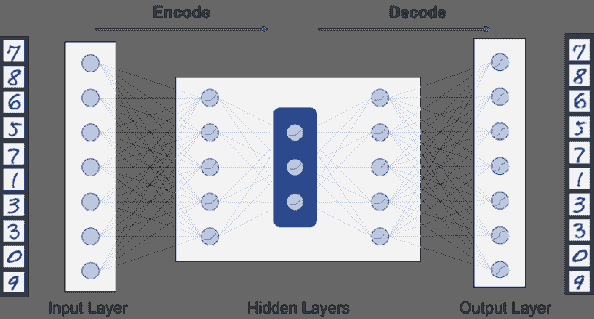
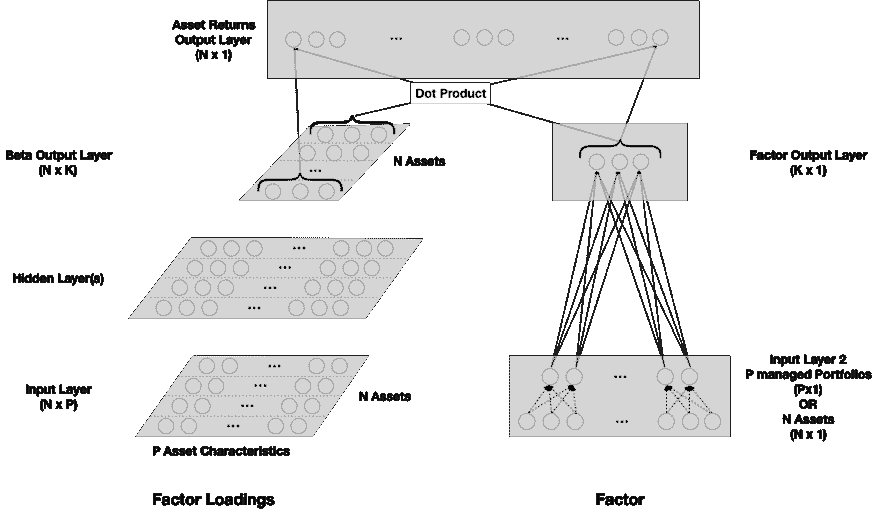
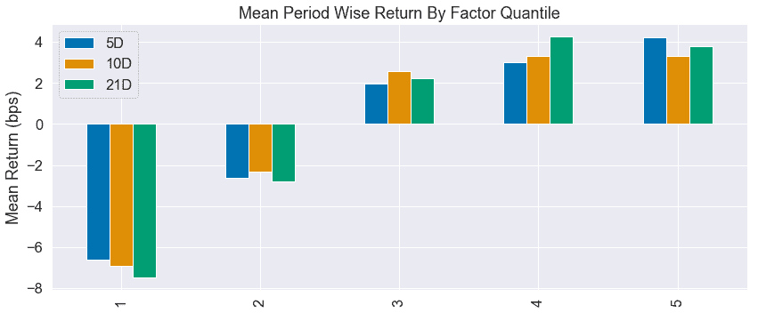

# 二十、用于条件风险因子和资产定价的自编码器

本章展示了无监督学习如何利用深度学习进行交易。更具体地说，我们将讨论**自编码器**，它已经存在了几十年，但最近吸引了新的兴趣。

**无监督学习**解决了实际的 ML 挑战，如标记数据的可用性有限和维数灾难，这需要成倍增加的样本才能从具有许多特征的复杂现实数据中成功学习。在概念层面上，无监督学习与人类学习和常识发展的相似性远远高于监督和强化学习，我们将在下一章中介绍。它也被称为**预测学习**，因为它的目的是从数据中发现结构和规律，以便能够预测缺失的输入，也就是说，填补观察到的部分的空白。

**自编码**r 是一个**神经网络**（**NN**），经过训练以在学习数据的新表示时再现输入，该数据由隐藏层的参数编码。自编码器长期以来一直用于非线性降维和流形学习（参见*第 13 章*、*数据驱动风险因子和无监督学习的资产分配*）。各种设计利用了我们在前三章中介绍的前馈、卷积和循环网络体系结构。我们将看到自编码器如何支持**交易策略**：我们将构建一个深度神经网络，使用自编码器提取风险因子并预测股票回报，以一系列股票属性为条件（Gu、Kelly 和 Xiu 2020）。

更具体地说，在本章中，您将了解：

*   哪些类型的自编码器具有实际用途，以及它们是如何工作的
*   使用 Python 构建和培训自编码器
*   使用自编码器提取考虑资产特征的数据驱动风险因子，以预测回报

您可以在 GitHub 存储库的相应目录中找到本章的代码示例以及指向其他资源的链接。笔记本电脑包括图像的彩色版本。

# 用于非线性特征提取的自编码器

在*第 17 章**交易深度学习*中，我们看到了神经网络如何通过提取对给定任务有用的分层特征表示，成功地进行监督学习。**卷积神经网络**（**CNNs**），例如，从类似网格的数据中学习和合成越来越复杂的模式，例如，识别或检测图像中的对象或对时间序列进行分类。

相比之下，自编码器是一种专门设计用于学习**新表示法**的神经网络，它以帮助解决另一项任务的方式对输入进行编码。为此，训练迫使网络再现输入。由于自编码器通常使用与输入和输出相同的数据，因此它们也被视为**自我监督学习**的一个实例。在过程中，隐藏层*h*的参数成为表示输入的代码，类似于*第 16 章*、*盈利电话和 SEC 备案的单词嵌入*中的 word2vec 模型。

更具体地说，该网络可被视为由从输入*x*学习隐藏层参数的编码器功能*h＝f（x）*和从编码*h*学习重构输入的解码器功能 g 组成。与其学习身份识别功能，不如：


它只是复制输入，自编码器使用**约束**，强制隐藏层**对数据的哪些方面进行编码**e 的优先级排序。目标是获得实用价值的表示。

自编码器也可以被视为前馈神经网络的**特例（参见*第 17 章*、*交易深度学习*），并且可以使用相同的技术进行训练。与其他型号一样，容量过大将导致过度拟合，从而防止自编码器产生超出训练样本范围的信息编码。参见古德费罗、本吉奥和库尔维尔（2016）的*第 14 章*和*第 15 章*，了解的其他背景。**

## 广义线性降维

传统用例包括降维，通过限制隐藏的层的大小，从而创建“瓶颈”，从而执行有损压缩来实现。这种自编码器被称为欠完备，其目的是通过最小化以下形式的损失函数*L*来学习数据的最显著属性：


我们将在下一节中探讨的一个示例损失函数就是对输入图像及其重建的像素值进行评估的均方误差。当我们为交易构建条件自编码器时，我们还将使用此损失函数从金融特征的时间序列中提取风险因子。

欠完备自编码器在使用**非线性激活函数**时，不同于**主成分分析**（**PCA**；参见*第 13 章*、*数据驱动风险因子和无监督学习资产配置*等线性降维方法 ; 否则，他们学习的子空间与 PCA 相同。因此，它们可以被视为 PCA 的非线性推广，能够学习更广泛的编码。

*图 20.1*说明了具有三个隐藏层的欠完整前馈自编码器的编码器-解码器逻辑：编码器和解码器各有一个隐藏层，外加一个包含编码的共享编码器输出/解码器输入层。三个隐藏层使用非线性激活功能，如**校正线性单元**（**ReLU**）、*乙状体*或*tanh*（见*第 17 章*、*交易深度学习*）与网络重建的目标相比，单位更少。



图 20.1：欠完整编码器-解码器体系结构

根据任务的不同，具有单个编码器和解码器层的简单自编码器可能就足够了。然而，与其他神经网络一样，具有附加层的**更深层次的自编码器**可以有几个优势。这些优势包括能够学习更复杂的编码，实现更好的压缩，并且可以用更少的计算工作量和更少的训练样本来实现这一点，同时还存在长期过度拟合的风险。

## 用于图像压缩的卷积自编码器

如*第 18 章*、*针对金融时间序列和卫星图像的 CNN*所述，完全连接的前馈架构不太适合捕捉网格结构数据的典型局部相关性。相反，自编码器也可以使用卷积层来学习分层特征表示。卷积自编码器利用卷积和参数共享来学习分层模式和特征，而不考虑其位置、平移或大小变化。

下面我们将说明用于图像数据的卷积自编码器的不同实现。或者，卷积自编码器可以应用于以网格格式排列的多元时间序列数据，如*第 18 章*、*金融时间序列和卫星图像 CNN*所示。

## 使用正则化自编码器管理过拟合

神经网络表示复杂函数的强大能力要求严格控制编码器和解码器提取信号而不是噪声的能力，以便编码对下游任务更有用。换句话说，当网络很容易重新创建输入时，它无法仅学习数据最有趣的方面，也无法提高使用编码作为输入的机器学习模型的性能。

与其他对给定任务容量过大的模型一样，**正则化**可以通过约束自编码器的学习过程并迫使其产生有用的表示来帮助解决**过度拟合**挑战（例如，参见*第 7 章*、*线性模型——从风险因子到回报预测*、线性模型的正则化以及*第 17 章*、*交易深度学习*、神经网络）。理想情况下，我们可以精确地将模型的容量与数据分布的复杂性相匹配。在实践中，最优模型通常将（有限的）过剩产能与适当的正则化相结合。为此，我们在训练目标中添加了一个稀疏性惩罚，该惩罚取决于编码层*h*的权重：


我们在本章后面探讨的一种常见方法是使用**L1 正则化**，它以权重绝对值之和的形式向损失函数添加惩罚。L1 范数导致稀疏编码，因为如果参数值未捕获数据中的独立变化，则会强制参数值为零（参见*第 7 章*，*线性模型–从风险因子到回报预测*。因此，即使具有比输入更高维度的隐藏层的过完备自编码器也可能能够学习信号内容。

## 使用去噪自编码器修复损坏的数据

到目前为止，我们已经讨论过的自编码器设计用于在容量受限的情况下再现输入。另一种方法是用损坏的输入训练自编码器，以输出所需的原始数据点。在这种情况下，自编码器将损失*L*降至最低：


损坏的输入是阻止网络学习身份函数的另一种方式，而不是从数据中提取信号或显著特征。去噪自编码器已被证明可以学习原始数据的数据生成过程，并且在生成建模中非常流行，其目标是**学习产生输入的概率分布**（Vincent 等人，2008）。

## Seq2seq 用于时间序列功能的自编码器

**递归神经网络**（**RNNs**）已针对序列数据开发，该数据具有数据点之间的纵向依赖性，可能会在较长的范围内（*第 19 章*、*RNNs 用于多变量时间序列和情感分析*）。类似地，序列到序列（seq2seq）自编码器旨在学习与序列中生成的数据的性质相协调的表示（Srivastava、Mansimov 和 Salakhutdinov，2016）。

Seq2seq 自编码器基于 RNN 组件，如**长短时记忆**（**LSTM**）或选通循环单元。它们学习序列数据的表示，并已成功应用于视频、文本、音频和时间序列数据。

如前一章所述，编码器-解码器体系结构允许 RNN 处理长度可变的输入和输出序列。这些体系结构支持了复杂序列预测任务（如语音识别和文本翻译）的许多进展，并越来越多地应用于（金融）时间序列。在高层，他们的工作如下：

1.  LSTM 编码器逐步处理输入序列以了解隐藏状态。
2.  该状态以固定长度向量的形式成为序列的学习表示。
3.  LSTM 解码器接收该状态作为输入，并使用它生成输出序列。

参见 GitHub 上链接的参考文献，了解构建序列到序列自编码器以**压缩时间序列数据**和**检测时间序列中的异常**的示例，例如允许监管机构发现潜在的非法交易活动。

## 变分自编码器的生成建模

**变分自编码器**（**VAE**）是最近开发的（Kingma 和 Welling，2014），重点关注生成建模。与学习给定数据的预测值的判别模型不同，生成模型旨在解决学习所有变量的联合概率分布这一更一般的问题。如果成功，它可以首先模拟数据的生成方式。学习数据生成过程是非常有价值的：它揭示了潜在的因果关系，并支持半监督学习，以有效地将小的标记数据集推广到大的未标记数据集。

更具体地说，VAE 设计用于学习负责输入数据的模型的潜在（意思是*未观察到的*）变量。请注意，我们在*第 15 章*、*主题建模——总结财经新闻*和*第 16 章*、*盈利电话和 SEC 备案的单词嵌入*中遇到了潜在变量。

就像到目前为止讨论的自编码器一样，VAE 不允许网络学习任意函数，只要它忠实地再现输入。相反，他们的目标是学习生成输入数据的概率分布的参数。

换句话说，VAE 是生成模型，因为如果成功，您可以通过从 VAE 学习的分布中采样来生成新的数据点。

VAE 的操作比目前讨论的自编码器更复杂，因为它涉及随机反向传播，即随机变量的导数，细节超出了本书的范围。他们能够学习高容量的输入编码，而无需正则化，这是非常有用的，因为模型的目标是最大化训练数据的概率，而不是再现输入。有关详细介绍，请参见 Kingma 和 Welling（2019）。

`variational_autoencoder.ipynb`笔记本包括一个应用于时尚 MNIST 数据的 VAE 实现示例，该示例改编自 Francois Chollet 的 Keras 教程，用于 TensorFlow 2。GitHub 上链接的资源包含一个 VAE 教程，其中包含对 PyTorch 和 TensorFlow 2 实现的参考以及许多其他参考。参见 Wang et al.（2019），了解使用 LSTM 将 VAE 与 RNN 相结合的应用程序，该应用程序的表现优于期货市场中的各种基准模型。

# 用 TensorFlow 2 实现自编码器

在本节中，我们将说明如何使用 TensorFlow 2 的Keras 接口实现上一节中介绍的自编码器模型。我们将首先加载并准备一个图像数据集，我们将在本节中使用该数据集。我们将使用图像而不是金融时间序列，因为它使编码过程的结果更容易可视化。下一节将展示如何将自编码器与金融数据一起使用，作为更复杂体系结构的一部分，该体系结构可作为交易策略的基础。

在准备好数据之后，我们将继续使用深度前馈网络、稀疏约束和卷积构建自编码器，并将后者应用于图像去噪。

## 如何准备数据

为了进行说明，我们将使用时尚 MNIST 数据集，这是一个现代的替代品，用于替代 Lecun 等人（1998）和 LeNet 推广的经典 MNIST 手写数字数据集。我们还依赖于*第 13 章*、*数据驱动的风险因子和无监督学习的资产配置*中的数据集，基于无监督学习。

Keras 可以轻松访问分辨率为 28×28 像素的 60000 个训练和 10000 个测试灰度样本：

```py
from tensorflow.keras.datasets import fashion_mnist
(X_train, y_train), (X_test, y_test) = fashion_mnist.load_data()
X_train.shape, X_test.shape
((60000, 28, 28), (10000, 28, 28)) 
```

该数据包含 10 个类别的服装项目。*图 20.2*绘制了每个类别的样本图像：


图 20.2:Fashion MNIST 示例图像

我们对数据进行重塑，使每个图像由一个平面一维像素向量表示，其中 28×28=784 个元素归一化为范围[0,1]：

```py
image_size = 28              # pixels per side
input_size = image_size ** 2 # 784
def data_prep(x, size=input_size):
    return x.reshape(-1, size).astype('float32')/255
X_train_scaled = data_prep(X_train)
X_test_scaled = data_prep(X_test)
X_train_scaled.shape, X_test_scaled.shape
((60000, 784), (10000, 784)) 
```

## 单层前馈自编码器

我们从一个带有单个隐藏层的普通前馈自编码器开始，以说明使用功能性 Keras API 的一般设计方法，并建立性能基线。

第一步是使用 784 个元素的展平图像向量的占位符：

```py
input_ = Input(shape=(input_size,), name='Input') 
```

模型的编码器部分由一个完全连接的层组成，该层学习输入的新的压缩表示。我们使用 32 个单位，压缩比为 24.5：

```py
encoding_size = 32 # compression factor: 784 / 32 = 24.5
encoding = Dense(units=encoding_size,
                 activation='relu',
                 name='Encoder')(input_) 
```

解码部分在单个步骤中将压缩数据重建为其原始大小：

```py
decoding = Dense(units=input_size,
                 activation='sigmoid',
                 name='Decoder')(encoding) 
```

我们用链式输入和输出元素实例化`Model`类，这些元素隐式定义计算图，如下所示：

```py
autoencoder = Model(inputs=input_,
                    outputs=decoding,
                    name='Autoencoder') 
```

这样定义的编码器-解码器计算使用了近 51000 个参数：

```py
Layer (type)                 Output Shape              Param #   
Input (InputLayer)           (None, 784)               0         
Encoder (Dense)              (None, 32)                25120     
Decoder (Dense)              (None, 784)               25872     
Total params: 50,992
Trainable params: 50,992
Non-trainable params: 0 
```

功能 API 允许我们使用模型链的一部分作为单独的编码器和解码器模型，使用在培训期间学习的自编码器参数。

### 定义编码器

编码器仅使用输入和隐藏层，约占总参数的一半：

```py
encoder = Model(inputs=input_, outputs=encoding, name='Encoder')
encoder.summary()
Layer (type)                 Output Shape              Param #   
Input (InputLayer)           (None, 784)               0         
Encoder (Dense)              (None, 32)                25120     
Total params: 25,120
Trainable params: 25,120
Non-trainable params: 0 
```

我们将很快看到，一旦我们训练了自编码器，我们就可以使用编码器来压缩数据。

### 定义解码器

解码器由最后一个自编码器层组成，由编码数据的占位符提供：

```py
encoded_input = Input(shape=(encoding_size,), name='Decoder_Input')
decoder_layer = autoencoder.layers[-1](encoded_input)
decoder = Model(inputs=encoded_input, outputs=decoder_layer)
decoder.summary()
Layer (type)                 Output Shape              Param #   
Decoder_Input (InputLayer)   (None, 32)                0         
Decoder (Dense)              (None, 784)               25872     
Total params: 25,872
Trainable params: 25,872
Non-trainable params: 0 
```

### 训练模型

我们编译模型以使用 Adam 优化器（参见*第 17 章*、*交易深度学习*）来最小化输入数据与自编码器实现的再现之间的均方误差。为了确保自编码器学习再现输入，我们使用相同的输入和输出数据训练模型：

```py
autoencoder.compile(optimizer='adam', loss='mse')
autoencoder.fit(x=X_train_scaled, y=X_train_scaled,
                epochs=100, batch_size=32,
                shuffle=True, validation_split=.1,
                callbacks=[tb_callback, early_stopping, checkpointer]) 
```

### 评估结果

训练在大约 20 个时期后停止，测试 RMSE 为 0.1121：

```py
mse = autoencoder.evaluate(x=X_test_scaled, y=X_test_scaled)
f'MSE: {mse:.4f} | RMSE {mse**.5:.4f}'
'MSE: 0.0126 | RMSE 0.1121' 
```

为了对数据进行编码，我们使用刚才定义的编码器，如下所示：

```py
encoded_test_img = encoder.predict(X_test_scaled)
Encoded_test_img.shape
(10000, 32) 
```

解码器获取压缩数据并根据自编码器训练结果再现输出：

```py
decoded_test_img = decoder.predict(encoded_test_img)
decoded_test_img.shape
(10000, 784) 
```

*图 20.3*显示了 10 幅原始图像及其由自编码器重建的图像，并说明了压缩后的损失：


图 20.3：原始和重建的时装 MNIST 图像样本

## 具有稀疏约束的前馈自编码器

正则化的添加相当简单。我们可以使用 Keras'`activity_regularizer`将其应用于密集编码器层，如下所示：

```py
encoding_l1 = Dense(units=encoding_size,
                    activation='relu',
                    activity_regularizer=regularizers.l1(10e-5),
                    name='Encoder_L1')(input_) 
```

输入层和解码层保持不变。在这个压缩系数为 24.5 的示例中，正则化会对性能产生负面影响，测试 RMSE 为 0.1229。

## 深前馈自编码器

为了说明向自编码器添加深度的好处，我们将建立一个三层前馈模型，分别将输入从 784 压缩到 128、64 和 32 个单位：

```py
input_ = Input(shape=(input_size,))
x = Dense(128, activation='relu', name='Encoding1')(input_)
x = Dense(64, activation='relu', name='Encoding2')(x)
encoding_deep = Dense(32, activation='relu', name='Encoding3')(x)
x = Dense(64, activation='relu', name='Decoding1')(encoding_deep)
x = Dense(128, activation='relu', name='Decoding2')(x)
decoding_deep = Dense(input_size, activation='sigmoid', name='Decoding3')(x)
autoencoder_deep = Model(input_, decoding_deep) 
```

结果模型的参数超过 222000 个，是以前单层模型容量的四倍多：

```py
Layer (type)                 Output Shape              Param #   
=================================================================
input_1 (InputLayer)         (None, 784)               0         
_________________________________________________________________
Encoding1 (Dense)            (None, 128)               100480    
_________________________________________________________________
Encoding2 (Dense)            (None, 64)                8256      
_________________________________________________________________
Encoding3 (Dense)            (None, 32)                2080      
_________________________________________________________________
Decoding1 (Dense)            (None, 64)                2112      
_________________________________________________________________
Decoding2 (Dense)            (None, 128)               8320      
_________________________________________________________________
Decoding3 (Dense)            (None, 784)               101136    
=================================================================
Total params: 222,384
Trainable params: 222,384
Non-trainable params: 0 
```

训练在 45 个阶段后停止，结果是测试 RMSE 降低 14%至 0.097。由于分辨率较低，很难直观地观察到较好的重建效果。

### 可视化编码

我们可以使用流形学习技术**t-分布随机邻居嵌入**（**t-SNE**；参见*第 13 章*、*数据驱动风险因子和无监督学习的资产配置*）可视化和评估自编码器隐藏层学习的编码质量。

如果编码成功地捕获了数据的显著特征，那么数据的压缩表示仍应显示与区分观察结果的 10 个类一致的结构。我们使用刚刚训练的深度编码器的输出，以获得测试集的 32 维表示：

```py
tsne = TSNE(perplexity=25, n_iter=5000)
train_embed = tsne.fit_transform(encoder_deep.predict(X_train_scaled)) 
```

*图 20.4*显示，这 10 个类之间有很好的分离，这表明编码作为一种低维表示法非常有用，可以保留数据的关键特征（颜色版本请参见`variational_autoencoder.ipynb`笔记本）：


图 20.4:t-SNE 显示时尚 MNIST 自编码器嵌入

## 卷积自编码器

*第 18 章*、*CNN 针对金融时间序列和卫星图像*关于 CNN 的见解建议我们将卷积层纳入自编码器，以提取图像数据网格状结构的信息特征。

我们定义了一个三层编码器，分别使用 32、16 和 8 个过滤器的 2D 卷积、ReLU 激活和`'same'`填充来保持输入大小。第三层的结果编码大小为，高于前面示例：

```py
x = Conv2D(filters=32,
           kernel_size=(3, 3),
           activation='relu',
           padding='same',
           name='Encoding_Conv_1')(input_)
x = MaxPooling2D(pool_size=(2, 2), padding='same', name='Encoding_Max_1')(x)
x = Conv2D(filters=16,
           kernel_size=(3, 3),
           activation='relu',
           padding='same',
           name='Encoding_Conv_2')(x)
x = MaxPooling2D(pool_size=(2, 2), padding='same', name='Encoding_Max_2')(x)
x = Conv2D(filters=8,
           kernel_size=(3, 3),
           activation='relu',
           padding='same',
           name='Encoding_Conv_3')(x)
encoded_conv = MaxPooling2D(pool_size=(2, 2),
                            padding='same',
                            name='Encoding_Max_3')(x) 
```

我们还定义了一个匹配解码器，该解码器反转滤波器的数量，并使用 2D 上采样而不是最大池来反转滤波器大小的减少。三层自编码器有 12785 个参数，略高于深度自编码器容量的 5%。

由于卷积滤波器能够更有效地从图像数据中学习以及更大的编码大小，训练在 67 个时期后停止，并导致测试 RMSE 进一步减少 9%。

## 去噪自编码器

自编码器在去噪任务中的应用只会影响训练阶段。在本例中，我们将标准正态分布的噪声添加到时尚 MNIST 数据中，同时将像素值保持在范围[0,1]内，如下所示：

```py
def add_noise(x, noise_factor=.3):
    return np.clip(x  + noise_factor * np.random.normal(size=x.shape), 0, 1)
X_train_noisy = add_noise(X_train_scaled)
X_test_noisy = add_noise(X_test_scaled) 
```

然后，我们继续在噪声输入上训练卷积自编码器，目的是学习如何生成未损坏的原稿：

```py
autoencoder_denoise.fit(x=X_train_noisy,
                        y=X_train_scaled,
                        ...) 
```

60 个时代后的测试 RMSE 为 0.0931，毫不奇怪地高于之前。*图 20.5*自上而下显示原始图像以及噪声和去噪版本。它说明了自编码器成功地从噪声图像生成压缩编码，这些图像与从原始图像生成的图像非常相似：


图 20.5：输入和输出去噪示例

# 用于交易的条件自编码器

Gu、Kelly 和 Xiu 最近的研究（GKX，2019）开发了一个基于证券暴露于风险因子的资产定价模型。它建立在我们在*第 13 章*、*数据驱动风险因子和无监督学习资产配置*中讨论的**数据驱动风险因子**概念的基础上，在介绍 PCA 以及*第 4 章*、*中涵盖的风险因子模型时金融特征工程——如何研究阿尔法因子*。它们旨在表明，因子模型用于捕获“异常”的系统驱动因子的资产特征只是无法直接测量的风险因子时变暴露的代理。在这种情况下，异常情况是指超过总市场风险敞口所解释的回报（参见*第 5 章*、*投资组合优化和表现评估*中对资本资产定价模型的讨论）。

*第 4 章*和*第 7 章*中讨论的**法玛-法兰西因子模型**通过基于平均股票收益差异的经验观察，通过指定风险因子（如公司规模）来解释收益，而非总市场风险。考虑到这些**特定的风险因子**，这些模型能够使用相应设计的投资组合来衡量投资者承担因子风险所获得的回报：按大小对股票进行排序，购买最小的五分之一，出售最大的五分之一，并计算回报。然后，观察到的风险因子回报允许线性回归来估计资产对这些因子的敏感性（称为**因子负荷**），这反过来又有助于根据（少得多的）因子回报预测（许多）资产的回报。

相比之下，GKX 将**风险因子视为数量足够大的资产中的潜在或不可观察的**协方差驱动因子，足以阻止投资者通过多元化规避风险敞口。因此，投资者需要像任何价格一样进行调整的报酬，以实现均衡，从而为不再反常的回报差异提供经济理由。在这一观点中，风险因子纯粹是统计性质的，而潜在的经济力量可能是任意和不同的来源。

在最近的另一篇论文（Kelly、Pruitt 和 Su，2019 年）中，在耶鲁大学教授金融的 Kelly 与 AQR 合作，是将 ML 应用于交易的先驱之一，他的合著者开发了一个称为**仪器化主成分分析**（IPCA）到**的线性模型根据**数据估算潜在风险因子和资产的因子负荷。IPCA 扩展了 PCA，将资产特征作为协变量包括在内，并产生时变因子负荷。（PCA 的覆盖范围参见*第 13 章*、*数据驱动的风险因子和无监督学习的资产配置*），通过将资产敞口调节到可观察资产特征上的因子，IPCA 旨在回答是否有一组共同的潜在风险因子可以解释观察到的异常，而不是是否有一个特定的可观察因子可以解释。

GKX 创建了一个**条件自编码器架构**，以反映线性 Fama-French 模型和 IPCA 方法忽略的返回动态的非线性本质。其结果是一个深度神经网络，它使用自编码器同时学习给定数量的不可观测因子的溢价，并使用前馈网络学习基于广泛的时变资产特征的大范围股票的因子负荷。该模型成功地解释和预测了资产收益。它展示了一种在统计上和经济上都很重要的关系，当转化为一种长短十分位数利差策略时，产生了一个有吸引力的夏普比率，类似于我们在本书中使用的例子。

在本节中，我们将创建此模型的简化版本，以演示如何**利用自编码器生成可交易信号**。为此，我们将使用 yfinance 建立一个 1990-2019 年间近 4000 只美国股票的新数据集，因为它提供了一些有助于计算资产特征的额外信息。我们将采取一些捷径，例如使用较少的资产和仅使用最重要的特性。为了简化说明，我们还将省略一些实现细节。我们将强调最重要的差异，以便您可以相应地增强模型。

在解释、构建和训练模型并评估其预测性能之前，我们将首先展示如何准备数据。有关理论和实现的其他背景，请参见上述参考资料。

## 采购股票价格和元数据信息

GKX 参考实施使用证券价格研究中心（CRSP）1957-2016 年超过 30000 股美国股票的股票价格和公司特征数据，每月一次。它计算了 94 个指标，其中包括广泛的资产属性，这些资产属性在以前的学术研究中被认为是回报的预测指标，并在 Green、Hand 和 Zhang（2017）中列出，他们着手验证这些说法。

由于我们无法访问高质量但昂贵的 CRSP 数据，我们利用 yfinance（参见*第 2 章*、*市场和基础数据–来源和技术*）从 Yahoo Finance 下载价格和元数据。选择免费数据有一些缺点，包括：

*   在调整方面缺乏质量控制
*   生存偏差，因为我们无法获得不再上市股票的数据
*   就股票数量和历史长度而言，范围较小

`build_us_stock_dataset.ipynb`笔记本包含本节的相关代码示例。

为了获得数据，我们使用 pandas datareader 从纳斯达克获得了 8882 个当前交易的符号列表（参见*第 2 章*、*市场和基础数据–来源和技术*：

```py
from pandas_datareader.nasdaq_trader import get_nasdaq_symbols
traded_symbols = get_nasdaq_symbols() 
```

我们移除 ETF，并为剩余部分创建 yfinance`Ticker()`对象：

```py
import yfinance as yf
tickers = yf.Tickers(traded_symbols[~traded_symbols.ETF].index.to_list()) 
```

每个股票代码的`.info`属性都包含从雅虎金融（Yahoo Finance）获取的数据点，从已发行股票数量和其他基本面到最新市值；保险范围因安全而异：

```py
info = []
for ticker in tickers.tickers:
    info.append(pd.Series(ticker.info).to_frame(ticker.ticker))
info = pd.concat(info, axis=1).dropna(how='all').T
info = info.apply(pd.to_numeric, errors='ignore') 
```

对于带有元数据的股票，我们下载调整后和未调整的价格，后者包括股票分割和股息支付等公司行为，我们可以使用这些行为创建用于策略回溯测试的拉链捆绑包（参见*第 8 章*、*ML4T 工作流–从模型到策略回溯测试*。

我们得到 4314 只股票的调整后 OHLCV 数据如下：

```py
prices_adj = []
with pd.HDFStore('chunks.h5') as store:
    for i, chunk in enumerate(chunks(tickers, 100)):
        print(i, end=' ', flush=True)
        prices_adj.append(yf.download(chunk,
                                      period='max',
                                      auto_adjust=True).stack(-1))
prices_adj = (pd.concat(prices_adj)
              .dropna(how='all', axis=1)
              .rename(columns=str.lower)
              .swaplevel())
prices_adj.index.names = ['ticker', 'date'] 
```

由于缺乏对基础价格数据和股票分割调整的任何质量控制，我们剔除了日回报率高于 100%或低于-100%的可疑股票：

```py
df = prices_adj.close.unstack('ticker')
pmax = df.pct_change().max()
pmin = df.pct_change().min()
to_drop = pmax[pmax > 1].index.union(pmin[pmin<-1].index) 
```

这去除了约 10%的股票，使我们在 1990-2019 年期间拥有近 3900 项资产。

## 计算预测资产特征

GKX 根据 Green 等人（2017 年）测试了 94 个资产属性，并确定了 20 个最具影响力的指标，同时断言特征重要性此后会迅速下降。前 20 名股票特征分为三类，即：

*   **价格趋势**，包括（行业）动量、短期和长期反转，或近期最大回报
*   **流动性，**如营业额、美元交易量或市值
*   **风险度量**，例如，总和特殊回报波动率或市场贝塔

在这 20 项中，我们将分析限制为 16 项，我们拥有或可以近似计算相关输入。`conditional_autoencoder_for_trading_data.ipynb`笔记本演示了如何计算相关指标。我们在本节中重点介绍几个例子；另见*附录*、*α因子库*。

一些指标需要行业、市值和流通股等信息，因此我们将股价数据集限制为具有相关元数据的证券：

```py
tickers_with_metadata = (metadata[metadata.sector.isin(sectors) & 
                                 metadata.marketcap.notnull() &
                                 metadata.sharesoutstanding.notnull() & 
                                (metadata.sharesoutstanding > 0)]
                                 .index.drop(tickers_with_errors)) 
```

我们以每周而不是每月的回报频率进行分析，以弥补 50%的时间周期缩短和大约 80%的股票数量减少。我们获得的每周回报如下：

```py
returns = (prices.close
           .unstack('ticker')
           .resample('W-FRI').last()
           .sort_index().pct_change().iloc[1:]) 
```

大多数指标都非常容易计算。**股票动量**是指截至当前日期前 1 个月的 11 个月累计股票收益率，可推导出如下公式：

```py
MONTH = 21
mom12m = (close
            .pct_change(periods=11 * MONTH)
            .shift(MONTH)
            .resample('W-FRI')
            .last()
            .stack()
            .to_frame('mom12m')) 
```

**Amihud 非流动性**指标是一只股票的绝对收益相对于其美元交易量的比率，以 21 天滚动平均值衡量：

```py
dv = close.mul(volume)
ill = (close.pct_change().abs()
       .div(dv)
       .rolling(21)
       .mean()
       .resample('W-FRI').last()
       .stack()
       .to_frame('ill')) 
```

**特殊波动率**是作为前三年平均加权市场指数收益率的每周收益率残差回归的标准偏差来衡量的。我们使用`statsmodels`计算该计算密集型指标：

```py
index = close.resample('W-FRI').last().pct_change().mean(1).to_frame('x')
def get_ols_residuals(y, x=index):
    df = x.join(y.to_frame('y')).dropna()
    model = sm.OLS(endog=df.y, exog=sm.add_constant(df[['x']]))
    result = model.fit()
    return result.resid.std()
idiovol = (returns.apply(lambda x: x.rolling(3 * 52)
                         .apply(get_ols_residuals))) 
```

对于**市场贝塔**，我们可以使用 statsmodels 的`RollingOLS`类，以周资产收益率为结果，以等权指数为输入：

```py
def get_market_beta(y, x=index):
    df = x.join(y.to_frame('y')).dropna()
    model = RollingOLS(endog=df.y, 
                       exog=sm.add_constant(df[['x']]),
                       window=3*52)
    return model.fit(params_only=True).params['x']
beta = (returns.dropna(thresh=3*52, axis=1)
        .apply(get_market_beta).stack().to_frame('beta')) 
```

在 1990-2019 年间，我们对 3800 种证券的 16 项指标进行了约 300 万次观察。*图 20.6*显示了每周股票回报数量的直方图（左面板）和框线图，概述了每个特征的观察数量分布：


图 20.6：一段时间内的股票数量和每股特征

为了限制异常值的影响，我们遵循 GKX，并将特征标准化为[-1，1]区间：

```py
data.loc[:, characteristics] = (data.loc[:, characteristics]
                                .groupby(level='date')
                                .apply(lambda x:
                                      pd.DataFrame(quantile_transform(
                                      x, 
                                      copy=True, 
                                      n_quantiles=x.shape[0]),
                                      columns=characteristics,
                                        index=x.index.get_level_values('ticker'))
                                      )
                               .mul(2).sub(1)) 
```

由于神经网络无法处理缺失数据，我们将缺失值设置为-2，这超出了周收益率和特征的范围。

作者还采用了其他方法来避免 microcap 股票权重过高，如市值加权最小二乘回归。他们还通过考虑特征的保守报告滞后来调整数据窥探偏差。

## 创建条件自编码器体系结构

GKX 提出的条件自编码器允许考虑变化的资产特征的时变回报分布。为此，作者扩展了我们在本章第一节中讨论的标准自编码器体系结构，以允许形成编码的功能。

*图 20.7*说明了将结果（资产回报，顶部）建模为资产特征（左输入）和单个资产回报（右输入）函数的架构。作者允许资产回报为基于资产特征的单个股票回报或由样本中的股票形成的投资组合，类似于我们在*第 4 章*、*金融特征工程——如何研究阿尔法因子*中讨论的法玛-法兰西因子投资组合，并在本节导言中进行了总结（因此，右下框中有从股票到投资组合的虚线）。我们将使用个人股票收益；请参阅 GKX 了解如何以及为什么使用投资组合的详细信息。



图 20.7:GKX 设计的条件自编码器架构

条件自编码器左侧的**前馈神经网络**将*N*个股的*K*因子负荷（β输出）建模为其*P*特征（输入）的函数。在我们的例子中，*N*约为 3800，*P*等于 16。作者对进行了三个隐藏层（分别为 32、16 和 8 个单元）的实验，发现两个隐藏层的性能最好。由于特征的数量较少，我们仅使用类似的层，发现 8 个单元最有效。

该架构的右侧是一个传统的自编码器，用于将单个资产收益作为输入，因为它将*N*资产收益映射到自身。作者用这种方法来衡量衍生因子对同期回报的解释程度。此外，他们使用自编码器预测未来收益，方法是使用*t*-1 期间的输入收益和 t 期间的输出收益。我们将重点讨论预测架构的使用，强调自编码器是前馈神经网络的一个特例，如本章第一节所述。

模型输出为左侧因子载荷与右侧因子溢价的点积。作者使用范围为 2-6 的*K*值进行实验，类似于已建立的因子模型。

为了使用 TensorFlow 2 创建此架构，我们使用功能性 Keras API 并定义一个`make_model()`函数，该函数自动执行模型编译过程，如下所示：

```py
def make_model(hidden_units=8, n_factors=3):
    input_beta = Input((n_tickers, n_characteristics), name='input_beta')
    input_factor = Input((n_tickers,), name='input_factor')
    hidden_layer = Dense(units=hidden_units,
                         activation='relu',
                         name='hidden_layer')(input_beta)
    batch_norm = BatchNormalization(name='batch_norm')(hidden_layer)

    output_beta = Dense(units=n_factors, name='output_beta')(batch_norm)
    output_factor = Dense(units=n_factors,
                          name='output_factor')(input_factor)
    output = Dot(axes=(2,1),
                 name='output_layer')([output_beta, output_factor])
    model = Model(inputs=[input_beta, input_factor], outputs=output)
    model.compile(loss='mse', optimizer='adam')
    return model 
```

我们跟随作者使用批量标准化，并编译模型，以使用此回归任务和 Adam 优化器的均方误差。该模型有 12418 个参数（见笔记本）。

作者使用额外的正则化技术，如网络权重的 L1 惩罚，并结合具有相同结构但使用不同随机种子的各种网络的结果。他们也使用提前停车。

我们使用 20 年的培训进行交叉验证，并预测下一年的周回报率，对应于 2015-2019 年的五倍。我们通过计算验证集的**信息系数**（**IC**）来评估系数*K*从 2 到 6 以及 8、16 或 32 个隐藏层单元的组合，如下所示：

```py
factor_opts = [2, 3, 4, 5, 6]
unit_opts = [8, 16, 32]
param_grid = list(product(unit_opts, factor_opts))
for units, n_factors in param_grid:
    scores = []
    model = make_model(hidden_units=units, n_factors=n_factors)
    for fold, (train_idx, val_idx) in enumerate(cv.split(data)):
        X1_train, X2_train, y_train, X1_val, X2_val, y_val = \
            get_train_valid_data(data, train_idx, val_idx)
        for epoch in range(250):         
            model.fit([X1_train, X2_train], y_train,
                      batch_size=batch_size,
                      validation_data=([X1_val, X2_val], y_val),
                      epochs=epoch + 1,
                      initial_epoch=epoch, 
                      verbose=0, shuffle=True)
            result = (pd.DataFrame({'y_pred': model.predict([X1_val,
                                                             X2_val])
                                   .reshape(-1),
                                    'y_true': y_val.stack().values},
                                  index=y_val.stack().index)
                      .replace(-2, np.nan).dropna())
            r0 = spearmanr(result.y_true, result.y_pred)[0]
            r1 = result.groupby(level='date').apply(lambda x: 
                                                    spearmanr(x.y_pred, 
                                                              x.y_true)[0])
            scores.append([units, n_factors, fold, epoch, r0, r1.mean(),
                           r1.std(), r1.median()]) 
```

*图 20.8*绘制了五因子计数和三个隐藏层大小组合的五个年度褶皱（按历元）的平均验证 IC。上面板显示 52 周的 IC，下面板显示平均每周 IC（彩色版本见笔记本）：


图 20.8：所有因子和隐藏层大小组合的交叉验证性能

结果表明，因子越多，隐层单元越少，效果越好；特别是，当整体 IC 值在 0.02-0.03 范围内时，具有八个单位的四因子和六因子表现最佳。

为了评估模型预测性能的经济意义，我们为一个四因子模型生成了预测，该模型有 8 个单元，经过 15 个时期的训练。然后，我们使用 Alphalens 计算每个时间点预测值的五分之一所投资的等权投资组合之间的利差，同时忽略交易成本（参见`alphalens_analysis.ipynb` 笔记本）。

*图 20.9*显示了持有期从 5 天到 21 天的平均价差。对于也反映预测范围的较短端，底部和顶部十分位数之间的差值约为 10 个基点：



图 20.9：预测五分位数的平均周期分布

为了评估预测性能如何随时间转化为回报，我们分别对类似投资组合的累积回报以及投资于上半部分和下半部分的长短组合的累积回报进行评分：


图 20.10：基于五分位数和长短组合的累积回报

结果显示，随着时间的推移，五分位投资组合和更广泛的长短组合的正累积回报之间存在显著的利差。这支持了条件自编码器模型有助于盈利交易策略的假设。

## 经验教训和下一步

条件自编码器结合了我们在*第 13 章*中使用 PCA 探索的数据驱动风险因子的非线性版本，*数据驱动风险因子和资产分配与无监督学习*，以及*第 4 章*和*中讨论的风险因子回报建模方法第七章*。它说明了深层神经网络结构如何能够灵活地适应各种任务以及自编码器和前馈神经网络之间的流体边界。

从数据源到体系结构的大量简化指出了一些改进的途径。除了获取更多质量更好的数据，也允许计算其他特征外，以下修改是一个起点，当然还有更多：

*   试验**数据频率**而不是每周，预测周期而不是每年，更短的周期也会增加训练数据量
*   修改**模型架构**，特别是如果使用更多数据，这可能会逆转更小的隐藏层可以估计更好的因子负载的发现

# 总结

在本章中，我们介绍了无监督学习如何利用深度学习。自编码器学习复杂的非线性特征表示，能够显著压缩复杂数据，同时几乎不丢失信息。因此，它们非常有助于对抗与具有许多特性的丰富数据集相关的维度灾难，尤其是具有备选数据的常见数据集。我们还了解了如何使用 TensorFlow 2 实现各种类型的自编码器。

最重要的是，我们实施了最近的学术研究，从数据中提取数据驱动的风险因子来预测回报。与我们在*第 13 章*、*数据驱动风险因子和无监督学习的资产配置*中对此挑战的线性方法不同，自编码器捕捉非线性关系。此外，深度学习的灵活性使我们能够结合许多关键资产特征，对有助于预测回报的更敏感因子进行建模。

在下一章中，我们将重点介绍生成性对抗网络，这通常被称为人工智能最令人兴奋的最新发展之一，并了解它们如何能够创建合成训练数据。