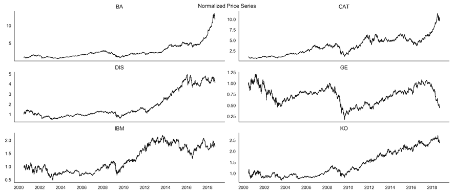
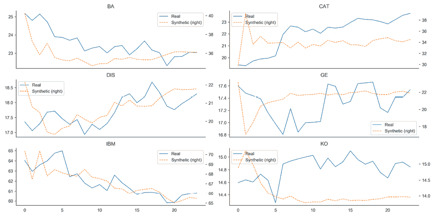

# 二十一、合成时间序列数据的生成对抗网络

继上一章中对自编码器的介绍之后，本章介绍了第二种无监督深度学习技术：**生成性对抗网络**（**GANs**）。与自编码器一样，GANs 补充了*第 13 章*、*数据驱动风险因子和无监督学习*中介绍的降维和聚类方法。

**GANs**由古德费罗等人于 2014 年发明。Yann LeCun 称 GANs 为“过去十年来人工智能领域最令人兴奋的想法”。在竞争环境中，一个**GAN**训练两个神经网络，称为**生成器**和**鉴别器**。生成器旨在生成鉴别器无法从给定类别的训练数据中区分的样本。其结果是一个生成模型，能够生成代表特定目标分布的合成样本，但人工创建，因此成本低廉。

GANs 已经在许多领域产生了大量的研究和成功的应用。最初应用于图像时，Esteban、Hyland 和 Rätsch（2017）将 GANs 应用于医学领域，以生成**合成时间序列数据**。随后对金融数据进行了实验（Koshiyama、Firoozye 和 Treleaven 2019；Wiese 等人 2019；Zhou 等人 2018；Fu 等人 2019），以探索 GANs 是否能够生成模拟替代资产价格轨迹的数据，以训练监督或强化算法，或对交易策略进行回溯测试。我们将复制 Yoon、Jarrett 和 van der Schaar（2019 年）在 2019 年 NeurIPS 上展示的时间序列 GAN，以说明该方法并演示结果。

更具体地说，在本章中，您将了解以下内容：

*   GAN 如何工作，为什么有用，以及如何将其应用于交易
*   使用 TensorFlow 2 设计和训练 GANs
*   生成合成金融数据以扩展可用于训练 ML 模型和回溯测试的输入

您可以在 GitHub 存储库的相应目录中找到本章的代码示例以及指向其他资源的链接。笔记本电脑包括图像的彩色版本。

# 使用 GANs 创建合成数据

本书主要关注接收输入数据并预测结果的监督学习算法，我们可以将其与基本事实进行比较，以评估其性能。这种算法也称为**判别模型**，因为它们学习区分不同的输出值。

GANs 是**生成模型**的一个实例，就像我们在上一章中遇到的变分自编码器一样。如上所述，生成模型使用从某个分布*p*<sub class="Subscript--PACKT-">数据</sub>中提取的样本获取训练集，并学习表示该数据生成分布的估算*p*<sub class="Subscript--PACKT-">模型</sub>。

正如引言中提到的，GANs 被认为是最近最令人兴奋的机器学习创新之一，因为它们似乎能够生成忠实模拟一系列输入数据的高质量样本。考虑到监督学习所需的标记数据的缺乏或高成本，这是非常有吸引力的。

GANs 已经引发了一场研究浪潮，最初的重点是生成令人惊讶的真实图像。最近，由于历史市场数据的有限可用性是回测过度拟合风险的关键驱动因子，出现了生成具有显著交易潜力的合成时间序列的 GAN 实例。

在本节中，我们将更详细地解释生成模型和对抗训练是如何工作的，并回顾各种 GAN 架构。在下一节中，我们将演示如何使用 TensorFlow 2 设计和训练 GAN。在最后一节中，我们将描述如何调整 GAN 以创建合成时间序列数据。

## 生成模型与判别模型的比较

辨别性模型学习如何在给定输入数据*X*的情况下区分结果*y*。换句话说，他们学习给定数据的结果概率：*p*（*y**X*）。另一方面，生成模型学习输入和结果的联合分布*p*（*y*、*X*。而生成模型可以用作使用贝叶斯规则计算哪一类最有可能的判别模型（参见*第 10 章*、*贝叶斯 ML–动态夏普比率和成对交易*），直接解决预测问题似乎比首先解决更一般的生成挑战更可取（Ng 和 Jordan，2002）。

GANs 有一个生成目标：它们产生复杂的输出，比如真实的图像，给定简单的输入，甚至可以是随机数。他们通过对可能输出的概率分布建模来实现这一点。该概率分布可以具有多个维度，例如图像中的每个像素、文档中的每个字符或标记或时间序列中的每个值都有一个维度。因此，该模型可以生成很可能代表该类输出的输出。

理查德·费曼（Richard Feynman）的名言“**我无法创造，我不理解**”强调，建模生成分布是迈向更通用人工智能的重要一步，类似于人类学习，它成功地使用了更少的样本。

生成模型有几个**用例**，超出了从给定分布生成额外样本的能力。例如，它们可以被纳入基于模型的**强化学习**（**RL**算法）中（见下一章。生成模型也可应用于时间序列数据，以模拟替代的过去或可能的未来轨迹，这些轨迹可用于 RL 中的规划或更普遍的监督学习，包括交易算法的设计。其他用例包括半监督学习，其中 GAN 促进特征匹配，以比当前方法少得多的训练样本分配丢失的标签。

## 对抗性训练——一场零和游戏

GANs 的关键创新是一种学习数据生成概率分布的新方法。该算法在两个名为**生成器**和**鉴别器**的神经网络之间建立竞争或对抗博弈。

生成器的目标是将随机噪声输入转换为特定类别对象的伪实例，如人脸图像或股价时间序列。鉴别器的目的是将生成器的欺骗性输出与包含目标对象真实样本的一组训练数据区分开来。GAN 的总体目标是让两个网络在各自的任务中都做得更好，以便发电机产生的输出不再是机器能够区分的原始输出（此时我们不需要鉴别器，鉴别器不再是必要的，可以丢弃）。

*图 21.1*说明了使用通用 GAN 架构（设计用于生成图像）进行对抗性训练。我们假设生成器使用深度 CNN 架构（如*第 18 章*中的 VGG16 示例，*用于金融时间序列和卫星图像的 CNN*），该架构与我们在前面章节中讨论的卷积自编码器的解码器部分相同。生成器接收具有随机像素值的输入图像，并生成*伪*输出图像，该图像被传递到鉴别器网络，鉴别器网络使用镜像 CNN 架构。鉴别器网络还接收表示目标分布的*真实*样本，并预测输入为*真实*的概率，而不是*假*。通过将鉴别器和发生器损耗的梯度反向传播到各自网络的参数，可以进行学习：


图 21.1:GAN 结构

最近的 GAN Lab 是一个受 TensorFlow Playerly 启发的伟大互动工具，它允许用户设计 GAN，并随着时间的推移可视化学习过程和性能的各个方面（请参阅 GitHub 上的参考资料链接）。

## 赣建筑的快速发展

自 2014 年古德费罗等人发表论文以来，GANs 吸引了大量的兴趣，并引发了相应的研究热潮。

这项工作的大部分改进了原始体系结构，使其适应不同的域和任务，并将其扩展为包含附加信息和创建条件 GAN。更多的研究集中于改进具有挑战性的训练过程的方法，这需要在两个网络之间实现稳定的博弈论平衡，每个网络都可能很难单独训练。

赣的景观已经变得比我们在这里所能涵盖的更加多样化；最近的调查见 Creswell 等人（2018 年）和 Pan 等人（2019 年），开放性问题列表见 Odena（2019 年）。

### 用于表征学习的深卷积 GANs

**深层卷积性 GANs**（**DCGANs**）的动机是将 CNN 成功应用于类网格数据的监督学习（Radford、Metz 和 Chintala 2016）。该体系结构通过开发基于对抗训练的特征提取器，率先将 GANs 用于无监督学习。训练和生成更高质量的图像也更容易。它现在被认为是一个基线实现，有许多开源示例可用（请参阅 GitHub 上的参考资料）。

DCGAN 网络以均匀分布的随机数作为输入，输出分辨率为 64×64 像素的彩色图像。随着输入的增量更改，生成的图像也会随之更改。该网络由标准 CNN 组件组成，包括反褶积层（如前一章卷积自编码器示例中的卷积层）或完全连接层。

作者进行了详尽的实验，并提出了一些建议，例如在两个网络中使用批处理规范化和 ReLU 激活。我们将在本章后面探讨 TensorFlow 的实现。

### 用于图像到图像翻译的条件 GANs

**条件 GANs**（**cGANs**）在培训过程中引入了额外的标签信息，从而提高了的质量，并对输出进行了一些控制。

CGAN 通过向包含类标签的鉴别器添加第三个输入来改变前面在*图 21.1*中显示的基线架构。例如，这些标签可以在生成图像时传达性别或头发颜色信息。

扩展包括**生成对抗性 what-where 网络**（**GAWWN**；Reed 等人 2016），该网络不仅使用边界框信息生成合成图像，还将对象放置在给定位置。

## GAN 在图像和时间序列数据中的应用

除了对原有体系结构进行大量扩展和修改外，还出现了大量图像应用程序以及语音和音乐等顺序数据。图像的应用尤其多样化，从图像混合和超分辨率到视频生成和人体姿势识别。此外，GANs 已被用于改善监督学习性能。

我们将看几个突出的例子，然后更仔细地看时间序列数据的应用程序，这些数据可能与算法交易和投资特别相关。最近的调查见 Alqahtani、Kavakli Thorne 和 Kumar（2019 年），其他资源见 GitHub 参考资料。

### CycleGAN–未配对图像到图像的转换

监督图像到图像翻译旨在学习对齐的输入和输出图像之间的映射。CycleGAN 在成对图像不可用时解决此任务，并将图像从一个域转换为另一个域。

流行的例子包括把马画成斑马，反之亦然。它还包括风格的转换，通过从任意风景照片生成印象派印刷品的真实样本（Zhu 等人，2018 年）。

### StackGAN–文本到照片的图像合成

GANs 在域转移中的早期应用之一是基于文本生成图像。**Stacking GAN**通常缩写为**StackGAN**，使用语句作为输入，并生成多个与描述匹配的图像。

该体系结构分两个阶段运行，第一阶段生成形状和颜色的低分辨率草图，第二阶段将结果增强为具有真实照片细节的高分辨率图像（Zhang 等人，2017）。

### SRGAN–照片级真实感单图像超分辨率

超分辨率旨在从低分辨率输入生成更高分辨率的照片级真实感图像。应用于此任务的 GAN 具有深度 CNN 架构，使用批量规范化、ReLU 和跳过连接，正如在 ResNet 中遇到的一样（参见*第 18 章*、*CNN 用于金融时间序列和卫星图像*），以产生令人印象深刻的结果，这些结果已经在商业应用中找到（Ledig 等人，2017 年）。

### 具有循环条件 GANs 的合成时间序列

**递归 GANs**（**RGANs**）和**递归条件 GANs**（**RCGANs**是两种旨在合成真实实值多元时间序列的模型架构（Esteban、Hyland 和 Rätsch 2017）。作者以医学领域的应用为目标，但该方法对于克服历史市场数据的局限性具有极高的价值。

RGAN 依赖于**递归神经网络**（**RNN**）作为发生器和鉴别器。RCGAN 本着 CGAN 的精神添加了辅助信息（参见前面的*条件 GAN 的图像到图像翻译*部分）。

作者成功地生成了视觉上和数量上令人信服的真实样本。此外，他们还评估了合成数据（包括合成标签）的质量，通过使用它来训练一个模型，在真实测试集上的预测性能只有轻微下降。作者还利用重症监护病房 17000 名患者的医疗数据集，展示了 RCGANs 在早期预警系统中的成功应用。因此，作者说明 RCGANs 能够生成对监督训练有用的时间序列数据。我们将在本章的*TimeGAN–针对综合金融数据的对抗性培训*一节中，将这种方法应用于金融市场数据。

# 如何使用 TensorFlow 2 构建 GAN

为了说明使用 Python 的 GAN 的实现，我们将使用本节前面讨论的 DCGAN 示例，从我们在*第 13 章*中首次遇到的 Fashion MNIST 数据集、*数据驱动的风险因子和无监督学习的资产分配*中合成图像。

具体实施细节及参考资料见`deep_convolutional_generative_adversarial_network`笔记本。

## 构建发电机网络

生成器和鉴别器都使用了深 CNN 架构，如图 20.1*所示*，但层数较少。生成器使用一个完全连接的输入层，然后是三个卷积层，如以下`build_generator()`函数中所定义，该函数返回一个 Keras 模型实例：

```py
def build_generator():
    return Sequential([Dense(7 * 7 * 256, 
                             use_bias=False,
                             input_shape=(100,), 
                             name='IN'),
                       BatchNormalization(name='BN1'),
                       LeakyReLU(name='RELU1'),
                       Reshape((7, 7, 256), name='SHAPE1'),
                       Conv2DTranspose(128, (5, 5), 
                                       strides=(1, 1),
                                       padding='same', 
                                       use_bias=False,
                                       name='CONV1'),
                       BatchNormalization(name='BN2'),
                       LeakyReLU(name='RELU2'),
                       Conv2DTranspose(64, (5, 5), 
                                       strides=(2, 2),
                                       padding='same',
                                       use_bias=False,
                                       name='CONV2'),
                       BatchNormalization(name='BN3'),
                       LeakyReLU(name='RELU3'),
                       Conv2DTranspose(1, (5, 5), 
                                       strides=(2, 2),
                                       padding='same', 
                                       use_bias=False,
                                       activation='tanh', 
                                       name='CONV3')],
                      name='Generator') 
```

生成器接受 100 个一维随机值作为输入，并生成 28 像素宽和高的图像，因此包含 784 个数据点。

调用此函数返回的模型的`.summary()`方法表明，该网络有 230 多万个参数（详见笔记本，包括培训前发电机输出的可视化）。

## 创建鉴别器网络

鉴别器网络使用两个卷积层，将从发生器接收的输入转换为单个输出值。该模型有大约 212000 个参数：

```py
def build_discriminator():
    return Sequential([Conv2D(64, (5, 5), 
                              strides=(2, 2), 
                              padding='same',
                              input_shape=[28, 28, 1], 
                              name='CONV1'),
                       LeakyReLU(name='RELU1'),
                       Dropout(0.3, name='DO1'),
                       Conv2D(128, (5, 5), 
                              strides=(2, 2),
                              padding='same', 
                              name='CONV2'),
                       LeakyReLU(name='RELU2'),
                       Dropout(0.3, name='DO2'),
                       Flatten(name='FLAT'),
                       Dense(1, name='OUT')],
                      name='Discriminator') 
```

*图 21.2*描述了随机输入如何从发生器流向鉴别器，以及各种网络组件的输入和输出形状：


图 21.2:DCGAN TensorFlow 2 模型架构

## 建立对抗性训练流程

现在我们已经建立了生成器和鉴别器模型，我们将设计并执行对抗训练过程。为此，我们将定义以下内容：

*   这两种模型的损失函数都反映了它们之间的竞争互动
*   运行反向传播算法的单个训练步骤
*   重复训练步骤的训练循环，直到模型性能满足我们的期望

### 定义发电机和鉴别器损耗函数

发电机损耗反映了鉴别器关于假输入的决定。如果鉴别器将生成器生成的图像误认为是真实图像，则为低，否则为高；我们将在创建培训步骤时定义两个模型之间的交互。

发电机损耗通过二进制交叉熵损耗函数测量，如下所示：

```py
cross_entropy = BinaryCrossentropy(from_logits=True)
def generator_loss(fake_output):
    return cross_entropy(tf.ones_like(fake_output), fake_output) 
```

鉴别器接收真图像和假图像作为输入。它计算每种类型的损失，并尝试最小化总和，以准确识别两种类型的输入：

```py
def discriminator_loss(true_output, fake_output):
    true_loss = cross_entropy(tf.ones_like(true_output), true_output)
    fake_loss = cross_entropy(tf.zeros_like(fake_output), fake_output)
    return true_loss + fake_loss 
```

为了训练这两个模型，我们为每个模型分配一个学习率低于默认值的 Adam 优化器：

```py
gen_optimizer = Adam(1e-4)
dis_optimizer = Adam(1e-4) 
```

### 核心-设计培训步骤

每个训练步骤使用 Adam 优化器执行一轮随机梯度下降。它包括五个步骤：

1.  向每个模型提供小批量输入
2.  获取当前权重的模型输出
3.  在给定模型目标和输出的情况下计算损失
4.  获得关于每个模型权重的损失梯度
5.  根据优化器的算法应用梯度

函数`train_step()`执行这五个步骤。我们使用`@tf.function`修饰符通过将其编译为 TensorFlow 操作来加速执行，而不是依赖于急切执行（有关详细信息，请参阅 TensorFlow 文档）：

```py
@tf.function
def train_step(images):
    # generate the random input for the generator
    noise = tf.random.normal([BATCH_SIZE, noise_dim])
    with tf.GradientTape() as gen_tape, tf.GradientTape() as disc_tape:     
        # get the generator output
        generated_img = generator(noise, training=True)
        # collect discriminator decisions regarding real and fake input
        true_output = discriminator(images, training=True)
        fake_output = discriminator(generated_img, training=True)
        # compute the loss for each model
        gen_loss = generator_loss(fake_output)
        disc_loss = discriminator_loss(true_output, fake_output)
    # compute the gradients for each loss with respect to the model variables
    grad_generator = gen_tape.gradient(gen_loss,
                                       generator.trainable_variables)
    grad_discriminator = disc_tape.gradient(disc_loss,
                                            discriminator.trainable_variables)
    # apply the gradient to complete the backpropagation step
    gen_optimizer.apply_gradients(zip(grad_generator,
                                      generator.trainable_variables))
    dis_optimizer.apply_gradients(zip(grad_discriminator,
                                      discriminator.trainable_variables)) 
```

### 把它放在一起——训练循环

一旦我们正确定义了培训步骤，培训循环就非常容易实现。它由一个简单的`for`循环组成，在每次迭代中，我们将一批新的真实图像传递给训练步骤。我们还将采样一些合成图像，偶尔保存模型权重。

请注意，我们使用`tqdm`包跟踪进度，其中显示了培训期间完成的百分比：

```py
def train(dataset, epochs, save_every=10):
    for epoch in tqdm(range(epochs)):
        for img_batch in dataset:
            train_step(img_batch)
        # produce images for the GIF as we go
        display.clear_output(wait=True)
        generate_and_save_images(generator, epoch + 1, seed)
        # Save the model every 10 EPOCHS
        if (epoch + 1) % save_every == 0:
            checkpoint.save(file_prefix=checkpoint_prefix)
        # Generator after final epoch
    display.clear_output(wait=True)
    generate_and_save_images(generator, epochs, seed)
train(train_set, EPOCHS) 
```

## 评估结果

在经历了仅需几分钟的 100 个纪元后，由随机噪声创建的合成图像明显开始与原始图像相似，如*图 21.3*所示（有关最佳视觉质量，请参见笔记本）：


图 21.3：合成时装 MNIST 图像示例

该笔记本还创建了一个动态 GIF 图像，可以直观地显示训练期间合成图像的质量如何提高。

现在我们已经了解了如何使用 TensorFlow 2 构建和训练 GAN，接下来我们将讨论一个更复杂的示例，该示例从股票价格数据生成合成时间序列。

# 综合金融数据的 TimeGAN

在为图像设计 GAN 时，生成合成时间序列数据带来了一些特殊的挑战。除了在任何给定点上的变量分布，如像素值或众多股票的价格，时间序列数据的生成模型还应了解形成一个观测序列如何跟随另一个观测序列的时间动力学。（另请参见*第 9 章*、*波动率预测和统计套利时间序列模型*中的讨论）。

Yoon、Jarrett 和 van der Schaar 于 2019 年 12 月在 NeurIPS 上发表的最新且有前景的研究介绍了一种新的**时间序列生成对抗网络**（**TimeGAN**）框架，旨在通过结合有监督和无监督训练来解释时间相关性。该模型学习时间序列嵌入空间，同时优化监督目标和对抗目标，这鼓励它遵守训练期间从历史数据采样时观察到的动态。作者在各种时间序列（包括历史股票价格）上对模型进行了测试，发现合成数据的质量明显优于可用备选数据。

在本节中，我们将概述这个复杂的模型是如何工作的，重点介绍在前面的 DCGAN 示例基础上构建的关键实现步骤，并展示如何评估生成的时间序列的质量。有关更多信息，请参阅本文。

## 学习跨功能和时间生成数据

一个成功的时间序列数据的生成模型需要捕获特征在每个时间点的横截面分布以及这些特征随时间的纵向关系。在我们刚才讨论的图像上下文中表示，模型不仅需要了解真实图像的外观，还需要了解一个图像如何从视频中的前一个图像演变而来。

### 对抗训练与监督训练相结合

如第一节所述，先前生成时间序列数据的尝试，如 RGAN 和 RCGANs，依赖于 RNN（参见*第 19 章*、*RNN 用于多元时间序列和情感分析*）作为生成器和鉴别器。TimeGAN 通过将 DCGAN 示例中熟悉的真实和合成序列上的**无监督对抗损失**与原始数据的**逐步监督损失**相结合，明确地结合了时间序列的自回归性质。目标是奖励模型学习历史数据中从一个时间点到下一个时间点的**过渡分布**。

此外，TimeGAN 包括将时间序列特征映射到低维潜在空间的嵌入网络，以降低对抗空间的复杂性。其动机是捕捉通常具有较低维度的时间动力学的驱动因子。（另请参阅*第 13 章*中的流形学习、*数据驱动的风险因子以及*第 20 章*、*条件风险因子和资产定价自编码器*中的无监督学习*和非线性降维资产配置的讨论）。

TimeGAN 体系结构的一个关键要素是，生成器和嵌入（或自编码器）网络都负责最小化监督损失，以测量模型学习动态关系的程度。因此，该模型学习一个潜在空间，条件是促进生成器的任务忠实地再现历史数据中观察到的时间关系。除了时间序列数据外，模型还可以处理静态数据，这些数据不会随时间变化或变化频率较低。

### TimeGAN 架构的四个组件

TimeGAN 架构将对抗性网络与自编码器结合在一起，因此有四个网络组件，如*图 21.4*所示：

1.  **自编码器**：嵌入和恢复网络
2.  **对抗网络**：序列发生器和序列鉴别器组件

作者强调通过**三种不同的损失函数**对自编码器和对抗网络进行**联合训练**。**重构损耗**优化自编码器；**无监督损耗**训练对抗网；**有监督损耗**强化时间动态。作为这一关键洞察的结果，TimeGAN 同时学习编码特征、生成表示和跨时间迭代。更具体地说，嵌入网络创建了潜在空间，对抗网络在该空间内运行，监督损失同步了真实数据和合成数据的潜在动态。


图 21.4:TimeGAN 架构的组件

自编码器的**嵌入和恢复**组件将特征空间映射到潜在空间，反之亦然。这有助于敌方网络在低维空间学习时间动态。作者使用堆叠 RNN 和前馈网络实现了嵌入和恢复网络。然而，这些选择可以灵活地适应手头的任务，只要它们是自回归的，并且尊重数据的时间顺序。

敌方网络的**生成器和鉴别器**元素与 DCGAN 不同，不仅因为它们对序列数据进行操作，还因为合成特征是在模型同时学习的潜在空间中生成的。作者选择了一个 RNN 作为发生器，一个带有前馈输出层的双向 RNN 作为鉴别器。

### 自编码器和对抗网络的联合训练

在*图 21.4*中显示的三个损失函数驱动了在真实和随机生成的时间序列上进行训练时刚刚描述的网元的联合优化。更详细地说，他们旨在实现以下目标：

*   **重建损失**是我们在*第 20 章*中对自编码器的讨论中熟悉的，*条件风险因子和资产定价自编码器*；它比较了编码数据的重建与原始数据的相似程度。
*   **无监督损失**反映了 DCGAN 示例中描述的发生器和鉴别器之间的竞争性交互作用；当生成器的目标是最小化鉴别器将其输出分类为伪输出的概率时，鉴别器的目标是优化正确的分类或真实和虚假输入。
*   **监督损失**捕获了当接收到先前序列的编码真实数据时，生成器如何很好地逼近潜在空间中的实际下一时间步。

培训分**三个阶段**进行：

1.  在实时序列上训练自编码器以优化重建
2.  利用实时序列捕获历史数据的时间动态优化监督损失
3.  联合培训四个组件，同时最小化所有三个损失函数

TimeGAN 包括几个**超参数**，用于衡量复合损失函数的分量；然而，作者发现网络对这些设置的敏感度比人们想象的要低，这是因为 GAN 训练存在着臭名昭著的困难。事实上，他们**在训练**期间没有发现重大挑战，并认为嵌入任务有助于规范对抗性学习，因为它降低了维度，而监督损失限制了生成器的逐步动态。

现在我们转向使用 TensorFlow 2 的 TimeGAN 实现；有关该方法的数学和方法的深入解释，请参见本文。

## 使用 TensorFlow 2 实现 TimeGAN

在部分中，我们将实现刚才描述的 TimeGAN 架构。作者使用 TensorFlow 1 提供了示例代码，我们将把它移植到 TensorFlow 2。构建和培训 TimeGAN 需要几个步骤：

1.  选择和准备实时和随机时间序列输入
2.  创建关键 TimeGAN 模型组件
3.  定义三个培训阶段中使用的各种损失函数和培训步骤
4.  运行训练循环并记录结果
5.  生成合成时间序列并评估结果

我们将浏览每个步骤的关键项目；本节中的代码示例（除非另有说明）以及其他实现细节请参见笔记本`TimeGAN_TF2`。

### 准备真实和随机输入序列

作者使用从雅虎财经下载的 15 年每日谷歌股票价格，包括六个特征，即开放、高、低、收盘和调整收盘价格，以及交易量，来证明 TimeGAN 对金融数据的适用性。我们将对六种不同的股票采用近 20 年的调整收盘价，因为它引入了更高的可变性。我们将遵循原始论文，以 24 个时间步长确定合成系列的目标。

Quandl Wiki 数据集中历史最长的股票是那些以规范化格式显示的股票，即从 1.0 开始，在*图 21.5*中。我们检索了 2000-2017 年调整后的收盘价，获得了 4000 多个观测值。序列之间的相关系数范围从 GE 和 CAT 的 0.01 到 DIS 和 KO 的 0.94。



图 21.5:TimeGAN 输入的六个真实股票价格序列

我们使用 scikit learn 的`MinMaxScaler`类将每个系列缩放到[0,1]范围，稍后我们将使用该类重新缩放合成数据：

```py
df = pd.read_hdf(hdf_store, 'data/real')
scaler = MinMaxScaler()
scaled_data = scaler.fit_transform(df).astype(np.float32) 
```

在下一步中，我们为六个系列创建包含 24 个连续数据点重叠序列的滚动窗口：

```py
data = []
for i in range(len(df) - seq_len):
    data.append(scaled_data[i:i + seq_len])
n_series = len(data) 
```

然后我们从`NumPy`数组列表中创建一个`tf.data.Dataset`实例，确保数据在训练时被洗牌，并将批量大小设置为 128：

```py
real_series = (tf.data.Dataset
               .from_tensor_slices(data)
               .shuffle(buffer_size=n_windows)
               .batch(batch_size))
real_series_iter = iter(real_series.repeat()) 
```

我们还需要一个随机时间序列生成器，它可以生成模拟数据，并在训练持续期间对六个序列进行 24 次观测。

为此，我们将创建一个生成器，随机抽取所需的数据，并将结果输入到第二个实例中。我们将此数据集设置为生产所需大小的批次，并在必要时重复此过程：

```py
def make_random_data():
    while True:
        yield np.random.uniform(low=0, high=1, size=(seq_len, n_seq))
random_series = iter(tf.data.Dataset
                     .from_generator(make_random_data,
                                     output_types=tf.float32)
                     .batch(batch_size)
                     .repeat()) 
```

现在我们将继续定义和实例化 TimeGAN 模型组件。

### 创建 TimeGAN 模型组件

现在，我们将创建两个 autoencoder 组件和两个敌对网络元素，以及鼓励生成器了解历史价格序列的时间动态的监管者。

我们将按照作者的示例代码创建带有三个隐藏层的 RNN，每个隐藏层有 24 个 GRU 单元，但 supervisor 仅使用两个隐藏层。以下`make_rnn`功能自动创建网络：

```py
def make_rnn(n_layers, hidden_units, output_units, name):
    return Sequential([GRU(units=hidden_units,
                           return_sequences=True,
                           name=f'GRU_{i + 1}') for i in range(n_layers)] +
                      [Dense(units=output_units,
                             activation='sigmoid',
                             name='OUT')], name=name) 
```

`autoencoder`由`embedder`和我们在此实例化的恢复网络组成：

```py
embedder = make_rnn(n_layers=3, 
                    hidden_units=hidden_dim, 
                    output_units=hidden_dim, 
                    name='Embedder')
recovery = make_rnn(n_layers=3, 
                    hidden_units=hidden_dim, 
                    output_units=n_seq, 
                    name='Recovery') 
```

然后我们创建生成器、鉴别器和监控程序，如下所示：

```py
generator = make_rnn(n_layers=3, 
                     hidden_units=hidden_dim, 
                     output_units=hidden_dim, 
                     name='Generator')
discriminator = make_rnn(n_layers=3, 
                         hidden_units=hidden_dim, 
                         output_units=1, 
                         name='Discriminator')
supervisor = make_rnn(n_layers=2, 
                      hidden_units=hidden_dim, 
                      output_units=hidden_dim, 
                      name='Supervisor') 
```

我们还定义了两个通用损失函数，即`MeanSquaredError`和`BinaryCrossEntropy`，我们稍后将使用它们在三个阶段创建各种特定损失函数：

```py
mse = MeanSquaredError()
bce = BinaryCrossentropy() 
```

现在是开始培训过程的时候了。

### 培训阶段 1–具有真实数据的自编码器

自编码器集成了嵌入器和恢复功能，如前一章所述：

```py
H = embedder(X)
X_tilde = recovery(H)
autoencoder = Model(inputs=X,
                    outputs=X_tilde,
                    name='Autoencoder')
autoencoder.summary()
Model: "Autoencoder"
_________________________________________________________________
Layer (type)                 Output Shape              Param #   
=================================================================
RealData (InputLayer)        [(None, 24, 6)]           0         
_________________________________________________________________
Embedder (Sequential)        (None, 24, 24)            10104     
_________________________________________________________________
Recovery (Sequential)        (None, 24, 6)             10950     
=================================================================
Trainable params: 21,054 
```

它有 21054 个参数。现在，我们将为这个培训阶段实例化优化器，并定义培训步骤。它遵循 DCGAN 示例中介绍的模式，使用`tf.GradientTape`记录生成重建损失的操作。这使我们能够依靠自动差异化引擎获得与驱动`backpropagation`的可训练嵌入式和恢复网络权重相关的梯度：

```py
autoencoder_optimizer = Adam()
@tf.function
def train_autoencoder_init(x):
    with tf.GradientTape() as tape:
        x_tilde = autoencoder(x)
        embedding_loss_t0 = mse(x, x_tilde)
        e_loss_0 = 10 * tf.sqrt(embedding_loss_t0)
    var_list = embedder.trainable_variables + recovery.trainable_variables
    gradients = tape.gradient(e_loss_0, var_list)
    autoencoder_optimizer.apply_gradients(zip(gradients, var_list))
    return tf.sqrt(embedding_loss_t0) 
```

重建损失只是将自编码器的输出与其输入进行比较。我们在一分钟的时间内进行 10000 步的训练，使用这个训练循环记录步长损失，以便使用张力板进行监测：

```py
for step in tqdm(range(train_steps)):
    X_ = next(real_series_iter)
    step_e_loss_t0 = train_autoencoder_init(X_)
    with writer.as_default():
        tf.summary.scalar('Loss Autoencoder Init', step_e_loss_t0, step=step) 
```

### 培训阶段 2–使用真实数据的监督学习

我们已经创建了主管模型，所以我们只需要实例化优化器，并定义如下的训练步骤：

```py
supervisor_optimizer = Adam()
@tf.function
def train_supervisor(x):
    with tf.GradientTape() as tape:
        h = embedder(x)
        h_hat_supervised = supervisor(h)
        g_loss_s = mse(h[:, 1:, :], h_hat_supervised[:, 1:, :])
    var_list = supervisor.trainable_variables
    gradients = tape.gradient(g_loss_s, var_list)
    supervisor_optimizer.apply_gradients(zip(gradients, var_list))
    return g_loss_s 
```

在这种情况下，损失将管理器的输出与嵌入序列的下一个时间步进行比较，以便了解历史价格序列的时间动态；训练循环的工作原理与前一章中的自编码器示例类似。

### 培训阶段 3–使用真实和随机数据进行联合培训

联合培训包括所有四个网络组件以及主管。它使用多个损失函数和基本组件的组合来实现潜在空间嵌入、过渡动力学和合成数据生成的同步学习。

我们将突出几个突出的例子；请参阅笔记本了解完整的实现，其中包括一些重复的步骤，我们将在这里省略这些步骤。

为了确保生成器忠实地再现时间序列，TimeGAN 包括一个矩损失，当合成数据的平均值和方差偏离真实版本时，该矩损失将受到惩罚：

```py
def get_generator_moment_loss(y_true, y_pred):
    y_true_mean, y_true_var = tf.nn.moments(x=y_true, axes=[0])
    y_pred_mean, y_pred_var = tf.nn.moments(x=y_pred, axes=[0])
    g_loss_mean = tf.reduce_mean(tf.abs(y_true_mean - y_pred_mean))
    g_loss_var = tf.reduce_mean(tf.abs(tf.sqrt(y_true_var + 1e-6) - 
                                       tf.sqrt(y_pred_var + 1e-6)))
    return g_loss_mean + g_loss_var 
```

生成合成数据的端到端模型涉及生成器、监控器和恢复组件。其定义如下，具有接近 30000 个可培训参数：

```py
E_hat = generator(Z)
H_hat = supervisor(E_hat)
X_hat = recovery(H_hat)
synthetic_data = Model(inputs=Z,
                       outputs=X_hat,
                       name='SyntheticData')
Model: "SyntheticData"
_________________________________________________________________
Layer (type)                 Output Shape              Param #   
=================================================================
RandomData (InputLayer)      [(None, 24, 6)]           0         
_________________________________________________________________
Generator (Sequential)       (None, 24, 24)            10104     
_________________________________________________________________
Supervisor (Sequential)      (None, 24, 24)            7800      
_________________________________________________________________
Recovery (Sequential)        (None, 24, 6)             10950     
=================================================================
Trainable params: 28,854 
```

联合培训涉及自编码器、生成器和鉴别器的三个优化器：

```py
generator_optimizer = Adam()
discriminator_optimizer = Adam()
embedding_optimizer = Adam() 
```

发电机的培训步骤说明了使用四个损耗函数和网络组件的相应组合，以实现本节开头所述的预期学习：

```py
@tf.function
def train_generator(x, z):
    with tf.GradientTape() as tape:
        y_fake = adversarial_supervised(z)
        generator_loss_unsupervised = bce(y_true=tf.ones_like(y_fake),
                                          y_pred=y_fake)
        y_fake_e = adversarial_emb(z)
        generator_loss_unsupervised_e = bce(y_true=tf.ones_like(y_fake_e),
                                            y_pred=y_fake_e)
        h = embedder(x)
        h_hat_supervised = supervisor(h)
        generator_loss_supervised = mse(h[:, 1:, :], 
                                        h_hat_supervised[:, 1:, :])
        x_hat = synthetic_data(z)
        generator_moment_loss = get_generator_moment_loss(x, x_hat)
        generator_loss = (generator_loss_unsupervised +
                          generator_loss_unsupervised_e +
                          100 * tf.sqrt(generator_loss_supervised) +
                          100 * generator_moment_loss)
    var_list = generator.trainable_variables + supervisor.trainable_variables
    gradients = tape.gradient(generator_loss, var_list)
    generator_optimizer.apply_gradients(zip(gradients, var_list))
    return (generator_loss_unsupervised, generator_loss_supervised,
            generator_moment_loss) 
```

最后，联合训练循环将各种训练步骤拉到一起，并基于第 1 和第 2 阶段的学习，在真实和随机数据上训练 TimeGAN 组件。我们在 40 分钟内运行了 10000 次循环：

```py
for step in range(train_steps):
    # Train generator (twice as often as discriminator)
    for kk in range(2):
        X_ = next(real_series_iter)
        Z_ = next(random_series)
        # Train generator
        step_g_loss_u, step_g_loss_s, step_g_loss_v = train_generator(X_, Z_)
        # Train embedder
        step_e_loss_t0 = train_embedder(X_)
    X_ = next(real_series_iter)
    Z_ = next(random_series)
    step_d_loss = get_discriminator_loss(X_, Z_)
    if step_d_loss > 0.15:
        step_d_loss = train_discriminator(X_, Z_)
    if step % 1000 == 0:
        print(f'{step:6,.0f} | d_loss: {step_d_loss:6.4f} | '
              f'g_loss_u: {step_g_loss_u:6.4f} | '
              f'g_loss_s: {step_g_loss_s:6.4f} | '
              f'g_loss_v: {step_g_loss_v:6.4f} | '
              f'e_loss_t0: {step_e_loss_t0:6.4f}')
    with writer.as_default():
        tf.summary.scalar('G Loss S', step_g_loss_s, step=step)
        tf.summary.scalar('G Loss U', step_g_loss_u, step=step)
        tf.summary.scalar('G Loss V', step_g_loss_v, step=step)
        tf.summary.scalar('E Loss T0', step_e_loss_t0, step=step)
        tf.summary.scalar('D Loss', step_d_loss, step=step) 
```

现在我们终于可以生成合成时间序列了！

### 生成合成时间序列

为了评估`TimeGAN`结果，我们将通过抽取随机输入并将输入到上一节所述的`synthetic_data`网络来生成合成时间序列。更具体地说，我们将在六个计时器上创建大约 24 个观测值的人工序列，因为真实数据集中存在重叠窗口：

```py
generated_data = []
for i in range(int(n_windows / batch_size)):
    Z_ = next(random_series)
    d = synthetic_data(Z_)
    generated_data.append(d)
len(generated_data)
35 
```

结果是 35 批，包含 128 个样本，每个样本的尺寸为 24×6，我们按如下方式堆叠：

```py
generated_data = np.array(np.vstack(generated_data))
generated_data.shape
(4480, 24, 6) 
```

我们可以使用经过训练的`MinMaxScaler`将合成输出还原为输入序列的比例：

```py
generated_data = (scaler.inverse_transform(generated_data
                                           .reshape(-1, n_seq))
                  .reshape(-1, seq_len, n_seq)) 
```

*图 21.6*显示了六个合成系列和相应的真实系列的样本。合成数据通常反映了与真实数据相似的行为变化，并且在重新缩放后，大致（由于随机输入）匹配其范围：



图 21.6:TimeGAN 产出六个合成价格系列及其实际对应产品

现在是时候仔细研究一下如何更彻底地评估合成数据的质量了。

## 评价合成时间序列数据的质量

TimeGAN 作者根据三个实际标准评估生成数据的质量：

*   **多样性**：合成样本的分布应与真实数据大致匹配。
*   **逼真度**：样本系列应与真实数据无法区分。
*   **有用性**：在解决预测任务时，合成数据应该与真实数据一样有用。

他们采用三种方法来评估合成数据是否实际表现出这些特征：

*   **可视化**：对于多样性的定性多样性评估，我们使用了维度约简——**主成分分析**（**PCA**）和**t-SNE**（见*第 13 章*、*）数据驱动的风险因子和无监督学习的资产配置*——目视检查合成样本的分布与原始数据的分布有多相似。
*   **判别分数**：对于保真度的定量评估，时间序列分类器的测试误差，例如两层 LSTM（参见*第 18 章*、*金融时间序列和卫星图像的 CNN*），让我们评估真实和合成时间序列是否可以区分或者是正确的，事实上，无法区分。
*   **预测分数**：为了定量衡量有用性，我们可以比较在真实或合成数据上训练的序列预测模型的测试误差，以预测真实数据的下一时间步。

我们将在以下部分应用并讨论每种方法的结果。有关代码示例和其他详细信息，请参见笔记本`evaluating_synthetic_data`。

### 评估多样性–使用 PCA 和 t-SNE 进行可视化

为了可视化具有 24 个时间步长和 6 个特征的真实和合成序列，我们将降低它们的维度，以便我们可以在二维中绘制它们。为此，我们将对 250 个标准化序列进行采样，每个序列具有六个特征，并对其进行重塑，以获得维度为 1500×24 的数据（仅显示真实数据的步骤；合成数据见笔记本）：

```py
# same steps to create real sequences for training
real_data = get_real_data()
# reload synthetic data
synthetic_data = np.load('generated_data.npy')
synthetic_data.shape
(4480, 24, 6)
# ensure same number of sequences
real_data = real_data[:synthetic_data.shape[0]]
sample_size = 250
idx = np.random.permutation(len(real_data))[:sample_size]
real_sample = np.asarray(real_data)[idx]
real_sample_2d = real_sample.reshape(-1, seq_len)
real_sample_2d.shape
(1500, 24) 
```

PCA 是一种线性方法，它使用相互正交的向量识别新的基，这些向量依次捕获数据中最大方差的方向。我们将使用真实数据计算前两个分量，然后将真实和合成样本投影到新坐标系上：

```py
pca = PCA(n_components=2)
pca.fit(real_sample_2d)
pca_real = (pd.DataFrame(pca.transform(real_sample_2d))
            .assign(Data='Real'))
pca_synthetic = (pd.DataFrame(pca.transform(synthetic_sample_2d))
                 .assign(Data='Synthetic')) 
```

t-SNE 是一种用于高维数据可视化的非线性流形学习方法。它将数据点之间的相似性转换为联合概率，目的是最小化低维嵌入和高维数据之间的联合概率之间的 Kullback-Leibler 分歧（参见*第 13 章*、*数据驱动风险因子和无监督学习的资产配置*。我们对组合真实数据和合成数据的 t-SNE 计算如下：

```py
tsne_data = np.concatenate((real_sample_2d,  
                            synthetic_sample_2d), axis=0)
tsne = TSNE(n_components=2, perplexity=40)
tsne_result = tsne.fit_transform(tsne_data) 
```

*图 21.7*显示了 PCA 和 t-SNE 结果，用于定性评估真实和合成数据分布的相似性。这两种方法都揭示了惊人的相似模式和显著的重叠，表明合成数据捕获了真实数据特征的重要方面。


图 21.7:250 个二维真实和合成数据样本

### 评估保真度–时间序列分类性能

可视化只提供定性的印象。为了定量评估合成数据的保真度，我们将训练一个时间序列分类器，以区分真实数据和虚假数据，并在保留的测试集上评估其性能。

更具体地说，我们将选择前 80%的滚动序列进行训练，最后 20%作为测试集，如下所示：

```py
synthetic_data.shape
(4480, 24, 6)
n_series = synthetic_data.shape[0]
idx = np.arange(n_series)
n_train = int(.8*n_series)
train_idx, test_idx = idx[:n_train], idx[n_train:]
train_data = np.vstack((real_data[train_idx], 
                        synthetic_data[train_idx]))
test_data = np.vstack((real_data[test_idx], 
                       synthetic_data[test_idx]))
n_train, n_test = len(train_idx), len(test_idx)
train_labels = np.concatenate((np.ones(n_train),
                               np.zeros(n_train)))
test_labels = np.concatenate((np.ones(n_test),
                              np.zeros(n_test))) 
```

然后，我们将创建一个具有六个单元的简单 RNN，接收 24×6 形状的小批量真实和合成系列，并使用 S 形激活。我们将使用二进制交叉熵损失和 Adam 优化器对其进行优化，同时跟踪 AUC 和精度指标：

```py
ts_classifier = Sequential([GRU(6, input_shape=(24, 6), name='GRU'),
                            Dense(1, activation='sigmoid', name='OUT')])
ts_classifier.compile(loss='binary_crossentropy',
                      optimizer='adam',
                      metrics=[AUC(name='AUC'), 'accuracy'])
Model: "Time Series Classifier"
_________________________________________________________________
Layer (type)                 Output Shape              Param #   
=================================================================
GRU (GRU)                    (None, 6)                 252       
_________________________________________________________________
OUT (Dense)                  (None, 1)                 7         
=================================================================
Total params: 259
Trainable params: 259 
```

该模型有 259 个可训练参数。我们将对 128 个随机选择的样本进行 250 个批次的培训，并跟踪验证性能：

```py
result = ts_classifier.fit(x=train_data,
                           y=train_labels,
                           validation_data=(test_data, test_labels),
                           epochs=250, batch_size=128) 
```

一旦培训完成，对测试集的评估会产生平衡测试集上近 56%的分类错误，并且 AUC 非常低，为 0.15：

```py
ts_classifier.evaluate(x=test_data, y=test_labels)
56/56 [==============================] - 0s 2ms/step - loss: 3.7510 - AUC: 0.1596 - accuracy: 0.4403 
```

*图 21.8*绘制了 250 个训练周期内训练和测试数据的准确性和 AUC 性能指标：


图 21.8:250 个历元时间序列分类器的训练和测试性能

图中显示，该模型无法以推广到测试集的方式学习真实数据和合成数据之间的差异。这一结果表明，合成数据的质量符合保真度标准。

### 评估有用性——综合培训，真实测试

最后，我们想知道合成数据在解决预测问题时有多有用。为此，我们将在合成数据和真实数据上交替训练时间序列预测模型，以预测下一个时间步，并在根据真实数据创建的测试集上比较性能。

更具体地说，我们将选择每个序列的前 23 个时间步作为输入，最后一个时间步作为输出。同时，我们将使用与前面分类示例相同的时间分割，将真实数据分割为列车和测试集：

```py
real_data.shape, synthetic_data.shape
((4480, 24, 6), (4480, 24, 6))
real_train_data = real_data[train_idx, :23, :]
real_train_label = real_data[train_idx, -1, :]
real_test_data = real_data[test_idx, :23, :]
real_test_label = real_data[test_idx, -1, :]
real_train_data.shape, real_train_label.shape
((3584, 23, 6), (3584, 6)) 
```

我们将选择完整的合成数据进行培训，因为丰度是我们首先生成该数据的原因之一：

```py
synthetic_train = synthetic_data[:, :23, :]
synthetic_label = synthetic_data[:, -1, :]
synthetic_train.shape, synthetic_label.shape
((4480, 23, 6), (4480, 6)) 
```

我们将创建一个具有 12 个 GRU 单位的单层 RNN，用于预测六个股票价格系列的最后时间步，因此具有六个线性输出单位。该模型使用 Adam 优化器最小化平均绝对误差（MAE）：

```py
def get_model():
    model = Sequential([GRU(12, input_shape=(seq_len-1, n_seq)),
                        Dense(6)])
    model.compile(optimizer=Adam(), 
                  loss=MeanAbsoluteError(name='MAE'))
    return model 
```

我们将分别使用合成数据和真实数据对模型进行两次训练，并使用真实测试集评估样本外性能。综合数据工作培训如下；关于真实数据的培训与此类似（参见笔记本）：

```py
ts_regression = get_model()
synthetic_result = ts_regression.fit(x=synthetic_train,
                                     y=synthetic_label,
                                     validation_data=(
                                         real_test_data, 
                                         real_test_label),
                                     epochs=100,
                                     batch_size=128) 
```

*图 21.9*绘制了两种模型的列车和测试集上的 MAE（对数刻度，以便我们能够发现差异）。结果表明，在合成数据集上进行训练后，MAE 略低：


图 21.9：时间序列预测模型在 100 个时期内的训练和测试性能

结果表明，综合训练数据可能确实有用。在预测六家股票交易公司的下一日股价的具体预测任务中，一个在合成 TimeGAN 数据上训练的简单模型可以提供与在真实数据上训练相同或更好的性能。

## 经验教训和下一步

我们在本书中遇到的长期存在的过度拟合问题意味着生成有用的合成数据的能力将是非常有价值的。蒂梅根的例子证明了这方面谨慎乐观的理由。同时，还有一些**注意事项**：我们以每天的频率生成少量资产的价格数据。事实上，我们可能对更多资产的回报感兴趣，可能更频繁。**横截面和时间动态**肯定会变得更加复杂，可能需要调整 TimeGAN 架构和训练过程。

实验的这些局限性，无论多么有希望，都意味着自然的下一步：我们需要将范围扩大到包含价格以外的信息的高维时间序列，还需要在更复杂的模型（包括特征工程）背景下测试它们的有用性。对于合成训练数据来说，现在还为时尚早，但是这个例子应该使您能够继续自己的研究议程，寻求更现实的解决方案。

# 总结

在本章中，我们介绍了学习输入数据概率分布的 GAN，从而能够生成代表目标数据的合成样本。

虽然这项最新的创新有许多实际应用，但如果能够将医学领域中生成时间序列训练数据的成功转化为金融市场数据，它们对于算法交易可能特别有价值。我们学习了如何使用 TensorFlow 进行对抗性训练。我们还探讨了 TimeGAN，这是一个此类模型的最新示例，专门用于生成合成时间序列数据。

在下一章中，我们将重点介绍强化学习，在强化学习中，我们将构建从（市场）环境交互学习的智能体。