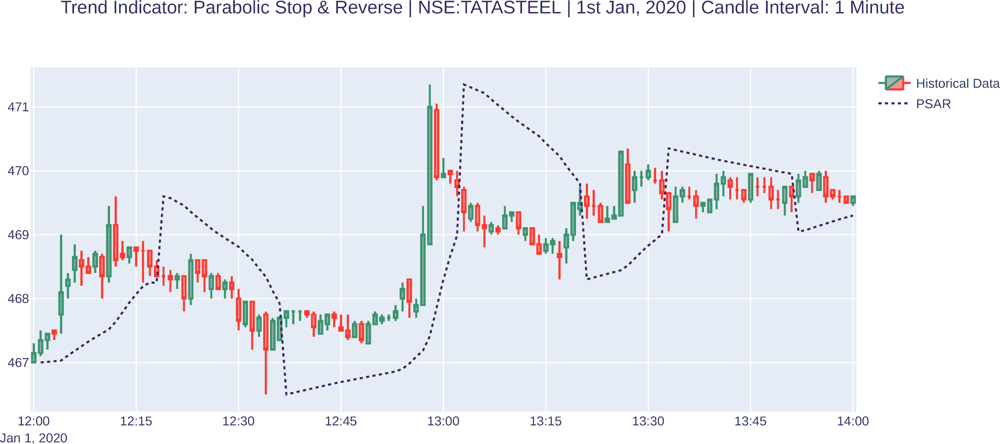
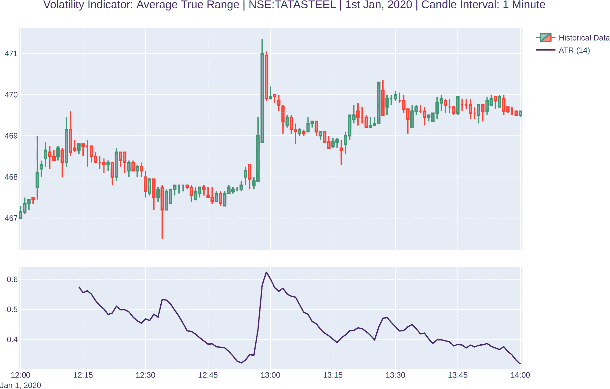
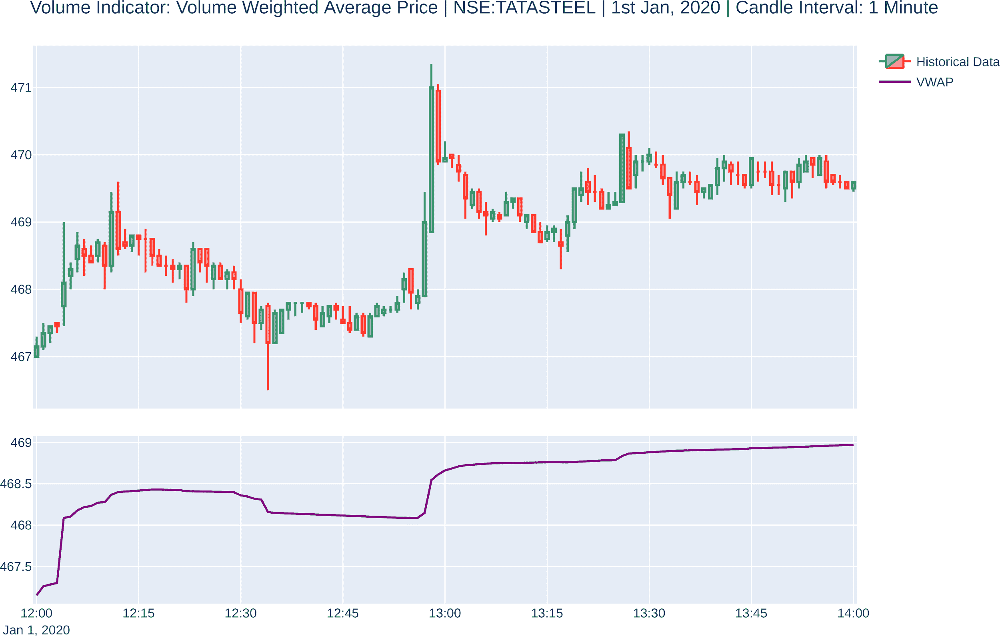

# 五、计算和绘制技术指标

技术分析是交易中的一门学科，它使用数学函数，称为技术指标，来预测和发现股票市场中的盈利机会。技术指标根据金融工具过去和现在的价格和交易量来分析数据，并给出统计信息。这有助于预测金融工具的未来价格走向(上涨或下跌)。有了这些知识，作为交易者，你可以在交易时做出明智的决定，从而增加成功的几率。

技术指标不考虑基础金融工具业务的任何基本方面，如收入、收益、利润等。然而，它们确实考虑了过去和现在的价格和数量，这有助于预测短期价格变动。

大多数经纪人实时提供叠加在历史数据图上的技术指标图。这有助于直观地预测价格走势。但是，仅进行可视化分析有一些限制:

*   您一次只能查看和分析少数几个图表，而您可能希望分析成千上万个图表来帮助搜索有利可图的机会。
*   直观地分析多个图表是乏味的，并且容易受到延迟和人为错误的影响。当我们想立即准确地抓住一个好的交易机会时，延迟和错误是不可行的。

因此，最好让计算机实时分析大量金融工具的历史数据。出于这个原因，学会使用历史数据计算给定金融工具的技术指标是很重要的。本章介绍了使用 Python 计算各种技术指标的代码。

有些情况下，您可能想要绘制复杂的图表。然而，使用大多数经纪人提供的工具可能无法做到这一点。例如，您可能希望在历史数据收盘时的**相对强弱指数** ( **RSI** )上绘制一个**简单移动平均线** ( **SMA** )(数学上，这是 *SMA(RSI(收盘，时间周期=10)，时间周期=5)* )，并在一段时间内(比如说 3 个月)对其进行分析，以帮助您制定交易策略。在这种情况下，了解如何为给定的金融工具绘制技术指标会有所帮助。本章的配方还包括使用 Python 绘制技术指标的代码。

每个技术指标都属于下面提到的两个类别之一:

*   **领先**:这类指标在趋势即将开始或反转即将发生时给出交易信号。换句话说，他们*引领*潮流。因此，这些指标有助于预测未来的趋势。(如果价格上涨，趋势可能是**看涨**，如果价格下跌，趋势可能是**看跌**。)
*   滞后指标:这类指标在趋势开始或反转发生后给出交易信号。所以，这些指标有助于发现当前的趋势。

根据技术指标的洞察力，技术指标也可以大致分为四种类型:

*   **趋势指标** **或振荡指标**:这些指标表明市场的趋势，如果有趋势的话。这些指标也被称为**振荡器**，因为它们经常随着时间在高低值之间振荡，就像振荡波一样。这样的指标通常*滞后*，但有时也可能*领先*。
*   动量指标:这些指标告诉我们当前的趋势有多强，以及当前趋势是否可能发生逆转。这些指标通常是*领先*指标。
*   **波动指标**:这些指标衡量价格运动的变化率，与方向无关(即**看跌**或**看涨**)。这些指标帮助我们了解价格变化的快慢。波动剧烈的市场可能对你的交易策略不利，因为当你查询市场并在某一特定价格下单时，价格可能已经大大偏离了指定价格。这些指示器通常是滞后的指示器。
*   **音量指示器**:这些是指示音量随时间变化快慢的指示器。成交量越高，当前趋势越强，所以这些指标有助于发现当前趋势的强度。这些指标既可以是*领先*，也可以是*滞后*。

本章讨论了前面提到的所有类别和类型的 10 个技术指标。每个配方都有以下功能:

1.  引入了新的技术指标
2.  展示了如何使用 Python 对给定的历史数据进行计算
3.  展示了如何使用 Python 在日本烛台模式图上绘制它
4.  解释图中指标提供的洞察力

在本章中，我们将介绍以下配方:

*   趋势指标-简单移动平均线
*   趋势指标–指数移动平均线
*   趋势指标-移动平均收敛背离
*   趋势指示器-抛物线停止和反转
*   动量指标——相对强度指数
*   动量指标——随机振荡器
*   波动指标–布林线
*   波动指标–平均真实范围
*   音量指示器-平衡音量
*   数量指标-数量加权平均价格

本章的主要重点是演示如何计算和绘制最常用的技术指标。虽然每个技术指标在每个食谱的开头都有介绍，但是深入理解它们已经超出了本书的范围。如果你对此感兴趣，请参考知名人士的作品，如杰克·施瓦格、马丁·普林、约翰·墨菲、史蒂夫·尼森和托马斯·布尔考斯基等。你也可以使用广为接受的网络资源，比如 https://www.investopedia.com/。

# 技术要求

要成功执行本章中的配方，您需要具备以下条件:

*   Python 3.7+版本
*   以下 Python 包:
*   `pyalgotrading` ( `$ pip install pyalgotrading`)
*   `TA-Lib` ( `$ pip install TA-Lib`)

如果您在安装`TA-Lib`时遇到错误，这主要是由于缺少依赖项。您可以按照以下说明解决问题:

*   **对于 Mac OS X，使用以下**:

```py
$ brew install ta-lib
```

*   **对于 Windows，使用以下说明**:

你可以根据你的 Windows build (32 位/64 位)和 Python 版本从[https://www.lfd.uci.edu/~gohlke/pythonlibs/#ta-lib](https://www.lfd.uci.edu/~gohlke/pythonlibs/#ta-lib)安装最新的`TA-Lib`二进制。因此，例如，站点上的这个链接[TA _ Lib-0 . 4 . 18 cp38 cp38 win _ amd64 . whl](https://download.lfd.uci.edu/pythonlibs/w3jqiv8s/TA_Lib-0.4.18-cp39-cp39-win_amd64.whl)，是针对`TA-Lib`版本 0.4.18 ( `TA_Lib-0.4.18`)和 Python 版本 3.8 ( `cp38`)，并且是 Windows 64 位兼容的(`win_amd64`)。

*   **对于 Linux，采取以下步骤**:

从[http://pr downloads . SourceForge . net/ta-lib/ta-lib-0 . 4 . 0-src . tar . gz](http://prdownloads.sourceforge.net/ta-lib/ta-lib-0.4.0-src.tar.gz)下载`gzip`文件，并从您的 Linux 终端运行以下命令:

1.  提取下载的包含`TA-Lib`源代码的`gzip`文件:

```py
$ tar -xzf ta-lib-0.4.0-src.tar.gz 
```

2.  将您当前的工作目录更改为提取的文件夹:

```py
$ cd ta-lib/
```

3.  运行`configure`命令为您的机器配置`TA-Lib`:

```py
$ ./configure --prefix=/usr 
```

4.  运行`make`命令，从下载的源代码构建`TA-Lib`:

```py
$ make
```

5.  运行`install`命令将构建的可执行文件和库安装到机器上的特定目录:

```py
$ sudo make install
```

如果这没有帮助，你仍然得到错误，请参考在[https://github.com/mrjbq7/ta-lib#dependencies](https://github.com/mrjbq7/ta-lib#dependencies)的官方`TA-Lib` GitHub 页面。

本章最新的 Jupyter 笔记本可以在 GitHub 上找到，网址为[https://GitHub . com/packt publishing/Python-algorithm-Trading-Cookbook/tree/master/chapter 05](https://github.com/PacktPublishing/Python-Algorithmic-Trading-Cookbook/tree/master/Chapter05)。

建议您在 Jupyter 笔记本上尝试本章的食谱。所有的食谱都有一个输出图。您可以使用 Jupyter Notebook 中的选择、平移、缩放等功能方便地与这些图进行交互。

设置与代理的连接所需的第一件事是获取 API 密钥。代理将向每个客户提供唯一的密钥，通常是一对`api-key`和`api-secret`密钥。这些 API 密钥是收费的，通常是按月订阅的。在开始之前，你需要从经纪人网站获得你的`api-key`和`api-secret`副本。更多细节可以参考*附录一*。

以下步骤将帮助您导入必要的模块，设置与 Zerodha 的代理连接，并获取和保存一些历史数据，本章中的所有食谱都将用到这些数据。在尝试任何食谱之前，请确保您遵循了以下步骤:

1.  导入必要的模块:

```py
>>> import pandas as pd
>>> import talib
>>> from pyalgotrading.broker.broker_connection_zerodha import BrokerConnectionZerodha
>>> from pyalgotrading.utils.func import plot_candlesticks_chart, PlotType
```

这些模块将贯穿本章。

每个配方中都使用了`plot_candlesticks_chart`功能。它采用以下参数:

*   `data`:要绘制的历史数据，应该是一个`pandas.DataFrame`对象，有`timestamp`、`open`、`high`、`low`、`close`列。
*   `plot_type`:指定烛台模式图表类型的`pyalgotrading.plot_type`枚举类的实例。
*   `indicators`(可选):字典列表，指定应该与烛台模式图一起绘制的指示器。每个`dict`应该有以下键值对:
*   `name`:图例的绘图名称
*   `data`:表示要绘制的指标数据的`pandas.Series`对象
*   `extra`(可选):属性的`dict`，它将被传递给`plotly.graph_objects.Scatter`构造函数(关于这个类的更多信息可以在[https://plot . ly/python-API-reference/generated/plot ly . graph _ objects 找到。Scatter.html](https://plot.ly/python-api-reference/generated/plotly.graph_objects.Scatter.html)
*   `plot_indicators_separately`(可选):如果`False`，指标将与历史数据绘制在同一个图上。如果`True`，指标将单独标绘。默认值为`False`。
*   `caption`(可选):给绘图添加一个字符串标题。

2.  从代理获取`api_key`和`api_secret`密钥。这些是您独有的，经纪人将使用它们来识别您的 Demat 帐户:

```py
>>> api_key = "<your-api-key>"
>>> api_secret = "<your-api-secret>"
>>> broker_connection = BrokerConnectionZerodha(api_key, 
                                                api_secret)
```

我们得到以下输出:

```py
Installing package kiteconnect via pip. This may take a while...
Please login to this link to generate your request token: https://kite.trade/connect/login?api_key=<your-api-key>&v=3
```

如果您是第一次运行此程序，并且没有安装`kiteconnect`，则`pyalgotrading`会自动为您安装。*步骤 2* 的最终输出将是一个链接。点击链接并使用您的 Zerodha 凭据登录。如果认证成功，您将在浏览器的地址栏中看到类似于`https://127.0.0.1/?request_token=<aplphanumeric-token>&action=login&status=success`的链接，例如`https://127.0.0.1/?request_token=H06I6Ydv95y23D2Dp7NbigFjKweGwRP7&action=login&status=success`。

3.  复制字母数字标记并粘贴到`request_token`:

```py
>>> request_token = "<your-request-token>"
>>> broker_connection.set_access_token(request_token)
```

4.  获取并打印仪器的历史数据，并将其分配给`historical_data`:

```py
>>> instrument = broker_connection.get_instrument('NSE', 
                                                  'TATASTEEL')
>>> historical_data = \
        broker_connection.get_historical_data(
                                instrument=instrument, 
                                candle_interval='minute', 
                                start_date='2020-01-01 12:00:00', 
                                end_date='2020-01-01 14:00:00')
>>> historical_data
```

我们得到以下输出:

```py
                    timestamp   open   high    low  close volume
  0 2020-01-01 12:00:00+05:30 467.00 467.30 467.00 467.15   5694
  1 2020-01-01 12:01:00+05:30 467.15 467.50 467.10 467.35  10852
  2 2020-01-01 12:02:00+05:30 467.35 467.45 467.20 467.45   4171
  3 2020-01-01 12:03:00+05:30 467.50 467.50 467.35 467.45   2897
...                       ...    ...    ...    ...    ...    ...
117 2020-01-01 13:57:00+05:30 469.70 469.70 469.55 469.60   9442
118 2020-01-01 13:58:00+05:30 469.60 469.70 469.50 469.60   7609
119 2020-01-01 13:59:00+05:30 469.60 469.60 469.50 469.50   8155
120 2020-01-01 14:00:00+05:30 469.50 469.60 469.45 469.60   6973
```

这一步使用`BrokerConnectionZerodha`类的`get_instrument()`方法获取一个乐器，并将其分配给一个新属性`instrument`。这个对象是`Instrument`类的一个实例。调用`get_instrument`所需的两个参数是交易所(`'NSE'`)和交易符号(`'TATASTEEL'`)。接下来，使用`get_historical_data()`方法获取并打印`instrument`的历史数据。该方法有四个参数，描述如下:

*   `instrument` ( `Instrument`):由`broker_connection`的`get_instrument()`方法返回的对象。
*   `candle_interval` ( `str`):有效字符串，表示历史数据中每个蜡烛线的持续时间。可能的值有`'minute'`、`'3minute'`、`'5minute'`、`'10minute'`、`'15minute'`、`'30minute'`、`'60minute'`和`'day'`。我们在*步骤 4* 中将`'minute'`传递给这个参数。
*   `start_date` ( `str`):从该时间戳开始提取历史数据。在*步骤 4* 中，我们将`'2020-01-01 12:00:00'`传递给这个论点。
*   `end_date` ( `str`):将提取到该时间戳的历史数据。在*步骤 4* 中，我们将`'2020-01-01 14:00:00'`传递给这个论点。

在这一章中需要用到`historical_data`对象。

`pyalgotrading`包支持多个代理，并使用相同的方法为每个代理提供一个连接对象类。它在一个统一的接口后面抽象了代理 API，所以你不需要担心底层的代理 API 调用，可以直接使用本章中的所有方法。只有建立代理连接的过程会因代理而异。如果您没有使用 Zerodha 作为您的代理，您可以参考`pyalgotrading`文档来获得关于设置代理连接的信息。对于 Zerodha 用户来说，前面提到的步骤就足够了。

# 趋势指标-简单移动平均线

SMA 是一个**滞后趋势指标**。它通过消除噪声来平滑价格数据，从而识别趋势。

SMA 是均线最简单的形式。每个输出值是历史数据的前 *n* 个值的平均值。可以定义 *n* 的值，也叫**时间段**。在 SMA 中，时间段内的每个值都具有相同的权重，时间段之外的值不包括在内。这使得它对最近的数据变化的反应不如以前的数据变化，因此对平滑价格数据很有用。SMA 连续上涨表明明显的看涨趋势，而连续下跌表明**看跌**趋势。因此，它是一个**趋势指示器**。此外，由于它在开始后指示趋势，所以它是一个**滞后指示器**。

SMA 广泛应用于技术分析。它还用于计算其他技术指标，或者与自身结合，或者与其他指标结合，具有相同或不同的时间段。

SMA 的计算公式如下:


( *n > = 1* )，这里 *n* 是时间段，必须由用户定义。

虽然了解这背后的数学原理是个好主意，但是这个食谱并不要求你理解或记住给定的公式。我们使用第三方 Python 包`talib`，它提供了计算 SMA 的现成函数。

## 入门指南

确保您的 Python 命名空间具有以下对象:

1.  `talib`(包)
2.  `plot_candlesticks_chart`(功能)
3.  `PlotType`(枚举)
4.  `historical_data`(一个`pandas`数据帧)

参考本章的*技术要求*部分来设置这些对象。

## 怎么做…

我们将为此配方执行以下步骤:

1.  在`historical_data`计算形状记忆合金。将其分配给`sma_9`并打印:

```py
>>> sma_9 = talib.SMA(historical_data['close'], 
                      timeperiod=9)
>>> sma_9
```

我们得到以下输出:

```py
0             NaN
1             NaN
2             NaN
3             NaN
4             NaN
5             NaN
6             NaN
7             NaN
8      467.927778
9      468.100000
10     468.211111
11     468.400000
          ...    
117    469.738889
118    469.744444
119    469.716667
120    469.716667
```

2.  在`historical_data`上绘制`sma_9`:

```py
>>> indicators = [
    {
       'name': 'SMA 9',
       'data': sma_9,
       'extra': {
           'mode': 'lines',
           'line': {
               'color': 'gray'
            }
        }
    }
]
>>> plot_candlesticks_chart(data=historical_data,
                            plot_type=PlotType.JAPANESE, 
```

```py
                           indicators=indicators, 
                           caption='Trend Indicator: '
                           'Simple Moving Average | '
                           'NSE:TATASTEEL | '
                           '1st Jan, 2020 | '
                           'Candle Interval: 1 Minute')
```

我们得到以下输出:


绘制图表需要`plotly` Python 包([https://github.com/plotly/plotly.py](https://github.com/plotly/plotly.py))。如果您还没有安装它，`plot_candlesticks_chart`功能会为您安装它。

## 它是如何工作的...

`talib`包提供了一个现成的`talib.SMA`函数。我们在*步骤 1* 中使用它来计算`historical_data`上的 SMA，并将其分配给一个新属性`sma_9`。随着`historical_data`的闭合系列，该函数以`timeperiod`为参数，应该是一个`int`值。这里我们使用`9`作为参数。`sma_9`对象是一个`pandas.Series`对象。这在*步骤 1* 中打印。我们使用`plot_candlesticks_chart`功能在*步骤 2* 中的`historical_data`上绘制`sma_9`。

观察关于 SMA 指标值和图表的以下几点:

*   SMA 图缺少前八个时间戳值，因为输出值是`NaN`(索引从`0`开始，因此索引`0`到`7`是前八个值)。这是因为`talib.SMA`函数需要至少一个时间段的条目数来计算 SMA，在我们的例子中是`9`。从第九行开始，我们可以看到**简单移动平均值** ( **SMA** )的计算值和`historical_data`对象的相应时间戳。
*   SMA 随着价格的上涨而增加，随着价格的下跌而减少，尽管不是在下一个时间戳。
*   SMA 图的涨跌跟随相应价格的涨跌。因此，这是一个滞后指标。换句话说，它不能提前预测趋势结果。
*   SMA 图是平滑的，没有任何突然的尖峰，不像历史数据图。因此，SMA 经常被用来平滑价格。

# 趋势指标–指数移动平均线

均线是滞后的趋势指标。它通过消除噪声来平滑价格数据，从而识别趋势，并赋予最近值更多的权重。

EMA 技术指标的计算是累积的，包括所有权重递减的数据。过去的值对平均值的贡献较低，而最近的值的贡献较大。离数值越远，贡献越小。因此，均线是一种移动平均线，对数据的最近变化反应更快。

EMA 技术指标不同于 SMA 技术指标，在 SMA 技术指标中，时间周期内的每个值都具有相同的权重，时间周期之外的值不包括在计算中。

EMA 在技术分析中被广泛使用。它还用于计算其他技术指标，或者与自身结合，或者与其他指标结合，具有相同或不同的时间段。

计算 EMA 的递归公式如下:


(n >= 1)，这里， *n* 是**时间段**，必须由用户定义。 *K* 有时被称为**平滑**或**加权因子**。

虽然知道这是一个好主意，但这个食谱并不要求你理解或记住给定的公式。我们使用第三方 Python 包`talib`，它提供了计算 EMA 的现成函数。

## 入门指南

确保您的 Python 命名空间具有以下对象:

1.  `talib`(包)
2.  `plot_candlesticks_chart`(功能)
3.  `PlotType`(枚举)
4.  `historical_data`(一个`pandas`数据帧)

参考本章的*技术要求*部分来设置这些对象。

## 怎么做…

我们将为此配方执行以下步骤:

1.  在`historical_data`计算均线。将其分配给`ema_9`并打印:

```py
>>> ema_9 = talib.EMA(historical_data['close'], 
                      timeperiod=9)
>>> ema_9
```

我们得到以下输出:

```py
0             NaN
1             NaN
2             NaN
3             NaN
4             NaN
5             NaN
6             NaN
7             NaN
8      467.927778
9      468.082222
10     468.135778
11     468.338622
          ...    
117    469.728790
118    469.703032
119    469.662426
120    469.649941
```

2.  在`historical_data`上绘制`ema_9`:

```py
>>> indicators = [
    {
        'name': 'EMA 9',
        'data': ema_9, 
        'extra': {
            'mode': 'lines',
            'line': {
                'color': 'gray'
            }
        }
    }
]
>>> plot_candlesticks_chart(data=historical_data, 
                            plot_type=PlotType.JAPANESE, 
                            indicators=indicators, 
                            caption='Trend Indicator: '
                            'Exponential Moving Average | '
                            'NSE:TATASTEEL | '
                            '1st Jan, 2020 | '
                            'Candle Interval: 1 Minute')
```

我们得到以下输出:


## 它是如何工作的…

`talib`包提供了一个现成的`talib.EMA`函数。我们在*步骤 1* 中使用它来计算`historical_data`上的均线，并将其分配给新属性`ema_9`。随着`historical_data`的闭合系列，该函数以`timeperiod`为参数，应该是一个`int`值。这里我们使用`9`作为参数。`ema_9`对象是一个`pandas.Series`对象。这在*步骤 1* 中打印。我们使用`plot_candlesticks_chart`功能在*步骤 2* 中的`historical_data`上绘制`ema_9`。

观察关于 EMA 指标值和图表的以下几点:

*   EMA 图缺少前八个时间戳值，因为输出值是`NaN`(索引从`0`开始，所以索引`0`到`7`是前八个值)。这是因为`talib.EMA`函数需要至少一个时间段的条目数来计算 EMA，在我们的例子中是`9`。从第九行开始，我们可以看到 EMA 的计算，每个条目都是对应于`historical_data`对象的时间戳的 EMA。
*   均线随着价格上涨而上涨，随着价格下跌而下跌，紧跟价格。因此，这是一个趋势指标。
*   均线图的涨跌跟随相应价格的涨跌。因此，这是一个滞后指标。换句话说，它不能提前预测趋势结果。
*   EMA 图很平滑，没有任何突然的峰值，不像历史数据图。因此，均线被用来平滑价格。
*   EMA 图与来自*绘制趋势指标-简单移动平均线*配方的 SMA 图相比，显示 EMA 图比 SMA 图更接近价格趋势。这是因为 EMA 给最近的值更多的权重，不像 SMA，用于计算的每一位数据都有相等的权重。

关于`plot_candlesticks_chart`功能使用的更多信息，请参考本章*绘制趋势指标-简单移动平均线*配方的*工作原理……*部分。

# 趋势指标-移动平均收敛背离

**移动平均线收敛发散**(**)是一个滞后的趋势指标。MACD 有三个部分:MACD 线、MACD 信号和 MACD 柱状图。MACD 线有助于识别趋势变化，因为它标志着一个新趋势方向的开始。MACD 线的大正值表明短均线比长均线大得多。这表明市场出现了*超买*状况，这意味着价格将会上涨。同样，MACD 线的大负值表明短均线比长均线小得多。这表明市场上存在*超卖*的情况，这意味着价格将会下跌。当 MACD 线在 MACD 信号上方交叉且为正时，产生**买入**信号；并且 MACD 线穿过 MACD 信号下方并变为负值，则产生一个**卖出**信号。**

 **计算 MACD 三个分量的公式如下:

*   MACD 线是两个不同时间段的均线之差——较短时间段的均线 *m* 和较长时间段的均线 *n* :


*   MACD 信号是 MACD 线的均线，时间周期为 *p* :


*   MACD 直方图是 MACD 线和 MACD 信号之间的差异:


MACD 线的时间周期通常用`12` ( *m* )和`26` ( *n* )表示，MACD 信号的时间周期通常用`9` ( *p* )表示。

虽然知道这是一个好主意，但这个食谱并不要求你理解或记住给定的公式。我们使用第三方 Python 包`talib`，它提供了计算 MACD 的现成函数。

## 入门指南

确保您的 Python 命名空间具有以下对象:

1.  `talib`(包)
2.  `pd`(模块)
3.  `plot_candlesticks_chart`(功能)
4.  `PlotType`(枚举)
5.  `historical_data`(一个`pandas`数据帧)

参考本章的*技术要求*部分来设置这些对象。

## 怎么做…

我们将为此配方执行以下步骤:

1.  在`historical_data`计算 MACD。分配给`macd_line`、`macd_signal`和`macd_historgram`。另外，打印它:

```py
>>> macd_line, macd_signal, macd_histogram = \
                            talib.MACD(historical_data['close'],
                                       fastperiod=12,
                                       slowperiod=26,
                                       signalperiod=9)
>>> pd.DataFrame({
    'Line': macd_line,
    'Signal': macd_signal, 
    'Histogram': macd_histogram
})
```

我们得到以下输出:

```py
        Line   Signal Histogram
0        NaN      NaN       NaN
1        NaN      NaN       NaN
2        NaN      NaN       NaN
3        NaN      NaN       NaN
4        NaN      NaN       NaN
...      ...      ...       ...
116 0.075136 0.087038  -0.011901
117 0.057580 0.081146  -0.023566
118 0.043170 0.073551  -0.030381
119 0.023410 0.063523  -0.040113
120 0.015639 0.053946  -0.038307
```

2.  剧情`macd_line`、`macd_signal`、`macd_histogram`，以及`historical_data`:

```py
>>> indicators = [
    {
        'name': 'MACD Line',
        'data': macd_line,
        'extra': {
            'mode': 'lines',
            'line': {
                'width': 1
            }
        }
    },
    {
        'name': 'MACD Signal',
        'data': macd_signal,
        'extra': {
            'mode': 'lines',
            'line': {
                'width': 1
            }
        }
    },
    {
        'name': 'MACD Histogram',
        'data': macd_histogram,
        'extra': {
            'mode': 'lines',
            'line': {
                'dash': 'dot',
                'width': 2
            }
        }
    }
]

>>> plot_candlesticks_chart(data=historical_data, 
                            plot_type=PlotType.JAPANESE, 
                            indicators=indicators,
                            plot_indicators_separately=True, 
                            caption='Trend Indicator: Moving '
                            'Average Convergence/Divergence | '
                            'NSE:TATASTEEL | '
                            '1st Jan, 2020 | '
                            'Candle Interval: 1 Minute', 
                            plot_height=700)
```

我们得到以下输出:


## 它是如何工作的…

`talib`包提供了一个现成的`talib.MACD`函数。我们在*步骤 1* 中使用它来计算`historical_data`上的 MACD。随着`historical_data`的关闭系列，该函数以`fastperiod`、`slowperiod`、`signalperiod`为参数，它们都应该是`int`类型的对象。我们在这里使用`26`、`12`和`9`作为各自的参数。`talib.MACD`函数返回三个`pandas.Series`对象，我们将它们分配给新的属性:`macd_line`、`macd_signal`和`macd_histogram`。这三个对象连接成一个`pandas.DataFrame`对象，并在*步骤 1* 中打印。我们使用`plot_candlesticks_chart`功能在*步骤 2* 中绘制`macd_line`、`macd_signal`和`macd_histogram`以及`historical_data`。

关于 MACD 指标值和图表，请注意以下几点:

*   MACD 图对于前 34 个时间戳值是缺失的，并且仅在第 35 个<sup xmlns:epub="http://www.idpf.org/2007/ops">时间戳开始出现。这是因为第一个长均线数据需要 26 个数据点(短均线数据出现在前 12 个数据点)，其中 9 个数据点是 MACD 信号出现的时间。所以，26 + 9 是 35 个数据点。</sup>
*   当价格上涨时，MACD 线是负数，当价格下跌时，它是正数。因此，这是一个趋势指标。
*   MACD 线图的涨跌跟随相应价格的涨跌。因此，这是一个滞后指标。换句话说，它不能提前预测趋势结果。
*   与历史数据图不同，MACD 线图是平滑的，没有任何突然的尖峰。MACD 信号更平滑，因为它是 MACD 线的均线。
*   当 MACD 直方图为正时，趋势是看涨的，这意味着价格在上涨。当 MACD 直方图为负时，趋势是**看跌**，这意味着价格在下跌。

关于`plot_candlesticks_chart`功能的使用，请参考本章*绘制趋势指标-简单移动平均线*配方的*工作原理……*部分。

# 趋势指示器-抛物线停止和反转

抛物线**停止和反转** ( **SAR** )是领先趋势指标。

抛物线 SAR 计算每个数据点的跟踪止损。由于数据点是止损点，当有趋势时，它们远离价格，在趋势反转时穿过价格线。抛物线 SAR 将两个参数作为输入:点`acceleration factor`和点`maximum`。

计算抛物线 SAR 的公式并不简单，因此在此不再提及。如果你对底层数学感兴趣，请参考在 http://www.tadoc.org/indicator/SAR.htm[的`TA-Lib`关于抛物线 SAR 的官方文档。虽然知道这是一个好主意，但这个食谱并不要求你理解或记住给定的公式。我们使用第三方 Python 包`talib`，它提供了计算抛物线 SAR 的现成函数。](http://www.tadoc.org/indicator/SAR.htm)

## 入门指南

确保您的 Python 命名空间具有以下对象:

1.  `talib`(包)
2.  `plot_candlesticks_chart`(功能)
3.  `PlotType`(枚举)
4.  `historical_data`(一个`pandas`数据帧)

参考本章的*技术要求*部分来设置这些对象。

## 怎么做…

我们将为此配方执行以下步骤:

1.  计算`historical_data`上的抛物线 SAR。将其分配给`psar`并打印:

```py
>>> psar = talib.SAR(historical_data['high'], 
                     historical_data['low'], 
                     acceleration=0.02, 
                     maximum=0.2)
>>> psar
```

我们得到以下输出:

```py
0             NaN
1      467.000000
2      467.010000
3      467.019800
4      467.029404
          ...    
116    469.175426
117    469.208409
118    469.240073
119    469.270470
120    469.299651
```

2.  在`historical_data`上绘制`psar`:

```py
>>> indicators = [
    {
        'name': 'PSAR',
        'data': psar,
        'extra': {
            'mode': 'lines',
            'line': {
                'dash': 'dot',
                'width': 2,
                'color': 'purple'
            }
        }
    }
]

>>> plot_candlesticks_chart(data=historical_data, 
                            plot_type=PlotType.JAPANESE,
                            indicators=indicators,
                            caption='Trend Indicator: '
                            'Parabolic Stop and Reverse | '
                            'NSE:TATASTEEL | '
                            '1st Jan, 2020 | '
                            'Candle Interval: 1 Minute')
```

我们得到以下输出:



## 它是如何工作的…

`talib`包提供了一个现成的`talib.SAR`函数。我们在*步骤 1* 中使用它来计算`historical_data`上的抛物线 SAR，并将其分配给一个新属性`psar`。随着`historical_data`的高低系列，这个函数以`acceleration`和`maximum`为参数，两者都应该是`float`类型的对象。我们在这里使用`0.02`和`0.2`作为各自的参数。`psar`对象是一个`pandas.Series`对象。这在*步骤 1* 中打印。我们使用`plot_candlesticks_chart`功能在*步骤 2* 中绘制`psar`和`historical_data`。

观察关于抛物线 SAR 指示器值和图表的以下几点:

*   抛物线 SAR 被绘制为离散点，因为每个点代表止损。止损点每次都在变。所以，是*尾随*止损。
*   当抛物线 SAR 图低于 OHLC 图时，趋势为**看涨**，当抛物线 SAR 图高于 OHLC 图时，趋势为**看跌**。因此，这是一个趋势指标。

关于`plot_candlesticks_chart`功能使用的更多信息，请参考本章*绘制趋势指标-简单移动平均线*配方的*工作原理……*部分。

# 动量指标——相对强度指数

RSI 是领先的动量指标。RSI 是最近价格上升运动与绝对价格运动的比率。RSI 总是在`0`和`100`之间。它可以被解释为当价格高于`70`时表示超买，当价格低于`30`时表示超卖。当价格创出新高或新低时，RSI 显示反转。

计算 RSI 的公式并不简单，因此在此不再提及。如果你对基础数学感兴趣，请参考在 http://www.tadoc.org/indicator/RSI.htm[的官方文档`TA-Lib`。虽然知道这是一个好主意，但这个食谱并不要求你理解或记住给定的公式。我们使用第三方 Python 包`talib`，它提供了计算 RSI 的现成函数。](http://www.tadoc.org/indicator/RSI.htm)

## 入门指南

确保您的 Python 命名空间具有以下对象:

1.  `talib`(包)
2.  `plot_candlesticks_chart`(功能)
3.  `PlotType`(枚举)
4.  `historical_data`(一个`pandas`数据帧)

参考本章的*技术要求*部分来设置这些对象。

## 怎么做…

我们将为此配方执行以下步骤:

1.  计算`historical_data`上的 RSI。将其分配给`rsi_14`并打印:

```py
>>> rsi_14 = talib.RSI(historical_data['close'], 
                       timeperiod=14)
>>> rsi_14
```

我们得到以下输出:

```py
0            NaN
1            NaN
2            NaN
3            NaN
          ...
12           NaN
13           NaN
14     70.886076
15     69.932757
16     69.932757
17     64.873530
18     61.976413
         ...    
116    48.449209
117    48.449209
118    48.449209
119    45.997672
120    48.788323
```

2.  沿着`historical_data`绘制`rsi_14`:

```py
>>> indicators = [
    {
        'name': 'RSI (14)', 
        'data': rsi_14,
        'extra': {
            'mode': 'lines',
            'line': {
                'width': 2,
                'color': 'purple'
            }
        }
    }
]

>>> plot_candlesticks_chart(data=historical_data, 
                            plot_type=PlotType.JAPANESE, 
                            indicators=indicators, 
                            plot_indicators_separately=True,
                            caption='Momentum Indicator: '
                            'Relative Strength Index | '
                            'NSE:TATASTEEL | '
                            '1st Jan, 2020 | '
                            'Candle Interval: 1 Minute')
```

我们得到以下输出:


## 它是如何工作的…

`talib`包提供了一个现成的`talib.RSI`函数。我们在*步骤 1* 中使用它来计算`historical_data`上的 RSI，并将其分配给一个新属性`rsi_14`。随着`historical_data`的闭合系列，该函数以`timeperiod`为参数，应该是一个`int`值。这里我们使用`14`作为参数。`rsi_14`对象是一个`pandas.Series`对象。这在*步骤 1* 中打印。我们使用`plot_candlesticks_chart`功能在*步骤 2* 中的`historical_data`上绘制`rsi_14`。

观察关于 RSI 指标值和图表的以下几点:

*   输出中的前 13 个值是`NaN`(索引从`0`开始，因此索引`0`到`12`是前 13 个值)，因为该函数需要至少一个时间段的条目数来计算 RSI，在我们的例子中是`14`。从第 14 <sup xmlns:epub="http://www.idpf.org/2007/ops">行开始，我们可以看到计算出的 RSI，每个条目都是对应于`historical_data`对象时间戳的 RSI。</sup>

*   RSI 总是在`0`和`100`之间。
*   对于给定的图，价格在下午 12:45 到 1:00 之间突然达到峰值，RSI 在`70`上方移动。因此，它正确地指示了一个*超买*状态。此外，因为它表明了价格运动的强度，所以它是一个动量指标。

关于`plot_candlesticks_chart`功能使用的更多信息，请参考本章*绘制趋势指标-简单移动平均线*配方的*工作原理……*部分。

# 动量指标——随机振荡器

随机振荡指标是领先的动量指标。它也被简称为 **STOCH** 。斯托奇比较了最近的收盘价和最近的交易区间。*快速 K* 是一个比值，其值在`0`和`100`之间。*快 K* 会有杂乱无章的移动，因此使用移动平均来平滑，这就是*慢 K* 。*慢 K* 使用另一个移动平均线进一步平滑，该移动平均线是*慢 D* 。超过`75`的*慢 K 值*表示超买状态，而低于`25`的值表示超卖状态。当*慢 K* 穿越*慢 D* 上方时，视为**买入**信号。同样，当*慢 K* 穿越*慢 D* 下方时，被认为是**卖出**信号。

计算 STOCH 的公式如下:


**MA** 代表**移动平均线**，可以是 SMA 也可以是 EMA。对于这个食谱，我们使用了 SMA。这个公式需要三个时间段:其中一个是 *n* ，另外两个是 MAs 的时间段。我们分析数据的范围由 *n* 定义。

虽然知道这是一个好主意，但这个食谱并不要求你理解或记住给定的公式。我们使用第三方 Python 包`talib`，它提供了计算 STOCH 的现成函数。

## 入门指南

确保您的 Python 命名空间具有以下对象:

1.  `talib`(包)
2.  `pd`(模块)
3.  `plot_candlesticks_chart`(功能)
4.  `PlotType`(枚举)
5.  `historical_data`(一个`pandas`数据帧)

参考本章的*技术要求*部分来设置这些对象。

## 怎么做…

我们将为此配方执行以下步骤:

1.  计算`historical_data`上的随机振子。分配给`slowk`和`slowd`。另外，打印它:

```py
>>> slowk, slowd = talib.STOCH(historical_data['high'], 
                               historical_data['low'], 
                               historical_data['close'], 
                               fastk_period=5, 
                               slowk_period=3, 
                               slowk_matype=0, 
                               slowd_period=3, 
                               slowd_matype=0)
>>> pd.DataFrame({
    'Slow K': slowk, 
    'Slow D': slowd
})
```

我们得到以下输出:

```py
       Slow K    Slow D
  0       NaN       NaN
  1       NaN       NaN
  2       NaN       NaN
  3       NaN       NaN
  4       NaN       NaN
  5       NaN       NaN
  6       NaN       NaN
  7       NaN       NaN
  8 70.514283 69.296302
  9 71.113411 70.921500
 10 61.606578 67.744757
 11 67.613252 66.777747
 12 52.662272 60.627367
...       ...       ...
116 63.626374 77.374847
117 44.102564 64.420024
118 20.000000 42.576313
119 13.333333 25.811966
120 15.757576 16.363636
```

2.  剧情`slowk`和`slowd`，还有`historical_data`:

```py
>>> indicators = [
    {
        'name': 'Slow K',
        'data': slowk, 
        'extra': {
            'mode':'lines', 
            'line': {
                'width': 2
            }
        }
    },
    {
        'name': 'Slow D',
        'data': slowd, 
        'extra': {
            'mode': 'lines',
            'line': {
                'width': 2
            }
        }
    }
]

>>> plot_candlesticks_chart(data=historical_data, 
                            plot_type=PlotType.JAPANESE, 
                            indicators=indicators, 
                            plot_indicators_separately=True, 
                            caption='Trend Indicator: '
                            'Stochastic Oscillator (Slow) | '
                            'NSE:TATASTEEL | '
                            '1st Jan, 2020 | '
                            'Candle Interval: 1 Minute', 
                            plot_height=700)
```

我们得到以下输出:


## 它是如何工作的…

`talib`包提供了一个现成的`talib.STOCH`函数。我们在*步骤 1* 中使用这个来计算`historical_data`上的随机振荡器。除了`historical_data`的高、低和收盘系列，该功能还采用以下参数:

*   `fastk_period` ( `int`):我们分析数据的范围。在这里，我们把这个值作为`5`。

*   `slowk_period` ( `int`):在*快 K* 上计算移动平均线的时间段。在这里，我们把这个值作为`3`。

*   `slowk_matype` ( `int`):移动平均线类型。值`0`表示 SMA，`1`表示 EMA。在这里，我们把这个值作为`0`。

*   `slowd_period` ( `int`):在*慢 K* 上计算移动平均线的时间段。在这里，我们把这个值作为`3`。

*   `slowd_matype` ( `int`):移动平均线类型。值`0`表示 SMA，`1`表示 EMA。在这里，我们把这个值作为`0`。

`talib.STOCH`函数返回两个`pandas.Series`对象，我们将它们分配给新的属性:`slowk`和`slowd`。这两个对象连接成一个`pandas.DataFrame`对象，并在*步骤 1* 中打印。我们使用`plot_candlesticks_chart`函数在*步骤 2* 中绘制`slowk`和`slowd`以及`historical_data`。

请注意以下关于 STOCH 指标值和图表的几点:

*   输出中的前八个值是`NaN`(索引从`0`开始，所以索引`0`到`7`是前八个值)。那是因为需要前五个值才能得到一个*快 K* ，三个*快 K* 才能得到一个*慢 K* ，三个*慢 K* 才能得到一个*慢 D* 。所以，那就是 5 + (3 - 1) + (2 - 1) = 9。(我们减去`1`两次，因为上一次计算的最后一个值是下一次计算的第一个值，所以已经计算过一次了。)从第九行开始，我们可以看到*慢速 K* 和*慢速 D* 的计算值以及`historical_data`对象的相应时间戳。
*   *慢 K* 和*慢 D* 值始终在`0`和`100`之间。

*   *慢 K* 和*慢 D* 图的涨跌，大部分时间都是跟随相应价格的涨跌，在晚上 12:45 以后的图中尤为明显，因此是先行指标。换句话说，它提前预测了趋势结果。
*   因为它是领先指标，所以对价格的反应很快。这通常会导致错误的信号，正如在下午 12:30 到 12:45 之间的曲线图中可以看到的那样。(为了保护自己免受这些情况的影响，你可以在策略中使用更多的指标来获得趋势或反转的额外确认。)

# 波动指标–布林线

布林线是一个滞后的波动指标。布林线由三条线或带组成——中间的**带**、**下带**和**上带**。当价格波动性高时，波段之间的差距扩大，当价格波动性低时，差距缩小。

布林线是超买或超卖的指标。当价格在高波段或低波段附近时，该指标预测反转即将发生。中间带作为支撑位或阻力位。

上波段和下波段也可以解释为价格目标。当价格从上波段反弹并穿过中波段时，下波段成为价格目标，反之亦然。

计算布林线的公式如下。

布林线将**典型价格** ( **TP** )定义为蜡烛线最高价、最低价和收盘价的平均值。TP 用于计算中间波段、较低波段和较高波段:


中间的带是 TP 的 SMA:


上带和下带是中间带上下标准差的整数( *F* )。 *F* 的典型值为 2:


虽然知道这是一个好主意，但这个食谱并不要求你理解或记住给定的公式。我们使用第三方 Python 包`talib`，它提供了计算布林线的现成函数。

## 入门指南

确保您的 Python 命名空间具有以下对象:

1.  `talib`(包)
2.  `pd`(模块)
3.  `plot_candlesticks_chart`(功能)
4.  `PlotType`(枚举)
5.  `historical_data`(一个`pandas`数据帧)

参考本章的*技术要求*部分来设置这些对象。

## 怎么做…

我们为此配方执行以下步骤:

1.  计算`historical_data`上的布林线。分配给`upperband`、`middleband`和`lowerband`。另外，打印它:

```py
>>> upperband, middleband, lowerband = talib.BBANDS(
                                        historical_data['close'], 
                                        timeperiod=5, 
                                        nbdevup=2, 
                                        nbdevdn=2, 
                                        matype=0)
>>> pd.DataFrame({
    'Upperband': upperband,
    'Middleband': middleband,
    'Lowerband': lowerband
})
```

我们得到以下输出:

```py
      Upperband Middleband   Lowerband
  0         NaN        NaN         NaN
  1         NaN        NaN         NaN
  2         NaN        NaN         NaN
  3         NaN        NaN         NaN
  4  468.138749     467.50  466.861251
...         ...        ...         ...
116  470.071661     469.83  469.588339
117  470.080666     469.78  469.479334
118  470.020666     469.72  469.419334
119  469.959839     469.65  469.340161
120  469.660000     469.58  469.500000
```

2.  在`historical_data`上绘制`upperband`、`middleband`、`lowerband`:

```py
>>> indicators = [
    {
        'name': 'Upperband',
        'data': upperband, 
        'extra': {
            'mode': 'lines', 
            'line': {
                'width': 1
            }
        }
    },
    {
        'name': 'Middleband',
        'data': middleband, 
        'extra': {
            'mode':'lines',
            'line': {
                'width': 1
            }
        }
    },
    {
        'name': 'Lowerband',
        'data': lowerband, 
        'extra': {
            'mode': 'lines',
            'line': {
                'width': 1
            }
        }
    }
]

>>> plot_candlesticks_chart(data=historical_data, 
                            plot_type=PlotType.JAPANESE, 
                            indicators=indicators, 
                            caption='Volatility Indicator: '
                            'Bollinger Bands | '
                            'NSE:TATASTEEL | '
                            '1st Jan, 2020 | '
                            'Candle Interval: 1 Minute')
```

我们得到以下输出:


## 它是如何工作的…

`talib`包提供了一个现成的`talib.BBANDS`函数。我们在*的第一步*中使用这个来计算`historical_data`的布林线。与`historical_data`的关闭系列一起，该功能采用以下参数:

*   `timeperiod` ( `int`):计算 TP 上 SMA 的时间段。TP 是最高价、最低价和收盘价的平均值。在这里，我们把这个值作为`5`。

*   `nbdevup` ( `int`):上限平均值的无偏标准偏差数。在这里，我们把这个值作为`2`。

*   `nbdevdn` ( `int`):较低波段平均值的无偏标准偏差数。在这里，我们把这个值作为`2`。

*   `matype` ( `int`):移动平均线类型。值`0`表示 SMA，`1`表示 EMA。在这里，我们把这个值作为`0`。

`talib.BBANDS`函数返回三个`pandas.Series`对象，我们将它们分配给新的属性:`upperband`、`middleband`和`lowerband`。这三个对象连接成一个`pandas.DataFrame`对象，并在*步骤 1* 中打印。我们使用`plot_candlesticks_chart`功能在*步骤 2* 中的`historical_data`上绘制`upperband`、`middleband`和`lowerband`。

观察布林线指标值和图表的以下几点:

*   输出中的前四个值是`NaN`(指数从`0`开始，所以指数`0`到`3`是前四个值)，因为`talib.BBANDS`函数需要至少一个时间段的条目数来计算布林线，在我们的例子中是`5`。从第五行开始，我们可以看到所有三个带的所有计算值以及对应的`historical_data`对象的时间戳。
*   波段的涨跌跟随相应价格的涨跌。因此，布林线是一个滞后指标。换句话说，他们不会提前预测趋势结果。
*   在下午 12:45 左右，我们可以看到谱带变窄了。这是因为当时波动性较低(价格变化率较低)。
*   在图中，就在下午 1 点之前，我们看到波段之间的差距急剧扩大。这是因为当时的高波动性(快速的价格变化率)。
*   大多数时候，当价格触及上波段时，它开始向下移动(相反的方向)。你可以用这些例子作为你的策略的**销售**信号。
*   大多数时候，当价格触及低波段时，它开始向上移动(相反的方向)。你可以用这些例子作为你策略的**买入**信号。

# 波动指标–平均真实范围

**平均真实区间** ( **ATR** )是一个滞后的波动指标。ATR 是衡量波动性的指标。高 ATR 值表示高挥发性，低值表示低挥发性。

计算 ATR 的公式并不简单，因此在此不再提及。如果你对底层数学感兴趣，请参考位于 http://www.tadoc.org/indicator/ATR.htm[的 ATR 官方文档`TA-Lib`。虽然知道这是一个好主意，但这个食谱并不要求你理解或记住给定的公式。我们使用第三方 Python 包`talib`，它提供了计算 ATR 的现成函数。](http://www.tadoc.org/indicator/ATR.htm)

## 入门指南

确保您的 Python 命名空间具有以下对象:

1.  `talib`(包)
2.  `pd`(模块)
3.  `plot_candlesticks_chart`(功能)
4.  `PlotType`(枚举)
5.  `historical_data`(一个`pandas`数据帧)

参考本章的*技术要求*部分来设置这些对象。

## 怎么做…

我们将为此配方执行以下步骤:

1.  计算`historical_data`的 ATR。将其分配给`atr_14`并打印:

```py
>>> atr_14 = talib.ATR(historical_data['high'], 
                       historical_data['low'], 
                       historical_data['close'], 
                       timeperiod=14)
>>> atr_14
```

我们得到以下输出:

```py
0           NaN
1           NaN
2           NaN
3           NaN
4           NaN
5           NaN
6           NaN
7           NaN
8           NaN
9           NaN
10          NaN
11          NaN
12          NaN
13          NaN
14     0.575000
15     0.555357
16     0.562117
17     0.550538
18     0.529071
         ...   
116    0.375902
117    0.359766
118    0.348354
119    0.330614
120    0.317713
```

2.  图`atr_14`，连同`historical_data`:

```py
>>> indicators = [
    {
        'name': 'ATR (14)',
        'data': atr_14,
        'extra': {
            'mode': 'lines',
            'line': {
                'width': 2,
                'color': 'purple'
            }
        }
    }
]

>>> plot_candlesticks_chart(data=historical_data,
                            plot_type=PlotType.JAPANESE,
                            indicators=indicators,
                            plot_indicators_separately=True, 
                            caption='Volatility Indicator: '
                            'Average True Range | '
                            'NSE:TATASTEEL | '
                            '1st Jan, 2020 | '
                            'Candle Interval: 1 Minute', 
                            plot_height=700)
```

我们得到以下输出:



## 它是如何工作的…

`talib`包提供了一个现成的`talib.ATR`函数。我们在*步骤 1* 中使用它来计算`historical_data`上的 ATR，并将其分配给一个新属性`atr_14`。随着`historical_data`的高、低、收盘系列，该函数以`timeperiod`为参数，应该是一个`int`值。这里我们使用`14`作为参数。`rsi_14`对象是一个`pandas.Series`对象。这在*步骤 1* 中打印。我们使用`plot_candlesticks_chart`功能在*步骤 2* 中的`historical_data`上绘制`atr_14`。

观察关于 ATR 指标值和图表的以下几点:

*   输出中的前 14 个值是`NaN`(索引从`0`开始，因此索引`0`到`13`是前 14 个值)，因为`talib.ATR`函数需要至少比时间段条目数多 1 的条目来计算 ATR，在我们的例子中是`14`。从第 15 <sup>行到第 15</sup>行，我们可以看到 ATR 的所有计算值和对应的`historical_data`对象的时间戳。

*   当波动性高时(价格快速变化)，ATR 开始增加。这可以在下午 1 点左右的图表中看到
*   当波动性低时(价格变化速度慢)，ATR 开始下降。这可以在图表的末尾看到。

# 音量指示器-平衡音量

**论成交量**(**)是领先的成交量指标。OBV 是上涨和下跌量的累计总和。当收盘价高于前一收盘价时，成交量被加到累计总数中，当收盘价低于前一收盘价时，成交量被从累计总数中减去。**

 **要解读 OBV，你可以观察 OBV 和价格的运动。如果价格在 OBV 之前变动，那么它就是一个未确认的变动。OBV 一系列上升的波峰或下降的波谷表明了一个强劲的趋势。如果 OBV 是平的，那么市场不是趋势。

计算 OBV 的公式如下:

*   如果*关闭>关闭<sub>-1</sub>T3，那么 *OBV = OBV <sub>-1</sub> +音量**
*   如果*关闭<关闭<sub>-1</sub>T3，那么 *OBV = OBV <sub>-1</sub> -音量**
*   如果*close = close<sub>-1</sub>T3，那么*OBV = OBV<sub>-1</sub>T7】**

虽然知道这是一个好主意，但这个食谱并不要求你理解或记住给定的公式。我们使用第三方 Python 包`talib`，它提供了计算 OBV 的现成函数。

## 入门指南

确保您的 Python 命名空间具有以下对象:

1.  `talib`(包)
2.  `pd`(模块)
3.  `plot_candlesticks_chart`(功能)
4.  `PlotType`(枚举)
5.  `historical_data`(一个`pandas`数据帧)

参考本章的*技术要求*部分来设置这些对象。

## 怎么做…

我们将为此配方执行以下步骤:

1.  计算`historical_data`上的 OBV。将其分配给`obv`并打印:

```py
>>> obv = talib.OBV(historical_data['close'], 
                    historical_data['volume'])
>>> obv
```

我们得到以下输出:

```py
0        5694.0
1       16546.0
2       20717.0
3       20717.0
4      211302.0
         ...   
116    406508.0
117    406508.0
118    406508.0
119    398353.0
120    405326.0
```

2.  图`obv`，连同`historical_data`:

```py
>>> indicators = [
    {
        'name': 'On Balance Volume',
        'data': obv,
        'extra': {
            'mode': 'lines',
            'line': {
                'width': 2,
                'color': 'purple'
            }
        }
    }
]

>>> plot_candlesticks_chart(data=historical_data, 
                            plot_type=PlotType.JAPANESE, 
                            indicators=indicators,
                            plot_indicators_separately=True, 
                            caption='Volume Indicator: '
                            'On Balance Volume | '
                            'NSE:TATASTEEL | '
                            '1st Jan, 2020 | '
                            'Candle Interval: 1 Minute', 
                            plot_height=700)
```

我们得到以下输出:


## 它是如何工作的…

`talib`包提供了一个现成的`talib.OBV`函数。我们在*步骤 1* 中使用它来计算`historical_data`上的 OBV，并将其分配给一个新属性`obv`。该函数以`historical_data`的收盘和成交量序列为参数。`obv`对象是一个`pandas.Series`对象。这在*步骤 1* 中打印。我们使用`plot_candlesticks_chart`功能在*步骤 2* 中绘制`obv`和`historical_data`。

关于 OBV 指标值和图表，请注意以下几点:

*   表格中没有`NaN`输出。从第一行本身，我们可以看到 OBV 的所有计算值和`historical_data`对象的相应时间戳。一个数据点就足以计算 OBV。
*   这些值总是正的。
*   在大多数时间里，OBV 地块的涨跌紧随相应价格的涨跌。因此，这是一个领先指标。换句话说，它提前预测了趋势结果。(因为它是领先指标，所以对价格的反应很快。这通常会导致错误的信号。为了保护自己免受这些情况的影响，你可以在策略中使用更多的指标来进一步确认趋势或反转。)

# 数量指标-数量加权平均价格

**成交量加权平均价格**(**)是一个滞后的成交量指标。VWAP 是一种加权移动平均，它使用交易量作为权重因子，因此交易量越大的日子权重越大。它是非累积移动平均值，因此在计算中仅使用该时间段内的数据。**

 **虽然此功能在`talib`中可用，但我们将通过创建公式向您展示如何手动计算指标。这将帮助您创建自己的指标，有时您可能会使用客户技术指标或`talib`中缺少的不太常用的指标。

计算 VWAP 的公式如下:


这里， *n* 是*时间段*，必须由用户定义。

## 入门指南

确保您的 Python 命名空间具有以下对象:

1.  `pd`(模块)
2.  `plot_candlesticks_chart`(功能)
3.  `PlotType`(枚举)
4.  `historical_data`(一个`pandas`数据帧)

参考本章的*技术要求*部分来设置这些对象。

## 怎么做…

我们将为此配方执行以下步骤:

1.  定义一个函数用于计算`VWAP`:

```py
>>> def VWAP(hist_data_df):
        """
        Returns VWAP computed over the given historical data
        hist_data_df: A pandas DataFrame of historical data with 
                        columns
        'timestamp', 'high', 'low', 'close' and 'volume'
        """
        hist_data_df['date'] = \
               hist_data_df['timestamp'].apply(lambda x: x.date())
        unique_dates = sorted(set(hist_data_df['date']))
        vwap = []

        """
        Compute vwap for each day's data and append it to vwap 
        variable
        """
        for i, date in enumerate(unique_dates):
            day_df = hist_data_df.loc[hist_data_df['date'] == date]
            typical_price_day_df = (day_df.high + day_df.low + 
                                    day_df.close)/3
            vwap_day = list(((typical_price_day_df * 
                              day_df.volume).cumsum()) /                     
                              day_df.volume.cumsum())
            vwap += vwap_day

        return pd.Series(vwap)
```

2.  在`historical_data`上计算`VWAP`。分配给`vwap`并打印:

```py
>>> vwap = VWAP(historical_data)
>>> vwap
```

我们得到以下输出:

```py
0      467.150000
1      467.259311
2      467.280925
3      467.299623
4      468.085910
          ...    
116    468.965162
117    468.967599
118    468.969499
119    468.971309
120    468.972893
```

3.  沿着`historical_data`绘制`vwap`:

```py
>>> indicators = [
    {
        'name': 'VWAP',
        'data': vwap, 
        'extra': {
            'mode': 'lines',
            'line': {
                'width': 2, 
                'color': 'purple'
            }
        }
    }
]

>>> plot_candlesticks_chart(data=historical_data, 
                            plot_type=PlotType.JAPANESE, 
                            indicators=indicators,
                            plot_indicators_separately=True,
                            caption='Volume Indicator: '
                            'Volume Weighted Average Price | '
                            'NSE:TATASTEEL | '
                            '1st Jan, 2020 | '
                            'Candle Interval: 1 Minute',
                            plot_height=700)
```

我们得到以下输出:



## 它是如何工作的…

我们定义一个函数，将给定的历史数据在*步骤 1* 中计算`VWAP`作为`pandas.DataFrame`对象。它的工作原理如下:

1.  在历史数据中查找所有唯一的日期
2.  迭代所有唯一的日期:

*   提取`day_df`，一个`pandas.DataFrame`对象，其中包含来自`historical_data`的条目，这些条目落在唯一的日期
*   计算典型价格`typical_price_day_df`，它是当天最高价、最低价和收盘价的平均值
*   计算`vwap_day`，这是`day_df`中所有条目的典型价格加权平均交易量列表

3.  返回所有追加在一起的`vwap_day`值作为一个`pandas.Series`对象

我们使用`VWAP`函数在`historical_data`的*步骤 2* 中计算`VWAP`，并将其赋给一个新属性`vwap`。`vwap`对象是一个`pandas.Series`对象。我们使用`plot_candlesticks_chart`函数在*步骤 3* 中绘制`vwap`和`historical_data`。

观察关于`VWAP`指示器值和图表的以下几点:

*   表格中没有`NaN`输出。从第一行本身，我们可以看到所有计算出的`VWAP`值和相应的`historical_data`对象的时间戳。一个单独的数据点足以计算`VWAP`。
*   这些值总是正值。
*   `VWAP`图的涨跌跟随相应价格的涨跌。因此，这是一个滞后指标。换句话说，它不能提前预测趋势结果。******