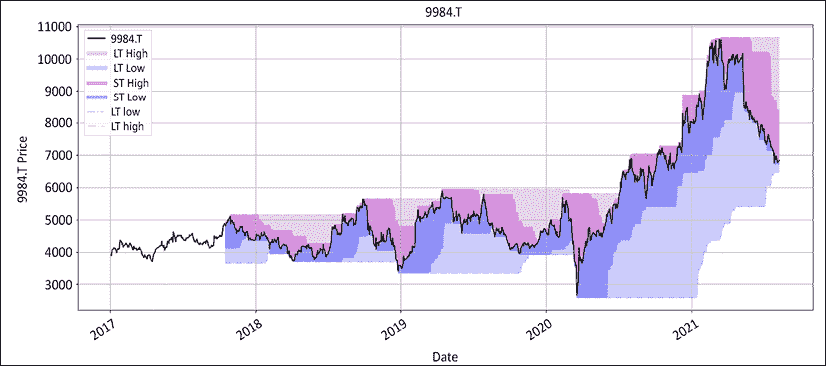
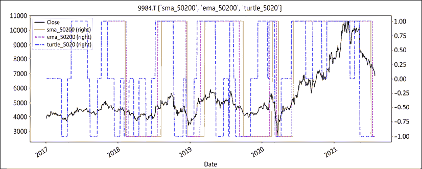
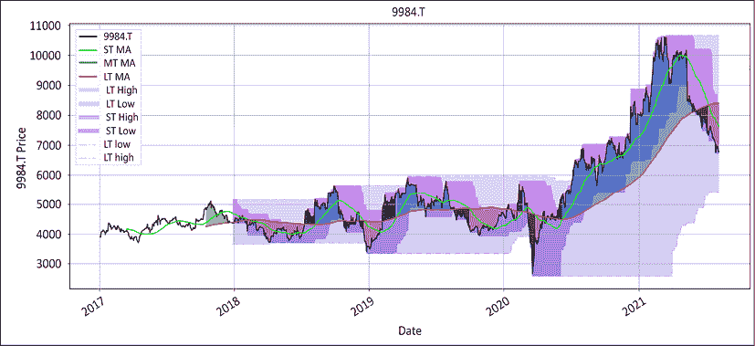
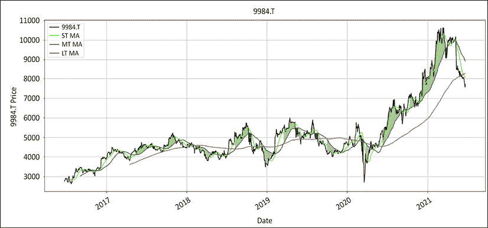
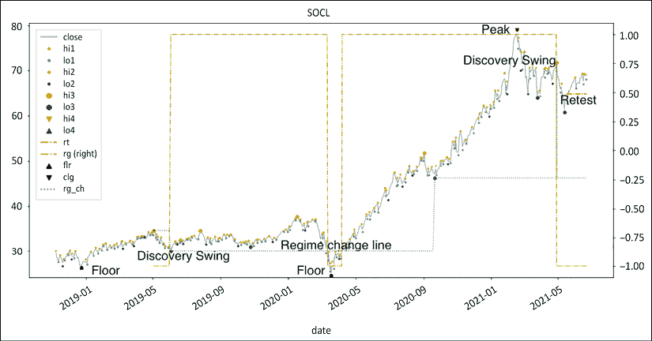
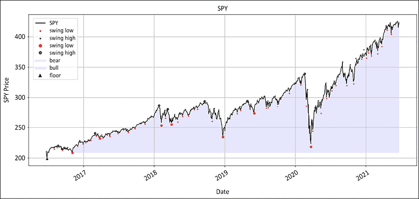
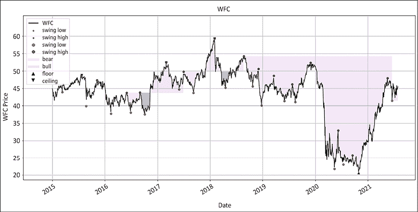

# five

# 制度定义

在拿破仑战争期间，资源有限的战地外科医生不得不迅速决定谁需要手术，谁没有手术也能活下去，以及哪些不幸的人什么也做不了。分诊诞生于以最有效和最人道的方式分配有限的时间和资源的需要。在股票市场，体制是分流的另一个词。有的看涨，有的看跌，有的没有定论。

市场倾向于“保持错误”的时间比投资者倾向于支持你的时间长得多。在进行深入分析之前，将股票划分到不同的制度类别(对它们进行分类)是一种有效的资源分配方式。这种初步分类的目的不是预测股票可能、将要或应该向何处发展，而是练习久违的积极倾听市场意见的艺术。

一些市场参与者喜欢花费时间和资源为顽固地蔑视理性的股票构建空头论点。这效率不高有两个原因。首先，他们预期回归均值。从长期来看，他们交易趋势，驾驭跑赢大盘的股票，期望他们继续做好。与此同时，从短期来看，他们交易均值回归，并预计昂贵的股票会被谦逊的馅饼噎住，然后再次回到便宜的价格。

正如我们将在接下来的章节中分析的，趋势跟踪和均值回归有相反的收益和风险。长期趋势跟踪和短期均值回归不会降低风险。它使之复合。目前，只要说市场参与者必须做出选择就够了。要么他们交易趋势，期待趋势发展，要么交易低效，期待趋势修正。当他们选择交易趋势和低效率时，他们的投资风格是不一致的。它们会导致每种风格的最坏结果，而不出所料，这往往会在最糟糕的时候同时发生。

第二，预期股票会反弹本质上就像试图预测顶部。这就像站在铁轨中间，期待一列接一列的货运列车停下来。牛市往往会让投资者对勇敢失去耐心。更谨慎的做法是，等待更多信息浮出水面，趋势转为看跌，然后再做空。

作为一种不同的方法，建立一种市场机制可能真正有助于基本面做空者。他们经常出现得太早。他们在更广泛的市场开始考虑这些信息之前就下注了。卖空大师和可怕的轻拍肩膀之间的差别是 6 个月。1999 年做空互联网股票，到了 2000 年，你将会给无聊的大学生讲授数学。早在 2000 年 1 月下旬就做空同样的股票，一个新的做空明星诞生了。

在接下来的章节中，我们将在比较各种制度定义方法之前先看看它们:

*   导入库
*   创建图表功能
*   突破/崩溃
*   移动平均线
*   更高的高点/更高的低点
*   地板/天花板
*   方法比较
*   让市场机制决定最佳策略

您可以通过以下链接访问本章所有图片的彩色版本:[https://static . packt-cdn . com/downloads/9781801815192 _ color images . pdf](https://static.packt-cdn.com/downloads/9781801815192_ColorImages.pdf)。你也可以通过这本书的 GitHub 资源库获得本章的源代码:[https://GitHub . com/Packt publishing/algorithm-Short-Selling-with-Python-Published-by-Packt](https://github.com/PacktPublishing/Algorithmic-Short-Selling-with-Python-Published-by-Packt)

# 导入库

对于本章和本书的其余部分，我们将使用`pandas`、`numpy`、`yfinance`和`matplotlib`库。我们还将与来自 ScientificPython 库的`find_peaks`合作。

因此，请记住首先导入它们:

```
# Import Libraries
import pandas as pd
import numpy as np
import yfinance as yf
%matplotlib inline
import matplotlib.pyplot as plt
from scipy.signal import find_peaks 
```

# 创建图表功能

在我们直观地比较各种制度方法之前，让我们公布一个名为`graph_regime_combo`的彩色图表功能的源代码。随着我们揭示每种方法，这些参数将逐渐变得有意义。

代码就像日本的糯米糍一样容易理解，糯米糍是幼儿、老人和像作者这样的外国人在日本窒息死亡的常见原因。结构很简单，就像作者一样。一切都取决于 floor/ceiling 方法是否在`rg`变量中实例化。如果地板/天花板存在，那么它会取代其他所有东西。如果没有，则打印其他两种方法(突破和移动平均线交叉)。`ax1.fill_between`方法识别边界。请全部阅读以了解情况。剩下的是平淡无奇的:

```
#### Graph Regimes ####
def graph_regime_combo(ticker,df,_c,rg,lo,hi,slo,shi,clg,flr,rg_ch,                       ma_st,ma_mt,ma_lt,lt_lo,lt_hi,st_lo,st_hi):

    '''
    https://www.color-hex.com/color-names.html
    ticker,df,_c: _c is closing price
    rg: regime -1/0/1 using floor/ceiling method
    lo,hi: small, noisy highs/lows
    slo,shi: swing lows/highs
    clg,flr: ceiling/floor
    rg_ch: regime change base
    ma_st,ma_mt,ma_lt: moving averages ST/MT/LT
    lt_lo,lt_hi: range breakout High/Low LT 
    st_lo,st_hi: range breakout High/Low ST 
    '''
    fig = plt.figure(figsize=(20,8))
    ax1 = plt.subplot2grid((1,1), (0,0))
    date = df.index
    close = df[_c]
    ax1.plot_date(df.index, close,'-', color='k',  label=ticker.upper()) 
    try:
        if pd.notnull(rg):  
            base = df[rg_ch]
            regime = df[rg]

#### removed for brevity: check GitHub repo for full code ####

    for label in ax1.xaxis.get_ticklabels():
        label.set_rotation(45)
    ax1.grid(True)
    ax1.xaxis.label.set_color('k')
    ax1.yaxis.label.set_color('k')
    plt.xlabel('Date')
    plt.ylabel(str.upper(ticker) + ' Price')
    plt.title(str.upper(ticker))
    plt.legend()
#### Graph Regimes Combo #### 
```

既然这个致命的代码已经消失，幸存者可能会进入下一个阶段:范围突破。

# 突破/崩溃

> "风筝迎风飞得最高——而不是顺风."
> 
> 温斯顿·丘吉尔

这是最古老最简单的趋势跟踪法。它对牛市和熊市都有效。如果价格在 *x* 个周期内创出新高，该机制就是看涨的。如果价格在 *x* 个周期内再创新低，该机制是看跌的。这种方法在计算上易于实现。

普遍的持续时间是 252 个交易日(也就是 52 周)，100 和 50 个交易日。下面是这一制度方法的简单介绍:

```
def regime_breakout(df,_h,_l,window):
    hl =  np.where(df[_h] == df[_h].rolling(window).max(),1,
                                np.where(df[_l] == df[_l].                                    rolling(window).min(), -1,np.nan))
    roll_hl = pd.Series(index= df.index, data= hl).fillna(method= 'ffill')
    return roll_hl

ticker = '9984.T' # Softbank ticker
start= '2016-12-31'
end = None
df = yf.download(tickers= ticker,start= start, end = end,                 interval = "1d",group_by = 'column',                 auto_adjust = True, prepost = True, 
                 treads = True, proxy = None)

window = 252
df['hi_'+str(window)] = df['High'].rolling(window).max()
df['lo_'+str(window)] = df['Low'].rolling(window).min()
df['bo_'+ str(window)]= regime_breakout(df= df,_h= 'High',_l= 'Low',window= window)
df[['Close','hi_'+str(window),'lo_'+str(window),    'bo_'+ str(window)]].plot(secondary_y= ['bo_'+ str(window)], 
        figsize=(20,5), style=['k','g:','r:','b-.'],        title = str.upper(ticker)+' '+str(window)+' days high/low') 
```

这段代码的运行方式很简单:

1.  如果高电平是 *x* 周期中最高的，那么`hl`就是`1`。
2.  否则，如果 low 是 *x* 周期中的最低值，那么`hl`就是`-1`。
3.  如果这些条件都不成立，`hl`为不适用。
4.  我们希望使用`fillna`方法沿着丢失的值向前传播最新的值。首先，我们将`numpy`数组转换为`pandas`系列。
5.  然后，我们使用`fillna`向前填充方法填充缺失值。
6.  Download the data, run the function, and plot the chart:

    

    图 5.1:软银一年高/低区间突破定义

当价格在盘整或横盘后突破时，这种区间突破策略会产生奇迹。横向市场是上升或下降趋势之间的过渡时期，此时旧的机制已经死亡，新的机制还不明显。在横向波动的市场中，价格在一个范围内波动。

在吉尔伽美什史诗般的战斗中，公牛与熊搏斗。当价格突破上限或下限时，这是一方认输的信号。被压抑的能量被释放出来。价格毫不费力地沿着阻力最小的路线移动。因此，这种突破方法是区间突破/分解的首选武器。

这种方法的主要缺点是其固有的滞后，这是持续时间的结果。在金融修正主义行话中，等待期被称为**确认**。市场参与者很少有耐心等待 50 天，100 天，甚至一年，最终找到一些解决方案。时间就是金钱。迟交租金的股票要么降价，要么被踢出去。长期使用这种方法的市场参与者可能想在他们的策略中重新引入时间退出。

这种方法的主要优点是计算简单和稳定。主要的缺点是其固有的滞后性和返还大量利润的不适感。这就引出了下一个迭代:不对称区间突破策略。

对突破机制定义方法的进一步改进包括进入和退出的分离周期。例如，传说中的芝加哥海龟交易者在 50 天的高点进场，在 20 天的低点收盘:

```
# CHAPTER 5 Turtle for dummies

def turtle_trader(df, _h, _l, slow, fast):
    '''
    "    _slow: Long/Short direction\n",
    "    _fast: trailing stop loss\n",
    '''
    _slow = regime_breakout(df,_h,_l,window = slow)
    _fast = regime_breakout(df,_h,_l,window = fast)
    turtle = pd. Series(index= df.index, 
                        data = np.where(_slow == 1,np.where(_fast == 1,1,0), 
                                np.where(_slow == -1, np.where(_fast ==-1,-1,0),0)))
    return turtle
slow = 50
fast = 20
ohlc = ['Open','High','Low','Close']
_o,_h,_l,_c = [ohlc[h] for h in range(len(ohlc))]
df['bo_'+ str(slow)] = regime_breakout(df,_h,_l,window = slow)
df['bo_'+ str(fast)] = regime_breakout(df,_h,_l,window = fast)
df['turtle_'+ str(slow)+str(fast)] = turtle_trader(df, _h, _l, slow, fast)
rg_cols = ['bo_'+str(slow),'bo_'+ str(fast),'turtle_'+ str(slow)+str(fast)]
df[['Close','bo_'+str(slow),'bo_'+ str(fast),'turtle_'+ str(slow)+str(fast)] ].plot(
    secondary_y= rg_cols,figsize=(20,5), style=['k','orange','g:','b-.'],
                                 title = str.upper(ticker)+' '+str(rg_cols)) 
```

这种不对称的持续时间使交易者能够在灵活的市场中获取小额利润:


图 5.2:软银不对称制度突破持续时间(傻瓜的海龟交易者)

前面的图显示了软银的收盘价、慢速突破(橙色实线)、快速突破(绿色虚线)和蓝色点划线(两者的组合)。蓝色的点划线给出了入口和出口。阅读起来有点困难，所以我们将在下面使用一个视觉上更友好的图表。

上面概述的海龟策略是一个基本的脚本，灵感来自传奇的海龟交易者。它由两个区间突破机制组成。较慢的持续时间用于条目。更快的持续时间用于退出。这种非对称的进场和出场时间依赖于一个由来已久的原则:谨慎和深思熟虑地确认趋势，但快速和果断地减少损失和保护利润。从现在起，这最后一个制度将被重新命名为*假人龟*。

我们将在本书中重复使用这个基本策略来举例说明，纯粹是为了教育目的。然而，不要在家里这样做——这对于教育目的来说是足够现实的，但是对于在真实货币生产中部署来说太简单了。

使用`graph_regime_combo`的海龟假人策略的更直观表示如下:

```
ma_st = ma_mt = ma_lt = 0
rg=lo=hi=slo=shi=clg=flr=rg_ch = None
ohlc = ['Open','High','Low','Close']
_o,_h,_l,_c = [ohlc[h] for h in range(len(ohlc))]
bo_lt = 200
bo_st = 50

lt_lo = df[_l].rolling(window= bo_lt).min()
lt_hi = df[_h].rolling(window= bo_lt).max()
st_lo = df[_l].rolling(window= bo_st).min()
st_hi = df[_h].rolling(window= bo_st).max()
graph_regime_combo(ticker,df,_c,rg,lo,hi,slo,shi,clg,flr,rg_ch,ma_st,ma_mt,ma_lt,lt_lo,lt_hi,st_lo,st_hi) 
```

这给了下面的图表:



图 5.3:使用海龟交易者方法的软银机制。阴影越深，时间越短

较长的持续时间给出了方向；长或短。这是蓝线，基于 50 天的高点/低点。持续时间越短就是止损。我们将在第 7 章、*中详细讨论止损，提高你的交易优势*。较短的持续时间通过缩小区间来保护利润。另一方面是交易频率的提高。正如我们在 2018 年看到的那样，海龟策略的这套参数在波动的市场中并不奏效。它也在 2019 年的横盘市场中挣扎。

# 移动平均交叉

移动平均线是另一种流行的制度定义方法。这种方法非常简单和普遍，即使是声称从不看图表的最铁杆的基本面分析师也喜欢 200 天简单移动平均线。这种方法在计算上也很容易。移动平均线的类型可能会进一步细化，从简单移动平均线到指数移动平均线、三角形移动平均线和自适应移动平均线。然而，原理是相同的。当快速移动平均线高于慢速移动平均线时，这个机制是看涨的。当它低于较慢的那个时，该政权是看跌的。以下代码显示了如何使用简单和指数移动平均线(分别为`SMA`和`EMA`)计算两个移动平均线的状态:

```
#### Regime SMA EMA ####
def regime_sma(df,_c,st,lt):
    '''
    bull +1: sma_st >= sma_lt , bear -1: sma_st <= sma_lt
    '''
    sma_lt = df[_c].rolling(lt).mean()
    sma_st = df[_c].rolling(st).mean()
    rg_sma = np.sign(sma_st - sma_lt)
    return rg_sma

def regime_ema(df,_c,st,lt):
    '''
    bull +1: ema_st >= ema_lt , bear -1: ema_st <= ema_lt
    '''
    ema_st = df[_c].ewm(span=st,min_periods = st).mean()
    ema_lt = df[_c].ewm(span=lt,min_periods = lt).mean()
    rg_ema = np.sign(ema_st - ema_lt)
    return rg_ema

st = 50
lt = 200
df['sma_' + str(st) + str(lt)] = regime_sma(df, _c='Close', st= st, lt= lt)
df['ema_' + str(st) + str(lt)] = regime_ema(df, _c='Close', st= st, lt= lt)

ohlc = ['Open','High','Low','Close'] 
_o,_h,_l,_c = [ohlc[h] for h in range(len(ohlc))]
rgme_cols = ['sma_' + str(st) + str(lt), 'ema_' + str(st) + str(lt),'turtle_'+ str(slow)+str(fast) ]
df[['Close','sma_' + str(st) + str(lt), 'ema_' + str(st) + str(lt),'turtle_'+ str(slow)+str(fast)] ].plot(
    secondary_y= rgme_cols,figsize=(20,8), style=['k','orange','m--','b-.'],
                                 title = str.upper(ticker)+' '+str(rgme_cols)) 
```

这产生了下图:



图 5.4:软银使用海龟突破，均线和均线

这里，我们比较三种体制方法。我们有新制作的，永远最好的朋友*假人龟*在蓝色虚线中。橙色的是均线，紫色虚线的是均线。移动平均线系列的结果与预期接近。指数移动平均线比简单移动平均线反应更快。我们现在可以使用`graph_regime_combo`图表功能来可视化结果:

```
rg=lo=hi=slo=shi=clg=flr=rg_ch = None
lt_lo = lt_hi = st_lo = st_hi = 0

ma_st = df[_c].rolling(window=50).mean()
ma_mt = df[_c].rolling(window=200).mean()
ma_lt = df[_c].rolling(window=200).mean()
ohlc = ['Open','High','Low','Close']
_o,_h,_l,_c = [ohlc[h] for h in range(len(ohlc))]

graph_regime_combo(ticker,df,_c,rg,lo,hi,slo,shi,clg,flr,rg_ch,ma_st,ma_mt,ma_lt,lt_lo,lt_hi,st_lo,st_hi) 
```

函数最多可容纳三条移动平均线。要获得只有两条移动平均线的图表，就像这里所做的，将中期和长期设置为相同的值(在这个例子中，中期和长期被设置为`200`)。下面是移动平均线交叉区域的视觉再现。浅绿色和浅红色区域是该政权看涨或看跌并盈利的地方。深绿和深红区域是政权看涨或看跌且无利可图的地方:


图 5.5:软银的交叉较暗的区域是亏损区域

在横盘和动荡的市场中，这种策略经历了一段艰难的时期。快速移动平均线和慢速移动平均线会聚成一条低振幅正弦曲线。交易频率和损失率增加，而胜率下降。

举例说明三条移动平均线的更简洁的方法是通过列表理解。首先，我们创建一个移动平均变量列表。其次，我们通过理解列表实例化变量。让我们用一些列表理解来写上面的内容:

```
mav = [50, 200, 200]
ma_st,ma_mt,ma_lt = [df[_c].rolling(mav[t]).mean() for t in range(len(mav))]

bo = [50, 252]
st_lo,lt_lo = [df[_l].rolling(bo[t]).min() for t in range(len(bo))]
st_hi,lt_hi = [df[_h].rolling(bo[t]).max() for t in range(len(bo))]
ohlc = ['Open','High','Low','Close']
_o,_h,_l,_c = [ohlc[h] for h in range(len(ohlc))]

graph_regime_combo(ticker,df,_c,rg,lo,hi,slo,shi,clg,flr,rg_ch,ma_st,ma_mt,ma_lt,lt_lo,lt_hi,st_lo,st_hi) 
```

大概是这样的:



图 5.6:软银在海龟身上的交叉

这张越来越丰富多彩的图表显示了两种制度方法的结合。不幸的是，它带来的困惑多于它解决的问题。市场参与者有时会试图添加多个条件，希望剔除误报。但不幸的是，接受随机性比试图根除它更容易。

双线交叉是移动交叉法最流行的版本。较慢的线定义了制度，而较短的持续时间线规定了进场和出场的时间。最受欢迎的持续时间是 50/200，被称为的**黄金/死亡交叉**。理论上，这种组合是有意义的。200 天是一个稳健的长期指标，而 50 天是一个良好的动力指标。实际上，这种组合的命中率非常高。它只对大的长期趋势有效。不幸的是，他们很少出现，因此胜率徘徊在 20%左右。其余时间，较快的移动平均线围绕较慢的来回摆动，就像一个职业政客。

这些弱点导致均线爱好者下一次使用三条均线。在下面的例子中，我们在之前的黄金交叉 50/200 移动平均线交叉的基础上增加了另一条持续时间更短的移动平均线。为了简单起见，我们使用 20 天、50 天和 200 天。200 天给出了制度，而 20/50 排列给出了进入和退出。

我们所要做的就是在下面的代码中改变一个变量:

```
rg=lo=hi=slo=shi=clg=flr=rg_ch = None
lt_lo = lt_hi = st_lo = st_hi = 0

mav = [20, 50, 200]
ma_st,ma_mt,ma_lt = [df[_c].rolling(mav[t]).mean() for t in range(len(mav))]
ohlc = ['Open','High','Low','Close']
_o,_h,_l,_c = [ohlc[h] for h in range(len(ohlc))]

graph_regime_combo(ticker,df,_c,rg,lo,hi,slo,shi,clg,flr,rg_ch,ma_st,ma_mt,ma_lt,lt_lo,lt_hi,st_lo,st_hi) 
```

我们可以看到下面的结果图表:



图 5.7:软银三重均线交叉

最长持续时间决定了政权。这两个中期和短期的持续时间分别是进场和出场的时间。而不是一个很长的段落，逻辑可以总结如下:

1.  **多头**:当短期均线最高时进场并保持多头，其次是中长期均线
2.  **做空**:只要短期均线低于中期，进入并保持做空，而中期又需要低于长期均线。
3.  **Else** :空挡，无位置。

这种方法可能是遵循长期既定趋势和保持良好的风险管理之间最实际的折衷。

不像我们之前看到的双均线图，三均线不会在错误的方向上坚持很久。它在早期削减头寸方面做得更好。那些是无色和较短的较暗区域。另一方面是交易频率的增加。另一个缺点是这种方法固有的滞后性。如图表中间部分所示，在横盘市场中，在信号产生之前，价格会向两个方向移动一点。

市场参与者放弃移动平均线方法的主要原因是横盘行情。当市场横向波动时，均线会相互振荡。这产生了许多假阳性信号，往往会侵蚀金融和情感资本基础。在几次代价高昂的错误开始后，市场参与者倾向于寻找噪音更小的方法。

与其调整移动平均持续时间或完全放弃这种方法，更好的解决方案可能是用下注大小来代替。在横盘的第一个信号出现时，缩小仓位，然后随着趋势的增强，增加仓位。

# 更高的高点/更高的低点

这是另一种流行的方法。趋势上升的股票会创造更高的高点和更高的低点。相反，趋势下跌的股票按这个顺序制造更低的低点和更低的高点，因此暗示持续疲软。这种方法有直观的意义。不幸的是，从统计数据来看，它并不像看上去那样稳健。在继续他们的旅程之前，市场有时会打印更低/更高的低点/高点，打乱计算。其次，这种方法需要同时满足三个条件:

1.  更低的低点。
2.  较低的高点。
3.  低下限和高下限条件必须依次满足，这只有在有序的市场中才行得通。

这三个条件必须按照这个精确的顺序连续满足，该政权才会转而看跌。市场是随机的，比人们通常认为的更加嘈杂。

这种方法的主要优点是入口和出口。做多方面，在低点买入做多，在高点退出。做空方面，在高点做空，在低点退出。这些逆势进场和出场让市场参与者获得利润。此外，止损客观地定义在多头的较高低点和空头的较低高点。

总的来说，这个方法的前提是有逻辑意义的。打印更高的高点和更高的低点的股票被向上拉，反之亦然。不幸的是，这种方法在嘈杂的市场中挣扎，那里没有连续的高点和低点——因此我从本章中省略了代码。

下面的方法使用相同的波动高点和波动低点，以一种更有力的方式来定义制度。这是简单的和统计稳健的。

# 下限/上限法

该方法最初是高高低低方法的变体。每个人都凭直觉使用过它，然而它是如此显而易见，以至于没有人会费心将其正式化。与高低点方法不同，要改变状态，只需满足以下两个条件之一:

1.  看跌:波动高点必须比峰值低很多。
2.  看涨:一个摆动低点必须大大高于底部。

这种波动甚至不一定是政权更迭的连续过程。例如，市场有时会暴涨，然后回落，出现一段时间的横向波动。这些时期被称为巩固期和 T2 期。直到一个波动高点明显低于峰值时，该机制才转为看跌。

无论时间框架和资产类别如何，经典定义总是有效的。在牛市中，低点会大大高于底部。相反，高点将大大低于熊市中的峰值。

随机性触发异常，并以简单优雅的方式处理。有两种方法:

1.  **保守**:
    *   如果政权是熊市，价格越过了上限，政权就变成了牛市。
    *   如果政权是看涨的，价格穿过了底部，政权就变成了看跌的。
2.  **咄咄逼人**:
    *   如果政权是看跌的，价格越过发现摆动高点，政权变成看涨。
    *   如果政权是看涨的，价格在发现摆动低点下交叉，政权变成看跌的。

这种下限/上限方法只有两种状态:牛市或熊市。横盘是在更广泛的牛市或熊市背景下的暂停。这种方法给体制定义带来了稳定性。实际上，没有什么比在均线附近摇摆不定更令人沮丧的了。稳定使市场参与者能够更好地管理他们的头寸。

下限/上限方法在概念上很简单。然而，这并不容易计算。这是一个两步过程:

1.  摆动检测
2.  制度定义

市场不会直线上升。它沿着主导趋势上下波动。它标出了沿途的局部高点和低点。那些是被称为**的摇摆高点**和**摇摆低点**。

摆动检测是地板/天花板方法中 80%的工作。并非所有的波动高点和低点都是生来平等的。主要的困难是从信号中分离出噪声。由于状态定义基于摆动，错误的摆动检测不可避免地导致错误的状态定义。

代码的逻辑很简单。它依赖于两个测试:复试和距离。我们将经历从摆幅高到摆幅低的整个序列，如图*图 5.8* 所示:

1.  价格从先前的低点创出新高。
2.  价格从历史最高点下降。
3.  价格再次测试历史高点，但它失败并跌破后高点低点。
4.  一旦价格收盘低于最高价，卖方可能会负责。该算法被设计为在历史高点之后连续重置到最高低点。

以下是低摆幅的等效步骤:

1.  价格印出了最低价:第一个最低价。
2.  它反弹到第一个高点。
3.  价格回落到最近的低点，但未能达到最低点。
4.  The price subsequently starts traveling upward. Either it takes out the first high (always the highest high following the lowest low) or prints a lower high, called the latest high. When the price closes above the first or latest high, this suggests that buyers may be in charge now.

    这个序列不断重复，直到价格收盘高于或低于最新的最高价或最低价。在孤立的情况下，重复测试没有统计学意义。它们经常发生。当再加上距离测试，再测试往往更有意义。

5.  **Distance test**: This is the distance from the swing high to the lowest low. This test is either in units of volatility or percentage points. The further away from a swing, the more likely it indicates an exhaustion of the trend:

    

    图 5.8:挥杆检测直观解释:距离和重新测试

现在，让我们缩小范围，看看大图。上图中的摆幅高点是下图中的峰值:



图 5.9:下限/上限制度定义

副轴上的线是政权。在发现一个大幅高于底部的低点后，该机制开始看涨。这个低点现在是政权更替线。如果价格跌破这一水平，政府将转而看跌。这将发生在 2020 年第一季度，届时该政权将转而看跌。价格再次越过该水平，系统恢复看涨。价格在 2021 年初创下历史新高，下跌，然后反弹，但在高点之前滚动。该政权变得悲观。现在是时候从多头转向空头了。然而，在这个问题上的借贷成本高得惊人，因此利润丰厚的贸易没有升级为往返旅行。

在接下来的小节中，我们将浏览计算这个所需的源代码。概念框架的灵感来自比利时数学家伯努瓦·曼德尔布罗关于分形的开创性工作。我们从一系列嘈杂的小高点和低点开始，用之前的缩减系列缩小。这种方法比其他方法计算量大一点。结果是然而令人惊讶的直观。大致分为两个阶段:**挥杆检测**和**状态定义**。摆动检测是一系列小功能。

## 摆动检测

摆动检测分为两部分:历史摆动和上次摆动调整。前两个函数`historical_swings`和`hilo_alternation`完成了 90%的工作。剩下的就是一系列的小功能的,以确保最后的摆动是相关的。乍一看这可能有点冗长，所以我们将慢慢地浏览所有的函数并解释它们的相关性。

### 历史波动和高低交替

先从下载历史价格说起。我们正在使用 using SPY，一个 S & P 500 的代理**交易所交易基金** ( **ETF** )，但是如果你喜欢，你可以使用不同的股票代码进行实验:

```
# CHAPTER 5 Swing detection
ticker = 'SPY' 

start= '2016-12-31'
end = None
raw_data = round(yf.download(tickers= ticker,start= start, end = end,interval = "1d",
                 group_by = 'column',auto_adjust = True, prepost = True, 
                 treads = True, proxy = None),2)
ohlc = ['Open','High','Low','Close']
_o,_h,_l,_c = [ohlc[h] for h in range(len(ohlc))] 
```

接下来，我们将依次展示每个函数，并用图表或属性来说明进展。我们从上一个函数停止的地方继续前进。最后，我们将一次性发布所有功能的完整摘要，并制作图表:

```
#### hilo_alternation(hilo, dist= None, hurdle= None) ####
def hilo_alternation(hilo, dist= None, hurdle= None):
    i=0    
    while (np.sign(hilo .shift(1)) == np.sign(hilo)).any(): # runs until duplicates are eliminated
        # removes swing lows > swing highs
        hilo.loc[(np.sign(hilo.shift(1)) != np.sign(hilo)) & # hilo alternation test 
                 (hilo.shift(1)<0) &  # previous datapoint: high
                 (np.abs(hilo.shift(1)) < np.abs(hilo) )] = np.nan # high[-1] < low, eliminate low 

        hilo.loc[(np.sign(hilo.shift(1)) != np.sign(hilo)) &  # hilo alternation
                 (hilo.shift(1)>0) &  # previous swing: low
                 (np.abs(hilo ) < hilo.shift(1))] = np.nan # swing high < swing low[-1]

#### removed for brevity: check GitHub repo for full code ####
#### hilo_alternation(hilo, dist= None, hurdle= None) ####
#### historical_swings(df,_o,_h,_l,_c, dist= None, hurdle= None) #### 
def historical_swings(df,_o,_h,_l,_c, dist= None, hurdle= None):

    reduction = df[[_o,_h,_l,_c]].copy() 
    reduction['avg_px'] = round(reduction[[_h,_l,_c]].mean(axis=1),2)
    highs = reduction['avg_px'].values
    lows = - reduction['avg_px'].values
    reduction_target =  len(reduction) // 100

    n = 0
    while len(reduction) >= reduction_target: 
        highs_list = find_peaks(highs, distance = 1, width = 0)
        lows_list = find_peaks(lows, distance = 1, width = 0)
        hilo = reduction.iloc[lows_list[0]][_l].sub(reduction.iloc[highs_list[0]][_h],fill_value=0)

#### removed for brevity: check GitHub repo for full code ####
#### historical_swings(df,_o,_h,_l,_c, dist= None, hurdle= None) ####

df = raw_data.copy()
ohlc = ['Open','High','Low','Close']
_o,_h,_l,_c = [ohlc[h] for h in range(len(ohlc))]
rhs = ['Hi1', 'Lo1','Hi2', 'Lo2', 'Hi3', 'Lo3']
rt_hi,rt_lo,_hi,_lo,shi,slo = [rhs[h] for h in range(len(rhs))]

df= historical_swings(df,_o,_h,_l,_c,dist= None, hurdle= None)

df[[_c,rt_hi,rt_lo,_hi,_lo,shi,slo ]].plot(
    style=['grey','y.', 'c.','r.', 'g.', 'rv', 'g^'],
    figsize=(20,5),grid=True, title = str.upper(ticker))
df[[_c,shi,slo]].plot(style=['grey','rv', 'g^'],
        figsize=(20,5),grid=True, title = str.upper(ticker)) 
```

`hilo_alternation`函数循环遍历缩减数据框架，直到该系列由交替的高点和低点组成。它消除了:

1.  相同的侧连续高点和低点:高点被分配一个负号。低点有一个积极的信号。当有两个连续的高点或低点时，最低值标志着极值点。
2.  低点高于周围的高点。随机性无法消除:理论上，这种情况不应该存在，但实际上，异常现象依然存在。
3.  嘈杂的短距离高点和低点。距离测试并不完全相关，因为交替循环包含在更大的多级循环中。这是算法的分形部分，我们在缩小时寻找相同的模式。然而，该特性是缩短循环次数的一个很好的选择。
4.  在每次迭代结束时，使用`dropna`方法减少`hilo df`。

`historical_swings`功能采取以下步骤:

1.  Reduction 数据框架:复制主数据框架，并从高、低和平均值实例化一个新系列。
2.  循环以减少数据帧。
3.  计算两个系列的高点和低点(通过给平均系列分配一个负号)。对高点的唯一要求是前一根和后一根棒线必须低，反之亦然。
4.  运行`hilo_alternation`功能缩小数据帧。
5.  填充简化的数据框，并通过`dropna`方法进一步简化。
6.  填充每个级别的主数据框架。当缩减长度小于主数据帧的 1%,或者不可能再缩减，或者已经过了 10 次迭代时，停止缩减。

上面的代码返回了这个非常嘈杂的图表:


图 5.10: SPY 分形高点/低点级别 1 到 3

第一层是收盘价上下标有 Hi1 和 Lo1 的小圆点。级别 2 是标记为 Hi2 和 Lo2 的红绿点。它不那么频繁，但仍然相对嘈杂。接下来，我们真的需要确定有意义的拐点，作为我们分析的基础。所以，我们上一层楼。三角形是第三级。价格被过滤了两次。原始数据帧减少了 99%。

下图简单显示了价格和 3 级数据:

图 5.11:间谍历史波动

最后一个三角形低于最高收盘价。这显然是误报。摇摆高点显然既不是最高点，也不是紧随其后的摇摆低点。其余的功能将针对最后一次挥杆进行调整。所以，让我们让这个假阳性消失:

1.  **摇摆高点**:价格继续高于最新的摇摆高点。
2.  **摇摆低点**:价格继续低于最新的摇摆低点。

`cleanup_latest_swing()`功能从最新的高低摆动中消除误报:

```
#### cleanup_latest_swing(df, shi, slo, rt_hi, rt_lo) ####
def cleanup_latest_swing(df, shi, slo, rt_hi, rt_lo): 
    '''
    removes false positives
    '''
    # latest swing
    shi_dt = df.loc[pd.notnull(df[shi]), shi].index[-1]
    s_hi = df.loc[pd.notnull(df[shi]), shi][-1]
    slo_dt = df.loc[pd.notnull(df[slo]), slo].index[-1] 
    s_lo = df.loc[pd.notnull(df[slo]), slo][-1] 
    len_shi_dt = len(df[:shi_dt])
    len_slo_dt = len(df[:slo_dt])

    # Reset false positives to np.nan
    for i in range(2):

        if (len_shi_dt > len_slo_dt) & ((df.loc[shi_dt:,rt_hi].max()> s_hi) | (s_hi<s_lo)):
            df.loc[shi_dt, shi] = np.nan
            len_shi_dt = 0
        elif (len_slo_dt > len_shi_dt) & ((df.loc[slo_dt:,rt_lo].min()< s_lo)| (s_hi<s_lo)):
            df.loc[slo_dt, slo] = np.nan 
            len_slo_dt = 0
        else:
            pass

    return df
#### cleanup_latest_swing(df, shi, slo, rt_hi, rt_lo) ####

df[[_c,shi,slo]].plot(style=['grey','rv', 'g^'],
        figsize=(20,5),grid=True, title = str.upper(ticker) + ' pre-adjustment')

df = cleanup_latest_swing(df, shi,slo,rt_hi,rt_lo)

df[[_c,shi,slo]].plot(style=['grey', 'rv', 'g^'],
        figsize=(20,5),grid=True, title = str.upper(ticker) + ' post-adjustment') 
```

该代码采取以下步骤:

1.  该代码标识了最近的低和高摆动。
2.  确定最近的摆动。
3.  如果是假阳性，分配 N/A。

以下图表显示了调整前后，该函数已从数据中消除了误报:


图 5.12:前探:上一次波动的高点和低点是误报


图 5.13:监视之后:两个秋千都被删除

这两张图表不言自明。最后两个三角形必须去掉。由绿色三角形表示的最后一个摆动低点高于前一个摆动高点。此外，这个高摆幅是无效的，因为没有更低的低摆幅。所以，当我们在最后两次摆动中循环一次时，两者都被移除了。图表现在一直回到 2020 年 3 月的低点。接下来，我们将使用`latest_swing_variables()`函数实例化其余流程所需的所有变量。该函数计算将在接下来的几个函数中使用的变量。他们分别是:

*   `ud`:方向，上`+1`，下`-1`。
*   `bs`:底座，低摆或高摆。
*   `bs_dt`:挥杆日期。
*   `_rt`:将用于检测摆动的系列名称。要么重新测试低点`rt_lo`，代表波动高点；要么重新测试高点`rt_hi`，代表波动低点。
*   `_swg`:要赋值的序列；`shi`代表高摆幅，`slo`代表低摆幅。
*   `hh_ll`:最低低点或最高高点。
*   `hh_ll_dt`:最高价或最低价的日期。

我们将利用列表理解来声明变量:

```
#### latest_swings(df, shi, slo, rt_hi, rt_lo, _h, _l, _c, _vol) ####
def latest_swing_variables(df, shi, slo, rt_hi, rt_lo, _h, _l, _c):
    '''
    Latest swings dates & values
    '''
    shi_dt = df.loc[pd.notnull(df[shi]), shi].index[-1]
    slo_dt = df.loc[pd.notnull(df[slo]), slo].index[-1]
    s_hi = df.loc[pd.notnull(df[shi]), shi][-1]
    s_lo = df.loc[pd.notnull(df[slo]), slo][-1]

    if slo_dt > shi_dt: 
        swg_var = [1,s_lo,slo_dt,rt_lo,shi, df.loc[slo_dt:,_h].max(), df.loc[slo_dt:, _h].idxmax()]         
    elif shi_dt > slo_dt: 
        swg_var = [-1,s_hi,shi_dt,rt_hi,slo, df.loc[shi_dt:, _l].min(),df.loc[shi_dt:, _l].idxmin()]        
    else: 
        ud = 0
    ud, bs, bs_dt, _rt, _swg, hh_ll, hh_ll_dt = [swg_var[h] for h in range(len(swg_var))]   

    return ud, bs, bs_dt, _rt, _swg, hh_ll, hh_ll_dt
#### latest_swings(df, shi, slo, rt_hi, rt_lo, _h, _l, _c, _vol) ####

ud,bs,bs_dt,_rt,_swg,hh_ll,hh_ll_dt = latest_swing_variables(df,shi,slo,rt_hi,rt_lo,_h,_l,_c)

ud, bs, bs_dt, _rt, _swg, hh_ll, hh_ll_dt 
```

这将产生如下输出:

```
(1,
 213.43,
 Timestamp('2020-03-23 00:00:00'),
 'Lo1',
 'Hi3',
 452.6,
 Timestamp('2021-09-02 00:00:00')) 
```

上面声明的变量将在后面的小节中使用。

### 建立趋势衰竭

到目前为止，我们所做的一切都是双重的。我们发现了历史波动，并对其进行了清理。然后，我们已经声明了变量，我们将使用这些变量来实时查找最新的挥杆。我们用来检测最后一次挥杆的方法叫做一次**再测**。在间谍图的背景下，市场从摆动低点打印出最高高点。价格下跌一点，然后回升，但未能达到最高点。价格然后穿透后高点低点。重考本质上是犹豫。他们相当频繁。市场经常会犹豫不决。然而，当在持续波动结束时进行重新测试时，这可能是趋势衰竭和市场方向可能逆转的信号。

这个距离测试起到了过滤器的作用。该函数有两个内置测试:

1.  以波动率倍数表示的距离。我们使用波动率**平均真实范围** ( **ATR** )或标准差来衡量。
2.  作为固定百分比的距离。

该函数的默认设置是无距离测试，这将返回一个事实上的通过。一个成功的测试是`-1`为低摆幅或`+1`为高摆幅，而`0`为失败的测试。我们还将定义一个计算 ATR 的函数。这是经典的波动率测量方法，最初由传奇人物威尔斯·怀尔德(Welles Wilder)提出:

```
#### test_distance(ud, bs, hh_ll, vlty, dist_vol, dist_pct) ####
def test_distance(ud,bs, hh_ll, dist_vol, dist_pct): 

    # priority: 1\. Vol 2\. pct 3\. dflt
    if (dist_vol > 0):    
        distance_test = np.sign(abs(hh_ll - bs) - dist_vol)
    elif (dist_pct > 0):
        distance_test = np.sign(abs(hh_ll / bs - 1) - dist_pct)
    else:
        distance_test = np.sign(dist_pct)

    return int(max(distance_test,0) * ud)
#### test_distance(ud, bs, hh_ll, vlty, dist_vol, dist_pct) ####
#### ATR ####
def average_true_range(df, _h, _l, _c, n):
    '''
    http://stockcharts.com/school/doku.php?id=chart_school:technical_indicators:average_true_range_atr
    '''
    atr =  (df[_h].combine(df[_c].shift(), max) - df[_l].combine(df[_c].shift(), min)).rolling(window=n).mean()
    return atr

#### ATR ####

dist_vol = round(average_true_range(df,_h,_l,_c,n=63)[hh_ll_dt] * 2,2)
dist_pct = 0.05
_sign = test_distance(ud,bs, hh_ll, dist_vol, dist_pct)
_sign 
```

这将产生以下输出:

```
1 
```

这个距离测试验证了最近一次波动到最极端价格(以波动性单位或百分比表示)之间的距离大到足以表明潜在的趋势衰竭。该过滤器减少了假阳性的发生。

#### 重新测试挥杆

所有的功能将我们带到了这个时刻:挥杆检测。这个小函数有着惊人的强大功能。摆幅高低的逻辑是对称的。因此，我们将专注于摆高:

1.  从摆动低点检测最高高点。
2.  从最高的高点，确定最高的再测试低点。
3.  当价格收盘低于最高再测试低点时:波动高点=最高高点。

它同样适用于识别波动低点。这是序列将如何展开:

1.  从波动高点检测最低低点。
2.  从最低的低点，确定最低的再测试高点。
3.  当价格收盘在最低再测试高点之上时:摆动低点=最低低点。

请注意，该功能将始终重置为最高重新测试下限。有时，价格会突然下跌，然后试图恢复平静，但随后又会动摇。当重置到最高的再测试低点时，这个函数会立刻识别趋势可能反转的最早时刻。

该功能还将创建绝对序列`rt`或相对序列`rrt`,以显示用于检测摆动的重新测试。如果您想直观地看到哪个重新测试用于检测挥杆，这个可选功能可能会很有用。

在*图 5.14* 中，这是黑点:

```
#### retest_swing(df, _sign, _rt, hh_ll_dt, hh_ll, _c, _swg) ####
def retest_swing(df, _sign, _rt, hh_ll_dt, hh_ll, _c, _swg):
    rt_sgmt = df.loc[hh_ll_dt:, _rt] 

    if (rt_sgmt.count() > 0) & (_sign != 0): # Retests exist and distance test met    
        if _sign == 1: # 
            rt_list = [rt_sgmt.idxmax(),rt_sgmt.max(),df.loc[rt_sgmt.idxmax():, _c].cummin()]

        elif _sign == -1:
            rt_list = [rt_sgmt.idxmin(), rt_sgmt.min(), df.loc[rt_sgmt.idxmin():, _c].cummax()]
        rt_dt,rt_hurdle, rt_px = [rt_list[h] for h in range(len(rt_list))]

        if str(_c)[0] == 'r':
            df.loc[rt_dt,'rrt'] = rt_hurdle
        elif str(_c)[0] != 'r':
            df.loc[rt_dt,'rt'] = rt_hurdle    

        if (np.sign(rt_px - rt_hurdle) == - np.sign(_sign)).any():
            df.at[hh_ll_dt, _swg] = hh_ll 
    return df
#### retest_swing(df, _sign, _rt, hh_ll_dt, hh_ll, _c, _swg) ####

df = retest_swing(df, _sign, _rt, hh_ll_dt, hh_ll, _c, _swg)
try:
    df['rt '] = df['rt'].fillna(method='ffill')
    df[bs_dt:][[_c, rt_hi, rt_lo,
        shi, slo,'rt']].plot(style=['grey', 'c.','y.',
        'rv', 'g^', 'ko'],figsize=(20,5),grid=True, title = str.upper(ticker))
except:
    df[bs_dt:][[_c, rt_hi, rt_lo,
        shi, slo]].plot(style=['grey', 'c.','y.',
        'rv', 'g^', 'ko'],figsize=(20,5),grid=True, title = str.upper(ticker)) 
```

最终图表末端的黑点是最高的再测试低点。请注意，当函数遇到新高或新低时，它会随着函数的重置而周期性地消失，因此，如果在运行函数时看不到它，也不用担心:


图 5.14:从低点重新测试

只要价格不断创出新高，重新测试就会随之重置。一路上会有误报，但这是旅程的一部分。

一些读者可能不同意重新测试的方法，不管原因是什么。因此，我们引入了另一种摆动检测方法。

#### 回撤摆动

该功能是重新测试方法的替代方法。它完全依赖于从极值的回撤。这种方法的主要好处是概念简单。一旦价格向相反的方向移动足够远，那么通常可以得出结论，波动已经被打印出来。然而，这种工具是钝的。它通常有效，但在横向或高度波动的市场中会失效:

1.  从极值开始计算回撤，要么是从顶部开始的最小值，要么是从底部开始的最大值。
2.  以波动性或百分点为单位的距离测试。

该功能作为故障保险，以防重新测试不够迅速:

```
#### retracement_swing(df, _sign, _swg, _c, hh_ll_dt, hh_ll, vlty, retrace_vol, retrace_pct) 
def retracement_swing(df, _sign, _swg, _c, hh_ll_dt, hh_ll, vlty, retrace_vol, retrace_pct):
    if _sign == 1: #
        retracement = df.loc[hh_ll_dt:, _c].min() - hh_ll

#### removed for brevity: check GitHub repo for full code ####
#### retracement_swing(df, _sign, _swg, _c, hh_ll_dt, hh_ll, vlty, retrace_vol, retrace_pct) ####

vlty = round(average_true_range(df=df, _h= _h, _l= _l, _c= _c , n=63)[hh_ll_dt],2)
dist_vol = 5 * vlty
dist_pct = 0.05
_sign = test_distance(ud,bs, hh_ll, dist_vol, dist_pct)
df = retest_swing(df, _sign, _rt, hh_ll_dt, hh_ll, _c, _swg)
retrace_vol = 2.5 * vlty
retrace_pct = 0.05
df = retracement_swing(df,_sign,_swg,_c,hh_ll_dt,hh_ll, vlty,retrace_vol, retrace_pct)

df[[_c,_hi,_lo,shi,slo]].plot(
    style=['grey','r.', 'g.', 'rv', 'g^'],
    figsize=(20,5),grid=True, title = str.upper(ticker))

df[[_c,shi,slo]].plot(style=['grey','rv', 'g^'],
            figsize=(20,5),grid=True, title = str.upper(ticker)) 
```

此创建了以下图表:


图 5.15:二级和三级回撤摆动功能


图 5.16:回撤摆动函数摆动高点和低点

当市场剧烈波动时，这最后一个功能起到了故障保险的作用。两种功能(重测和回撤)可以同时使用。

因此，我们仔细阅读了所有这些冗长的代码，得出了几个有意义的数据点，称为**摇摆高点**和**低点**。接下来，我们将使用这些摆动作为状态检测的基础。

### 将所有这些放在一起:状态检测

让我们使用所有的函数快速回顾一下。为了展示函数的多功能性，我们将增加一些趣味。首先，我们再次发布相关函数的代码。然后我们将在 absolute 中运行 SPY，然后将其与 ONEQ(纳斯达克的一个代理 ETF)进行基准测试。

我们将绘制三个图表来显示您的资金的最佳配置:

```
### RELATIVE
def relative(df,_o,_h,_l,_c, bm_df, bm_col, ccy_df, ccy_col, dgt, start, end,rebase=True):
    '''
    df: df
    bm_df, bm_col: df benchmark dataframe & column name
    ccy_df,ccy_col: currency dataframe & column name
    dgt: rounding decimal
    start/end: string or offset
    rebase: boolean rebase to beginning or continuous series
    '''
#### removed for brevity: check GitHub repo for full code ####
### RELATIVE ###
bm_df = pd.DataFrame()
bm_col = 'ONEQ'
ccy_col = 'USD'
dgt= 3
bm_df[bm_col] = round(yf.download(tickers= bm_col,start= start, end = end,interval = "1d",
                 group_by = 'column',auto_adjust = True, prepost = True, 
                 treads = True, proxy = None)['Close'],2)
bm_df[ccy_col] = 1

df = raw_data.copy()
ohlc = ['Open','High','Low','Close']
_o,_h,_l,_c = [ohlc[h] for h in range(len(ohlc))]
rhs = ['Hi1', 'Lo1','Hi2', 'Lo2', 'Hi3', 'Lo3']
rt_hi,rt_lo,_hi,_lo,shi,slo = [rhs[h] for h in range(len(rhs))]
df= relative(df,_o,_h,_l,_c, bm_df, bm_col, ccy_df=bm_df, 
            ccy_col=ccy_col, dgt= dgt, start=start, end= end,rebase=True)

for a in np.arange(0,2):  
    df = historical_swings(df,_o,_h,_l,_c, dist= None, hurdle= None)
    df = cleanup_latest_swing(df, shi, slo, rt_hi, rt_lo)
    ud, bs, bs_dt, _rt, _swg, hh_ll, hh_ll_dt = latest_swing_variables(df, shi, slo,rt_hi,rt_lo,_h, _l,_c)
    vlty = round(average_true_range(df=df, _h= _h, _l= _l, _c= _c , n=63)[hh_ll_dt],2)
    dist_vol = 5 * vlty
    dist_pct = 0.05
    _sign = test_distance(ud,bs, hh_ll, dist_vol, dist_pct)
    df = retest_swing(df, _sign, _rt, hh_ll_dt, hh_ll, _c, _swg)
    retrace_vol = 2.5 * vlty
    retrace_pct = 0.05
    df = retracement_swing(df,_sign,_swg,_c,hh_ll_dt,hh_ll, vlty,retrace_vol, retrace_pct)
    rohlc = ['rOpen','rHigh','rLow','rClose']
    _o,_h,_l,_c = [rohlc[h] for h in range(len(rohlc)) ]
    rrhs = ['rH1', 'rL1','rH2', 'rL2', 'rH3', 'rL3']
    rt_hi,rt_lo,_hi,_lo,shi,slo = [rrhs[h] for h in range(len(rrhs))] 
```

让我们运行这段代码涵盖的关键步骤:

1.  我们实例化基准`ONEQ`。货币是`USD`。
2.  我们通过复制原始数据来实例化`df`。我们运行两个列表理解来声明变量。
3.  我们运行相对函数来获得相对价格。
4.  `for`循环将在绝对系列上运行一次。在第一次运行结束时，我们运行两个列表理解来声明相关变量。
5.  在第二个循环中，绝对变量被相对变量替换。一切都对称。参数保持不变。唯一改变的是输入系列。

最后，我们打印四张图表:

```
df[['Close','Hi1','Lo1','Hi2','Lo2','Hi3','Lo3']].plot(style=['grey','y.', 'c.','r.', 'g.', 'rv', 'g^'],
    figsize=(20,5),grid=True, title = str.upper(ticker))
df[['Close','Hi3','Lo3']].plot(
    style=['grey', 'rv', 'g^'],
    figsize=(20,5),grid=True, title = str.upper(ticker))

df[['Close','Hi3','Lo3',_c,shi,slo]].plot(
    style=['grey','rv', 'g^','k:','mv','b^'],
            figsize=(20,5),grid=True, title = str.upper(ticker)+' vs '+str.upper(bm_col))
rohlc = ['rOpen','rHigh','rLow','rClose']
_o,_h,_l,_c = [rohlc[h] for h in range(len(rohlc)) ]

df[[_c,shi,slo]].plot(
    style=['k:','mv','b^'],
            figsize=(20,5),grid=True, title = str.upper(ticker)+' vs '+str.upper(bm_col)) 
```

第一个是看起来像圣诞树的图表，上面有很多小点:


图 5.17:高/低级别 1 到 3 的间谍

所有的信息都存在。图表有噪音。第二个是干净的**间谍**图表:


图 5.18:忽高忽低的间谍

这是一张**间谍**的干净图表。误报已被删除。现在是压轴戏。**间谍**对 **ONEQ** :


图 5.19:绝对和相对于 ONEQ 的窥探

间谍的表现明显不如 T2[ONEQ]T3，这意味着标准普尔 500 指数已经连续几年低于纳斯达克指数。相对价值的波动往往反映了绝对价值的波动。有趣的是，看第四个也是最后一个图表，相对价值似乎已经触底，这意味着最后一个摆动低点似乎大大高于的最低低点:


图 5.20:SPY 对 ONEQ 终于触底了吗？

当我们打印相对图表时，看起来最后的波动低点可能比最低低点高很多。这意味着相对图表可能已经见底。这可能是标准普尔 500 可能开始超越纳斯达克的早期迹象。这很好地引导我们进入下一节的下限/上限制度定义。

## 制度定义

当新低明显高于最低点时，熊市就结束了。在某个时候，市场会印出一个底部。随后的每一个低点都会更高。衡量所有低点与底部的对比。一旦以经波动性调整的单位甚至百分点表示的距离足够大，市场就找到了底部。在 execution trader English 中，如果卖方的所有悲观情绪未能穿透低点，那么市场就不再看跌。

当所有的上涨都回到顶部以下时，牛市就结束了。在某个时候，市场会出现一个顶部。如果随后的每一次反弹都低于顶部，那么市场就找到了一个天花板。用执行交易者的英语来说，如果所有的牛市都不能占据高点，那么这波牛市就结束了。当发现天花板时，市场可以横盘或者下跌。相反，当找到底部时，市场可以横盘或看涨。

这个公式是从波峰/波谷到后续波动高点/低点的距离的 **z 值**。z 得分是以波动率(ATR、标准差、已实现或隐含)为单位表示的增量。下面的代码可能看起来有点冗长。然而，该原理在概念上是简单的。

典型的牛市状态定义如下:

1.  寻找天花板:搜索窗口从地板开始。
2.  测量当前相对于天花板的摆动:`ceiling_test = (swing_high[i]-top)/stdev[i]`。
3.  如果到天花板的距离小于 *x* 标准差，则该机制已经转向熊市。

典型的熊市制度定义如下:

1.  寻找地板:搜索窗口从天花板开始。
2.  测量当前相对于地面的挥杆:`floor_test = (swing_low[i]-bottom)/stdev[i]`。
3.  如果到底部的距离大于标准偏差，这个机制就变得看涨。

地板/天花板功能的代码是本章的*阻力系数*。该功能如下所示:

```
#### regime_floor_ceiling(df, hi,lo,cl, slo, shi,flr,clg,rg,rg_ch,stdev,threshold) ####
def regime_floor_ceiling(df, _h,_l,_c,slo, shi,flr,clg,rg,rg_ch,stdev,threshold):
    # Lists instantiation
    threshold_test,rg_ch_ix_list,rg_ch_list = [],[], []
    floor_ix_list, floor_list, ceiling_ix_list, ceiling_list = [],[],[],[]

    ### Range initialisation to 1st swing
    floor_ix_list.append(df.index[0])
    ceiling_ix_list.append(df.index[0])

    ### Boolean variables
    ceiling_found = floor_found = breakdown = breakout = False

    ### Swings lists
    swing_highs = list(df[pd.notnull(df[shi])][shi])
    swing_highs_ix = list(df[pd.notnull(df[shi])].index)
    swing_lows = list(df[pd.notnull(df[slo])][slo])
    swing_lows_ix = list(df[pd.notnull(df[slo])].index)
    loop_size = np.maximum(len(swing_highs),len(swing_lows))

    ### Loop through swings
    for i in range(loop_size): 

        ### asymetric swing list: default to last swing if shorter list
#### removed for brevity: check GitHub repo for full code ####

         ### CLASSIC CEILING DISCOVERY
#### removed for brevity: check GitHub repo for full code ####

        ### EXCEPTION HANDLING: price penetrates discovery swing
#### removed for brevity: check GitHub repo for full code ####
        ### CLASSIC FLOOR DISCOVERY        
#### removed for brevity: check GitHub repo for full code ####

        ### EXCEPTION HANDLING: price penetrates discovery swing
#### removed for brevity: check GitHub repo for full code #### 
    ### POPULATE FLOOR,CEILING, RG CHANGE COLUMNS
#### removed for brevity: check GitHub repo for full code ####

#### regime_floor_ceiling(df, hi,lo,cl, slo, shi,flr,clg,rg,rg_ch,stdev,threshold) ####
ohlc = ['Open','High','Low','Close']
_o,_h,_l,_c = [ohlc[h] for h in range(len(ohlc))]
rg_val = ['Hi3','Lo3','flr','clg','rg','rg_ch',1.5]
slo, shi,flr,clg,rg,rg_ch,threshold = [rg_val[s] for s in range(len(rg_val))]
stdev = df[_c].rolling(63).std(ddof=0)
df = regime_floor_ceiling(df,_h,_l,_c,slo, shi,flr,clg,rg,rg_ch,stdev,threshold)

df[[_c,'Hi3', 'Lo3','clg','flr','rg_ch','rg']].plot(    style=['grey', 'ro', 'go', 'kv', 'k^','c:','y-.'],     secondary_y= ['rg'],figsize=(20,5),    grid=True, title = str.upper(ticker)) 
```

在这令人生畏的冗长代码背后是简单的逻辑。让我们看看它的主要发音。大致有两种逻辑:

1.  **经典的地板和天花板发现**:我们在波动中循环，识别波峰和随后下降的波动高点，以及波谷和上升的波动低点。这种类型的设置在代码中被称为经典地板和天花板发现。
2.  **异常处理**:当价格穿透发现波动时发生；
    *   初始穿透:对于一个地板，我们寻找最低的低点，因为发现摆动低。对于天花板，我们寻找自发现秋千以来的最高高度。该制度被重置为先前的主导制度。
    *   逆转:有时价格会反弹。这种往返异常处理确保了该机制对随机性的良好响应。
3.  一旦循环结束，列就会被填充。

澄清之后，瞧！地板/天花板状态是次级 *y* 轴上的水平虚线。这种体制方法论就是稳定的定义:


图 5.21:秘密交易和底/顶看涨机制

该政权在整个时期一直保持乐观。2020 年初，市场“遭遇软肋”，金融克里奥语，因为它把肠子都吐出来了。该政权甚至没有眨眼。这并不意味着这种制度的定义没有反应。这并不意味着市场参与者应该“买入并抱有希望”。这仅仅意味着政权没有改变。这种稳定性使市场参与者能够以冷静沉着的方式阐明策略和管理风险。

# 方法比较

> “学会选择很难。学会做好选择更难。在一个充满无限可能的世界里，学会做出正确的选择更加困难。”
> 
> –巴里·施瓦茨论选择的悖论

2004 年，Barry Schwartz 用我们一直凭直觉感受到的东西震撼了世界。我们的选择越多，我们经历的压力就越大。我们已经概述了一些方法。让我们用图形来比较它们，并希望获胜者能够在视觉上脱颖而出。

首先，让我们单独打印地板/天花板。小点是 1 级。大点是第二层。黑三角是地板。阴影是政权的长度。它从第一次低挥杆开始，一直到右边。即使是疫情的“软肋”也没有削弱它。这是尽可能稳定的:



图 5.22:间谍地板/天花板永远看涨政权

这可能会给人以对市场波动反应迟钝的印象，在一定程度上确实如此。在 2020 年的 Q1，世界似乎正朝着 AC/DC 众所周知的“通往地狱的高速公路”驶去。然而，政权并没有动摇。它可能在 2020 年 5 月下旬的上涨中表现出熊市，但很快又回到罗伯特德尼罗(Robert de Niro)的“愤怒的牛市”。它不好也不坏。这就是这种管理方法的工作原理。绝大多数市场参与者都是长期趋势跟随者。他们想购买一些东西，连同他们的百达翡丽腕表系列一起传给下一代。

这并不意味着他们在未来十年将无所作为。市场参与者经常在市场下跌时增加他们的头寸，这被称为在疲软时买入**。这是实现这一点的完美制度定义方法。这种状态检测方法的无与伦比的稳定性设定了长期的背景环境。该政权要么看涨，要么看跌。然后，市场参与者可以叠加各种策略，根据主导政权“弱时买入”或“强时卖出”。**

 **更重要的是，沃伦·巴菲特说，我们应该在街上有血的时候买入。说起来容易做起来难，当市场像石头一样下跌，我们的边缘大脑感到被困住了。这就是这种制度方法带来扣动扳机所需的保证的地方。

其次，我们打印出移动平均线和区间突破机制方法:

```
ohlc = ['Open','High','Low','Close']
_o,_h,_l,_c = [ohlc[h] for h in range(len(ohlc))]
mav = [20, 50, 200]
ma_st,ma_mt,ma_lt = [df[_c].rolling(mav[t]).mean() for t in range(len(mav))]

bo = [50, 252]
st_lo,lt_lo = [df[_l].rolling(bo[t]).min() for t in range(len(bo))]
st_hi,lt_hi = [df[_h].rolling(bo[t]).max() for t in range(len(bo))]

rg=lo=hi=slo=shi=clg=flr=rg_ch = None
graph_regime_combo(ticker,df,_c,rg,lo,hi,slo,shi,clg,flr,rg_ch,ma_st,ma_mt,ma_lt,lt_lo,lt_hi,st_lo,st_hi)

rg_combo = ['Close','rg','Lo3','Hi3','Lo3','Hi3','clg','flr','rg_ch']
_c,rg,lo,hi,slo,shi,clg,flr,rg_ch =[rg_combo[r] for r in range(len(rg_combo)) ]

graph_regime_combo(ticker,df,_c,rg,lo,hi,slo,shi,clg,flr,rg_ch,ma_st,ma_mt,ma_lt,lt_lo,lt_hi,st_lo,st_hi) 
```

这将生成以下两个图表:


图 5.23:间谍体制突破和移动平均线交叉

变数故意比一般市场参与者的耐心长得多。区间突破设置在 252 天突破，50 天止损。三重均线有著名的黄金交叉，20 天作为进出点。这些变量有意针对长期趋势进行校准。他们不应该像参议员那样摇摆不定。然而，在这个过程中仍然有一些变化。

第二个图表覆盖了下限/上限方法。这是最浅的蓝色阴影，从第一次摆动一直延伸到图表的末尾:


图 5.24:底部/顶部，突破，和移动平均线交叉区域

上图在一个清晰的可视化中结合了所有三种方法。地板/天花板是最浅的蓝色。请注意，下限/上限制度取代了所有其他方法。使用突破或移动平均交叉方法的熊市阶段不会反映出来，除非下限/上限制度发生变化。

最重要的一点是，下限/上限方法提供了建立战略的稳定性。知道市场仍然看涨，逢低买入，有巨大的价值。没有其他方法能提供这种程度的稳定性。机构投资者转移大额资金。进进出出侵蚀了盈利能力。这就是为什么他们会优先考虑稳定性而不是准确性。当情况改变时，他们会改变主意。在那之前，这是通常的戏剧。然后，市场参与者可以以他们认为合适的方式阐述策略。它可能是波动检测，移动平均线，区间突破，或风险逆转。唯一重要的是知道市场仍处于看涨区域。

对于喜欢行动而不是耐心的市场参与者来说，有两种方法可以超频下限/上限方法。它依靠摆动。增加摇摆的次数，政权会机械地变得更加紧张。

*   **方法一**:用 2 级代替 3 级挥杆。级别 3 会过滤掉大量噪音。这也使得它的响应速度较慢。如果你不介意噪音，就去吧
*   **方法二**:周期更快。这些数据是在日线时间框架内处理的。保持相同的级别 3，但将周期加速到 4 小时。第二种方法给出了一些有趣的结果。尝试以 1-5 分钟的间隔下载数据。处理挥杆检测序列，观察分形描绘出一幅接近完美的日常画面。警告:这种方法适用于历史数据，但会产生大量误报。因此，我们没有生成数据来推广该方法。

上面的代码是一个长边的例子。这在一本关于卖空的书中看起来有点不协调。然而，这一信息更容易传达给做多方的市场参与者。这种方法在短边上是严格对称的。因此，是时候重温我们所钟爱的丑闻富国银行的例子了。我们将以绝对和相对于 S&P500 的方式运行序列，并发布各自的图表:

```
params = ['2014-12-31', None, 63, 0.05, 0.05, 1.5, 2]
start, end, vlty_n,dist_pct,retrace_pct,threshold,dgt= [params[h] for h in range(len(params))]

rel_var = ['^GSPC','SP500', 'USD']
bm_ticker, bm_col, ccy_col = [rel_var[h] for h in range(len(rel_var))]
bm_df = pd.DataFrame()
bm_df[bm_col] = round(yf.download(tickers= bm_ticker,start= start, end = end,interval = "1d",
                 group_by = 'column',auto_adjust = True, prepost = True, 
                 treads = True, proxy = None)['Close'],dgt)
bm_df[ccy_col] = 1

ticker = 'WFC'
df = round(yf.download(tickers= ticker,start= start, end = end,interval = "1d",
                 group_by = 'column',auto_adjust = True, prepost = True, 
                 treads = True, proxy = None),2)
ohlc = ['Open','High','Low','Close']
_o,_h,_l,_c = [ohlc[h] for h in range(len(ohlc))]
df= relative(df=df,_o=_o,_h=_h,_l=_l,_c=_c, bm_df=bm_df, bm_col= bm_col, ccy_df=bm_df, 
            ccy_col=ccy_col, dgt= dgt, start=start, end= end,rebase=True)

df[['Close','rClose']].plot(figsize=(20,5),style=['k','grey'],
                           title = str.upper(ticker)+ ' Relative & Absolute') 
```

这将生成如下图:


图 5.25:富国银行相对于标准普尔 500 的绝对值

上面的代码是我们在前一章已经看到的内容的重复。接下来，我们将运行序列。值得注意的一点是，关于基准和货币的计算先于单一股票的计算。如果你想在整个投资领域进行同样的计算，你所要做的就是插入一个循环来迭代 tickers。

接下来，我们运行两次挥杆检测和状态定义。首先，我们在绝对系列上运行它。在循环结束时，我们将变量重新初始化为相对序列。然后我们在相关系列上运行序列:

```
swing_val = ['rg','Lo1','Hi1','Lo3','Hi3','clg','flr','rg_ch']
rg,rt_lo,rt_hi,slo,shi,clg,flr,rg_ch = [swing_val[s] for s in range(len(swing_val))]

for a in np.arange(0,2):    
    df = round(historical_swings(df,_o,_h,_l,_c, dist= None, hurdle= None),2)
    df = cleanup_latest_swing(df,shi,slo,rt_hi,rt_lo)
    ud, bs, bs_dt, _rt, _swg, hh_ll, hh_ll_dt = latest_swing_variables(df, 
            shi,slo,rt_hi,rt_lo,_h,_l, _c)
    vlty = round(average_true_range(df,_h,_l,_c, n= vlty_n)[hh_ll_dt],2)
    dist_vol = 5 * vlty
    _sign = test_distance(ud,bs, hh_ll, dist_vol, dist_pct)
    df = retest_swing(df, _sign, _rt, hh_ll_dt, hh_ll, _c, _swg)
    retrace_vol = 2.5 * vlty
    df = retracement_swing(df, _sign, _swg, _c, hh_ll_dt, hh_ll, vlty, retrace_vol, retrace_pct)
    stdev = df[_c].rolling(vlty_n).std(ddof=0)
    df = regime_floor_ceiling(df,_h,_l,_c,slo, shi,flr,clg,rg,rg_ch,stdev,threshold)    

    rohlc = ['rOpen','rHigh','rLow','rClose']
    _o,_h,_l,_c = [rohlc[h] for h in range(len(rohlc)) ]
    rswing_val = ['rrg','rL1','rH1','rL3','rH3','rclg','rflr','rrg_ch']
    rg,rt_lo,rt_hi,slo,shi,clg,flr,rg_ch = [rswing_val[s] for s in range(len(rswing_val))] 
```

我们之前解释了所有这些功能。现在，序列被打包在一个代码块中。在附录中，我们将用一个单一的函数更优雅地重新包装它。最后，我们打印彩色图表来表示绝对和相对政权:

```
ma_st = ma_mt = ma_lt = lt_lo = lt_hi = st_lo = st_hi = 0

rg_combo = ['Close','rg','Lo3','Hi3','Lo3','Hi3','clg','flr','rg_ch']
_c,rg,lo,hi,slo,shi,clg,flr,rg_ch =[rg_combo[r] for r in range(len(rg_combo)) ]
graph_regime_combo(ticker,df,_c,rg,lo,hi,slo,shi,clg,flr,rg_ch,ma_st,ma_mt,ma_lt,lt_lo,lt_hi,st_lo,st_hi)

rrg_combo = ['rClose','rrg','rL3','rH3','rL3','rH3','rclg','rflr','rrg_ch']
_c,rg,lo,hi,slo,shi,clg,flr,rg_ch =[rrg_combo[r] for r in range(len(rrg_combo)) ]
graph_regime_combo(ticker,df,_c,rg,lo,hi,slo,shi,clg,flr,rg_ch,ma_st,ma_mt,ma_lt,lt_lo,lt_hi,st_lo,st_hi) 
```

所有其他参数已被静音。该代码将打印两个图表。我们只想从绝对和相对的角度来看下限/上限制度。首先，我们将打印绝对系列:



图 5.26:富国银行绝对下限/上限制度

这张图表是一个很好的例子，因为它表明这个制度不是万灵药。下限/上限方法不是解决随机性的万灵药。从长期来看，有亏损的时期。这仅仅意味着制度定义不能替代风险管理。接下来，我们打印富国银行相对于 S & P500:


图 5.27:富国银行相对于标准普尔 500 的下限/上限制度

再说一次，富国银行并不是长期表现不佳。在滑回漫长的下坡路之前，它在夕阳下有辉煌的“升起和闪耀”的短暂时刻。正如上一轮低点所表明的那样，朝鲜政权甚至可能已经开始看涨。也许这一次，优异表现可能更可持续。

## 在底部或顶部后选择最佳进场点

> “准备修正或试图预测修正的投资者损失的钱，远远超过修正本身的损失。”
> 
> 彼得·林奇

第一个问题是，那些希望通过预期政权更迭来保护自己收益的市场参与者，从长远来看往往会赔钱。如果某个“专家”走到你面前说，“你下周会生病的。你平均会病三个月。你会在这一天痊愈，”你可能会认为他们已经失去了他们的 L 号锡纸帽！

然而，在市场中，我们关注这种不断的变化(记得我们在第二章、*中的关键词*)。市场大师非常擅长把握顶部和底部的时机。事实上，他们准确无误地连续 39 次预测了最近两次熊市！然而，预测顶部和底部是一个愚蠢的游戏。底部的日子和顶峰的日子之间有几千天。你可以错过前 50 天，但仍能赶上大趋势。下限/上限的方法不会让你达到顶峰。它会让你以合理的精确度在最高点做空。

## 看穿基本的新闻流程

第二个问题出现在基本面消息跟上磁带的时候。基本面信息在市场顶部看起来很强，在底部看起来很弱。它报告过去的数字，如月销售额、订单等。与此同时，市场倾向于向前看。市场参与者成为“确认偏差”的牺牲品:他们拥有加倍建仓或认输所需的所有基本证据。

这种下限和上限方法是一种客观的方法，用来评估是该继续看涨还是采取更具防御性的立场。这种方法有几个优点。第一，稳定带来可靠。例如，在 2008 年危机后的十多年里，标准普尔 500 指数的走势只有两次从牛市转为横向熊市。每一次，在此后不到 3 个月的时间里，中国政府都恢复了看涨。

相比之下，收盘价在 200 天移动平均线附近翻转了 20 多次。这种稳定水平给市场参与者带来了极大的信心。在政权改变之前，每次回调都是买入的机会。

这种方法也带来了清晰度。它把我们从合理化的愚蠢中拯救出来。在某些时候，我们都遇到过这样一只股票，我们会想:“这只股票涨得太多了，该做空了。”嗯，这往往发生在牛市的股票上。或者，我们可能会说:“这已经跌得太多了，该买了。”看跌的股票也往往会出现这种情况。这一机制带来了清晰性:买入多头并对冲，卖出空头并对冲。

## 认识转折点

下限/上限方法的优势来自转折点。我们从小就认为，公牛需要先死去，熊才能开始，反之亦然。用这种方法，熊市始于垂死的牛市，反之亦然。细微差别是昂贵的。它允许市场参与者在一个政权过渡到下一个政权时为自己定位。

兴高采烈的市场参与者通常在高点后被看涨，在低点后被看跌。在我们左右耳垂的尖叫匹配中，我们往往听不到市场悄悄耳语的内容。

最难确定的是什么时候清算盈利的头寸。这种方法足够强大，可以让尤利西斯在驶过市场的警报器时，仍然被绑在理性的桅杆上。好消息是这种方法在逻辑上是准确的。当新的上涨回落到天花板以下时，熊市就开始了。当新低保持在底部以上时，牛市开始。

# 让市场机制决定最佳策略

> "当你排除了所有的不可能，那么剩下的，不管多么不可思议，一定是事实。"
> 
> 阿瑟·柯南·道尔爵士

这些年来，我逐渐相信业绩的两个主要决定因素是仓位大小和市场机制。交易量太大，你可能会破产。交易规模太小，你就没有生意。其次，经验丰富的市场参与者通常有几种策略来应对不同的市场类型。

困难在于何时使用哪种策略，更重要的是何时淡化它们。这归结为制度定义。下限/上限法可能会改变你交易市场的方式。

有两种策略:均值回归和趋势跟踪。均值回归在区间市场中效果最好。价格以一种半可预测的方式在平均值附近波动。均值回归策略在趋势市场中表现不佳。趋势跟踪策略在牛市或熊市中运行良好，但在横盘时会失去收益。

在牛市结束时，当发现天花板时，市场要么横盘，要么下跌。所有夏天的公牛都不会在同一天穿着冬天的熊衣服醒来。假设市场将是横向的，直到熊市控制了“黄金交易者”(智力密度比黄金还高的落后者)。相反，当找到底部时，需要时间来处理熊市的创伤经历，并为新生的牛市做好准备。

一旦发现了底部或顶部，假设市场横向运行，或在一个区间内交易，直到有证据表明它走熊或恢复牛市趋势。暂停趋势交易，步入均值回归。一旦有证据表明出现了新的趋势，市场出现了更低的高点/更高的低点或突破了范围，重新激活趋势交易并暂停均值回复。

对于只做多的市场参与者来说，对称通常是一个陌生的概念。市场参与者都从对称的理想开始，但很快意识到，他们的长期规则在短期内并不奏效。毕竟，多头是缓慢移动的，通常是安静的，而空头是快节奏的，不稳定的。然后，他们着手制定两套规则，分别与双方进行较量。像往常一样，理论上一切都很好，直到它需要在实践中工作。当两条规则同时有效时，问题就出现了，股票可以做多也可以做空。这通常发生在最糟糕的时候:当性能开始下降的时候。性能下降不利于清晰度。此时，市场参与者求助于信念、故事或复杂的风险管理。对称避免了冲突的规则。它要么是长的，要么是短的，从不兼而有之。

让市场机制决定战略。下限/上限方法为每一种制度变化提供了客观的起点和终点:上限、幅度和下限。一旦你知道更广泛的机制应该是看涨，看跌，还是横盘，就更容易设计适合每个桶的策略。有了正确的制度定义和头寸规模，即使是平庸的策略也可以有积极的优势。

# 摘要

我们已经研究了一些机制方法，它们将帮助你发现市场上涨或下跌的信号。制度突破和均线交叉是趋势跟踪交易者的主要武器。持续时间是风格的函数，也是市场奖励的函数。然后，我们引入了下限/上限方法。这种体制定义方法适用于绝对和相对序列。它是对称的，最重要的是比其他任何方法都更稳定。因此，它取代了其他一切。

然而，制度定义方法并不相互排斥。例如，下限/上限方法可以用来确定交易方向，是做多还是做空。然后，制度突破可以用来进入盘整或横盘后的市场。最后，均线交叉可以用来出场。

有信号是一回事。将它转化为具有强大统计优势的盈利战略是另一个选择。在做空方面，没有与“买入并持有”等同的有利可图的心态。卖空就像综合格斗。那条皮带会得到它应得的一磅肉。出于这个原因，我们将在第二部分剩余的时间里,《外围游戏:发展强大的交易优势》( T1)研究如何做到这一点；建立强大的贸易优势。**