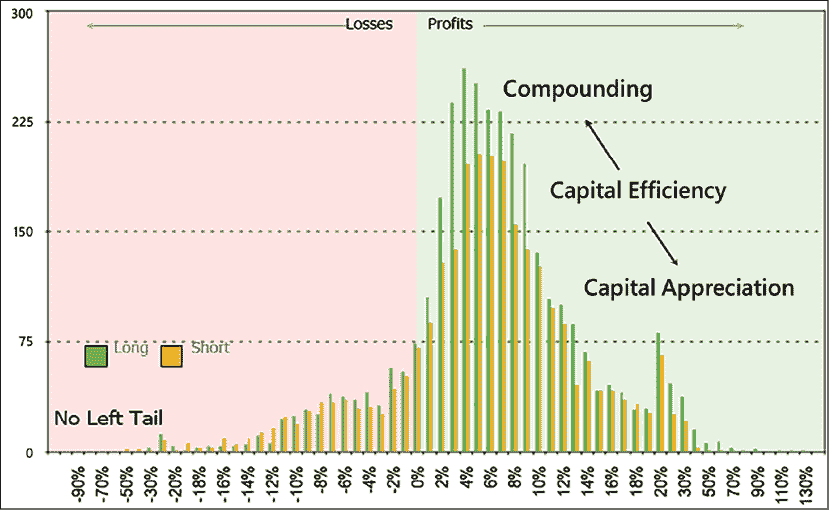
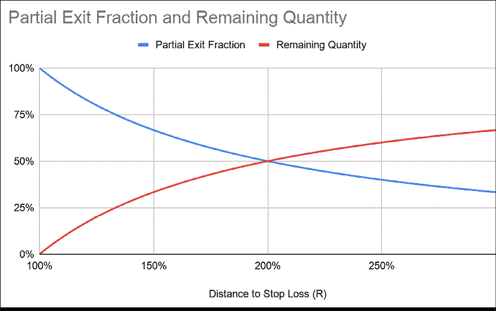
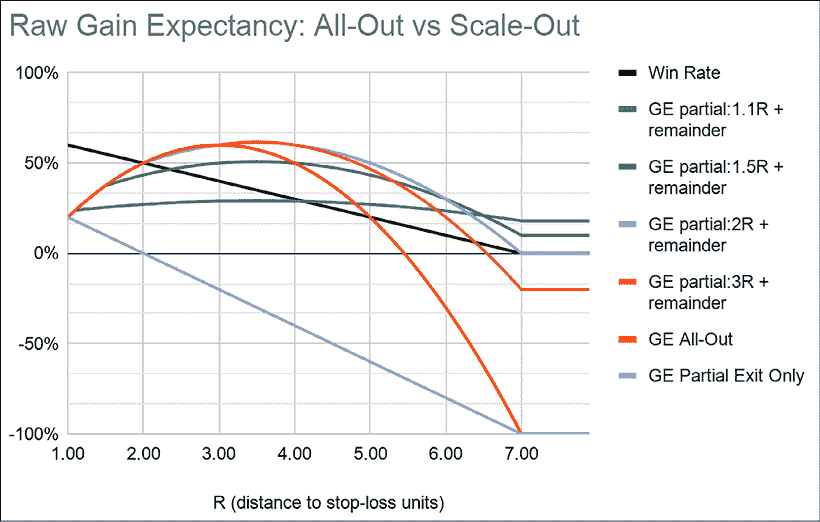

# 七、提高您的交易优势

> "我从不在底部买入，也总是过早卖出."
> 
> –纳撒尼尔·德·罗斯柴尔德男爵

尤塞恩·博尔特和罗杰·班尼斯特都跑得很快。前者是短跑运动员。后者跑了一英里。同样的运动，不同的学科。这里的等价条件是你有一个主导风格:要么均值回归，要么趋势跟踪。提高你交易优势的最好方法是改进你的主导风格。第一步是从什么是最佳策略开始，然后逐渐把你的风格推向那个方向。

建立统计上稳健的交易优势是为了夺回控制权。你无法控制一周或一年后市场的走向，但你可以完全控制你的投资组合今天的走势。接下来的章节邀请你用不同的方式思考你的主导风格，以及如何建立一个更好的交易优势。

现在，我们知道交易优势有两个模块:信号和资金管理。我们也有一个清晰的趋势跟踪或均值回归正交易优势的可视化表示。接下来，我们将把**损益** ( **P & L** )分布分解成两部分。首先，我们将介绍控制损失的所有步骤。然后，我们将看看你可以采取哪些步骤来增加利润。最后，我们将研究一种创新性下注规模确定策略。

在此过程中，我们将讨论以下主题:

*   混合交易风格
*   止损心理学
*   止损的科学
*   提高你交易优势的技巧
*   如果你的主导风格是均值回归，如何倾斜你的交易优势

您可以通过以下链接访问本章中所有图像的彩色版本:<add url="" of="" online="" colour="" image="" pack="" here="">。</add>

# 混合交易风格

正如我们在*第 6 章*、*中发现的，交易优势是一个数字，这里是公式*，均值回复策略有负偏斜。泰坦尼克号的几次损失会使船沉没。趋势跟踪策略有积极的倾向。几个王子会弥补所有的青蛙。这两种策略都有好的和不好的属性，下表总结了这些属性:

<colgroup><col> <col> <col> <col></colgroup> 
|  | 平均值回复 | 趋势跟踪 | 混合物 |
| 胜率 | 高的 | 低的 | 高的 |
| 波动性 | 低的 | 高的 | 低的 |
| 左尾巴 | 长的 | 短的 | 短的 |
| 右尾巴 | 短的 | 长的 | 长的 |
| 斜交 | 否定的；消极的；负面的；负的 | 积极的 | 积极的 |

一个理想的策略应该结合两种风格的优点，并尽量减少它们的缺点。这将是一个高胜率、低波动性、左短右长的混合体。混合 P&L 分布如下所示:

图 7.1:混合 P&L 分布具有高胜率和右偏斜

市场参与者和趋势跟随者有不同的信仰体系。前者认为低效率最终会回归均值，而后者则认为低效率会持续下去。虽然那些信仰体系是不可调和的，但仍然有可能将你的主导风格与相反体系的某些属性融合在一起。

以下几节中概述的技术将持续提高性能。然而，众所周知，顶级运动员与其他人的区别并不在于身体上的外在表现。这是他们内心对话的质量，他们内心的游戏。如果我们不承认房间里的大象，任何技术都不起作用。

专业卖空者和游客的区别在于他们有能力止损，更重要的是他们有坚持止损的毅力。

# 止损心理学

> “希望是个错误。”
> 
> –疯狂的麦克斯，后启示录时代的澳大利亚哲学家

仅在美国，减肥产业就价值 640 亿美元。然而，从 1999 年到 2016 年，肥胖率增加了 30%。减肥行业在商业上是成功的，但在实践中却是失败的，因为它试图解决错误的问题。这对于止损心理学有很多教导。

我们集体肥胖的原因不是我们摄入的食物。这就是我们与食物的关系。如果你的父母告诉你，不是“吃你的汉堡，它会让你变得强壮”，而是“加大那些致癌的转基因蛋白质，充满抗生素，它们会使你患心血管健康问题的风险增加两倍”，那么你可能会觉得不太倾向于食用圣牛的肉。

以下《科学美国人》的报道讨论了给牲畜喂食抗生素带来的健康风险:[https://www . Scientific American . com/article/most-us-antibodies-fed-t/](https://www.scientificamerican.com/article/most-us-antibiotics-fed-t/)。

每个人都知道在市场上赚钱的秘诀:“砍掉你的输家，抓住你的赢家。”裁掉失败者不是火箭科学。数学介于小学和中学水平的算术之间。然而，正是我们对待损失的方式使得兑现止损变得不可逾越。对正确的需求取代了赚钱的需要。

当人们说，“我不相信止损”，他们真正的意思是，“我不喜欢承认我错了。”他们经常敏锐地意识到有些事情不对劲。然而，他们的自我愿意忍受更多的痛苦，希望事情会有转机，他们最终会被证明是正确的。骄傲每次都会取代利润。诺贝尔奖获得者丹尼尔·卡内曼和阿莫斯·特沃斯基把我们对损失的风险寻求态度和对利润的风险厌恶称之为禀赋效应。

如果盈利等于正确，那么，从逻辑上讲，亏损就意味着错误。因此，任何损失都是对我们自我形象的直接攻击。自我感觉需要正确，但不觉得有义务赚钱，为了保护自己，会默认防御机制——否认和偏离。这迫使我们牺牲利润，长时间忍受极度的痛苦，危及我们的工作、名誉甚至家庭。在自我意识投降之前，名誉、公司和国家都已经衰落了。

底线是，40 岁的对冲基金经理受教育过度，竞争激烈，极其老练，但他们仍下意识地在一个 5 岁的儿童操作系统上操作。他们只是变得更擅长精心策划合理化。

比尔·阿克曼和瓦兰特(VRX 饰)的公开失败说明了自我凌驾于利润之上。当 VRX 股价从峰值下跌 50%时，选择很简单:要么坚持过程，要么坚持股票。谨慎管理他人的资金(OPM)要求平仓全部或部分头寸，因为股价必须上涨 100%才能回到之前的水平。另一种选择是假设分析是正确的，但“市场是错误的”，并呼吁市场的虚张声势。阿克曼爱国地选择牺牲另一部分 OPM 股票，以 104 美元的价格额外购买了 200 万股。对正确的需求取代了为投资者谨慎管理风险的受托责任。

随后，Valeant 股价再次跳水，较峰值下跌了 92%。此时，价格必须上涨 11 倍才能达到盈亏平衡。该头寸以每股 11 美元左右的价格平仓。有时我们会赢，有时我们会学习。阿克曼在 2016 年致股东的信中重申了谦逊的重要性:*“为了成为一名伟大的投资者，你首先需要有信心在别人对你所追求的机会高度怀疑的时候，在没有完美信息的情况下进行投资。然而，这种自信必须小心翼翼地与认识到自己错误的谦逊相平衡。”*

这让我们知道了获胜者的命运。Kanneman 和 Tversky 已经证明，当涉及到利润时，我们是规避风险的。我们并非生来就渴望提前获利，事实恰恰相反。初学者的运气是另一个在低概率事件中承担大风险的短语，这是任何经验丰富的玩家都不敢做的事情。我们并非生来厌恶风险。婴儿总是会绊倒。他们振作起来，继续前进。

只有在经历了几次惨痛的损失后，我们才会变得厌恶风险。一旦我们经历了亏损的痛苦，无论什么时候利润开始在我们眼前蒸发，我们都会冲过去保护剩下的利润。如果我们从未经历过亏损，我们就不会觉得有必要用利润来规避风险。如果不是因为我们从损失中吸取了痛苦的教训，我们会欣然接受风险最大的策略。一句话:我们的本性是运行输家，然后削减赢家。在市场上赚钱违背了我们的本性。

如果我们想在这场与自然的斗争中取得成功，我们需要重新连接我们与损失的联系。只要我们保持以结果为导向的观点，那么自然，我们的杏仁核，将战胜理性，我们的前额叶皮层。

在执行交易者英语中，只要我们认为赚钱等于正确，赔钱是失败者的事，我们就会找借口不承担那些损失。我们需要把正确和做正确的事情联系起来，不管结果如何。

这里有六个步骤来彻底改变你和止损的关系。

## 第一步:问责制

> "做生意是拖延的一种形式。"
> 
> 蒂姆·菲利斯

自我的工作是在任何时候不惜一切代价保护自己。也许你现在已经得出结论，你不受有害自我的影响，但在其他市场参与者身上看到了这一点。好吧，如果那些想法刚刚闪过你的脑海，那么你的自我意识刚刚对你开了一个玩笑。丹尼尔·戈尔曼认为，自我欺骗是一种根深蒂固的内在机制，会掩盖自己的痕迹。下面是两个例子，它们将帮助你亲眼看到你的潜意识有多擅长欺骗你。

例子 1:上次你的投资组合出现巨额亏损时，你做了什么？你看了所有的分析师报告了吗？你打电话或拜访公司或分析师了吗？你更新你的盈利模式了吗？你得到股票的颜色了吗，这是一个代号*是一个流行的缩写*？有没有在论坛上和同龄人发泄？你喝醉了，责怪别人，还是发泄在家人身上？或者，你只是止损，然后继续前进？

学术界最近关于拖延症的研究表明，在考试之前，学生们会从事一些大脑积极记录的重要活动，如整理房间、清理桌子或给父母打电话，但不是像为考试而学习这样的必要活动。他们实行一种心理核算形式:通过做好事，他们希望自己能弥补未能做重要事情的损失。市场参与者也不例外。当头寸变坏时，我们从事积极的任务:更新收益模型或致电分析师、专家和公司，但推迟不可避免的事情:裁掉输家。

例 2:让我们从对性能的影响上更进一步。在我之前的一份工作中，我很幸运地接触到了几位经理的所有交易。我继续分析它们，希望从这些聪明的头脑中收集一些经验。最大的发现是一个违反直觉的游戏规则改变者。如果把表现最差的三只股票从每个投资组合中剔除，那么在整个样本期内，每个经理每年的表现都会超过基准(成本前)。然而，如果把表现最好的三只股票排除在外，并不是所有人都会跑赢大盘。此外，优异表现不会持续。

每一个市场参与者都延迟平仓亏损头寸，期待价格回升一点点，以更有利的报价退出。不幸的是，一天会变成一周、一个月等等。亏损不会在一夜之间发生。他们溃烂和坏疽。第一步是保持整洁的交易日志。永远记住你的平均损失和最大损失。下一次有人问你的交易优势时，你的默认回答应该是这样的:“哪一边:多头，空头，还是盘整？”这将避免由于你自我的抵制而导致对市场事件的延迟反应。

## 第二步:重新连接你与损失的联系

让我们来回顾一下减肥。健康的食物选择就像卖方维护研究:平淡乏味。我们知道坚持节食会让我们保持身材。所以，我们继续前进，摆脱层层繁荣。但是一旦我们达到了减肥目标，会发生什么呢？绝大多数会复发。有些人从一种饮食跳到下一种，希望有一天会有所收获。我们失败是因为我们只关注节食的物理方面:减肥。我们敷衍了事，却忘记了教训。在节食期间，我们吃正确的东西，吃正确的量，然而我们保持着潜在的不健康的联系，这最终会使我们回到不良的饮食习惯。食物不是问题。通常，减肥不是身体上的问题，而是精神上的问题。

这同样适用于止损。我们从智力上理解它们的重要性。当我们经历困难时，我们会努力剔除失败者。但接下来是这个特殊的位置:“如果我们再给它一天，最多一周，它就会好转。这只是暂时的。”我们内心的白痴处理与我们精神变态的另一个自我——经济人——的谈判。定局是这个例外:“就这一次，我们可以推翻止损。”接下来，我们知道，投资组合看起来像一个烂苹果的果园。只要我们把正确和逐笔交易的盈利联系在一起，我们就从结果导向的角度来运作。

我们不能对抗我们对正确的需求，但是我们可以改变我们选择正确的东西。除了赚钱，我们还可以把正确与严格遵守投资流程联系起来。我们从一个我们无法控制的结果转向一个面向过程的视角。

这实现了两件事:

*   成功变得可以量化和衡量。一次交易是随机的。一百次交易是一个数据样本。试图控制个人结果是徒劳的。然而，完全有可能衡量投资过程的遵守情况。好消息是，在历史上的每一种文化中，尤其是在我们这个行业，纪律是一种美德。
*   欺骗的诱惑自然会消失。正确不再是关于离散序列的结果。你可以反复亏损，但仍然是正确的。当你坚持从这个角度运作时，你实际上改写了神经通路，从而重塑了你的身份。

高级版本是将这种过程思维模式游戏化。这里有一个个人的小故事。回到 2012 年末，日本首相安倍晋三决定重振日本经济。市场机制瞬间从沉闷的熊市变成了狂暴的牛市。每次股票止损，我都会在 YouTube 上播放詹姆斯·布朗的《我感觉很好》的第一个音符，并模仿罗宾·威廉姆斯在《早安，越南》中的表演。某个时候，一个同事走到我面前说:“你真的很喜欢詹姆斯·布朗，是吗？”我的回答是，“嗯，我今天刚止损了。”

这个轶事可能很傻，但其中有一点科学。大脑讨厌止损。它也渴望即时的满足。那个小小的叮当声带来了多巴胺的震动。随着时间的推移，它压倒了不愿兑现止损的情绪，并重新连接了与亏损的联系。到连续第 30 次止损时，我已经有了免疫力，可以毫不费力地承受下一个 100 点。你自己试试看。从小处着手。执行止损后立即奖励自己。几轮过后，你可能会注意到你的大脑开始渴望止损。你大脑的原始部分会为了多巴胺做任何事。你的工作是找出奖励应该附加在什么东西上。

纪律严明的基金管理应该像牙齿卫生一样乏味。人们很少对使用牙线感到兴奋。然而，大脑渴望刺激和新奇。因此，如果没有乐趣，就很难养成习惯。建立健康资金管理习惯的一个方法是引入奖励。下面是在实践中如何做到这一点:

1.  每周或每月对你的系统进行评分。
2.  决定一个能让你感觉良好的奖励。什么都有可能。例如，我的第一只对冲基金的本金会购买一瓶葡萄酒，其价格将与累计表现相关。每个人都期待着周五的压力释放。
3.  每次你打破自己的高分，立即奖励自己。

游戏化毫不费力地完成了两件事。它让我们参与到有利可图的活动中，并推动我们打破最高记录。

## 第三步:何时设置止损

婚姻合同被称为婚前协议而不是婚后协议是有原因的。一旦我们进入一个位置，情绪就会出现。我们不再是旁观者。我们在比赛中，我们内心的白痴在驾驶座上。设置止损的最佳时间是进场前五分钟。其次，风险预算决定仓位大小。止损是等式中的一个变量。如果你不为你能承受的损失设定一个限度，你最终可能会失去比你应该失去的更多的东西。

止损不是故事。一些自由市场参与者声称，当故事发生变化时，他们会改变自己的观点。问题是我们不是公正的法官。我们总是努力使我们的行动与我们的信念相一致。当我们的行为与我们的想法不一致时，不安就会产生。这叫做*认知失调*。我们只有一个简单的选择:根据我们的信念重新调整我们的行动，或者改变我们的观点以适应新的事实。虽然前者是合理的选择，但令人遗憾的是，我们经常选择后者。当价格对我们不利时，更容易的选择是改变我们告诉自己的故事。等到故事发生变化的时候，我们最初的论点早已走上了进化的歧途。这种现象的一个简单表现就是我们对亏损头寸的态度。我们在理智上知道大约一半的交易会失败，但是我们在情感上表现得好像我们必须一直 100%正确。在执行交易员英语中，这被称为狂妄。

对于自由市场参与者来说，一个有效的方法是在交易开始时给每笔交易分配一个预算。超出预算，承诺将仓位减半。如果交易成功，利润将补偿已实现的损失。如果情况继续恶化，处理小头寸比高风险头寸更容易。止损是一种预算管理练习。因此，它是一个价格。承诺把它写在入门成本和价格旁边。不要相信你的大脑会记分。你内心的白痴会重新谈判，骗你犯一个愚蠢的错误。

## 第四步:死前:对抗过度自信的疫苗

事后分析是金融服务行业的一个热门话题。在金融克里奥尔语中，它通常指的是官僚式的乏味的管理仪式，即事后检查你过去的交易，准确无误。如果这整本书有两个要点，预死亡应该是其中之一。事前分析是过度自信的终极解毒剂。心理学家加里·克莱因发明的一种技术，死前方法包括在时间上向前移动，想象你将要做的决定以失败告终。

乐观情绪通常在进场前达到顶峰。没有人会一边骄傲地走向圣坛一边想着离婚。当我们下单时，我们内心的白痴唱着一些有毒的合理化歌曲，比如:“当然会是赢家，否则，我为什么一开始就做那笔交易？我有那么傻吗？”不幸的是，冷酷的统计现实证实了这一点:“是的，我们就是那么蠢。”即使我们的长期盈利率低于 50%，我们可以预测，好像每笔交易都是赢家。

在每笔交易中练习这个练习:就在下单之前，想象这将是一个必须被止损的输家。想象自己亏本平仓。感受你情感资本的流失。运用你所有的感官，尽可能生动地描绘这一画面:嘴里的恶趣味、狭隘的视野、手心冒汗、无助、致命的内心对话。现在，你会怎么做？调整您的仓位大小并发送订单。这种技术看起来有点自虐，但它完成了两件事:

*   它确保了保守的头寸规模:如果你预期交易会失败，你会下较小的赌注。你也会远离流动性差的选股。你会成为一个更好的风险管理者。
*   它允许我们预先处理我们的悲伤。我们通常预期交易会成功。当他们不这样做时，我们悲伤地走向清算。按照伊丽莎白·库伯勒-罗斯经典的悲伤五阶段，我们浪费时间、精力和金钱与不可避免的事情讨价还价。如果你做一笔交易，期望它成功，但它失败了，这强化了习得性无助。如果你认为每笔交易都会失败，那些成功的交易会是惊喜。那些失败的将按预期执行。因此，尸检消除了情感上的创伤。预先包装你的悲伤可以让你对损失更加客观。

快乐生活的秘诀是接受死亡为日常伴侣，而在市场中赚钱的悖论是接受亏损并继续前行。

## 第五步:执行止损:原谅自己的错误

> “痛苦是不可避免的，苦难是可以选择的。”
> 
> – Rande Howell

止损和其他交易一样。然而，我们赋予它的意义可能是毁灭性的。每次你因为止损而自责，你就剥夺了自己的教训。

最近关于自我原谅的研究表明，学习过自我原谅技巧的学生提高了他们的学习能力，并且随着时间的推移表现得更好。当人们越过自己的界限时，原谅自己的人往往会从错误中学习。那些不原谅自己的人否认了从错误中学习的好处。矛盾的是，通过惩罚我们的易犯错误，我们谴责自己重复我们的错误。而是善待自己。安抚自己，就像在和孩子说话一样。

以下是它的作用:

*   你越原谅自己，执行止损就变得越轻松。
*   止损越容易，新的交易就越容易。
*   执行越流畅，性能越好。

一句话:原谅你的错误，你会成为一个更好的投资组合经理，更能忍受市场的艰难。

## 步骤 6:蔡加尼克效应能教会我们如何执行止损

Bluma Zeigarnik 是 20 世纪早期生活在维也纳的一位心理学家。当她正在享用咖啡时，她注意到一个服务员能非常准确地记住所有顾客的订单。在回家的路上，她意识到她忘了带围巾，于是回到店里。然而，尽管服务员可以毫不费力地记住所有未完成的订单，但他不记得半小时前见过她。这让她对我们的大脑如何处理未完成的任务有了重大发现。未完成的业务(在这种情况下，一个未完成的订单)往往会在我们的脑海中挥之不去，而完成的任务(一个已经付款并离开的客户)很快就会被遗忘。

在任何时候，我们的投资组合都有问题孩子。那些人总是占据比他们应得份额更多的精神空间。它们总是萦绕在我们的脑海里，直到我们最终鼓起勇气把它们赶走。现在，你有没有注意到一两个星期后，你几乎记不起那些让你如此困扰的职位的名字？这就是应用于投资组合管理的蔡加尼克效应:眼不见，心不烦。迅速处理问题儿童可以实现两件事:保护你的金融资本不被进一步侵蚀。更重要的是，它释放了精神空间，保护你的情感资本不至于陷入自我鞭笞。

蔡加尼克效应是执行止损的强大动力。你最不想看到的就是让小损失恶化成大规模的爆发。执行止损从来都不是一个容易的决定。如果你回顾一路走来的所有损失，你可以有把握地得出结论，没有发生灾难性的事情。事实上，你仍然在那里，部分是因为你做了那些艰难的决定。所以，下次你犹豫要不要扣动扳机的时候，告诉自己现在可能看起来很难，但你会克服它，下周就会精神焕发。

既然我们已经升级了我们的内在游戏，让我们在我们的外在游戏上下功夫，让那些数据看起来更好！

# 止损的科学

> "利润看起来很大，但亏损却很小."
> 
> 迈克尔·马丁

大多数市场参与者都有一些模糊的想法，认为亏损伤害了底线。他们只是从未真正意识到损害。亏损对你不利。50%的提款意味着你必须获得 100%的利润才能达到收支平衡。举个例子:有人在 100 买了一支股票。你负责交易的另一边，护送到 50。游客一直坚持着，因为长期的故事仍然完整无缺。那个固执的业余爱好者将不得不 100%地努力，使它回到收支平衡。

下面这张无关痛痒的图表展示了一些强有力的东西，足以让任何理性的市场参与者相信，保持较小的损失是唯一的出路。下面的线代表从峰值到-90%的下降。上面的线代表弥补这些损失所需的增长百分比。当提款-10%时，账户必须增长 11.2%才能回到正常水平。在-20%的情况下，需要 25%才能赚回这些损失。在-90%的情况下，需要 10 倍的增长才能弥补损失。因此，我们将在接下来的章节中看到的大多数技术都与亏损有关，亏损会以几何级数耗尽账户。下次你想抓住一个失败者不放的时候，拿出这张图表来提醒自己，为正确付出的代价是破产:

图 7.2:提取水平和弥补损失所需的收益百分比

设置和兑现止损的能力是专业卖空者和游客的区别。知道如何设置止损是需要练习的，这样才能最小化拉锯和最大化风险回报。接受一次又一次的止损，仍然进行下一笔交易，这需要谦逊和勇气。

止损是交易优势公式中最重要的变量。它对三个变量有直接影响:胜率%、损失率%和平均损失率%。相比之下，进入并不直接影响这些变量。止损在赌注规模和交易频率方面也起着至关重要的作用:止损越紧，赌注越大，但交易频率也越高。

市场参与者有时对止损持怀疑态度。然而，止损就像寿司刀。如果你不知道如何使用它们，你会割伤自己。没有一个头脑正常的人会因为自己造成的伤口而责怪寿司刀。同理，用止损割伤自己的，只有没做足功课的游客。这里有三个简单的原则。

## 止损是一个合乎逻辑的信噪比问题

止损被广泛误解。他们不是日常交易决策的一部分。等待止损被触发是一种非常低效的退出方式。你不希望你的安全气囊在每个红绿灯处都爆裂。理想情况下，在止损触发之前，你会减少、退出、甚至逆转头寸。

把止损当做信号，把波动当做噪音。如果你把信号放在噪声带内，你得到的回报就是噪声。市场是嘈杂的。在大动作之前通常会有一些错误的开始。如果你把止损放在波动范围内，你可能会在做对之前被鞭打几次。这将迅速侵蚀你的资本基础。你需要大动作来弥补之前的小损失。

你想把你的止损点放在一个有明确信号的点上，这个信号表明要么你的论点无效，要么另一边可能有一个有效的进场点。这可以通过使用波动率指标来实现，如**平均真实范围** ( **ATR** )或标准差。这些信号也可以是逻辑变化，如高于或低于高/低的一些买卖差价。

## 止损是一个统计问题

新手交易者喜欢保护自己的利润，所以他们设置了严格的止损。止损越紧，到止损的距离就越小，因此对于相同的风险预算，可以承受更大的头寸规模。这导致较大的平均头寸规模和较低的平均亏损，但亏损率较高。紧止损往往容易被触发。这也增加了交易频率。失败来自于小损失的积累。例如，如果需要三次尝试才能正确，那么价格必须移动三倍的距离到止损点，才能保持一个正的**预期收益** ( **葛**)。

经验丰富的交易者可以睡个好觉。他们开始明白市场需要回旋的空间。他们把止损设得更宽一些。这导致更小的平均头寸规模、更大的平均亏损、更高的盈利率、更低的亏损率和更低的交易频率。下表总结了止损对通用电气的影响:

<colgroup><col> <col> <col></colgroup> 
|  | 紧的 | 松的 |
| 胜率 | 降低 | 高等级的；级别较高的；较重要的 |
| 损失率 | 高等级的；级别较高的；较重要的 | 降低 |
| 交易频率 | 高等级的；级别较高的；较重要的 | 降低 |
| 位置大小 | 更大的 | 较小的 |

止损是通用电气方程式中最重要的变量。因此，知道如何设置止损将对任何策略产生巨大影响。相比较而言，选股(即进场)只对胜率和损失率有间接影响。

这个故事的寓意是:给市场足够的回旋空间来伸腿，但不要太多来逃跑。可能存在一个数学上的最优值，但市场条件也会随着时间而变化。波动性是不一致的。

## 止损是一个预算问题

止损用于计算头寸规模。离进场成本越远，仓位应该越小，反之亦然。这将对业绩、波动性和选股产生影响。

宽止损保证了小仓位。这将导致较低的波动性和较低的业绩。不稳定的股票往往有很大的止损，这导致了小仓位。当需要根据头寸规模对信号进行排序以分配资本时，低波动性股票将被系统地优先考虑。

当从做多转为做空时，预计市场会有一些阻力是合理的。将止损固定在一个会使你的论点无效的水平，相当于采取一个小的试探性立场。如果不成功，损失会很小。如果成功的话，这个小小的职位将会资助后续的活动。

# 提高你交易优势的技巧

接下来，我们将看看如何提高你的交易优势，这是本章的重点。我们将首先考虑如何缩短左边的尾巴，让亏损的峰值接近盈亏平衡。

## 技巧 1:两个半场的游戏:如何在提高你的交易优势的同时，砍掉输家，抓住赢家，保持信心

全世界每家医院都有一条不成文的规定:外科医生不应该给自己的家人做手术。当涉及到你自己的孩子时，没有所谓的职业超然。然而，在投资领域，基本面自由支配的市场参与者很难接受止损的想法。

他们一直被要求为自己的信念辩护，但又被期望对自己的损失采取外科手术式的态度。他们被迫失去公正性，但仍被要求保持职业上的超然。如果他们想掌握卖空游戏，全权参与者将不得不克服他们的不情愿。

这个强大的技术将帮助你实现不可能的事情:砍掉你的输家，运行你的赢家，保持你的信念，同时机械地提高你的交易优势。它是专门为那些纠结于止损的自由市场参与者设计的。

对付今天的输家比预测明天的赢家要容易得多。只要输家的总体规模小于赢家，通用电气就会保持乐观。如果你把损失了一半平均贡献的输家减半，机械地说，你赢了。在实践中，是这样做的:

1.  区分贡献者和诋毁者的所有立场。
2.  计算总平均贡献或平均利润。右尾异常长的市场参与者可能想用中间值而不是平均值。
3.  一旦所有诽谤者失去了一半的平均贡献，他们的权重减半。

对于剩余的未结头寸，只会发生两件事:

1.  股票掉头开始做贡献。这将抵消损失。增加新的份额。
2.  头寸继续受损。它们只能减少一半的量和一半的速度。更重要的是，位置小的比位置大的更容易临床脱离。

两半的游戏为基本面投资中最古老的问题提供了一个简单优雅的解决方案。信念和固执之间只有一线之隔。投资者希望管理者有信念。然而，他们不原谅固执。他们没有航海的勇气。他们不想和船一起沉。如果头寸开始受损，两个半场的游戏调和了信念的需求和行动的需求。你通过保持部分开放展示了你的信念，通过降低风险展示了你的谦逊。

其次，这种方法遵循性能的循环。当你的风格起作用时，你的平均利润会增加。你可以承担更多的风险，持有更大的头寸，也可以承受更大的损失。当你的风格失宠时，平均利润会缩水，从而允许较小的损失，也就是较小的仓位。

第三，交易优势在机械上得到改善:亏损相对于利润保持在较小水平。这种方法将损耗分布倾斜成直角。它让亏损交易的顶峰模式更接近盈亏平衡。在执行交易者的英语中，当利润减少时，亏损减少得更快。最后，它改变了正确的定义。这不再是每个想法盈利能力的二元结果。正确是对一个过程的遵守，这个过程将导致更高的总体盈利能力。简而言之，它不再触发战斗、逃跑或冻结本能，而是激活思维大脑。这样，两个半场的比赛减少了压力，提高了盈利能力。

## 技巧 2:用跟踪止损来减少损失

> “你应该总有最坏的打算。唯一的选择应该是更快地离开。”
> 
> 理查德·丹尼斯，养龟人

刚进场时，头寸最容易受到影响。有利可图的交易需要时间来成熟。与此同时，不盈利的公司通常很快就会倒闭。这种时间滞后导致帐户余额的减少。你可能无法减少误报的数量，但你仍然可以通过在止损之前插入一个减轻损失的出口来限制损失。这就是跟踪止损派上用场的地方。跟踪止损是随着价格移动的移动止损。有两个目标:

1.  随着价格的有利变动，降低风险。
2.  当价格开始向相反方向移动时，尽可能少的返还利润。

追踪止损不是万能的。它们对于保护利润是有效的，但对于捕捉长期趋势却适得其反。在短边上尤其如此。跟踪止损可能会让你在市场继续下行之前过早地出局。当交易最脆弱时，应该明智地使用跟踪止损来快速降低风险。这里的目标是利用每一个有利的价格变动来降低风险。这可能会对胜率产生不利影响，但会降低平均损失和累计损失。这将使亏损模式更接近盈亏平衡。

让我们用一个数字例子来说明逻辑止损对头寸规模、损失减轻、交易优势和整体权益曲线的影响。假设市场在 100 点又印出了一个局部高点，低于 108 点的历史高点。这看起来像天花板。目前价格水平在 98 左右。你决定做空。

让我们起草一份标准作战计划:

1.  在天花板处设置固定止损:如果市场占据了历史高点，那么它显然是看涨的。
2.  设置跟踪止损:作为一个经验丰富的交易者，你预计高点 100 会被重新测试，所以你在 101 设置跟踪止损，刚好在本地高点之上。
3.  选择止损来计算你的头寸规模:你可以选择固定止损或跟踪止损来计算你的头寸规模。
4.  计算你的头寸规模:你当前的头寸规模算法得出的风险预算是 100，000 美元，除以止损点的距离，得到的是股票数量。我们将在下一章更详细地考虑头寸规模。
5.  为降低风险设定一个目标价格:你在打印后发现了局部高点，包括滑点和交易成本，你的平均价格是 98。你设定目标价格为 95，在这个点上你将退出 3/4 的头寸(以保持积极的预期),并让剩余部分无风险。如果市场强劲反弹，你仍有时间回补。

现在，我们来选择哪个止损来锚定你的仓位大小。情况 1、2 和 3 依赖于相同的信号。情况 1 假设信号是有效的，并且将保持该位置，直到证明是错误的。案例 2 使用跟踪止损来积极获取利润。情况 3 假设信号是正确的，但预计会出现拉锯:

*   案例一:不设跟踪止损:你把止损设在 108:10000 股做空。你认为任何介于两者之间的东西都是噪音，不想进出交易。
*   案例 2:激进的跟踪止损:你从 101 跟踪止损计算你的仓位大小:33，000 股空头。你假设信号足够有效，并想获取尽可能多的利润。
*   案例 3:试探性持仓:你从 108 开始计算你的持仓规模，但是设置跟踪止损为 101: 10，000 股空头。由于几乎没有证据表明市场已经转向熊市，作为一个谨慎的风险经理，你使用固定止损来计算你的头寸规模，但使用跟踪止损来保护你的资本基础。

公平地说，大多数市场参与者会选择情况 1 或情况 2。要么设置止损，让仓位自然运行，要么进行交易是两个显而易见的选择。假设你 98 岁入学。既然我们已经设定好了，让我们来看看价格行为。在她改变主意并决定突破 108 点之前，市场很好地跌到了 96 点。跟踪止损已经下降到 99，因此在案例 2 和 3 中，你在 99 平仓。在案例 1 中，你以 108 收盘。

<colgroup><col> <col> <col> <col></colgroup> 
|  | 案例 1 | 案例 2 | 案例 3 |
| 风险预算 | One hundred thousand | One hundred thousand | One hundred thousand |
| 费用 | Ninety-eight | Ninety-eight | Ninety-eight |
| 头寸止损 | One hundred and eight | One hundred and one | One hundred and eight |
| 分享 | -10,000 | -33,333 | -10,000 |
| 退出价格 | One hundred and eight | Ninety-nine | Ninety-nine |
| 损益 | -100,000 | -33,333 | -10,000 |

让我们分析所有案例:

*   案例 1:这是基本案例。这个信号实际上是一个误报。你赢得一些，你学到一些。这就是生活。
*   情况 2:当从跟踪止损计算头寸大小时，止损有效地锚定在噪声带内。这是对信号的统计有效性和市场机制的假设。为了使策略有效，市场必须下跌。如果市场横向交易，将会有相当多的失败尝试，其累积效应将侵蚀资本基础。
*   案例三:一、固定止损设置在逻辑位置。如果价格创出新高，那么市场显然已经决定回到牛市。这与情况 1 一致。其次，跟踪止损在最脆弱的时候保护仓位。每一次有利的价格变动都会降低风险。当它不起作用时，很大一部分风险就会转化为接近盈亏平衡的小额损失。它不会像第一种情况那样发展成全面亏损。第三，当根据上限确定仓位时，你已经有效地采取了一个小的试探性仓位。你已经把筹码放在桌上，但你还不准备让市场摊牌。如果它正确地发现了一个趋势，初始位置可以被加满。否则，损失将得到控制。案例三是处理随机性和保本的有效方法。相比之下，在第二种情况下，每一次失败的尝试都会削弱你的资本。案例 2 正是趋势跟踪者最终在横盘中回吐收益的原因。

这里没有对错。目标不是告诉你一个你可以直接编码的策略，而是让你根据 P & L 分布来思考。前面的例子是处理随机性的许多方法之一，即减少误报的拖累。目标是让亏损的峰值尽可能接近盈亏平衡。对于可自由支配的市场参与者来说，在未来章节中概述的“两个半场的游戏”是一种系统化的方法，以保持亏损相对于利润较小。

## 技巧 3:三分之二的游戏:时间退出和如何修剪吃白食的人

如果你是一栋楼的房东，你会允许一些租户免租金吗？拖欠几个月后，你会驱逐那些不劳而获的人，因为这会损害盈利能力。这种常识性的方法并不适用于股市。每个投资组合都有相当一部分过期未还的陈旧头寸。

一个典型的误解是，性能会因为一些大的失误而下降。更深入的分析表明，吃白食者的累积重量拖累了性能，最终无法弥补一些损失。“次优阿尔法”经常发生，因为一堆“过时的”仍然堵塞着投资组合。

最常见的类型是“曾经我们是勇士”的老兵。他们曾经有所贡献，但有一段时间没有任何进展。由于其固有的 P&L 和情感依恋，他们很难被发现。这是锚定偏差的一个有趣且可以说是反常的表现。当进入成本远低于当前价格时，我们认为当前暗淡的回报是暂时的。在很多情况下，我们应该对投资组合中的所有股票培养这种超然态度。然而，同样的“自由放任”态度滋生了危险的自满情绪。市场参与者有时最终会在采取行动前返还大量账面利润。

一个简单的解决方案是引入时间加权回报。如果一只股票在一段时间内没有盈利，它的权重应该降低。这是一个简单的三步流程:

1.  决定持续时间。当有疑问时，计算年营业额并除以 3，取前三分之一作为持续时间。例如，营业额为 1 将产生 4 个月的周期。
2.  在步骤 1 中计算股票收益(不是业绩归因)。把它分成四个四分位数。专注于第三个四分位数。第一和第四个四分位数非常突出。所以，无论如何，他们都会被处理。处于第二个四分位数的股票并不是主要的贡献者，但它们仍然支付租金。第三季度股票的问题是它们并不突出。他们是行尸走肉，慢慢拖累业绩。
3.  将第三个四分位数中所有股票的权重减半。复杂的规则很容易被违反。所以，简单点:不贡献，分配减半。

此后会发生两件事:

1.  股票再次开始表现:增加新的份额。
2.  股票继续萎靡不振，甚至表现不佳。实现利润会显得有先见之明。较小的仓位总是更容易处理。

把你的投资组合想象成你的房子。你在一个地方住的时间越长，你积累的东西就越多。总有一些小东西是你为了情感价值而保留的。例如，如果你迷信或眷恋你宽松的旧大学毛衣，你很可能也是你职业能力中的“情感价值”投资者。股票在投资组合中的时间越长，它们就变得越粘。我们内心的白痴总是想方设法用诸如“我买什么来代替”这样的心理捷径来合理化旧的立场，或者“这是一个如此伟大的表演者，它会回来的。”这个游戏提供了客观的规则来克服最初的不情愿。第一步总是最难的。减少一次不新鲜的头寸，下次就更容易处理了。

其次，它使投资组合流动起来。正如市场谚语所说，“你的下一个想法有多好，你就有多好。”迫使陈旧的立场退出，为新的想法腾出空间。受先进先出 T2 规则约束的市场参与者不愿放弃旧头寸，这是可以理解的。处理陈旧头寸的另一种方法是对基础现金头寸使用期权策略。记住，随着时间的推移，你错的次数会比对的次数多，所以处理好今天的损失会让明天的利润看起来大很多。胜利者会照顾好自己。你的工作是照顾失败者。既然我们已经处理了分布的亏损面，我们接下来将考虑等式的利润面。

## 技巧 4:利润方面:通过小利润来降低风险和复合回报

> “你就这点本事，乔治？”
> 
> 穆罕默德·阿里，有史以来最伟大的人

对于做多的市场参与者来说，平仓以降低风险的想法有些陌生。他们想让他们的赢家经历“起起落落”在空头方面，上涨被称为熊市反弹和空头挤压。一天，市场参与者舒适地坐在一张短椅子上，用巴里·怀特浑厚的男中音哼唱着“永远不会让你走”。

第二天，他们踮起脚尖，用巴里·吉布的高音假声从牙缝中吹出“活着”的口哨。下面的技巧比熊市反弹的免疫力更进了一步。与旅游卖空者不同，这种技巧会教你如何迎接卖空。

如果你不把钱从桌上拿走，当不可避免的熊市反弹来袭时，你将在心理上处于不利地位。利润会很快蒸发，你内心的白痴会骗你补仓来保护剩下的利润。通过这样做，空头回补将增加反弹的燃料，从而保证不利的执行。另一方面，如果你提前减少你的敞口，你将处于一个更好的位置来度过反弹。你将会获得一些利润，降低风险，即使交易达到了你最初的止损，你也能保证收支平衡。你情感资本的损失与仓位大小成正比。现在，你银行里有钱了。你有一个小赌注，几乎没有削弱 P&L，但可能会资助后续的活动。

撤资可能会降低风险，但也会减少潜在利润。与此同时，停止的交易每次都要花费一个完整的风险单位。如果处理不当，通用电气肯定会迅速变得消极。

让我们回到 GE 来解这个方程:

接下来，让我们去掉盈亏率，只关注盈亏平衡，当 *R =成本-止损* , *X =价格-成本*,*N =待平仓头寸的分数*:

为了达到盈亏平衡而平仓的部分是以 R 表示的成本距离的倒数(从成本到止损的距离)。如果价格运行了 1.1R、1.5R 或 2R，那么分别平仓 91%、67%或 50%。

图 7.3:随着价格的有利变化，平仓头寸的比例

简单地说，头寸减少得越早，需要平仓的部分就越大，反之亦然。然后，这就变成了一场机会之舞:我们是应该让头寸运行得更久一点，还是应该在力所能及的时候兑现？当我们使用这个分数退场重新引入胜率时，通用电气方程现在看起来像这样:

我们最初去掉了*赢%* 和*输%* 来专注于收支平衡。简单地说，头寸平仓越早，剩余头寸越少。现在，市场并不总是善待它的参与者。把每个头寸想象成两个独立的交易:一个大的优惠券和一个小的彩票。第一次交易需要有 50%的大概率>。它持续时间短，距离短。第二种是无风险彩票。有时候会一直进行下去，有时候会付出代价关闭。

这里有一个额外的提示，也学到了艰难的方式。胜率不是常数。为了达到收支平衡，至少保持一个中性的交易优势，你可以拿出更大的份额，或者提前平仓。你拿出 75%而不是 67%或者你支付 1.5R 而不是 2R。盈亏平衡公式变成:

如果*亏%* > *赢%* ，干脆平仓更大一部分或者提前保释。赚钱现在降低到胜率高于损耗率。现在我们已经知道了距离和部分退出之间的关系，让我们比较一下单一退出和横向扩展之间的 GE。

让我们举一个简单的数字例子。假设我们的策略在 1R 时有 60%的胜率，或者从成本到止损的距离是 100%。为了练习起见，我们假设每增加 0.1R，胜率减少 1%:移动越大，频率越低。这是下图中的黑线。胜率呈线性下降(每 0.1R 下降 1%):

图 7.4:横向扩展 GE

我们来计算一下 GE，假设 100%平仓。这就是标着 GE 全力以赴的长弧线。葛遵循一条弧线。大动作很少，最终无法弥补损失。在这种情况下，盈亏平衡的胜率为 16%，风险/回报比为 5.4R。

接下来，让我们计算一下 GE 在交易中所占的比例。这是通用电气部分退出的唯一路线。它以线性方式跟随胜率。当价格超过 2R 时，成功的概率下降到 50%以下。唯一的部分出口机械地转阴。请注意，这个部分出口只是作为一个视觉参考，因为其余部分是无限期开放的。趋势跟踪策略通常有一个默认的负 GE。大招很少。损失控制是确保 GE 长期保持正值的唯一方法。

最后让我们用一个部分退出和剩余部分来计算 GE。我们设定了 1.1R、1.5R、2R、3R 四个目标价。我们分别关闭了 91%、67%、50%和 33%。其余部分关闭。部分退出显著改善了通用电气。1.1R 是最保守的。它有最低的回报潜力，但它有一个内置的强大通用电气。1.5R 具有较高的返回电位，但残余 GE 较低。在这个例子中，2R 和 3R 具有端子负 GE。过了某一点，剩下的就类似于彩票。

降低风险遵循两条规则:

1.  胜率>损失率:会有胜率暂时较低的时候。然后，要么早点平仓提高胜率，要么平仓大一点的部分降低风险。
2.  目标价> 1R:盈利一定大于亏损。

这个故事的寓意是，市场参与者最好在 2R 以下平仓。这提供了一个强大的通用电气。强劲的预期保证了更大的头寸规模。

然而，在设计稳健的策略时，这种形式的游击交易不会自然而然地出现在脑海中。反对部分退出的理由是，止损必然代价高昂。过早平仓会降低利润潜力。与此同时，一次失败将花费一个完整的风险预算。看起来交易优势注定是负面的。此外，从直觉上来说，横向扩展就像是把钱留在桌子上。事实上，绝大多数市场参与者宁愿专注于改善他们的信号，也不愿致力于他们的订单管理。

大多数市场参与者都采用全进全出的模式。他们漫步进来，有时加满油，然后突然蜂拥而出，所以退出是一个事件。市场参与者可能会发现，他们不愿意在刚开始工作时就大幅减少头寸。记住我们在玩一个无限的游戏。目标是设计一个强大的通用电气。这就引出了横向扩展技术的一种变体，称为 Kelly 横向扩展组合(因为没有更好的词)。这个主题的一个更激进的变化是利用高胜率来加大仓位。

正如我们在整本书中看到的，退出政策决定了战略类型。让自己的股票跑起来的趋势跟踪者很少能大获全胜。逆向投资者经常有小赢。因为出口决定了分布的形状，所以可以通过简单地向外扩展来结合两者的属性。

<colgroup><col> <col> <col> <col></colgroup> 
|  | 平均值回复 | 趋势跟踪 | 混合物 |
| 胜率 | 高的 | 低的 | 高的 |
| 波动性 | 低的 | 高的 | 低的 |
| 左尾巴 | 长的 | 短的 | 短的 |
| 右尾巴 | 短的 | 长的 | 长的 |
| 斜交 | 否定的；消极的；负面的；负的 | 积极的 | 积极的 |

这个概念就是大单进场，平仓大部分交易，让剩下的部分无风险运行。一个高概率的早期部分退出将模式，交易的峰值数量，带到了利润端。胜率超过 50%时，头寸规模甚至可以使用公式扩大，如**分数凯利**，或拉尔夫·文斯的**最优 F** 。Optimal F 是另一个强大的头寸规模算法，它考虑了最大的压降。这个保证大仓位大小。这些是快速交易。他们以几何速度迅速增加利润。这意味着我们大笔买进，赚快钱，平仓一大笔，然后在下一次交易中把钱投入流通，等等。

让我们回到假设的例子来解释这个过程。假设每增加 0.1，胜率就会下降 1%。凯利标准是一种下注规模算法，我们将在下一章中再次讨论。在 1.1R 时出场，胜率是 59%，保证每次交易有 18%的风险。

<colgroup><col> <col> <col> <col> <col></colgroup> 
| r(止损单位的距离) | 胜率 | 凯利全力以赴 | 部分退出数量 | 剩余物 |
| One | 60% | 20% | 100% | 0% |
| One point one | 59% | 18% | 91% | 9% |
| One point two | 58% | 16% | 83% | 17% |
| One point three | 57% | 14% | 77% | 23% |
| One point four | 56% | 12% | 71% | 29% |
| One point five | 55% | 10% | 67% | 33% |
| One point six | 54% | 8% | 63% | 38% |
| One point seven | 53% | 6% | 59% | 41% |
| One point eight | 52% | 4% | 56% | 44% |
| One point nine | 51% | 2% | 53% | 47% |
| Two | 50% | 0% | 50% | 50% |
| Two point one | 49% | -2% | 48% | 52% |

让这些百分比沉淀一秒钟。如果“做大然后回家...“早”终究是一个成功的策略？例如，假设你的目标价格是 1.5R。盈利率是 55%，所以根据上表中的凯利栏，你可以承担每次交易 10%的风险。你要做的就是在 1.5R 平仓 67%，然后重新设置止损到成本。剩下的 33%是无风险彩票。有时你记 2R，有时你记 5R。最坏的情况是，你以成本价成交。

让我们回顾一下来加强论点。第一笔交易是短期的，高胜率的，大仓位的，这将模拟均值回归分布。这种交易感觉像剪优惠券，因此得名。第二个交易是小额彩票。一旦第一笔交易结束，将止损重新设置为成本(绝对或相对)，并将其带入日落。这种交易天生有更多的随机回报，因此被称为彩票。

图 7.5: Kelly 横向扩展组合

此图建立在上一张图的基础上。它包括仓位大小。记住，投资者总是下意识地对提款做出反应，即使他们有意识地说他们想要回报。因此，提前平仓不仅是谨慎之举，也是增加管理资产的关键。组合均值回归和趋势跟踪策略的 P & L 分布的形状如下:

图 7.6:组合均值回归和趋势跟踪策略 P&L 图

交易的模式是盈利方(胜率高)。这与均值回归策略一致。交易的分布向右倾斜。这是趋势跟踪者的右尾彩票。

这是一个利用高胜率和大数定律的强有力的方法。这增加了资本基础，消除了失败，并补贴了未来的交易活动。因为有连续亏损，暴露限制，最重要的是投资者要保持平静的睡眠，交易大凯利尺寸是不明智的。正如我们之前看到的，投资者更关注提款，而不是回报，所以保守一点总是明智的。在接下来的章节中，我们将看到一个动态的分数方钻杆，这将有助于降低提款风险。

让我们回顾一下向外扩展(即严格的获利回吐)实现了什么:

*   复合小利润:均值回归市场参与者通过复合小利润赚钱。降低风险综合来说也是如此。薄利多销。
*   其次，“做空并抱有希望”策略的支持者总是声称，他们可以预见过去的短期波动。在他们第一次遭遇波动之前，情况确实如此。如果你已经平仓了一部分，降低了风险，获得了一些利润，并确保你会在交易中实现盈亏平衡，那么你会有更好的精神状态来度过熊市反弹。在实践中，你可能会松一口气，终于看到熊市反弹，回到游戏中，并在另一部分。
*   第三，它给出了另一种模式和 P&L 分布的利润侧的正偏斜。这种盈利模式是为了弥补亏损方的模式。换句话说，这些累积的小利润吸收了大部分损失。

这可能不是你在考虑建立交易优势时的想法。剪优惠券既费力又不性感，但这也是一种让交易优势向你倾斜的有效方式，可以迅速增加利润。

事实上，如果你勤勤恳恳地练习这种降低风险的方法足够多次，你会训练你的大脑去期待那些熊市反弹，把它们作为驾驭赢家的机会。当其他人都在防守时，你将有效地处于攻势。

## 技巧 5:拉长右尾巴

> “你不必用力挥棒就能打出全垒打。如果你掌握了时机，它就会去。”
> 
> 约吉·贝拉

跟踪止损对保护资本很重要，但它们只在完美的条件下起作用。因此，它们的保质期有限。一旦风险降低，保持跟踪止损可能会触发过早退出。跟踪止损的目标只是让 P&L 分布更接近盈亏平衡。现在剩下的是无风险的，你可能想取消跟踪止损，依靠你的固定止损。短期波动性较高。给市场一些回旋的空间，直到重新进入的时候。

我们都在最后的告别中挣扎。我们和赢家一起成为“感性价值投资者”。我们都倾向于推迟不可避免的事情。此外，在价格走势开始向相反方向移动很久之后，基本面消息仍然支持我们的论点。往返并不少见。

市场参与者真正需要的是趋势已经结束的客观信号。下限/上限方法足够稳定，可以让市场参与者在市场竞争中保持稳定。作为一般原则，最终的退出应该是趋势的逆转:股票留在投资组合中，只是换边。

传统观点认为，在你写完“入门书”之前，你不能写“退出书”做空方面的经验表明，情况并非如此。如果你先建立你的逃跑路线，那么进场只是滑动概率。例如，在熊市反弹结束后进场，比等待新低有更高的成功概率和更大的仓位。当账面利润变成真金白银时，就意味着退出。然而，在我们看最后的技术时，我们将讨论每个人最喜欢的话题:入口。

## 技巧 6:重新入场:通过逐步增加仓位来驾驭你的赢家

> “你，我，或者没有人会像生活一样艰难。但这与你击打的力度无关。关键是你能承受多大的打击，然后继续前进。”
> 
> 洛奇·巴尔博亚，意大利种马

20 世纪 80 年代初，海龟交易者赚了几亿，尽管只有 34%的胜率。他们的秘方是:他们给胜利者加分。只做多的参与者和卖空者之间的主要区别之一是定期补充成功头寸的必要性。当空头变得有利可图时，他们就会收缩。因此，长期流行的全进全出的方法在短期是行不通的。在某些时候，你需要补充你成功的短裤。当你给你的赢家充值时，你的胜率和平均胜率都会上升，这机械地提高了你的交易优势。

重返大气层确实是该战略显示其加速潜力的地方。你已经有了合格的赢家，存了一些钱，降低了风险。熊市反弹已经跌破了你的止损。购买压力耗尽。现在有足够的证据表明，熊市趋势正在形成。游客被赶了出来。借款人甚至可能更容易找到。星星排成一行，迎接辉煌的第二回合。

不幸的是，对于犯有 **TWA** 、**在美国**交易的市场参与者来说，扩大和缩小现金头寸是不可能的美国出台了一种被称为先进先出规则(FIFO rule)的库存估值方法，该方法规定，从最早的头寸到最新的头寸，所有头寸都必须被清空。这有效地阻止了美国参与者围绕其头寸进行交易。

在我们进一步讨论之前，这里有一个重要的注意事项，就是在熊市抛售时扩大仓位。随着市场萎缩，扩大规模很有诱惑力。然而，大多数市场参与者在这场游戏中是买，而不是卖。这让卖空者处于天然的劣势。假设某处有人一直在等待这个弱势，作为买入的机会。这意味着，一旦抛售压力耗尽，多头参与者将推动价格上涨，并引发空头止损。价格较低的第二批贷款可能会陷入困境。好消息是:如果空头头寸被确认，那么当下一轮熊市反弹结束时，市场会给你另一个进场的机会。耐心是一种有益的美德。

首先，把你的固定止损重新设置在原来的位置上。有几个合乎逻辑的地方。更激进的版本是将其置于当前熊市反弹水平的峰值之上。这将保护利润，但容易受到波动性冲击的影响。最保守的版本是把止损点放在之前的成本上。介于两者之间的是“法式止损”。市场在波动的高点和低点上下波动。这给了市场一些额外的回旋空间。它将保证较小的头寸规模。如果趋势逆转，你甚至可能放弃更大一部分利润，但你晚上会睡得更好。这种延迟一次的止损是时髦的迟到，因此有了“法式止损”的绰号。

一旦第一笔贷款的风险降低，就该使用和以前一样的策略重新进入了。重新进入空头头寸的最佳时机是在熊市反弹或空头挤压之后。游客被迫遮盖。购买压力很大。如果当前顶部低于前一个顶部，那么卖方仍在控制。重新进入的条件不需要像最初进入时那样严格。然而，重返大气层必须满足三个标准:

1.  趋势是你的朋友:当前的进场价格必须低于之前的价格。市场参与者有时会受到诱惑，以比前一次进入更高的成本重新进入。这是贪婪的丑恶嘴脸。它会工作，直到它不工作。有一天，这种感觉会像喝完龙舌兰酒后的早晨:“当时，这似乎是个好主意。”较高的进场价格可能是市场即将盘整或反转的早期迹象。
2.  借入利用率必须低于 50%:借入利用率定义为可用于借入的股份除以已借入的股份。它是煤矿中最简单的金丝雀，也是供求关系最有力的体现。随着长期持有人清算，可供借贷的股票供应枯竭。与此同时，随着卖空者涌入，需求也在增加。卖空者靠骑着做多者的尾巴赚钱。当借入利用率超过 50%时，这意味着长期持有者已经离开大楼，剩下的玩家只有游客。随着交易变得拥挤，再增加一部分是自找麻烦。而不是骑在做多者的尾巴上，将自己困在做空者的培养皿里。从长期来看，新买家抬高了价格。从短期来看，新卖空者的供应受到借款可用性的限制。因此，他们没有能力压低价格，但他们增加了抛售压力，使股票容易出现空头挤压。
3.  降低每个新头寸的风险:增加现有头寸被称为金字塔式投资。记住趋势最终会逆转。趋势反转的概率随着趋势的成熟而增加。

将所有未结头寸的固定止损重置为“法式止损”，即接近前一笔交易的成本。当你降低老仓位的止损时，不管接下来发生什么，它们都会盈利。这种嵌入式损益将补贴更新和更高风险的头寸。增加成功位置会提高胜率和平均胜率。

所有美好的事物最终都会结束。在一项交易上如此努力地工作，结果却被压榨或被扫地出门，这将是一种遗憾。

### 最终出口:右尾

趋势跟踪者喜欢骑着他们的仓位到日落。从长远来看，有时确实如此。在短期内，当下跌潜力达到 100%时，需要更多的技巧来获得 2-3 次机会。

最难的任务是放弃成功的交易。总是有这种想法，这可能是暂时的，可能会有更多的果汁。还有就是害怕回馈太多的业绩。这可以分解成两个独立的问题。市场参与者需要有一个客观的方法来知道趋势何时结束。其次，如果这种不稳定只是暂时的，那么他们需要一种重新进入的方式。

在*第五章*、*政体定义*中，我们描述了下限和上限方法。理由很简单。当所有的波动高点都低于最高点(天花板)时，牛市就结束了。当波动低点高于谷底时，熊市就结束了。下限和上限法是一种客观的方法来定义趋势何时结束。当一个新的楼层被打印出来时，退出你所有的空头头寸。请记住，您将回馈一些性能。用这种方法，你不是在预测顶部，而是在确认趋势已经结束。

### 最终退出后重新进入

市场并不总是像预期的那样运行，有时你会被震荡出局。如果市场又开始令人满意的表现，你会想要回来。最初的准入条件不太可能再次得到满足。例如，如果你卖空一个昂贵的**价格来预定** ( **PBR** )的 2，那么现在的估值可能已经下降到差不多公平了。因此，你不会进入这个行业。因此，你需要一些足够简单和坚固的东西来重新进入。

这就是地板和天花板方法的用武之地。如果你因为价格印了一个底价而被抛出，但随后又印了一个顶价，那就买入。将你的止损设在最高水平，确认借款的价格仍然合理，然后出发。关于短裤的一大要点是，它们的下降并不总是线性的。股票从过高的估值下降到合理的估值。他们有时会引诱多头参与者，结果又跌入价值陷阱的卖空天堂。给自己重新进入的灵活性。

趋势追随者占市场参与者的绝大多数。接下来，让我们来看看均值回归参与者是一种罕见的物种，他们有自己的一系列挑战。

# 如果你的主导风格是均值回归，如何倾斜你的交易优势

> “请赐予我宁静去斩断失败者，赐予我勇气去驾驭成功者，赐予我智慧去分辨两者的不同。”
> 
> –交易者的宁静祈祷

均值回归策略有一个负偏态，在利润端有一个模式:短右尾和长左尾。解决方法是缩短左尾巴，拉长右尾巴。

均值回归市场参与者天生擅长卖空。他们在高点做空，在低点回补。他们也更有能力应对横向市场。然而，主要的危险是忽视政权。虽然做空高估值或超买 RSI 很有吸引力，但处于上升趋势的股票通常会继续其上升轨迹。例如，RSI 在看涨的股票上会从 40 移动到 80，在看跌的股票会从 60 移动到 20。超买和超卖的情况通常是持续的迹象。

解决办法是等待机制从看涨转为看跌，或者看跌开始做空。在分析中纳入机制定义方法，如下限/上限或移动平均交叉，以减少假阳性。

## 损耗

与均值回归策略相关的风险就在尾部:一些巨大的损失。均值回归市场参与者不喜欢止损。它们有时会在股票开始按预期表现之前被触发。胜率下降，平均损失上升，期望值下降。一种方法是扩大止损。它们将保证较小的头寸，但也将防止灾难性的损失。

均值回归市场参与者通常会在他们最终会回归的前提下增加亏损头寸。例如，如果一只股票预期从均值的 2.5 个标准差恢复，在 4 个标准差，它甚至会更有吸引力。这在大多数情况下可能行得通，但如果行不通，损失可能是毁灭性的。LTCM 试过了。鞅工作，直到它不工作。

一个统计上更稳健但违反直觉的方法是，当市场参与者想要增加时，减少规模。假设过了某一点，低效率将不会得到纠正，而是持续存在。如果不是增加 4 个标准差的亏损，而是减少头寸，那么要么它会恢复并抵消亏损，要么它会减少亏损。无论哪种方式，都将使亏损倾向于盈亏平衡。

市场参与者应该减少而不是增加亏损头寸的另一个实际原因是通用电气的恶化。加到一个失败者直接增加损失率和平均损失。它通常会一直工作到坏掉。

## 收益

市场参与者过早退出。深度价值投资者通常会将接力棒交给成长型基金经理，然后他们会将股票带入极度兴奋的状态。他们把钱放在桌子上。

更重要的是，它们有一个不利的尾比。需要很多小的胜利来弥补一次大的损失。均值回归市场参与者需要拉长他们的右尾巴。

因此，解决办法是平仓一部分，让其余部分用不同的退出机制运行。

## 部分退出

使用前面提到的部分退出公式( *N = 1/X* )来计算你需要平仓多少才能让交易达到收支平衡。如有疑问，平仓三分之二到四分之三的仓位。高胜率加上超过 50%的获利，让赚钱的引擎持续运转。

对分布的影响将是一种在利润方面更接近盈亏平衡的模式。胜率不会受到影响，只会影响平均胜率。

## 出口

趋势跟踪者需要确信在此过程中需要获利。需要说服均值回归市场参与者，让他们推迟最终退出。问题在于价值投资者并不热衷于合理增长。在部分退出后，剩余部分将在以后使用不同的退出机制关闭。这里有两种方法:

*   均值附近的低效率:均值回归意味着均值附近的振荡。因此，平仓是不必要的保守，也有些不合逻辑。在平仓前，等待价格朝另一个方向上涨。这种过冲不一定是对称的。例如，一个 2.5 标准差的波动可能保证进场，但完全出场可能发生在 1 到 1.5 标准差之间。当估值下降时，它们通常不会停留在市场平均水平。在稳定下来之前，它们会过度下行。这种方法更符合均值回归市场参与者的心态。双方都存在效率低下的问题。
*   波动率跟踪止损:第一种是设置波动率跟踪止损，通常被称为吊灯止损。将一些平均真实范围加到最低价格上。当价格收在止损上方时平仓。这个技巧是从趋势跟踪策略中借鉴来的。

把右尾巴拉长想象成那些毁灭性损失的解毒剂。你越是允许你的仓位运行的时间长一点，下次恢复的时间就越少。

# 摘要

随机性是无法根除的。所以，不要再假装预测任何事情来欺骗自己了。当市场抛出柠檬时，那些学会为投资者做柠檬水的人会继续做生意。

在这一章中，我们开始考虑退出头寸的心理影响，以及克服你不愿意止损的一些步骤。然后，我们探讨了六种可以提高你交易优势的技巧。其中五个处理出口，一个处理入口，目标是缩短左尾巴和延长右尾巴。这是通过修剪失败者，让成功者超越你的舒适区来实现的。

接下来，我们将考虑任何战略的另一个重要部分——职位规模。