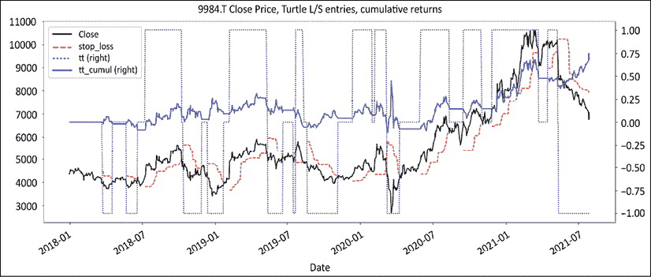
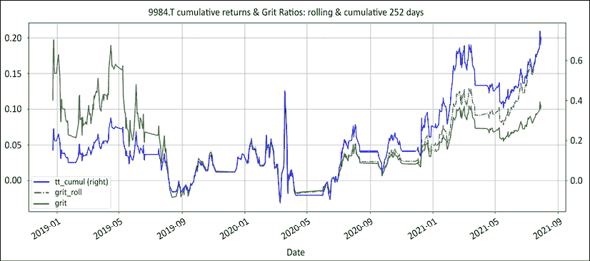
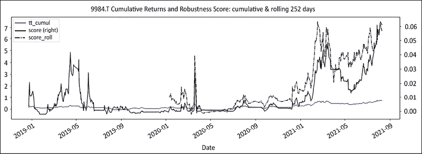

# nine

# 风险是一个数字

> "事实是不可改变的，但统计数据更容易驾驭."
> 
> 马克·吐温

在一天结束的时候，不管你是和你的另一半交易美国股票、猪肚还是丰富多彩的语言，你交易的只有一件事:风险。学者们把他们的职业生涯建立在用花哨的名字开发复杂的抽象指标上。越神秘，他们就越有可能在某个地方获得土地使用权。通过数学恐吓来证明是获得轻松学术任期的捷径。不幸的是，这些指标忽略了不老练的客户的体验，他们忍受着痛苦的透支。当市场参与者和投资者无法将抽象的数字与管理投资组合的现实相协调时，他们就会求助于故事。

在这一章中，我们将介绍三个指标:毅力指数、常识比率和预期收益的 t-stat。我们的目标是揭开风险的神秘面纱，让它回归到每个人都能直观感受到的事物上。

我们将讨论以下主题:

*   导入库
*   解读风险
*   夏普比率:错误问题的正确数学答案
*   砂砾指数
*   常识比率
*   范萨普的 SQN
*   鲁棒性得分

您可以通过以下链接访问本章所有图片的彩色版本:[https://static . packt-cdn . com/downloads/9781801815192 _ color images . pdf](https://static.packt-cdn.com/downloads/9781801815192_ColorImages.pdf)。你也可以通过这本书的 GitHub 资源库获得本章的源代码:[https://GitHub . com/Packt publishing/algorithm-Short-Selling-with-Python-Published-by-Packt](https://github.com/PacktPublishing/Algorithmic-Short-Selling-with-Python-Published-by-Packt)。

# 导入库

对于本章和本书的其余部分，我们将使用`pandas`、`numpy`、`yfinance`和`matplotlib`库。因此，请记住首先导入它们:

```
# Import Libraries
import pandas as pd
import numpy as np
import yfinance as yf
%matplotlib inline
import matplotlib.pyplot as plt 
```

# 解读风险

从短期来看，市场并不合作。市场达尔文主义表明，卖空者会成为出色的风险管理者。在接下来的部分中，我们将探索三个被大大低估的风险度量标准及其源代码。使用其中的任何一个或全部来校准风险，你可能会有一个长期的战斗机会。当被问及风险时，市场参与者通常会做两件事。

第一个是推出一系列指标。他们从夏普比率开始，增加了跟踪误差的测量，用 Sortino 调味，一茶匙 Treynor，一滴 Jensen Alpha 让它看起来不错，用信息比率画龙点睛，它就可以提供给一群怀疑的客户，他们假装喜欢“高级美食”这个数字。度量标准的任意扩散告诉我们一件事:我们天生不理解风险。

市场参与者做的第二件事是进入论文模式。他们讲述关于美联储、量化宽松、利率、技术颠覆(新潮的新同义词)和[在此插入一系列危言耸听的新闻……]的故事。

在金融克里奥尔语中，对无人能控制的未来的所有恐惧的总和被称为担忧之墙(T2)。

风险不是所有恐惧的总和。风险不是一个故事。风险是一个数字。在微观层面，是你在一次交易中能承受多少损失。在投资组合层面，这是你能够承受的总的损失，并且仍然保持领先。在专业水平上，它是在有人毫不客气地拔掉插头之前，你能承受多少损失、多频繁损失和多长时间损失。在生活方式层面，它是在给无聊的高中生教授数学之前，你从一个商店跳到另一个商店的频率。

没有人能预测这个世界会发生什么，但每个市场参与者都可以控制他们的投资组合在冲击面前的脆弱性。在*第一章*、*股票市场博弈*中，我们考虑了有限与无限博弈。无限游戏的目标是留在游戏中。如果你想玩一个无限的游戏，那么你需要专注于评估你在震荡中生存下来的能力，以及活到下一天交易的能力。因此，衡量稳健性的合理方法是在等式中的某个地方包括提款。

# 夏普比率:错误问题的正确数学答案

夏普比率是行业生活中如此复杂的一部分，以至于像“你好吗？”可以很容易地换成“你的夏普怎么样了？”这个比率试图回答的问题在概念上很简单:对于每一个波动单位，你能从无风险资产中获得多少个单位的超额回报？现在，所有的问题都不是源于公式，而是源于人们赋予波动性的含义。波动是坏的、有风险的还是不确定的？

下面是夏普比率的数学公式，其中 Rp 等于资产收益，Rf 等于无风险收益:


该比率着眼于无风险资产的年化平均超额收益除以这些收益的标准差。标准差衡量中值回报的方差。回报波动越大，标准差越高，比率越低(反之亦然)。相对于无风险资产的超额回报是一个简单的测试:对于每一个额外的波动单位，你是更好地将钱存放在特定的经理那里，还是安全地存放在国债或货币市场基金中？

就连天才威廉·夏普也对他创造的衡量标准提出了批评，这个标准现在已经成为默认的行业标准:夏普比率。这个指标达到了它的目的。有两件事它做得很好:

1.  **跨资产统一衡量**:现在普遍认为，阿尔法生成中最关键的组成部分是资产配置。困难在于要有一个跨资产类别的统一的风险调整后的阿尔法指标。这就是夏普比率发挥作用的地方。它可以通过固定收益、股票、商品等来计算。
2.  不确定性:人类大脑天生就将不确定性与风险联系在一起。它触发杏仁核，激活战斗、逃跑或冻结反射。

夏普比率是在 1966 年发明的。这在革命时代是革命性的:埃尔切格瓦拉和菲德尔卡斯特罗仍在古巴与巴蒂斯塔作战。正如先驱威廉·夏普自己所说，当计算能力仍然有限时，这是好的。但从那以后，时代变了。医生已经停止给孕妇开香烟处方，塑料已经成为主要的海洋物种，比那些把人送上月球的计算机更强大的计算机现在可以装进每个人的口袋。

首先，让我们以我们最喜欢的*海龟换假人*策略为例，重用`regime_breakout()`和`turtle_trader()`函数。我们将计算滚动和累积系列的风险指标。这个策略是在绝对系列上运行的。这里纯粹是为了教育目的。

```
def regime_breakout(df,_h,_l,window):
    hl =  np.where(df[_h] == df[_h].rolling(window).max(),1,
                                np.where(df[_l] == df[_l].rolling(window).min(), -1,np.nan))
    roll_hl = pd.Series(index= df.index, data= hl).fillna(method= 'ffill')
    return roll_hl
def turtle_trader(df, _h, _l, slow, fast):
    _slow = regime_breakout(df,_h,_l,window = slow)
    _fast = regime_breakout(df,_h,_l,window = fast)
    turtle = pd. Series(index= df.index, 
                        data = np.where(_slow == 1,np.where(_fast == 1,1,0), 
                                np.where(_slow == -1, np.where(_fast ==-1,-1,0),0)))
    return turtle
ticker = '9984.T' # Softbank
start = '2017-12-31'
end = None
df =  round(yf.download(tickers= ticker,start= start, end = end, 
       interval = "1d",group_by = 'column',auto_adjust = True, 
prepost = True, treads = True, proxy = None),0)
slow = 50
fast = 20 
#### removed for brevity: check GitHub page for full code ####
df[['Close','stop_loss','tt','tt_cumul']].plot(secondary_y=['tt','tt_cumul'],
                                  figsize=(20,8),style= ['k','r--','b:','b'],
                       title= str(ticker)+' Close Price, Turtle L/S entries, cumulative returns') 
```

使用对数返回而不是算术返回。它们更容易操作。累积回报是应用`np.exp`方法的每日回报的总和。



图 9.1:软银海龟的假人、位置和回报

这也是我们之前看到的图表。它显示了软银的收盘价，跟踪止损位高于或低于收盘价。它显示多头和空头头寸以及累计回报。现在我们有了策略，让我们在滚动和累积的基础上运行风险度量。

我们将从夏普比率开始。无风险回报被设定在任意一个基点的十分之一。

```
r_f = 0.00001 # risk free returns

def rolling_sharpe(returns, r_f, window):
    # Calculating average returns in a rolling window
    avg_returns = returns.rolling(window).mean()
    # Calculating the volatility of average returns in a rolling window
    std_returns = returns.rolling(window).std(ddof=0)
    # Rolling Sharpe ratio function
    return (avg_returns - r_f) / std_returns

def expanding_sharpe(returns, r_f):
    avg_returns = returns.expanding().mean()
    std_returns = returns.expanding().std(ddof=0)
    return (avg_returns - r_f) / std_returns

window = 252 
df['sharpe_roll'] = rolling_sharpe(returns= tt_log_returns, r_f= r_f, window= window) * 252**0.5

df['sharpe'] = expanding_sharpe(returns= tt_log_returns, r_f= r_f) * 252**0.5

df[window:][['tt_cumul','sharpe_roll','sharpe'] ].plot(figsize = (20,8),style = ['b','c-.','c'],grid=True,
title = str(ticker)+' cumulative returns, Sharpe ratios: rolling & cumulative') 
```

代码没有什么大的神秘之处。首先，我们计算一个滚动夏普，然后是一个累积夏普。使用标准公式计算年度结果:252 个工作日的平方根。


图 9.2:软银累积回报率和夏普比率:滚动和累积

滚动的夏普点划线比代表累积夏普的实线更不稳定，反应更灵敏。这仅仅是由于数据样本的大小。

风险通常等同于波动性。它弥补了令人愉快的公式。在这种情况下，夏普比率似乎是风险调整后回报的完美指标。唯一的问题是，在实践中，波动性并不是衡量风险的标准。为了证明这一点，让我们提出几个一夜之间撞上冰山的高夏普比率策略，以及几个非常持久的低夏普比率策略。现在，一些低波动性策略风险极大。这里有几个例子:

1.  **长期资本管理公司**(**【LTCM】**)在倒闭前几个月，一直采用波动性相当低的策略。他们在交易均值回归策略。这些策略具有持续的低波动性回报，这有利于高夏普比率。他们也许能挺过一次诺贝尔奖，但两次就太多了。
2.  **做空伽马波动基金**:金融大危机前，波动基金是时髦的投资工具。他们的策略包括从出售**价外**(**)期权中收取溢价。由于这些期权到期的概率极低，它们表现出持续的低波动性。他们的夏普比率高于行业平均水平。在波动性飙升、期权到期之前，一切都运转良好。亏损成倍增加，多年积累的回报在几周内蒸发。短伽玛在金融上相当于用一个巨大的桶玩统计俄罗斯轮盘赌。什么都不会发生，直到你打爆自己的头。在行业术语中，这被称为“在蒸汽滚筒前捡硬币”**

 **相反，尽管夏普比率很糟糕，一些波动性策略却有非常好的记录。作为一个群体，系统化的趋势跟踪商品交易顾问，如保罗·都铎琼斯、艾德·塞科塔、比尔·邓恩和威廉·埃克哈特，几十年来一直屹立在阿尔法世代金字塔的顶端。回报参差不齐。趋势跟踪者一年中大部分时间都在保护他们的资本，一年只有几次获得超额回报。

底线是，恕我直言，夏普比率是错误问题的正确数学答案。波动性是衡量风险的正确标准吗？夏普比率是衡量经波动性调整后的回报率的指标。波动不等同于风险，而是反映了不确定性。尽管不确定性可能会在我们哺乳动物的大脑中引发一些警报，但我们作为市场参与者的工作描述清楚地表明:“对不适感到舒适。”

# 构建组合风险指标

接下来的三个指标可以说是更接近风险的近似值，也更直观。

## 砂砾指数

> “当我坐在格莱斯顿旁边离开餐厅时，我认为他是英国最聪明的人。但当我坐在迪斯雷利旁边时，我觉得自己是最聪明的女人。”
> 
> 珍妮·杰罗姆，温斯顿·丘吉尔的母亲

投资者的行为似乎常常与他们的利益相悖。他们说他们想要回报，但他们对提款做出反应。更具体地说，他们以三种方式应对提款:

*   数量级:永远不要测试你的投资者的胃口
*   频率:永远不要测试你的投资者的神经
*   **恢复期**:永远不要考验你的投资者的耐心

在整个金融多元宇宙中，**毅力指数**可以说是最被低估的指标。不到几个指标如此优雅地捕捉到了健壮性。概括地说，它通过将一段时间内的业绩除以整个亏损面来评估下跌风险。该指数拥有罕见的数学公式的特权，非常直观，任何人都可以看到。为损失的数量和规模而痛苦的时间似乎是很久以前的事了，感觉就像一个漫长的痛苦表面。

曲面的数学计算称为**积分**。接下来，由于这些损失明显影响了金融和情感资本，它们应该在分母中。

回报率是投资者最终感知的。勇气指数是投资者最后得到的除以所有损失的痛苦。这个公式最初是由彼得·g·马丁在 1987 年发明的，并在他的书*富达基金投资者指南*中作为**溃疡指数**发表。传奇交易者埃德·塞科塔回收了它，并将其重新命名为塞科塔湖比率。这些是完全相同的公式，只是名称不同。既然溃疡指数或塞科塔湖比率可能无法吸引他们真正应得的关注，不如将其重命名为砂砾指数？

以下是源代码:

```
def rolling_grit(cumul_returns, window):
    tt_rolling_peak = cumul_returns.rolling(window).max()
    drawdown_squared = (cumul_returns - tt_rolling_peak) ** 2
    ulcer = drawdown_squared.rolling(window).sum() ** 0.5
    return cumul_returns / ulcer

def expanding_grit(cumul_returns):
    tt_peak = cumul_returns.expanding().max()
    drawdown_squared = (cumul_returns - tt_peak) ** 2
    ulcer = drawdown_squared.expanding().sum() ** 0.5
    return cumul_returns / ulcer

window = 252
df['grit_roll'] = rolling_grit(cumul_returns= df['tt_cumul'] , window = window)
df['grit'] = expanding_grit(cumul_returns= df['tt_cumul'])
df[window:][['tt_cumul','grit_roll', 'grit'] ].plot(figsize = (20,8), 
                secondary_y = 'tt_cumul',style = ['b','g-.','g'],grid=True,
    title = str(ticker) + ' cumulative returns & Grit Ratios: rolling & cumulative '+ str(window) + ' days') 
```

砂砾计算顺序如下:

1.  使用`rolling().max()`或`expanding().max()`计算峰值累积回报
2.  通过从峰值中减去累积回报并求平方来计算下降的平方
3.  通过计算提款平方的平方根来计算最小平方和
4.  将累积回报除以溃疡

该代码生成以下图表:



图 9.3:软银累积回报和粒度比率:滚动和累积

让我们来看一下图表上的进度。在上半年，砂砾指数反映了业绩。在下半年，业绩大幅上升，但下降的幅度和持续时间也是如此。指数落后于急速上升。这种策略有效，但有一段时间会下降，因此指数表现平平。这一指标只使用了对投资者至关重要的两个变量:业绩和亏损。如果你认为业绩是最终的目的地，那么用亏损的表面来除它，就能显示出旅程，以及一路上所有的坎坷。

说到底，人类没有达到伟大，是因为没有崇高的目标。他们中途放弃，因为旅途太艰难。这正是这个比率的作用。该指数实现了与夏普比率相同的功能，同时考虑了通往卓越绩效的道路上的所有坎坷。与夏普比率相比，它具有以下优势:

1.  **跨资产统一衡量**:在绝对和相对序列中，它在每个资产类别、每个策略、每个时间框架中统一发挥作用。
2.  **不确定性**:这一指标关注投资者真正关心的提款方面:规模、频率和恢复期。相反，夏普比率混淆了不确定性和恐惧。它惩罚高波动性策略，不管它们的盈利能力如何。

它不仅仅是夏普比率。逆转高夏普比率的最简单方法是抑制波动性。只要波动性被压缩，即使是最不温不火的回报看起来也不错。一个微小的分母会放大任何分子，无论它多么平庸。难怪资金会流向固定收益。回报少得可怜，但可以预见。

另一方面，砂砾指数关注的是累积回报，而不是平均回报。这是退休后第二天银行对账单底部的数字。因此，这一指标对固定收入类型的稳定平庸的容忍度很低。然而，这一指数也将惩罚投资者真正关心的唯一事物:下行波动性。退休时，领养老金的人只看他们账户里的钱的总数。他们不关心平均日收益的稳定性。对基金经理来说，稳定的日回报率是一个感觉良好的指标，而不是养老金领取者。当市场参与者使用夏普或**资本资产定价模型** ( **CAPM** )分配资产时，他们用回报换取稳定。根据定义，固定收益的夏普比率高于股票。它也有哮喘的回报。

勇气指标的优势在于它可以自我约束，甚至对那些完全不懂金融的人也是如此。对于这个指数，没有比生活更好的比喻了。绩效是你已经完成的事情。生活是当你有其他计划时发生在你身上的事情，一路上充满了挫折。用障碍来划分你的成就，你就有了相当强大的勇气。在实践中，Grit 指数的稳健性意味着它可以被用作不同策略之间的资产配置指标。

## 常识比率

> “常识没那么普遍。”
> 
> 伏尔泰，自由战士

杰克·施瓦格出场。在我个人的遗愿清单中，与*市场奇才*系列的作者进行一对一的会面，就像猫王的“非常感谢”或詹姆斯·布朗的输血一样。他的书现在和几十年前出版时一样有意义。

我非常荣幸地帮助施瓦格先生在东京的一次 CLSA 会议上发表了主题演讲。所以，我们在这里讨论的是他被低估的智慧瑰宝，市场意识和废话。在这本书里，他讨论了收益与痛苦的比率(T2)，也就是广为人知的利润比率(T4)。

本质上，这是交易优势/收益预期的一个小版本。在谈话的某个地方，我介绍了我自制的小指标，混合了两个比率，他的回答是，“嗯，常识。”主人发话了。我现在可以死了，快乐但有些困惑。几个小时后回到牧场，我向我的老板展示了它，并解释了理由:“是的，伙计，这是常识，”我的老板非常详细地解释道。

当两个以对数标度表示尊敬的人得出相同的结论时...瞧:**常识比** ( **CSR** )诞生了。这个标准背后的基本原理是输掉一场比赛有两种方式:要么得分，要么通过击倒。策略失败有两种方式:要么是过度累积损失，要么是几次毁灭性打击。这可以追溯到仅有的两种交易策略:趋势跟踪或均值回归。与趋势跟踪相关的风险存在于总量中。与均值回归相关的风险在尾部。

这两种策略有不同的风险因素，聚集或尾部。它们需要不同的风险指标。企业社会责任的基本原理是提出一个统一的衡量标准。早在小学时，当我的数学技能还没有达到“永久的低水平”时，就有了乘法的传递性这个奇妙的概念。将这两种策略的风险指标结合起来的最简单的方法是将收益与痛苦(利润)的比率乘以尾部比率。这是对第六章、*的原始代码的回顾，交易优势是一个数字，这是公式*，加上 CSR:

```
def rolling_profits(returns,window):
#### removed for brevity: check GitHub repo for full code ####
def rolling_losses(returns,window):
#### removed for brevity: check GitHub repo for full code ####
def expanding_profits(returns): 
#### removed for brevity: check GitHub repo for full code ####
def expanding_losses(returns): 
#### removed for brevity: check GitHub repo for full code ####
def profit_ratio(profits, losses):    
#### removed for brevity: check GitHub repo for full code ####
def rolling_tail_ratio(cumul_returns, window, percentile,limit):
    left_tail = np.abs(cumul_returns.rolling(window).quantile(percentile))
    right_tail = cumul_returns.rolling(window).quantile(1-percentile)
    np.seterr(all='ignore')
    tail = np.maximum(np.minimum(right_tail / left_tail,limit),-limit)
    return tail

def expanding_tail_ratio(cumul_returns, percentile,limit):
    left_tail = np.abs(cumul_returns.expanding().quantile(percentile))
    right_tail = cumul_returns.expanding().quantile(1 - percentile)
    np.seterr(all='ignore')
    tail = np.maximum(np.minimum(right_tail / left_tail,limit),-limit)
    return tail

def common_sense_ratio(pr,tr):
    return pr * tr    
window = 252
df['pr_roll'] = profit_ratio(profits= rolling_profits(returns = tt_log_returns,window = window), 
                             losses= rolling_losses(returns = tt_log_returns,window = window))
df['pr'] = profit_ratio(profits= expanding_profits(returns= tt_log_returns), 
                             losses= expanding_losses(returns = tt_log_returns))

df[window:] [['tt_cumul','pr_roll','pr'] ].plot(figsize = (20,8),secondary_y= ['tt_cumul'], 
                            style = ['r','y','y:'],grid=True) 
```

在这里，我们计算滚动和累积比率并打印出来:


图 9.4:累积回报和常识比率:累积和滚动

利润比率是趋势跟踪策略最合适的风险指标。风险是在总量中，正如我们在*第 6 章*、*中看到的，交易边缘是一个数字，这里是公式*，而*第 8 章*、*头寸调整:* *资金是在资金管理模块*中赚的。上图显示了一个健康但不惊人的利润率。换句话说，这一策略在目前的亲执政官(直立人的祖先)模式下似乎是有效的。

我们将以 CSR 作为结论，CSR 是利润和尾部比率的乘积:

```
window = 252

df['tr_roll'] = rolling_tail_ratio(cumul_returns= df['tt_cumul'], 
                             window= window, percentile= 0.05,limit=5)
df['tr'] = expanding_tail_ratio(cumul_returns= df['tt_cumul'], percentile= 0.05,limit=5)

df['csr_roll'] = common_sense_ratio(pr= df['pr_roll'],tr= df['tr_roll'])
df['csr'] = common_sense_ratio(pr= df['pr'],tr= df['tr'])

df[window:] [['tt_cumul','csr_roll','csr'] ].plot(secondary_y= ['tt_cumul'],style = ['b','r-.','r'], figsize = (20,8),
    title= str(ticker)+' cumulative returns, Common Sense Ratios: cumulative &  rolling '+str(window)+ ' days') 
```

图表反映了一个相对健康的企业社会责任，没有隐藏的惊喜。


图 9.5:累积回报和常识比率:累积和滚动

趋势跟踪策略需要关注的模式是越来越重的指数值。随着战略的推进，亏损的累积权重将对利润率产生更大影响。值得关注均值回归策略的模式是稳定的低值指数突然下降。这意味着利润无法弥补损失。

CSR 重新捕捉与这两种策略相关的风险。它也有力地表明了从损失中恢复的能力和策略的周期性。以下示例展示了这一指标在实践中是如何工作的。

例 1:假设一个策略的年回报率为 10%。最好月份的第 95 个百分位数为+0.6%，而最差月份的第 5 个百分位数为-2%。可以计算以下值:

*   增益与疼痛的比率= 1.1
*   尾比= |0.6%/-2%| = 0.3
*   CSR = 1.1* 0.3 = 0.33

CSR 低于 1 意味着该战略容易受到冲击。低于 0.5 的比率意味着该策略可能无法从严重冲击中恢复。CSR 在用均值回归策略识别隐藏风险方面特别有效。均值回归策略表现出稳定性和稳健性。利润有规律地滚滚而来。然而，不可预测的左翼事件破坏了这种稳定性。

这种策略看似每年产生+10%的稳定利润，但 0.3 的尾部比率表明从事故中恢复需要三倍的时间。唯一重要的问题是:投资者会有足够的耐心，还是会减少损失，寻找替代工具？这个问题的答案可能会在 2007 年宽客的死亡故事中找到。这些策略多年来表现良好，但当它们遭遇意想不到的缩水(相对于其月平均回报率而言，缩水幅度较大)时，投资者就会赎回。

我们将在第 10 章、*精炼投资领域*中考虑以前策略的一些失败，以及一些要避免的陷阱。

例 2:让我们采取一个策略，在一个完整的周期内落后基准 2%(GPR = 0.98)。假设赢家是输家的三倍，或者说尾部比率是 3。同样，根据之前定义的函数计算必要的值:

*   增益与疼痛的比率= 0.98
*   尾部比率= 3
*   CSR = 0.98 * 3 = 2.94

收益与痛苦的相对比率为 0.98，你可能会想，“为什么要投资一个随着时间推移会赔钱的工具？”欢迎来到你的平均**共同基金**。随着时间的推移，费用会侵蚀业绩，导致共同基金的表现低于基准。然而，表现是周期性的。有时候，经理会把球打出公园。CSR 是一种简单的入场计时方式，更重要的是，是一种出场计时方式。高 CSR 加上低于标准的利润/收益/痛苦比率是强季节性的证据。这些产品有时工作得很好，但从长远来看会失败。在*第 5 章*、*状态定义*中，我们看到了几种状态定义方法，这些方法有助于识别季节性。

## 范萨普的 SQN

范·撒普博士使这种统计学上的测量方法重新出名。系统品质号 SQN 是对历史悠久的 t-stat 的精彩诠释。它拥有衡量稳健性所需的所有要素。首先，策略只有在具有交易优势时才是可行的。在预期增益变为正值之前，什么都不会发生。

其次，它融入了交易频率。赚钱是一回事，预约交易是另一回事。一个策略在保持正收益预期的同时交易得越多，复利回报就越快。时间是立即跃入脑海的变量。

市场参与者应该降低他们的时间框架，只要他们能够保持积极的收益预期。例如，在日线和 4 小时线上可行的策略会在较低的时间框架内产生更多的信号。此外，更短的时间框架意味着更紧的止损和更大的仓位，但也意味着更嘈杂的信号。

第三，结果被归一化。它们用标准差表示，在这种情况下，意味着交易边缘波动。谈到回报，每个人都喜欢高峰，但没有人喜欢低谷。最后但同样重要的是，代码实现起来很简单:

```
def expectancy(win_rate,avg_win,avg_loss):  
    # win% * avg_win% - loss% * abs(avg_loss%) 
    return win_rate * avg_win + (1-win_rate) * avg_loss 
def t_stat(signal_count, trading_edge): 
    sqn = (signal_count ** 0.5) * trading_edge / trading_edge.std(ddof=0) 
    return sqn 
# Trade Count
df['trades'] = df.loc[(df['tt'].diff() !=0) & (pd.notnull(df['tt'])),'tt'].abs().cumsum()
signal_count = df['trades'].fillna(method='ffill')
signal_roll = signal_count.diff(window)
# Rolling t_stat
#### removed for brevity: check GitHub repo for full code ####
# Cumulative t-stat
#### removed for brevity: check GitHub repo for full code ####
df[window:][['tt_cumul','sqn','sqn_roll'] ].plot(figsize = (20,8),
                secondary_y= ['tt_cumul'], grid= True,style = ['b','y','y-.'], 
                 title= str(ticker)+' Cumulative Returns and SQN: cumulative & rolling'+ str(window)+' days') 
```

代码是这样工作的:

1.  信号的数量需要与体制脱钩。`.diff()`识别状态变化:从 0 到 1，反之亦然。`notnull()`方法确保信号在输入时计数一次。从那里，`abs()`把所有的交易算作一个。累计总和通过`cumsum()`完成。然后，`fillna`方法向前填充所有缺失的值。`.diff(window)`应用于交易列返回交易的滚动数。
2.  接下来，我们计算滚动级数。复制每日回报，并为亏损日分配 N/A。这带来了正回报。我们计算移动平均计数，并将其除以窗口。同样，我们计算滚动损益，按窗口划分。
3.  累积计算的工作方式略有不同。使用扩展法计算退货的累计数量。用同样的方法计算正回报的累计数。然后，计算胜率、平均胜率和损失。
4.  我们在*第六章*、*中重复使用收益预期的代码，交易优势是一个数字，下面是公式*。

SQN 是一个常规的 t-stat，以增益预期和信号计数作为输入变量。我们用交易的平方根乘以预期收益的信息比率。执行交易员英文翻译是:我们将交易频率计入交易边缘。


图 9.6:软银累积回报和 t-stat(范塔普的 SQN):累积和滚动

如果没有交易频率，SQN 将会是夏普比率的另一个变体，使用预期收益而不是平均回报。相反，这是一个非常有用的功能，它结合了交易频率和优势。例如，如果一个策略赚钱了，但每年闰年都根据预约交易，投资者可能不会继续投资你。相反，如果一个策略在从每天到 1 小时的较低时间框架内保持相同的正优势，用较低的时间框架交易来更快地复利会更有意义。

# 鲁棒性得分

> "马萨拉:印度烹饪中使用的各种香料的混合物."
> 
> –韦氏词典

砂砾指数、常识比率和范萨普的 SQN 都衡量稳健性。对于非金融人士来说，毅力指数可能是最优雅、最容易理解的指标。企业社会责任是煤矿中一只很好的金丝雀，用来搜寻狡猾的均值回归策略。SQN 是衡量质量的重要标准。他们都做这份工作。它们衡量稳健性的一个特定方面:

1.  砂砾指数综合了整个时期的损失。它给出了下跌所有方面的准确表现:幅度、频率和持续时间。
2.  CSR 将两种策略特有的风险结合在一个单一的措施中。它显示了每个指标的风险平衡情况。
3.  t-stat SQN 将交易频率纳入交易优势公式，以显示最有效的资金使用。

然而，在公开抨击风险指标激增后，提出三个稳健性指标可能会显得有点虚伪。最简单的解决方案是把它们都扔进锅里，利用乘法的传递性搅拌:

```
def robustness_score(grit,csr,sqn): 
    start_date = max(grit[pd.notnull(grit)].index[0],
               csr[pd.notnull(csr)].index[0],
               sqn[pd.notnull(sqn)].index[0])
    score = grit * csr * sqn / (grit[start_date] * csr[start_date] *
    sqn[start_date])
    return score

df['score_roll'] = robustness_score(grit = df['grit_roll'], csr = df['csr_roll'],sqn= df['sqn_roll'])
df['score'] = robustness_score(grit = df['grit'],csr = df['csr'],sqn = df['sqn'])
df[window:][['tt_cumul','score','score_roll']].plot(
    secondary_y= ['score'],figsize=(20,6),style = ['b','k','k-.'], 
title= str(ticker)+' Cumulative Returns and Robustness Score: cumulative & rolling '+ str(window)+' days') 
```

稳健性得分函数将所有变量重新设定为所有变量都不为空的第一个日期。这将所有变量置于相同的起始值。我们制作了以下图表:



图 9.7:软银稳健性得分:滚动和累积

稳健性得分指标针对的是希望用一个最终得分来统治所有人的参与者，或者更有可能是希望用一个排序关键字来对几个策略进行排序的参与者。这个乐谱像《弗兰肯斯坦》一样是重新作曲的，所以很难读懂。每个风险指标都有自己的价值。这就是为什么该指标将所有值重新设定到系列的开头。将它们合并成一个单一的指标不会产生一个超级风险指标，但一个切实的好处是作为一个统一的排序关键字。该指标将优先考虑以下策略:

1.  由于 SQN，贸易频繁
2.  由于砂砾指数，具有可接受的压降
3.  产生可观的回报

相反，它将惩罚以下战略:

1.  由于所有的指标，我没有正的交易优势
2.  由于企业社会责任指数，有着令人讨厌的尾部比率
3.  由于 SQN，交易很少

只要移动平均指标保持在 1 以上，并且该值似乎在上升，就可以认为该策略相当稳健。这种健壮性分数的一个用例可能是作为排序或资产分配目的的排序关键字。当有几个指标可供选择时，将它们组合成一个统一的基准指标并进行排序。然而，要小心行事。在将它部署到生产中之前，请先熟悉它。

# 摘要

在这一章中，我们没有对风险进行礼貌的对话。我们研究了风险指标，这些指标将毫无疑问地评估你是否有能力活到下一天进行交易。我们考虑了砂砾指数，它综合了压降(幅度、频率和持续时间)。然后，我们引入了常识比率，它重新捕捉了趋势跟踪和均值回复策略的特定风险。最后，我们看了系统质量数比率，然后将这三者结合成一个组合的稳健性得分，这有助于通过结合交易频率和交易优势来评估风险。

在*第二部分*、*外围游戏:发展强大的交易优势*中，我们研究了如何在做空方面产生想法。然后，我们研究了交易优势到底是什么，以及如何提高它。我们想出了一个创新的股票交易算法。最后，我们研究了真正衡量稳健性的风险指标。

既然我们双方都有很多想法，并且知道如何确定它们的大小和优先级，那么是时候组织它们了。*第三部分*，*多空博弈:构建多空产品*，讲的是多空组合的构建。**