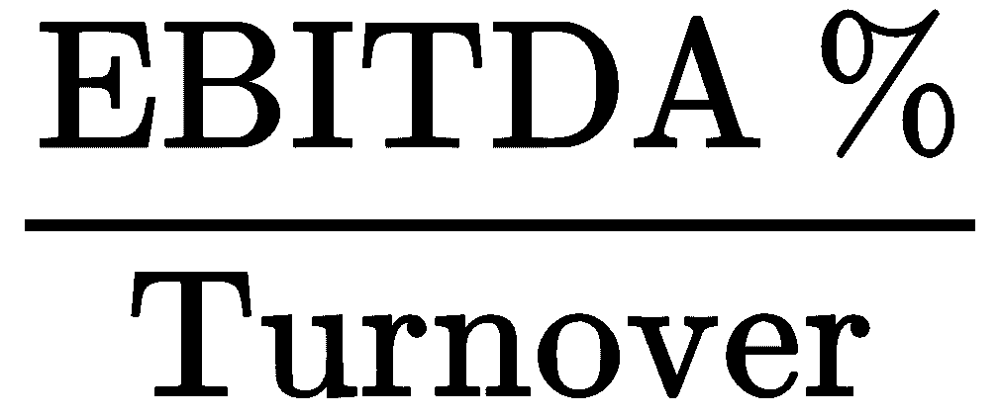
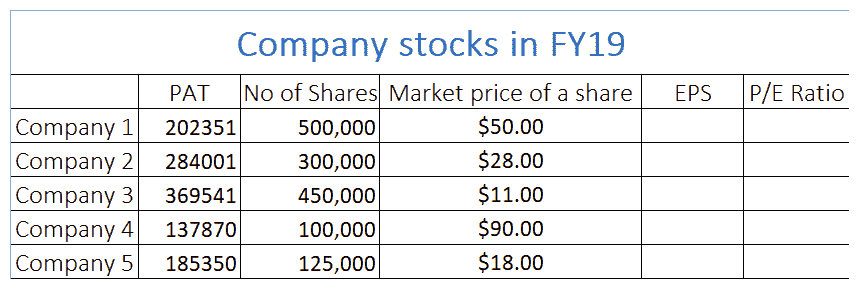
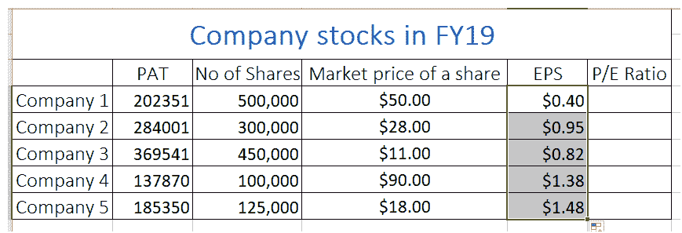
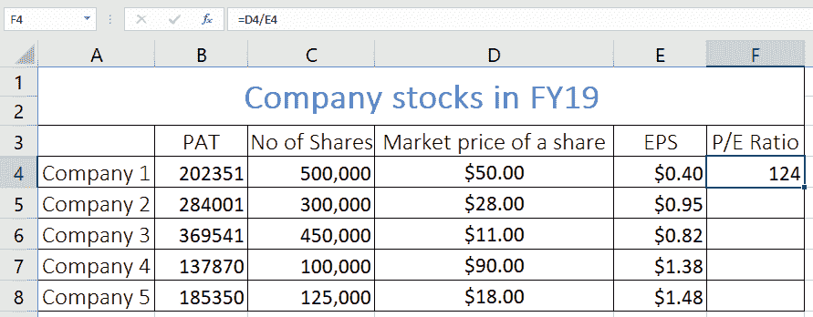

# 比率分析

为了评估一家公司，大多数人会立即查看其利润历史。虽然这是应该考虑的指标之一，但仅根据该信息做出决定可能是错误的。正如我们在[第 7 章](06.html)、*现金流量表*中看到的，利润并不总是等同于现金，如果利润没有现金流做后盾，即使是最赚钱的公司也可能倒闭。

比率分析着眼于公司的盈利能力、流动性、资产管理和效率、债务管理和市场价值。每个比率从财务报表中选取两个战略项目，并考察它们之间的关系，以便对公司的盈利能力、流动性等有所了解。

在本章中，我们将讨论以下主题:

*   理解比率分析的意义和好处
*   了解各种比率
*   解释比率
*   理解比率分析的局限性
*   利用比率寻找财务稳定的公司

# 理解比率分析的意义和好处

比率的计算方法是将一个项目除以另一个项目，例如，利润除以营业额。但是，你不应该随意从财务报表中挑选项目，然后进行划分；你应该选择那些比率有意义的项目，并提供有助于决策的信息。在利润除以营业额的例子中，这个比率，也称为利润率，告诉你每奈拉营业额产生多少利润。

比率通常用百分比表示，但当应用于**乘以**或**日**时也用百分比表示。20%的利润率意味着在扣除所有相关费用后，公司保留 20%的营业额作为利润。换句话说，该期间的利润是营业额的 20%。这些比率本身有助于将管理层和部门主管的注意力引向关注领域；然而，如果计算一段时间内的比率，以便确定趋势，将会更有用。

对于公司的外部利益群体，如投资者，更是如此。管理层可以获得第三方无法获得的其他内部信息，因此可以从年度比率中提取更多意义。投资者只能看到公布的财务报表。因此，从财务报表中得出的比率对投资者和其他外部利益集团来说特别重要。这些比率应该经过多年的计算，以确保结果真实地反映了公司的业绩。然后，可以将结果与类似的公司以及公司所在行业的标准进行比较。它们也可以作为预测的基础。

# 了解各种比率

有成千上万的比率，你很容易被它们冲昏头脑。为了让我们的生活更容易，比率可以分为五大类，即盈利能力、流动性、效率、债务管理和市场比率。

我们将为这些类别中的每一个检查几个例子。

这些比率衡量一家公司将营业额转化为利润的能力。这些比率通常被称为**保证金**，一般是指除以营业额。我们来看一下毛利率，用下面的公式表示:

在这里，毛利是营业额减去销售成本。

有时候，当一家公司亏损的时候，如果有毛利的话，你还是可以得到一些安慰的。这意味着直接成本已经包括在内，并且对间接费用或管理费用有所贡献。毛利率将在几年内趋于相当稳定，因为它通常反映了公司的加价政策。如果毛利率(或简单地说是毛利率)非常低，甚至为负，那么可以得出公司陷入困境的结论。这个比率对管理层来说特别重要，因为管理层制定了公司的加价政策。

还有其他种类的利润可以计算其利润率。利润率的相关性将取决于你属于哪个利益集团。债务提供者期望偿还债务本金和利息。因此，他们会对息前利润感兴趣，即息税前利润或 EBIT。EBIT 余量用以下公式表示:

利润率越高，投资者就越有信心，因为利润率表明公司能够在到期时偿还本金和利息。股东等权益持有人是公司利润分配的最后考虑对象。只有在扣除折旧、利息和税收之后，你才能得到可供分配的利润。因此，股东将对税后利润(PAT)特别感兴趣。

PAT 余量由以下公式表示:

EBITDA 在一些分析师中很受欢迎，因为他们认为它允许用户在资本支出政策(以折旧和债务偏好的形式，如利息和政府政策)影响公司业绩之前观察公司业绩。

**息税折旧摊销前收益** ( **EBITDA** )因此被认为是一个公司财务健康的更纯粹的指标。

EBITDA 利润率用以下公式表示:

# 流动性比率

流动性是衡量一家公司是否有能力偿还到期债务的最重要指标之一，换句话说，它是否是一家持续经营的企业。流动性比率比较公司的流动资产和流动负债。如果短期资产不足以弥补短期负债，这是我们需要采取行动防止公司陷入困境的第一个迹象。

流动比率表示如下:

很难具体说明什么数字代表一个好的比率；然而，1.5 比 2 的电流比通常被认为是足够的。低得多的数字表明该公司可能难以偿还债务。

另一方面，非常高的比率表明现金被占用，而这些现金可以用来赚取收入。流动资产主要由存货、应收账款和现金组成。速动比率确认存货不像其他流动资产那样容易转换成现金，并将流动资产减去存货与流动负债进行比较。

速动比率表示如下:

流动性最严格的测试是酸性测试，它将现金与流动负债进行比较。

酸性测试表示如下:

# 效率比率

效率比率衡量的是一家公司如何利用其资产和管理其负债来创造收入。

下面是一些效率比率的例子:

*   **库存天数**:平均库存是期初库存和期末库存的平均值。商品销售的日常成本是通过将当年的商品销售成本除以 365 得到的。结果以天数表示，表示库存在售出前停留的时间。公司应该保持足够的库存来满足顾客的需求，不要拖延；然而，保持过多的库存或持有库存太长时间会导致额外的成本。管理层必须在两者之间找到平衡。该比率的计算方法如下:

*   **应收账款** ( **债务人** ) **天数**:平均应收账款取期初和期末应收账款的平均值。日销售额是用全年销售额除以 365 得出的。结果以天数表示，代表客户为从公司赊购的商品付款所花费的时间。管理层需要给客户足够的时间来支付商品和服务，以鼓励他们继续与公司做生意；然而，信贷条件不应过于宽松，因为这可能会导致现金流问题。计算方法如下:

*   **应付账款** ( **债权人** ) **天数**:平均应付账款取期初和期末应付账款的平均值。商品销售的日常成本是通过将当年的商品销售成本除以 365 得到的。结果以天数表示，代表公司为从供应商处赊购的货物付款所花费的时间。管理层的目标应该是在不疏远供应商的情况下，尽可能花更多的时间来支付赊购。计算方法如下:

# 平均资产回报率

**平均资产回报率** ( **ROAA** )将当年实现的利润与当年平均总资产进行比较。这是衡量公司如何有效地利用其资产来创造利润的指标。

ROAA 计算如下:

从这个公式中，我们知道 EBIT 是利息和税前的收益或利润，平均总资产是期初和期末总资产的平均值。这是一个非常重要的比率，因为它给出了一些利润率的背景。

考虑以下 ROAA 的屏幕截图:

乍一看，公司 A 的营业额和 EBIT 都翻了一番，似乎更有吸引力；然而，仔细观察就会发现，A 公司利用 9000 万奈杰尔的资产创造了 N2 百万的利润，而 B 公司仅用 2250 万奈杰尔的资产就创造了 N1 百万的利润。

换句话说，B 公司的资产使用效率更高，平均资产回报率为 4.4%，而 a 公司仅为 2.2%。

# 平均资本回报率

平均资本回报率:这个比率决定了一个公司利用资本的效率。其计算方法如下:

**所用资本**是指债务资本和权益资本，计算公式如下:

这是最流行的比率之一，用于比较不同经济类型的公司如何利用他们的资本。回报率越高，资本的利用效率就越高。ROACE 没有一个绝对的目标值，和其他比率一样，随着时间的推移计算更有意义；然而，你会期望回报率高于资本成本。

# 平均股本回报率

**平均股本回报率** ( **ROAE** ):计算如下:

在前面的等式中，PAT 指的是税后利润。该比率使用净收入或 PAT 而不是 EBIT，因为在得出股东应占利润之前必须支付利息和税。

重新排列会计等式*资产=负债+权益*，你得到*权益=资产-负债*。

这是确定公平的另一种方法。股本回报率衡量公司使用其股本的效率和盈利能力。

# 债务管理比率

债务管理比率衡量公司的长期偿债能力。以下是一些债务管理比率:

*   **杠杆率或债务股本比**:该比率衡量公司依赖债务融资而非股权融资的程度。比率越高，公司对外债的依赖程度越高。一家高杠杆公司必须确保满足长期债务持有人的期望，以防止他们提前收回债务，这可能会削弱公司。计算方法如下:

*   **利息覆盖**:该比率衡量公司是否产生足够的利润来轻松覆盖外债和利息的成本。计算方法如下:

*   **市值比率:**每股收益是一种广泛用于计算市值的比率，计算方法如下:

如果有优先股，在除以普通股数量之前，将从 PAT 中扣除优先股股息。每股收益比率也可以归类为盈利能力比率。这里提到它是因为它是一个受欢迎的市场指标，表明每股普通股可保留多少公司利润。

*   **市盈率** **:** 市盈率是衡量投资者愿意为公司的利润或收益付出多少的指标。计算方法如下:

# 解释比率

公司的投资者和其他外部利益集团通常只能看到公司的财务报表。然而，在试图评估一家公司时，财务细节本身的用处有限。对于这些利益集团来说，比率是一个有价值的工具，使他们有机会使用广泛接受的参数以标准化的方式评估公司。

试图比较不同规模、地理位置、财政管辖区和性质的公司通常是一个非常主观的过程。比率分析通过强调业绩而不是营业额或利润的绝对规模来提供一个公平的竞争环境。效率、盈利能力和流动性或多或少独立于所涉及的单个参数的绝对大小，如营业额、资产、利润和负债。

比率分析允许对不同的公司进行比较，也允许分析师为不同的比率设定基准，以便后起之秀的公司可以根据这些基准评估他们的业绩，并确定他们需要改进的领域以及他们做得好的领域。

管理层可以使用比率分析来监控部门主管的绩效。他们可以用它来设定奖励或奖金的目标和门槛。如果对几个时期的比率进行计算，它们可能会揭示一种趋势，这种趋势可能会突出即将出现的困难，这些困难可以在具体化之前得到解决。

我们现在来看一些不同类型趋势分析的例子。

毛利率提高不一定是好事。您必须考虑以下几点:

*   确保这种增长不是由于某种错误，如多报营业额或少报销售成本。
*   找出这是否是公司政策变化的结果。
*   观察这对销售量有什么影响。毛利百分比的增加可能导致了市场份额的损失。

如果这种市场份额的损失继续不受控制，它可能会影响公司继续经营的能力。管理层可以决定降低产品的价格，以吸引顾客重新购买他们的产品，并最终恢复他们的市场份额。毛利率下降不一定是坏事。您必须考虑以下几点:

*   确保这种减少不是由于某种错误，如少报营业额或多报销售成本。
*   找出这是否是公司政策变化的结果。
*   观察这对销售量有什么影响。毛利百分比的下降可能导致了市场份额的增加，这将转化为利润的增加。

解释比率的另一个例子是流动性比率。高流动比率表明公司在流动性方面是健康的；然而，速动比率将揭示这种流动性在多大程度上依赖于库存。如果速动比率急剧下降，将存货从等式中排除，那么管理层将需要寻找减少对存货依赖的方法来反映流动性。

一种方法是减少库存中的现金。只要不影响满足顾客需求的能力，管理层可以考虑减少库存。提高流动性的另一个方法是努力提高周转率，这将渗透到债务人和/或现金。即使债权人也增加了公司的加价，这也将确保流动性得到净改善。

酸性测试只比较现金和流动负债，是最坏情况下的比率。只有当一个大债权人突然对公司欠他们的债务提出可强制执行的要求时，它才会变得有意义。

防止这种情况的一些方法如下:

*   避免只依赖一家供应商。在可能的情况下，将风险分散到多个供应商，这样，如果一个供应商开始施加压力，要求快速结算未清余额，公司可以迅速将注意力转移到其他供应商身上。
*   谨慎选择供应商。应该避免有突然对其余额提出要求历史的供应商。
*   管理层应该采取了解供应商的政策。应监控所有供应商的健康状况，以便在供应商遇到问题并可能需要快速结算其余额的第一个迹象出现时，公司可以采取适当的措施减少对该供应商的依赖。
*   管理层应确保存货和应收账款被有效地转化为现金。

# 理解比率分析的局限性

重要的是要认识到比率实际上并不能解决任何问题；它们仅仅强调了可以采取行动的趋势和例外。比率的定义通常因分析师而异，例如速动比率和酸性测试。一些分析家称流动资产减去存货除以流动负债的比率为速动比率，而另一些分析家称同样的比率为酸性测试。

一个学派使用 ROA 中的资产和 ROACE 中的权益和长期债务的年终余额。另一个学派认为，公司可以通过在年底公布重大交易来操纵这一比率，而在新的一年里又将其逆转。因此，他们使用这些余额的平均值来抵消这种做法。这些方法上的差异会导致截然不同的结果。对比率分析的另一个批评是，它使用历史价值，没有考虑到市场价值的变化。

最后，比率分析本质上只关注定量结果、比率的货币含义和趋势。如果不考虑定性特征，如社会责任、商业模式、市场份额、管理质量和运营对环境的影响，对公司的评估是不完整的。

现在我们知道了各种比率，让我们试着将它们应用到现实生活中。

# 利用比率寻找财务稳定的公司

让我们假设你想投资一家财务稳定、市场价值高的公司。我们可以使用以下比率找出最佳公司:

*   每股收益:这是寻找最佳投资公司的有用比率，因为它向你展示了该公司每卖出一股股票能赚多少钱
*   市盈率(P/E ratio):这个比率告诉你公司的未来可能会有更大的增长，它也告诉你投资者愿意为一股股票支付多少钱

我们将通过以下步骤来使用这些比率:

1.  打开`CompanyInvestment.xlsx`文件，你会发现一些公司的详细信息，比如他们的 PAT，股份数量，每股的市场价格，如下截图所示:

2.  现在，我们将使用单元格引用，通过用每个公司的`PAT`除以`No of Shares`来计算每个公司的`EPS`，如下所示:

由此我们可以看出`Company 1`每股赚`0.40$`。

3.  现在，我们将对所有其他公司进行同样的计算，方法是双击填充柄，这样我们就可以看到所有公司的 EPS，如下所示:

我们可以看到，`Company 5`的`EPS`最高，长期来看对投资者更有利可图。

4.  现在，我们将计算每家公司的市盈率。对于`Company 1`，我们可以通过将其股票的市场价格除以该公司的`EPS`来计算，如下所示:

我们可以看到该公司的市盈率非常高，大约为`124`！这意味着该公司很有可能在未来几年内进一步发展。

5.  最后，我们会找到所有公司的市盈率。您的表应该类似于下图:

我们可以看到,`Company 1`是投资的最佳选择，而`Company 4`是投资的最佳选择。

# 摘要

在本章中，我们已经了解了比率分析的重要性。我们已经看到有数以千计的比率，但我们知道，不是所有的比率都适用于任何给定的情况。我们研究了如何识别五组主要比率，并研究了所有五组比率的示例。

在下一章，我们将研究绝对(通过贴现现金流)和相对(通过比较测量)估价方法。我们将涵盖货币时间价值的概念，并在我们的计算中广泛使用。我们将学习几个概念，包括自由现金流、加权平均资本成本和终端价值等。