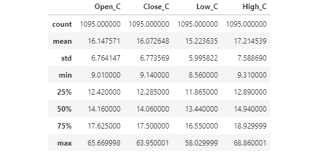
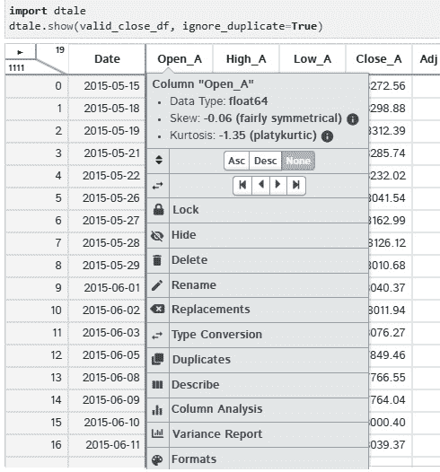

# *第二章*:Python 中的探索性数据分析

本章重点介绍**探索性数据分析** ( **EDA** )，这是处理任何数据集的第一步。EDA 的目标是将数据加载到最适合进一步分析的数据结构中，以识别和纠正任何错误/不良数据，并获得对数据的基本了解——字段的类型；无论它们是否是绝对的；有多少缺失值；这些字段是如何相关的；诸如此类。

这些是本章讨论的主要主题:

*   EDA 简介
*   用于 EDA 的特殊 Python 库

# 技术要求

本章使用的 Python 代码可以在本书的代码库中的`Chapter02/eda.ipynb`笔记本中找到。

# EDA 简介

EDA 是从感兴趣的结构化/非结构化数据中获取、理解和得出有意义的统计见解的过程。这是更复杂的分析之前的第一步，例如从数据中预测未来的预期。在金融数据的情况下，EDA 有助于获得洞察力，用于建立有利可图的交易信号和策略。

EDA 指导以后关于使用或避免哪些特征/信号以及使用或避免哪些预测模型的决策，并且在验证和引入关于变量的性质和它们之间的关系的正确假设的同时，使不正确的假设无效。

EDA 对于理解样本(代表完整数据集的较小数据集)统计数据与总体(完整数据集或最终真实值)统计数据有何不同也很重要，并且在根据对样本的观察得出总体结论时要记住这一点。因此，EDA 有助于减少可能的搜索空间；否则，我们将会在构建不正确/不重要的模型或策略上浪费更多的时间。

EDA 必须以科学的心态来对待。有时，我们可能会根据轶事证据而不是统计证据得出不充分的结论。

基于轶事证据的假设受到以下问题的困扰:

*   不具有统计显著性——观察次数太少。
*   选择偏差——假设仅仅是因为首次被观察到而产生的。
*   确认偏差——我们对假设的固有信念会使我们的结果产生偏差。
*   观察的不准确性。

让我们使用真实数据集来探索 EDA 中涉及的不同步骤和技术。

## EDA 中的步骤

这里列出了 EDA 中涉及的步骤(我们将在接下来的小节中逐一介绍):

1.  加载必要的库并设置它们
2.  数据收集
3.  数据争论/管理
4.  数据清理
5.  获取描述性统计数据
6.  数据的目视检查
7.  数据清理
8.  高级可视化技术

### 加载必要的库并设置它们

我们将使用`numpy`、`pandas`、`matplotlib`和这些库可以在下面代码的帮助下加载:

```
%matplotlib inline
import numpy as np
import pandas as pd
from scipy import stats
import seaborn as sn
import matplotlib.pyplot as plt
import mpld3
mpld3.enable_notebook()
import warnings
warnings.filterwarnings('ignore')
pd.set_option('display.max_rows', 2)
```

我们使用`mpld3`库来实现 Jupyter 的`matplotlib`图表的缩放。前面代码块的最后一行指定最多只能显示两行`pandas`数据帧。

### 数据收集

数据收集通常是 EDA 的第一步。数据可能来自许多不同的来源(**逗号分隔值** ( **CSV** )文件、Excel 文件、网页抓取、二进制文件等)，通常需要标准化，并首先正确格式化。

在本练习中，我们将使用三种不同交易工具为期 5 年的数据，以`.csv`格式存储。故意不透露这些仪器的身份，因为这可能会泄露它们的预期行为/关系，但我们将在本练习结束时透露它们的身份，以直观地评估我们对它们执行 EDA 的效果如何。

让我们首先将可用的数据集加载到三个数据帧(`A`、`B`和`C`)中，如下所示:

```
A = pd.read_csv('A.csv', parse_dates=True, index_col=0);
A
```

数据帧`A`的结构如下:


图 2.1–从 A.csv 文件构建的数据帧

类似地，让我们加载数据帧`B`，如下所示:

```
B = pd.read_csv('B.csv', parse_dates=True, index_col=0); 
B
```

数据帧`B`的结构如下:


图 2.2–从 B.csv 文件构建的数据帧

最后，让我们将`C`数据加载到数据帧中，如下所示:

```
C = pd.read_csv('C.csv', parse_dates=True, index_col=0); 
C
```

我们看到`C`有以下字段:


图 2.3–从 C.csv 文件构建的数据帧

正如我们所观察到的，所有三个数据源都具有相同的格式，其中**开盘**、**高**、**低**、**收盘**、**调整收盘**价格和**成交量**信息大约在`2015-05-15`和`2020-05-14`之间。

### 数据争论/管理

数据很少以现成的格式出现。数据争论/管理指的是操作数据并将其从初始原始源转换为结构化、格式化且易于使用的数据集的过程。

让我们使用`pandas.DataFrame.join(...)`来合并数据帧，并将它们对齐，使其具有相同的`DateTimeIndex`格式。使用`lsuffix=`和`rsuffix=`参数，我们将`_A`、`_B`和`_C`后缀分配给来自三个数据帧的列，如下所示:

```
merged_df = A.join(B, how='outer', lsuffix='_A', sort=True).join(C, how='outer', lsuffix='_B', rsuffix='_C', sort=True)
merged_df
```

我们将检查我们刚刚创建的`merged_df`数据帧，并确保它包含所有三个数据帧中我们期望的所有字段(仅显示前七列)。此处可以看到数据框:


图 2.4–通过连接数据帧 A、B 和 C 构建的数据帧

注意，最初的三个数据帧(`A`、`B`和`C`)分别有 1211、1209 和 1206 行，但是组合的数据帧有 1259 行。这是因为我们使用了外部连接，它使用了所有三个数据帧的日期的联合。当它找不到特定日期的特定数据帧的值时，它会为该数据帧的字段放置一个`NaN`值。

### 数据清理

数据清理指的是解决来自缺失数据、不正确数据值和异常值的数据错误的过程。

在我们的示例中，`merged_df`的许多字段缺少值，这些字段来自原始数据集以及合并具有不同日期集的数据帧。

让我们首先检查是否有所有值都丢失的行(`NaN`)，如下所示:

```
merged_df[merged_df.isnull().all(axis=1)]
```

结果显示，没有任何一行的所有字段都缺失，如下所示:


图 2.5–显示没有所有字段缺失的行的数据帧

现在，让我们找出有多少行至少有一个字段缺失/ `NaN`，如下所示:

```
merged_df[['Close_A', 'Close_B', 'Close_C']].isnull().any(axis=1).sum()
```

因此，在我们的 1，259 行中，有 148 行有一个或多个字段缺少值，如下所示:

```
148
```

为了进一步分析，我们需要有效的`Close`价格。因此，通过运行以下代码，我们可以删除三种工具中任何一种的`Close`价格缺失的所有行:

```
valid_close_df = merged_df.dropna(subset=['Close_A', 'Close_B', 'Close_C'], how='any')
```

删除缺失的`Close`价格后，我们应该不会再有缺失的`Close`价格字段，如下面的代码片段所示:

```
valid_close_df[['Close_A', 'Close_B', 'Close_C']].isnull().any(axis=1).sum()
```

结果确认没有任何一行的`Close_A`、`Close_B`或`Close_C`字段是`NaN`值，正如我们在这里看到的:

```
0
```

让我们检查新的数据帧，如下所示:

```
valid_close_df
```

以下是结果(仅显示前七列):


图 2.6-任何收盘价都没有缺失/NaN 值的结果数据框架

不出所料，我们删除了任何收盘价都有 missing/ `NaN`值的 148 行。

接下来，让我们处理对于任何其他字段都具有`NaN`值的行，从了解有多少这样的行开始。我们可以通过运行以下代码来实现这一点:

```
valid_close_df.isnull().any(axis=1).sum()
```

以下是该查询的输出:

```
165
```

因此，有 165 行至少有一些字段缺少值。

让我们快速检查一些至少有一些字段缺少值的行，如下所示:

```
valid_close_df[valid_close_df.isnull().any(axis=1)]
```

将显示一些缺少值的行(仅显示前七列)，如下所示:


图 2.7–显示仍有一些行缺少一些值的数据框

因此，我们可以看到`2015-05-18`上的`Low_C`字段(在前面的截图中不可见)和`2020-05-01`上的`Open_B`字段具有`NaN`值(当然，在其他 163 个字段中)。

让我们将`pandas.DataFrame.fillna(...)`方法与一个名为`backfill`的方法一起使用—这使用缺失值后的下一个有效值来填充缺失值。下面的代码片段展示了代码:

```
valid_close_complete = valid_close_df.fillna(method='backfill')
```

让我们看看回填的影响，如下所示:

```
valid_close_complete.isnull().any(axis=1).sum()
```

现在，这是查询的输出:

```
0
```

正如我们所看到的，在`backfill`操作之后，任何行中的任何字段都不再缺少/ `NaN`值。

### 获取描述性统计数据

下一步是使用`DataFrame.describe(...)`方法，根据数据生成关键的基本统计数据，以便熟悉每个领域。代码如下面的代码片段所示:

```
pd.set_option('display.max_rows', None)
valid_close_complete.describe()
```

请注意，我们增加了要显示的`pandas`数据帧的行数。

下面是运行`pandas.DataFrame.describe(…)`的输出，只显示前七列:


图 2.8–valid _ close _ complete 数据帧的描述性统计

前面的输出为我们的数据帧中的每个字段提供了快速汇总统计数据。

图 2.8 中*的主要观察结果如下:*

*   `Volume_C`的所有统计值都是`0`，意味着每一行的`Volume_C`值都被设置为`0`。因此，我们需要删除该列。
*   `Open_C` has a minimum value of `-400`, which is unlikely to be true for the following reasons:

    a)其他价格字段— `High_C`、`Low_C`、`Close_C`和`Adj Close_C`—都在`9`附近具有最小值，因此`Open_C`具有最小值`-400`没有意义。

    b)鉴于`Open_C`的第 25 百分位是`12.4`，最小值不太可能比那个值低很多。

    c)资产的价格应该是非负的。

*   `Low_C` has a maximum value of `330`, which is again unlikely because of the following reasons:

    a)由于与之前概述的原因相同的原因，因为`Open_C`不正确。

    b)此外，考虑到`Low_C`应该总是低于`High_C`，根据定义，一天中的最低价必须低于一天中的最高价。

让我们将所有`pandas`数据帧的输出放回两行，如下所示:

```
pd.set_option('display.max_rows', 2)
```

现在，让我们用以下代码删除所有三台仪器的`Volume`字段:

```
prices_only = valid_close_complete.drop(['Volume_A', 'Volume_B', 'Volume_C'], axis=1)
prices_only
```

并且`prices_only`数据帧具有以下数据(仅显示前七列):


图 2.9-仅价格数据框架

正如预期的那样，在我们删除了三个 volume 列之后，我们将数据帧的维度减少到了`1111 × 15`——这些维度以前是`1111 × 18`。

### 数据的目视检查

其他字段似乎没有任何明显的错误或差异，所以让我们绘制一个价格的快速可视化图，看看它是否与我们从描述性统计中了解到的一致。

首先，我们将从`A`的价格开始，因为根据描述性统计汇总，我们预计这些价格是正确的。代码如下面的代码片段所示:

```
valid_close_complete['Open_A'].plot(figsize=(12,6), linestyle='--', color='black', legend='Open_A')
valid_close_complete['Close_A'].plot(figsize=(12,6), linestyle='-', color='grey', legend='Close_A')
valid_close_complete['Low_A'].plot(figsize=(12,6), linestyle=':', color='black', legend='Low_A')
valid_close_complete['High_A'].plot(figsize=(12,6), linestyle='-.', color='grey', legend='High_A')
```

输出与我们的预期一致，我们可以根据统计数据和下面截图中显示的图表得出结论,`A`的价格是有效的:


图 2.10-显示 5 年内交易工具 A 的开盘价、收盘价、最高价和最低价的图表

现在，让我们画出 C 的价格，看看这个图是否为我们对一些价格不正确的怀疑提供了进一步的证据。代码可以在下面的代码片段中看到:

```
valid_close_complete['Open_C'].plot(figsize=(12,6), linestyle='--', color='black', legend='Open_C')
valid_close_complete['Close_C'].plot(figsize=(12,6), linestyle='-', color='grey', legend='Close_C')
valid_close_complete['Low_C'].plot(figsize=(12,6), linestyle=':', color='black', legend='Low_C')
valid_close_complete['High_C'].plot(figsize=(12,6), linestyle='-.', color='grey', legend='High_C')
```

输出证实了`Open_C`和`Low_C`有一些错误值，这些错误值与其他值相差甚远——这些是异常值。下面的屏幕截图显示了一个说明这一点的图:


图 2.11-显示 C 价格在正负两个方向上的较大异常值的图

我们将需要执行一些进一步的数据清理来消除这些异常值，这样我们就不会从我们的数据中得出不正确的统计见解。

两种最常用的检测和剔除异常值的方法是**四分位间距** ( **IQR** )和 Z 值。

### IQR

IQR 方法使用整个数据集的百分位/分位数范围的值来识别和移除异常值。

当应用 IQR 方法时，我们通常使用极端百分位值，例如 5%到 95%，以最小化删除正确数据点的风险。

在我们的`Open_C`示例中，让我们使用第 25 个百分位数和第 75 个百分位数，并删除值超出该范围的所有数据点。第 25 到第 75 百分位范围是(`12.4, 17.68`)，因此我们将删除`-400`的异常值。

#### z 分数

Z 得分(或标准得分)是通过从每个数据点减去数据集的平均值，然后除以数据集的标准偏差对结果进行归一化而获得的。

换句话说，数据点的 Z 得分代表该数据点与所有数据点平均值之间的标准差距离。

对于正态分布(适用于足够大的数据集)，有一个分布规则 **68-95-99** ，总结如下:

*   68%的数据将位于平均值的一个标准偏差范围内。
*   所有数据的 95%将位于平均值的两个标准差的范围内。
*   所有数据的 99%将位于平均值的三个标准偏差范围内。

因此，在计算了我们的数据集中所有数据点的 Z 分数(足够大)后，数据点的 Z 分数大于或等于`3`的概率约为 1%。

因此，我们可以使用这些信息来过滤掉 Z 分数为`3`或更高的所有观察值，以检测并移除异常值。

在我们的示例中，我们将删除 Z 值小于`-6`或大于`6`的所有行，也就是说，距离平均值有六个标准偏差。

首先，我们使用`scipy.stats.zscore(...)`来计算`prices_only`数据帧中每一列的 Z 分数，然后我们使用`numpy.abs(...)`来获得 Z 分数的大小。最后，我们选择所有字段的 Z 分数都小于 6 的行，并将其保存在一个`no_outlier_prices`数据帧中。代码如下面的代码片段所示:

```
no_outlier_prices = prices_only[(np.abs(stats.zscore(prices_only)) < 6).all(axis=1)]
```

让我们通过再次绘制其价格并与之前的图进行比较，来看看这个 Z 分数异常值移除代码对工具`C`的价格字段有什么影响，如下所示:

```
no_outlier_prices['Open_C'].plot(figsize=(12,6), linestyle='--', color='black', legend='Open_C')
no_outlier_prices['Close_C'].plot(figsize=(12,6), linestyle='-', color='grey', legend='Close_C')
no_outlier_prices['Low_C'].plot(figsize=(12,6), linestyle=':', color='black', legend='Low_C')
no_outlier_prices['High_C'].plot(figsize=(12,6), linestyle='-.', color='grey', legend='High_C')
```

以下是输出结果:


图 2.12-通过应用数据清理移除异常值后 C 的价格图

该图清楚地显示出之前对`Open_C`和`Low_C`极值的观察已经被丢弃；不再有的`-400`的衰落。

请注意，虽然我们删除了极端的异常值，但我们仍然能够保留 2015 年、2018 年和 2020 年期间价格的大幅飙升，因此不会导致大量数据丢失。

让我们通过重新检查描述性统计数据来检查异常值去除工作的影响，如下所示:

```
pd.set_option('display.max_rows', None)
no_outlier_prices[['Open_C', 'Close_C', 'Low_C', 'High_C']].describe()
```

这些统计数据看起来明显更好——正如我们在下面的屏幕截图中看到的，所有价格的`min`和`max`值现在看起来都符合预期，没有极值，因此我们成功完成了数据清理任务:



图 2.13–所选 no_outlier_prices 列的描述性统计

让我们重置`pandas`数据帧要显示的行数，如下所示:

```
pd.set_option('display.max_rows', 5)
```

### 高级可视化技术

在本节中，我们将探索单变量和多变量统计可视化技术。

首先，让我们收集三种工具的收盘价，如下所示:

```
close_prices = no_outlier_prices[['Close_A', 'Close_B', 'Close_C']]
```

接下来，让我们计算每日收盘价格变化，以评估这三种工具之间的每日价格变化是否存在关系。

#### 每日收盘价格变化

我们将使用`pandas.DataFrame.shift(...)`方法将原始数据框架向前移动一个周期，以便我们可以计算价格变化。这里的`pandas.DataFrame.fillna(...)`方法修复了第一行中由于`shift`操作而产生的一个缺失值。最后，我们将把这些列重命名为`Delta_Close_A`、`Delta_Close_B`和`Delta_Close_C`，以反映这些值是价格差异而不是实际价格。代码如下面的代码片段所示:

```
delta_close_prices = (close_prices.shift(-1) - close_prices).fillna(0)
delta_close_prices.columns = ['Delta_Close_A', 'Delta_Close_B', 'Delta_Close_C']
delta_close_prices
```

新生成的`delta_close_prices`数据帧的内容如下截图所示:


图 2.14–delta _ close _ prices 数据框架

从最初的几个实际价格和计算的价格差异来看，这些值看起来是正确的。

现在，让我们快速检查这个新数据框架的汇总统计数据，以了解增量价格值是如何分布的，如下所示:

```
pd.set_option('display.max_rows', None)
delta_close_prices.describe()
```

此数据帧上的描述性统计显示在以下屏幕截图中:


图 2.15-delta _ close _ prices 数据框架的描述性统计

我们可以从这些统计数据中观察到，所有三个 delta 值的平均值都接近于 0，其中工具`A`经历了较大的价格波动，而工具`C`经历了明显较小的价格波动(来自`std`字段)。

#### 直方图

让我们使用直方图来观察`Delta_Close_A`的分布，以便更熟悉它。下面的代码片段显示了的代码:

```
delta_close_prices['Delta_Close_A'].plot(kind='hist', bins=100, figsize=(12,6), color='black', grid=True)
```

在下面的截图中，我们可以看到分布近似正态分布:


图 2.16–Delta _ Close _ A 值的直方图，大致正态分布在 0 值周围

#### 箱形图

让我们画一个箱线图，它也有助于评估值的分布。这方面的代码如下面的代码片段所示:

```
delta_close_prices['Delta_Close_B'].plot(kind='box', figsize=(12,6), color='black', grid=True)
```

输出可以在下面的截图中看到:


图 2.17–显示平均值、中值、IQR(第 25 至 75 百分位)和异常值的箱线图

#### 相关图表

多元数据统计的第一步是评估`Delta_Close_A`、`Delta_Close_B`和`Delta_Close_C`之间的相关性。

最方便的方法是绘制一个相关散点图，显示三个变量之间的成对关系，以及每个变量的分布。

在我们的例子中，我们演示了使用**核密度估计** ( **KDE** )的选项，它与直方图密切相关，但在对角线上的图中提供了更平滑的分布表面。这方面的代码如下面的代码片段所示:

```
pd.plotting.scatter_matrix(delta_close_prices, figsize=(10,10), color='black', alpha=0.75, diagonal='kde', grid=True)
```

该图表明在`Delta_Close_A`和`Delta_Close_B`之间有很强的正相关性，在`Delta_Close_C`和其他两个变量之间有很强的负相关性。对角线也显示了每个变量的分布，使用 KDE。

在下面的屏幕截图中可以看到这些字段的散点图:


图 2.18–对角线上带有 KDE 直方图的 Delta_Close 字段散点图

接下来，让我们看一些提供变量之间关系的统计数据。对我们来说是这样，也显示了线性相关性。这可以在下面的代码片段中看到:

```
delta_close_prices.corr()
```

相关矩阵证实`Delta_Close_A`和`Delta_Close_B`具有很强的正相关性(非常接近 1.0，这是的最大值)，正如我们基于散点图所预期的那样。另外，`Delta_Close_C`与其他两个变量负相关(更接近-1.0 而不是 0.0)。

你可以在下面的截图中看到相关矩阵:


图 2.19–Delta _ Close _ A、Delta_Close_B 和 Delta_Close_C 的相关矩阵

#### 成对相关热图

另一种被称为**热图**的可视化技术在`seaborn.heatmap(...)`的中可用，如以下代码片段所示:

```
plt.figure(figsize=(6,6))
sn.heatmap(delta_close_prices.corr(), annot=True, square=True, linewidths=2)
```

在下图中，最右边的刻度显示了一个图例，其中最暗的值代表最强的负相关性，最亮的值代表最强的正相关性:


图 2.20–Seaborn 热图显示了 Delta_Close 油田之间的成对相关性

热图以图形方式显示了与上一节中的表格相同的信息——在`Delta_Close_A`和`Delta_Close_B`之间有非常高的相关性，在`Delta_Close_A`和`Delta_Close_C`之间有非常高的负相关性。`Delta_Close_B`和`Delta_Close_C`之间也有非常高的负相关。

## 揭示 A、B、C 的同一性和 EDA 的结论

`A`工具是**道琼斯工业平均指数** ( **DJIA** )，大盘股指数**交易所交易基金** ( **ETF** )。`B`工具是另一只大盘股票指数 ETF**S&p500**(**SPY**)。`C`工具是**芝加哥期权交易所** ( **CBOE** ) **波动指数** ( **VIX** )，它基本上跟踪市场在任何给定时间的波动程度(基本上是股票指数价格波动的函数)。

从我们对神秘仪器的 EDA 中，我们得出了以下结论:

*   (VIX)不能有负价格或高于 90 的价格，这在历史上是正确的。
*   `A` (DJIA)和`B`(间谍)分别在 2008 年和 2020 年大幅下跌，分别对应股市崩盘和新冠肺炎疫情。此外，`C` (VIX)的价格同时飙升，表明市场动荡加剧。
*   `A` (DJIA)的每日价格波动最大，其次是`B`(间谍)，最后是`C` (VIX)，每日价格波动非常小。考虑到他们隐藏的潜在工具，这些观察也是正确的。

`A` (DJIA)和`B`(间谍)有非常强的正相关性，这是有意义的，因为两者都是大盘股指数。`C` (VIX)与`A` (DJIA)和`B`(间谍)都有强烈的负相关性，这也是有道理的，因为在繁荣时期，波动性保持较低，市场上涨，而在危机时期，波动性飙升，市场下跌。

在下一节中，我们将介绍一个特殊的 Python 库，它可以自动生成最常见的 EDA 图表和表格。

# 用于 EDA 的特殊 Python 库

有多个 Python 库在单行代码中提供 EDA。其中最先进的是`dtale`，如下面的代码片段所示:

```
import dtale
dtale.show(valid_close_df)
```

前面的命令生成一个包含所有数据的表(只显示前七列)，如下所示:


图 2.21–dtale 组件显示了对 valid_close_df 数据帧的类似电子表格的控制

单击顶部的箭头会显示一个包含所有功能的菜单，如下图所示:


图 2.22–显示其功能的 dtale 全局菜单

点击列标题显示每个功能的单独命令，如下图所示:



图 2.23–显示列功能的 dtale 列菜单

交互式 EDA，而不是命令驱动的 EDA，有它的优势——直观，促进视觉创造力，而且速度更快。

# 总结

EDA 的目标是了解我们所处理的数据集，并纠正基本的数据错误，例如不太可能的异常值。我们已经描述了通过运行单独的 Python 命令构建的 EDA 和使用特殊的 Python EDA 库的自动化 EDA。

下一章将向我们介绍最重要的 Python 库之一:`numpy`。