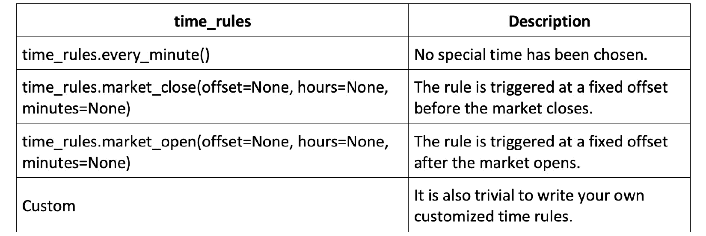
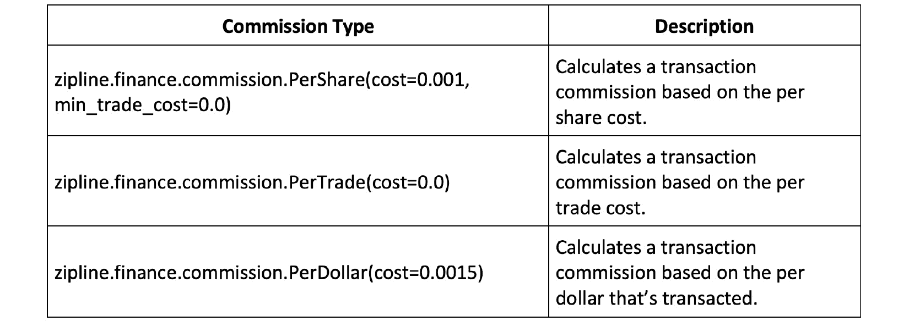
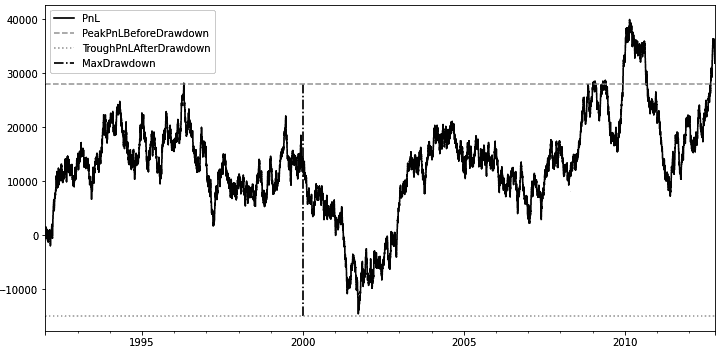

# 八、Zipline 和 PyFolio 简介

在这一章中，你将学习 Python 库 Zipline 和 PyFolio，它们抽象出算法交易策略的回溯测试和性能/风险分析方面的复杂性。它们让你完全专注于交易逻辑。

为此，我们将讨论以下主题:

*   Zipline 和 PyFolio 简介
*   安装 Zipline 和 PyFolio
*   将市场数据导入 Zipline/PyFolio 回溯测试系统
*   构建 Zipline/PyFolio 回溯测试模块
*   查看重要的 Zipline API 参考
*   从命令行运行 Zipline 回溯测试
*   对 PyFolio 提供的关键风险管理数据的介绍

# 技术要求

本章使用的 Python 代码可以在本书的代码库中的`Chapter08/risk_management.ipynb`笔记本中找到。

# zip line 和 PyFolio 简介

回溯测试是一种计算方法，用来评估交易策略如果应用于历史数据会有多好。理想情况下，这种历史数据应该来自一段时间，在这段时间里有类似的市场条件，例如它对现在和未来有类似的波动性。

回溯测试应该包括所有相关的因素，比如滑点和交易成本。

Zipline 是 T2 最先进的用于算法交易回溯测试引擎的开源 Python 库之一。它的源代码可以在 https://github.com/quantopian/zipline[的](https://github.com/quantopian/zipline)找到。Zipline 是一个回溯测试库，非常适合日常交易(你也可以每周、每月等等进行回溯测试)。不太适合回测高频交易策略。

**PyFolio** 是一个开源 Python 性能和风险分析库，由与 Zipline 紧密集成的金融投资组合组成。你可以在 https://github.com/quantopian/pyfolio 的[找到它的文档。](https://github.com/quantopian/pyfolio)

使用这两个库来回溯测试你的交易策略可以节省你大量的时间。

本章的目标是描述这些库的关键功能，并建立您的直觉。我们鼓励您在 PyCharm 或任何其他 Python IDE 中调试代码，并研究每个结果变量的内容，以充分利用所提供的信息。一旦熟悉了每个结果对象的内容，就可以简单地研究一下这些库的源代码，看看它们的全部功能。

# 安装滑索和文件夹

我们建议按照 [*附录 A*](10.html#_idTextAnchor200) 中所述设置开发环境。尽管如此，以下部分给出了详细的说明。

## 安装滑索

出于性能原因，Zipline 紧密依赖于 Python 的特定版本及其相关库。因此，最好的安装方法是创建一个`conda`虚拟环境，并在那里安装 Zipline。为此，我们建议使用 Anaconda Python。

让我们用 Python 3.6 创建一个名为`zipline_env`的虚拟环境，并安装`zipline`包:

```
conda create -n zipline_env python=3.6
conda activate zipline_env
conda install -c conda-forge zipline
```

我们现在将安装 PyFolio。

## 安装文件夹

您可以通过`pip`安装`pyfolio`包:

```
pip install pyfolio
```

正如我们所看到的，安装 PyFolio 也是一件容易的事情。

# 将市场数据导入 Zipline/PyFolio 回溯测试系统

回溯测试依赖于我们拥有广泛的市场数据数据库。

Zipline 引入了两个特定于市场数据的术语——捆绑和接收:

*   一个**捆绑包**是一个接口，用于将市场数据从一个定制源增量导入 Zipline 的专有数据库。
*   **接收**是将定制源市场数据逐步导入 Zipline 专有数据库的实际过程；数据摄取不会自动更新。每次需要新数据时，您都必须重新接收这个包。

默认情况下，Zipline 支持这些包:

*   历史 Quandl 捆绑包(截至 2018 年的美国股票免费每日数据)
*   `.csv`文件捆绑

我们现在将更详细地了解如何导入这两个包。

## 从历史 Quandl 包导入数据

首先，在激活的`zipline_env`环境中，将环境变量`QUANDL_API_KEY`设置为你的免费(或付费)Quandl API 密钥。然后，摄取`quandl`数据。

对于 Windows，使用以下代码:

```
SET QUANDL_API_KEY=XXXXXXXX
zipline ingest -b quandl
```

对于 Mac/Linux，使用以下代码:

```
export QUANDL_API_KEY=XXXXXXXX
zipline ingest -b quandl
```

注意

Quandl 在 2018 年停止更新免费捆绑包，但对于最初的几个算法交易步骤仍然非常有用。

最好在窗口的系统属性中设置`QUANDL_API_KEY`(按下窗口图标，输入`Environment Variables`):


图 8.1–在 Windows 上找到“编辑系统环境变量”对话框

然后，选择**编辑系统环境变量**。


图 8.2–Windows 系统属性中环境变量…对话框的位置

然后，在**环境变量中指定变量...**对话框。

在 Mac/Linux 上，对于基于用户的操作，将下面的命令添加到`~/.bash_profile`中；对于非登录交互式 shells，将下面的命令添加到`~/.bashrc`中:

```
export QUANDL_API_KEY=xxxx
```

现在，让我们学习如何从 CSV 文件包中导入数据。

## 从 CSV 文件包导入数据

默认的 CSV 捆绑包要求 CSV 文件为**开盘价、最高价、最低价、收盘价、成交量** ( **OHLCV** )格式，包含日期、股息和分割:

```
date,open,high,low,close,volume,dividend,split
```

本书的 GitHub 资源库包含一个示例输入 CSV 文件。它最上面的几行如下:

```
date,open,high,low,close,volume,dividend,split
2015-05-15,18251.9707,18272.7207,18215.07031,18272.56055,108220000,0,0
2015-05-18,18267.25,18325.53906,18244.25977,18298.88086,79080000,0,0
2015-05-19,18300.48047,18351.35938,18261.34961,18312.39063,87200000,0,0
2015-05-20,18315.06055,18350.13086,18272.56055,18285.40039,80190000,0,0
2015-05-21,18285.86914,18314.89063,18249.90039,18285.74023,84270000,0,0
2015-05-22,18286.86914,18286.86914,18217.14063,18232.01953,78890000,0,0
2015-05-26,18229.75,18229.75,17990.01953,18041.53906,109440000,0,0
```

要使用自定义 CSV 文件包，请按照下列步骤操作:

1.  为 CSV 文件创建一个目录，例如`C:\MarketData`，子目录名为`Daily`。
2.  将 CSV 文件复制到创建的目录中(例如，`C:\MarketData\Daily`)。
3.  Edit the `.py` file extension in the `C:\Users\<username>\.zipline\extension.py` directory on Windows or `~/.zipline/extension.py` on Mac/Linux, as shown:

    ```
    import pandas as pd
    from zipline.data.bundles import register
    from zipline.data.bundles.csvdir import csvdir_equities
    register(
        'packt-csvdir-bundle',
        csvdir_equities(
            ['daily'],
            'c:/MarketData/',
        ),
        calendar_name='NYSE', 
        start_session=pd.Timestamp('2015-5-15', tz='utc'),
        end_session=pd.Timestamp('2020-05-14', tz='utc')
    )
    ```

    请注意，我们将市场数据与交易日历相关联。在这种情况下，我们使用`NYSE`，它对应于美国股票。

4.  Ingest the bundle, as follows:

    ```
    zipline ingest -b packt-csvdir-bundle
    ```

    输出为,如下所示:


图 8.3–packt-CSV dir-bundle 的 zipline 摄取输出

这创建了一个带有`A`代码的资产。

## 从定制捆绑包导入数据

Quandl 历史包最适合学习如何设计和回溯测试算法策略。CSV 文件包最适合导入没有公开价格的资产价格。但是，对于其他目的，您应该购买市场数据订阅。

### 从 Quandl 的 EOD 美国股票价格数据导入数据

Quandl 提供订阅美国股票价格数据库(【https://www.quandl.com/data/EOD-End-of-Day-US-Stock-Prices】T2)的服务，每月 49 美元，季度或年度付款有折扣。

与其他服务相比，该服务的优势如下:

*   Quandl 与 Zipline 深度整合，你可以使用一个命令下载所有股票的历史记录。
*   与其他提供商不同，每月调用 API 的次数没有硬性限制。

安装定制包很简单:

1.  Find the location of the `bundles` directory using the following command:

    ```
    python -c "import zipline.data.bundles as bdl; print(bdl.__path__)"
    ```

    这会在我的电脑上产生以下输出:

    ```
    ['d:\\Anaconda3\\envs\\zipline_env\\lib\\site-packages\\zipline\\data\\bundles']
    ```

2.  将本书的 GitHub 资源库中的`quandl_eod.py`文件复制到该目录中。该文件是对 Zipline 的 GitHub 代码的轻微修改。
3.  在同一个目录下，修改`__init__.py`文件(在那里添加这一行):

    ```
    from . import quandl_eod  # noqa
    ```

完整的`__init__.py`文件示例如下:

```
# These imports are necessary to force module-scope register calls to happen.
from . import quandl  # noqa
from . import csvdir  # noqa
from . import quandl_eod # noqa
from .core import (
    UnknownBundle,
    bundles,
    clean,
    from_bundle_ingest_dirname,
    ingest,
    ingestions_for_bundle,
    load,
    register,
    to_bundle_ingest_dirname,
    unregister,
)
__all__ = [
    'UnknownBundle',
    'bundles',
    'clean',
    'from_bundle_ingest_dirname',
    'ingest',
    'ingestions_for_bundle',
    'load',
    'register',
    'to_bundle_ingest_dirname',
    'unregister',
] 
```

一旦完成了设置，确保已经将`QUANDL_API_KEY`环境变量设置为 API 键，并运行`ingest`命令:

```
zipline ingest -b quandl_eod
```

输出如下所示:


图 8.4–摄取 quandl_eod 包的输出

`quandl_eod.py`的实际源代码是自明的。用`@bundles.register("quandl_eod")`标注的`quandl_eod_bundle`函数定义了下载过程:

```
@bundles.register("quandl_eod")
def quandl_eod_bundle(environ,
                  asset_db_writer,
                  minute_bar_writer,
                  daily_bar_writer,
                  adjustment_writer,
                  calendar,
                  start_session,
                  end_session,
                  cache,
                  show_progress,
                  output_dir):
    """
    quandl_bundle builds a daily dataset using Quandl's WIKI Prices dataset.
    For more information on Quandl's API and how to obtain an API key,
    please visit https://docs.quandl.com/docs#section-authentication
    """
    api_key = environ.get("QUANDL_API_KEY")
    if api_key is None:
        raise ValueError(
            "Please set your QUANDL_API_KEY environment variable and retry."
        )
    raw_data = fetch_data_table(
        api_key, show_progress, 
        environ.get("QUANDL_DOWNLOAD_ATTEMPTS", 5)
    )
    asset_metadata = \
    gen_asset_metadata(raw_data[["symbol", "date"]], 
                       show_progress)
    asset_db_writer.write(asset_metadata)
    symbol_map = asset_metadata.symbol
    sessions = calendar.sessions_in_range(start_session, 
                                          end_session)
    raw_data.set_index(["date", "symbol"], inplace=True)
    daily_bar_writer.write(
        parse_pricing_and_vol(raw_data, sessions,
                              symbol_map),
        show_progress=show_progress,
    )
    raw_data.reset_index(inplace=True)
    raw_data["symbol"] = \
    raw_data["symbol"].astype("category")
    raw_data["sid"] = raw_data.symbol.cat.codes
    adjustment_writer.write(
        splits=parse_splits(
            raw_data[["sid", "date", "split_ratio"]].loc[raw_data.split_ratio != 1],
            show_progress=show_progress,
        ),
        dividends=parse_dividends(
            raw_data[["sid", "date", "ex_dividend"]].loc[raw_data.ex_dividend != 0],
            show_progress=show_progress,
        ),
    )
```

该流程涉及的步骤如下:

1.  下载所有 EOD 的数据。
2.  生成元数据。
3.  应用交易日历。
4.  应用公司事件。

虽然 Quandl 的商业数据源与 Zipline 深度集成，但也有替代的数据源。

### 从雅虎财经和 IEX 付费数据导入数据

https://github.com/hhatefi/zipline_bundles[的项目](https://github.com/hhatefi/zipline_bundles)为提供雅虎财经和 IEX 的高空滑索捆绑。该软件包支持从雅虎财经`.csv`文件、雅虎财经直接以及从 IEX 导入 Zipline。这本书将只侧重于直接从雅虎金融和 IEX 进口。

虽然这个包允许自动安装，但我不推荐它，因为它需要在 Windows 的`C:\Users\<username>\.zipline\extension.py`目录中有一个空的`extension.py`文件，或者在 Mac/Linux 上有一个空的`~/.zipline/extension.py`文件。

安装步骤如下:

1.  从[https://github.com/hhatefi/zipline_bundles](https://github.com/hhatefi/zipline_bundles)下载存储库。
2.  将存储库的`\zipline_bundles-master\lib\extension.py`文件与 Windows 上的`C:\Users\<username>\.zipline\extension.py`或 Mac/Linux 上的`~/.zipline/extension.py`文件合并。如果后一个文件不存在，只需复制并粘贴该文件。
3.  Edit the start and end dates in the following code:

    ```
    register('yahoo_direct', # bundle's name
             direct_ingester('YAHOO',
                             every_min_bar=False,
                             symbol_list_env='YAHOO_SYM_LST', 
    # the environment variable holding the comma separated list of assert names
                             downloader=yahoo.get_downloader(start_date='2010-01-01',
                                                             end_date='2020-01-01'
                             ),
             ),
             calendar_name='NYSE',
    )
    ```

    在以下代码中执行相同的操作:

    ```
    register('iex', # bundle's name
             direct_ingester('IEX Cloud',
                             every_min_bar=False,
                             symbol_list_env='IEX_SYM_LST', 
    # the environemnt variable holding the comma separated list of assert names
                             downloader=iex.get_downloader(start_date='2020-01-01',
                                                           end_date='2020-01-05'
                             ),
                             filter_cb=lambda df: df[[cal.is_session(dt) for dt in df.index]]
             ),
             calendar_name='NYSE',
    )
    ```

    完整文件应该看起来像下面的:

    ```
    #!/usr/bin/env python
    # -*- coding: utf-8 -*-
    from pathlib import Path
    from zipline.data.bundles import register
    from zipline.data.bundles.ingester import csv_ingester 
    # ingester.py need to be placed in zipline.data.bundles
    _DEFAULT_PATH = str(Path.home()/'.zipline/csv/yahoo')
    register(
        'yahoo_csv',
        csv_ingester('YAHOO',
                     every_min_bar=False, 
                     # the price is daily
                     csvdir_env='YAHOO_CSVDIR',
                     csvdir=_DEFAULT_PATH,
                     index_column='Date',
                     column_mapper={'Open': 'open',
                                    'High': 'high',
                                    'Low': 'low',
                                    'Close': 'close',
                                    'Volume': 'volume',
                                    'Adj Close': 'price',
                     },
        ),
        calendar_name='NYSE',
    )
    from zipline.data.bundles.ingester import direct_ingester
    from zipline.data.bundles import yahoo
    register('yahoo_direct', # bundle's name
             direct_ingester('YAHOO',
                             every_min_bar=False,
                             symbol_list_env='YAHOO_SYM_LST', # the environemnt variable holding the comma separated list of assert names
                             downloader=yahoo.get_downloader(start_date='2010-01-01',
                                                             end_date='2020-01-01'
                             ),
             ),
             calendar_name='NYSE',
    )
    from zipline.data.bundles import iex
    import trading_calendars as tc
    cal=tc.get_calendar('NYSE')
    register('iex', # bundle's name
             direct_ingester('IEX Cloud',
                             every_min_bar=False,
                             symbol_list_env='IEX_SYM_LST', # the environemnt variable holding the comma separated list of assert names
                             downloader=iex.get_downloader(start_date='2020-01-01',
                                                           end_date='2020-01-05'
                             ),
                             filter_cb=lambda df: df[[cal.is_session(dt) for dt in df.index]]
             ),
             calendar_name='NYSE',
    )
    ```

4.  Find the location of the `bundles` directory using the following command:

    ```
    python -c "import zipline.data.bundles as bdl; print(bdl.__path__)"
    ```

    这导致在我的电脑上出现以下输出:

    ```
    ['d:\\Anaconda3\\envs\\zipline_env\\lib\\site-packages\\zipline\\data\\bundles']
    ```

5.  将`Copy \zipline_bundles-master\lib\iex.py`、`\zipline_bundles-master\lib\ingester.py`和`\zipline_bundles-master\lib\yahoo.py`存储库文件复制到您的 Zipline `bundles`目录中；例如，`d:\\Anaconda3\\envs\\zipline_env\\lib\\site-packages\\zipline\\data\\bundles\`。
6.  Set the tickers of interest as environmental variables. For example, for Windows, use the following code:

    ```
        set YAHOO_SYM_LST=GOOG,AAPL,GE,MSFT
        set IEX_SYM_LST=GOOG,AAPL,GE,MSFT
    ```

    对于 Mac/Linux，使用以下代码:

    ```
        export YAHOO_SYM_LST=GOOG,AAPL,GE,MSFT
        export IEX_SYM_LST=GOOG,AAPL,GE,MSFT
    ```

7.  Set an IEX token (it starts with `sk_`), if available, like so on Windows:

    ```
    set IEX_TOKEN=xxx
    ```

    对于 Mac/Linux，请执行以下操作:

    ```
    export IEX_TOKEN=xxx
    ```

8.  Ingest the data:

    ```
    zipline ingest -b yahoo_direct
    zipline ingest -b iex
    ```

    根据`yahoo_direct`包，这会导致出现以下输出:


图 8.5–获取 yahoo_direct 包的输出

这个还会产生以下输出，这是针对`iex`包的:


图 8.6–摄取 iex 包的输出

将与其他数据源集成，比如本地 MySQL 数据库，类似于 https://github.com/hhatefi/zipline_bundles 的[中的代码。在 github.com 的](https://github.com/hhatefi/zipline_bundles)[可以买到一些这样的捆绑包。](http://github.com)

# 构建 Zipline/PyFolio 回溯测试模块

典型的 Zipline 回溯测试代码定义了三个函数:

*   `initialize`:该方法在任何模拟的交易发生之前被调用；它用于用报价机和其他关键交易信息的定义来丰富上下文对象。它还支持佣金和滑点考虑。
*   `handle_data`:该方法下载市场数据，计算交易信号，下单交易。这是你在进/出头寸上放置实际交易逻辑的地方。
*   `analyze`:调用该方法进行交易分析。在我们的代码中，我们将使用 pyfolio 的标准分析。请注意，`pf.utils.extract_rets_pos_txn_from_zipline(perf)`函数返回自定义分析的任何退货、头寸和交易。

最后，代码定义了**开始日期**和**结束日期**，并通过调用`run_algorithm`方法执行回溯测试。该方法将所有交易的综合摘要保存到一个文件中，供以后分析。

根据不同的用例，Zipline 的代码有几种典型的模式。

## 交易每天都在发生

让我们从`run_algorithm`方法直接引用`handle_data`方法的:

```
from zipline import run_algorithm 
from zipline.api import order_target_percent, symbol 
from datetime import datetime 
import pytz 
import matplotlib.pyplot as plt
import pandas as pd
import pyfolio as pf
from random import random
def initialize(context): 
    pass
def handle_data(context, data):      
    pass
def analyze(context, perf): 
    returns, positions, transactions = \
    pf.utils.extract_rets_pos_txn_from_zipline(perf) 
    pf.create_returns_tear_sheet(returns, 
                                 benchmark_rets = None)

start_date = pd.to_datetime('1996-1-1', utc=True)
end_date = pd.to_datetime('2020-12-31', utc=True)

results = run_algorithm(start = start_date, end = end_date, 
                        initialize = initialize, 
                        analyze = analyze, 
                        handle_data = handle_data, 
                        capital_base = 10000, 
                        data_frequency = 'daily', 
                        bundle ='quandl')
```

在`start_date`和`end_date`之间的每一天都会调用`handle_data`方法。

## 交易按照定制的时间表进行

我们在`run_algorithm`方法中省略了对`handle_data`方法的引用。相反，我们在`initialize`方法中设置调度程序:

```
from zipline import run_algorithm  
from zipline.api import order_target_percent, symbol, set_commission, schedule_function, date_rules, time_rules from datetime import datetime 
import pytz 
import matplotlib.pyplot as plt
import pandas as pd
import pyfolio as pf
from random import random
def initialize(context):  
    # definition of the stocks and the trading parameters, e.g. commission
    schedule_function(handle_data, date_rules.month_end(), 
                      time_rules.market_open(hours=1))  
def handle_data(context, data):      
    pass
def analyze(context, perf): 
    returns, positions, transactions = \
    pf.utils.extract_rets_pos_txn_from_zipline(perf) 
    pf.create_returns_tear_sheet(returns, 
                                 benchmark_rets = None)

start_date = pd.to_datetime('1996-1-1', utc=True)
end_date = pd.to_datetime('2020-12-31', utc=True)

results = run_algorithm(start = start_date, end = end_date, 
                        initialize = initialize, 
                        analyze = analyze, 
                        capital_base = 10000,
                        data_frequency = 'daily', 
                        bundle ='quandl')
```

开市后 1 小时价格的每一单`month_end`都将调用`handle_data`方法。

我们可以指定各种日期规则，如下所示:


图 8.7-包含各种日期规则的表格

同样，我们可以指定时间规则，如下所示:



图 8.8–包含各种时间规则的表格

我们现在将学习如何复习重要的 Zipline API 参考。

# 查看主要的 Zipline API 参考

在这一部分，我们将概述[https://www.zipline.io/appendix.html](https://www.zipline.io/appendix.html)的主要特点。

对于回溯测试，最重要的特性是订单类型、佣金模型和滑点模型。让我们更详细地看看它们。

## 订单类型

Zipline 支持这些类型的订单:


图 8.9–支持的订单类型

订单放置逻辑通常放置在`handle_data`方法中。

下面是一个例子:

```
def handle_data(context, data): 
    price_hist = data.history(context.stock, "close", 
                              context.rolling_window, "1d")
    order_target_percent(context.stock, 1.0 if price_hist[-1] > price_hist.mean() else 0.0) 
```

这个例子下了一个订单，如果最后一天的价格高于收盘价的平均值，我们就拥有 100%的股票。

## 佣金模式

佣金是经纪人在买卖股票时收取的费用。

Zipline 支持各种类型的佣金，如下所示:



图 8.10-支持的佣金类型

这个逻辑通常放在`initialize`方法中。

下面是一个例子:

```
def initialize(context): 
    context.stock = symbol('AAPL')
    context.rolling_window = 90
    set_commission(PerTrade(cost=5)) 
```

在本例中，我们将每笔交易的佣金定义为 5 美元。

## 滑移模型

滑点被定义为预期价格和执行价格之间的差异。

Zipline 提供这些滑动模型:


图 8.11–支持的滑动模型

滑移模型应该放在`initialize`方法中。

下面是一个例子:

```
def initialize(context): 
    context.stock = symbol('AAPL')
    context.rolling_window = 90
    set_commission(PerTrade(cost=5)) 
    set_slippage(VolumeShareSlippage(volume_limit=0.025, 
                                     price_impact=0.05))
```

在本例中，我们选择了限制为`0.025`的`VolumeShareSlippage`，价格影响为`0.05`。

# 从命令行运行 Zipline 回溯测试

对于大型的回测工作，最好从命令行运行回测。

以下命令运行在`job.py` Python 脚本中定义的回溯测试策略，并将结果数据帧保存在`job_results.pickle` pickle 文件中:

```
zipline run -f job.py --start 2016-1-1 --end 2021-1-1 -o job_results.pickle --no-benchmark
```

例如，您可以设置一个由几十个 Zipline 命令行作业组成的批处理来通宵运行，每个作业都将结果存储在一个 pickle 文件中供以后分析。

为过去的回溯测试 pickle 文件保留一个日志和库是一个很好的实践，以便于参考。

# 投资组合风险管理简介

拥有一个风险管理系统是拥有一个成功的算法交易系统的基础。

算法交易涉及各种风险:

*   **市场风险**:虽然所有的策略在其生命周期的某个时刻都会亏损，但量化风险措施并确保风险管理系统到位可以减轻策略亏损。在某些情况下，糟糕的风险管理会将交易损失增加到极致，甚至让成功的交易公司彻底倒闭。
*   **监管风险**:这是源于无意或有意违反监管的风险。它旨在加强平稳和公平的市场功能。一些众所周知的例子包括*恶搞*、*引用填充*、*敲打关闭*。
*   **软件实施风险**:软件开发是一个复杂的过程，复杂的算法交易策略系统尤其复杂。即使看起来很小的软件错误也会导致算法交易策略失灵，并产生灾难性的后果。
*   **操作风险**:这种风险来自于部署和操作这些算法交易系统。操作/交易人员的失误也会导致灾难性的后果。也许这一类中最广为人知的错误是胖手指错误，它指的是意外发送巨额订单和/或以非故意的价格发送。

投资组合库提供了广泛的市场表现和风险报告功能。

典型的投资组合报表如下所示:


图 8.12–py folio 的标准输出，显示回溯测试摘要和关键风险统计

以下内容旨在解释本报告中的主要统计数据；即**年波动率**、**夏普比率**、**跌水**。

为了本章的目的，让我们从一个假设的交易策略中产生交易和回报。

以下代码块为有轻微正偏差的交易策略和无偏差的假设头寸生成假设 pnl:

```
dates = pd.date_range('1992-01-01', '2012-10-22')
np.random.seed(1)
pnls = np.random.randint(-990, 1000, size=len(dates)) 
# slight positive bias
pnls = pnls.cumsum()
positions = np.random.randint(-1, 2, size=len(dates))
positions = positions.cumsum()
strategy_performance = \
pd.DataFrame(index=dates, 
             data={'PnL': pnls, 'Position': positions})
strategy_performance
              PnL    Position
1992-01-01     71           0
1992-01-02   -684           0
1992-01-03    258           1
     ...      ...         ...
2012-10-21  32100         -27
2012-10-22  32388         -26
7601 rows × 2 columns
```

让我们回顾一下 PnL 在 20 年间是如何变化的:

```
strategy_performance['PnL'].plot(figsize=(12,6), color='black', legend='PnL')
```

以下是输出结果:


图 8.13–显示带有轻微正偏差的合成生成的 pnl 的图

该图证实了轻微的正偏差导致该策略长期有利可图。

现在，让我们探讨一下这种假设策略的一些风险指标。

## 市场波动、PnL 方差和 PnL 标准差

**市场波动**被定义为价格的标准差。一般来说，在更不稳定的市场条件下，交易策略 pnl 也会经历更大幅度的波动。这是因为同样的头寸容易受到更大的价格变动的影响，这意味着 PnL 会变动。

**PnL 方差**是，用于衡量策略绩效/回报的波动幅度。

计算 PnL 标准差的代码与用于计算价格标准差(市场波动)的代码相同。

让我们计算连续 20 天的 PnL 标准差:

```
strategy_performance['PnLStdev'] = strategy_performance['PnL'].rolling(20).std().fillna(method='backfill')
strategy_performance['PnLStdev'].plot(figsize=(12,6), 
                                      color='black', 
                                      legend='PnLStdev')
```

输出如下所示:


图 8.14-显示 20 天滚动期内 PnL 标准差的曲线图

这张图证明，在这种情况下，没有明显的模式——这是一个相对随机的策略。

## 贸易水平夏普比率

交易级别的夏普比率比较平均 PnL(策略回报)与 PnL 标准差(策略波动性)。与标准夏普比率相比，交易水平夏普比率假设无风险利率为 *0* ，因为我们不滚动头寸，所以没有利息费用。这个假设对于日内或每日交易是现实的。

这个指标的优势在于，它是一个考虑了所有相关风险管理因素的单一数字，因此我们可以很容易地比较不同策略的表现。然而，重要的是要认识到夏普比率并不能说明全部情况，将它与其他风险指标结合使用是至关重要的。

交易水平夏普比率定义如下:


让我们为我们的策略回报生成夏普比率。首先，我们将生成每日 pnl:

```
daily_pnl_series = strategy_performance['PnL'].shift(-1) - strategy_performance['PnL']
daily_pnl_series.fillna(0, inplace=True)
avg_daily_pnl = daily_pnl_series.mean()
std_daily_pnl = daily_pnl_series.std()
sharpe_ratio = avg_daily_pnl/std_daily_pnl
sharpe_ratio
0.007417596376703097
```

直观地说，这个夏普比率是有意义的，因为假设策略的预期日平均业绩被设置为(1000-990)/2 = $5，并且 PnLs 的日标准偏差被设置为大约$1，000，基于这条线:

```
pnls = np.random.randint(-990, 1000, size=len(dates)) 
# slight positive bias
```

在实践中，夏普比率通常是按年计算的，这样我们可以更公平地比较不同视野的策略。要计算日回报率的夏普比率，我们必须用它乘以 252 的平方根(一年中的交易日数):


这方面的代码如下:

```
annualized_sharpe_ratio = sharpe_ratio * np.sqrt(252)
annualized_sharpe_ratio
0.11775069203166105
```

现在，让我们来解释夏普比率:

*   3.0 或更高的比率是极好的。
*   比值> 1.5 就很好了。
*   大于 1.0 的比率是可以接受的。
*   小于 1.0 的比率被认为是次优的。

我们现在来看看最大提取量。

## 最大水位下降

最大减仓是一段时间内交易策略的累计 PnL 从峰值到谷值的下降。换句话说，与已知的最大累积 PnL 相比，这是持续时间最长的亏损。

此指标基于历史结果量化交易账户价值的最差下降情况。

让我们直观地找出假设策略绩效的最大下降:

```
strategy_performance['PnL'].plot(figsize=(12,6), 
                                 color='black', 
                                 legend='PnL')
plt.axhline(y=28000, color='darkgrey', linestyle='--', 
            label='PeakPnLBeforeDrawdown')
plt.axhline(y=-15000, color='darkgrey', linestyle=':', 
            label='TroughPnLAfterDrawdown')
plt.vlines(x='2000', ymin=-15000, ymax=28000, 
           label='MaxDrawdown', color='black', linestyle='-.')
plt.legend()
```

以下是输出结果:



图 8.15-显示峰值和谷值 PnLs 和最大压降的曲线图

从这个图中，我们可以估计出这个策略的最大损失是 4.3 万美元，从 1996 年 PnL 的顶峰大约 2.8 万美元到 2001 年 PnL 的低谷大约-1.5 万美元。如果我们在 1996 年开始实施这一策略，我们的账户将会损失 43000 美元，我们需要意识到这一点，并做好继续发展的准备。

### 策略止损规则——止损/最大损失

在开始交易之前，设置止损屏障是很重要的，止损屏障的定义是一个策略或投资组合(只是策略的集合)在停止之前可以承受的最大亏损次数。

止损障碍可以使用历史最大下降值设置。对于我们的假设策略，我们看到在 20 年的过程中，实现的最大提款是 4.3 万美元。虽然历史结果不能 100%代表未来的结果，但你可能希望对这个策略使用 43K 美元的止损值，如果它在未来损失了那么多钱，就关闭它。在实践中，设置止损比这里描述的要复杂得多，但是这可以帮助你建立一些关于止损的直觉。

一旦一个策略被停止，我们可以决定永远关闭这个策略或者只是关闭一段时间，甚至关闭它直到某些市场条件发生变化。这个决定取决于策略的行为及其风险承受能力。

# 总结

在本章中，我们学习了如何安装和设置一个完整的基于 Zipline 和 PyFolio 的回溯测试和风险/性能分析系统。然后，我们将市场数据导入 Zipline/PyFolio 回溯测试组合，并对其进行结构化和审查。然后，我们研究了如何用 PyFolio 管理风险，并制作了一个成功的算法交易系统。

在下一章，我们将充分利用这一设置，并介绍几个关键的交易策略。