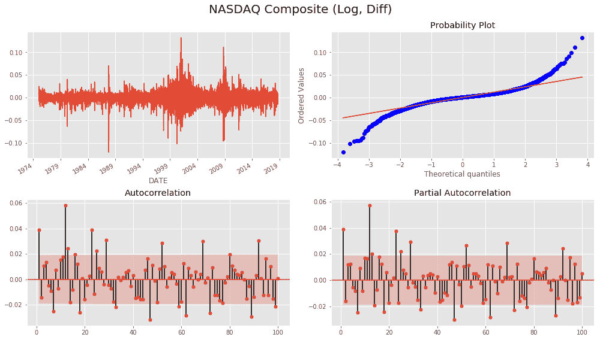
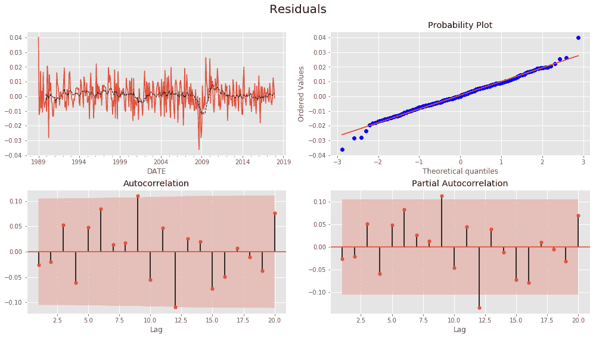
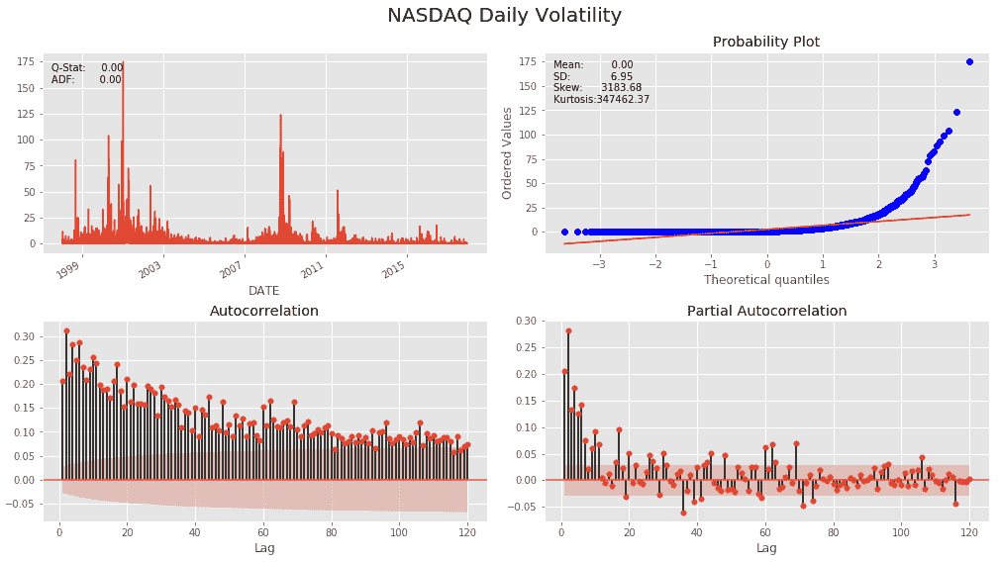
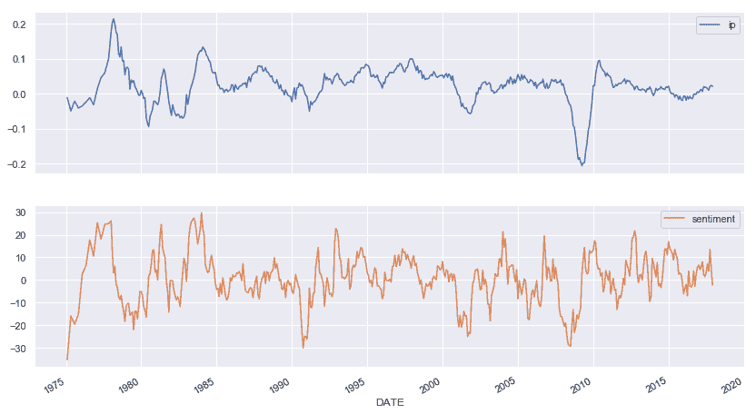
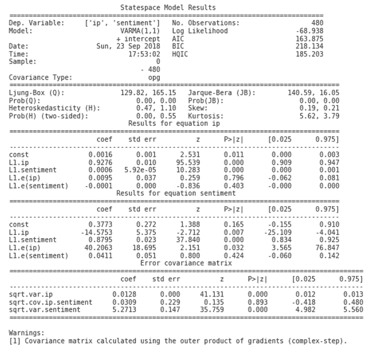
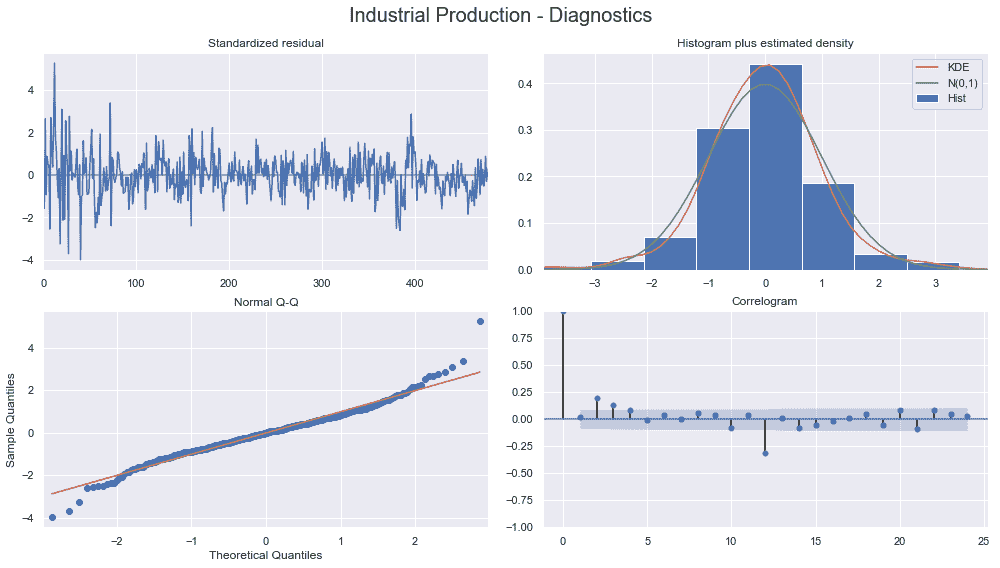

# 时间序列模型

在上一章中，我们重点关注了为横截面数据定制的线性模型，其中输入数据与它们旨在解释或预测的输出数据属于同一时间段。在这一章中，我们将关注时间序列数据，其中观察值因周期而异，这也创建了自然排序。我们的目标是识别数据中的历史模式，并利用这些模式来预测时间序列在未来的行为。

在上一章中，我们已经遇到了具有横截面和时间序列维度的面板数据，并了解了 Fama-Macbeth 回归如何估计在一段时间内和跨资产承担特定因素风险的价值。但是，不同时间的回报率之间的关系通常相当低，因此该过程可能会在很大程度上忽略时间维度。本章中的模型侧重于时间序列模型，其中过去的值包含关于未来发展的预测信号。时间序列模型还可以预测用于横截面模型的特征。

更具体地说，在这一章中，我们将重点放在从以前观察到的数据中提取信号来预测同一时间序列的未来值的模型上。交易的时间维度使得时间序列模型在市场、基本面和替代数据中的应用非常流行。随着越来越多的互联设备收集可能包含预测信号的定期测量，时间序列数据将变得更加普遍。主要应用包括资产回报、相关性或协方差或波动性的预测。

在这一章中，我们着重于线性时间序列模型，作为非线性模型的基线，如我们在本书第 4 部分中应用于时间序列数据的递归或卷积神经网络。我们通过引入工具来诊断时间序列特征，包括平稳性，并提取捕捉潜在模式的特征。然后，我们介绍了单变量和多变量时间序列模型，并应用它们来预测宏观数据和波动模式。我们以协整的概念和如何应用它来发展一个配对交易策略作为结论。

特别是，我们将涵盖以下主题:

*   如何使用时序分析来诊断为建模过程提供信息的诊断统计数据
*   如何估计和诊断自回归和移动平均时间序列模型
*   如何建立自回归条件异方差(ARCH)模型来预测波动性
*   如何建立向量自回归模型
*   如何将协整用于配对交易策略

# 用于诊断和特征提取的分析工具

时间序列数据是由离散时间间隔分隔的值序列，这些时间间隔通常是等间距的(缺失值除外)。时间序列通常被建模为由随机变量 y(t <sub>1</sub> )的集合组成的随机过程，...，y(t <sub>T</sub> ，每个时间点一个变量，t <sub>i</sub> ，i=1...单变量时间序列由每个时间点的单个值 y 组成，而多变量时间序列由可以用向量表示的几个观察值组成。

不同时间点 t <sub>i</sub> ，t <sub>j</sub> 之间的周期数δT = T<sub>I</sub>-T<sub>j</sub>，称为滞后，每个时间序列有 T-1 个滞后。正如给定时间点不同变量之间的关系是横截面模型的关键一样，由给定滞后分隔的数据点之间的关系是分析和利用时间序列模式的基础。对于横截面模型，我们区分输入和输出变量，或目标和预测，分别用标签 y 和 x。在时间序列环境中，结果的滞后值在横截面环境中扮演输入值或 x 值的角色。

一个时间序列称为白噪声如果它是一个独立同分布的随机变量序列，ε <sub>t</sub> ，具有有限的均值和方差。特别是，如果随机变量正态分布，均值为零，方差为σ，则该序列称为高斯白噪声。

如果一个时间序列可以写成过去干扰的加权和，ε <sub>t</sub> ，那么它就是线性的，这些干扰也被称为新息，这里假设它们代表白噪声，序列的均值μ:


时间序列分析的一个关键目标是理解由系数 a <sub>i</sub> 驱动的动态行为。时间序列分析提供了针对这类数据的方法，目的是提取有用的模式，进而帮助我们建立预测模型。为此，我们将介绍最重要的工具，包括分解成关键的系统元素、自相关分析和滚动窗口统计，如移动平均。线性时间序列模型通常对数据做出某些假设，例如平稳性，我们还将介绍概念、诊断工具和实现平稳性的典型转换。

对于本章中的大多数例子，我们使用美联储提供的数据，您可以使用我们在[第 2 章](02.html)、*市场和基本面数据*中介绍的`pandas datareader`来访问这些数据。本节的代码示例可在笔记本`tsa_and_arima`中找到。

# 如何分解时间序列模式

时间序列数据通常包含各种模式的组合，这些模式可以分解为几个部分，每个部分代表一个基本的模式类别。特别是，时间序列通常由系统成分趋势、季节性和周期以及非系统噪声组成。这些成分可以组合在一个加性的线性模型中，特别是当波动不依赖于级数的水平时，或者组合在一个非线性的乘法模型中。

这些组件可以自动拆分。`statsmodels`包括一个简单的方法，使用移动平均将时间序列分割成趋势、季节和剩余部分。我们可以将其应用于具有强劲趋势和季节性成分的工业制造生产月度数据，如下所示:

```
import statsmodels.tsa.api as tsa
industrial_production = web.DataReader('IPGMFN', 'fred', '1988', '2017-12').squeeze()
components = tsa.seasonal_decompose(industrial_production, model='additive')
ts = (industrial_production.to_frame('Original')
      .assign(Trend=components.trend)
      .assign(Seasonality=components.seasonal)
      .assign(Residual=components.resid))
ts.plot(subplots=True, figsize=(14, 8));
```

生成的图表显示了添加剂成分。假设趋势和季节性成分更具确定性，更易于简单推断，剩余成分将是额外建模的重点:


GitHub 上的参考资料中包含了更复杂的基于模型的方法。

# 如何计算滚动窗口统计数据

给定时间序列数据的连续排序，自然会计算给定长度的周期的常见描述性统计，以检测行为的稳定性或变化，并获得捕捉系统方面同时过滤掉噪声的平滑表示。

滚动窗口统计服务于这一过程:它们产生一个新的时间序列，其中每个数据点代表为原始数据的某一时期计算的汇总统计。均线是最熟悉的例子。原始数据点可以以相等的权重进入计算，或者例如使用权重来强调更近的数据点。指数移动平均递归计算距离现在较远的数据点收缩或衰减的权重。新的数据点通常是所有先前数据点的汇总，但是它们也可以从周围的窗口中计算出来。

`pandas`库包括非常灵活的功能来定义各种窗口类型，包括滚动、指数加权和扩展窗口。第二步，您可以对窗口捕获的每个数据进行计算。这些计算包括针对单个系列的内置标准计算，如多个系列的平均值或总和、相关性或协方差，以及用户定义的函数。下一节中的移动平均和指数平滑示例利用了这些工具。

# 移动平均线和指数平滑

早期的预测模型包括带指数权重的移动平均模型，称为指数平滑模型。我们将再次遇到移动平均线作为线性时间序列的关键组成部分。

依赖于指数平滑方法的预测使用过去观测值的加权平均值，其中权重随着观测值变老而指数衰减。因此，更近的观察得到更高的相关权重。这些方法对于没有非常复杂或突变模式的时间序列很流行。

指数平滑是一种基于过去观测值的加权平均值的流行技术，随着观测值变老，权重呈指数衰减。换句话说，观察越近，相关的权重越高。这一框架可以快速生成可靠的预测，并适用于大范围的时间序列，这是一个很大的优势，对工业应用非常重要。

# 如何测量自相关

自相关(也称为序列相关)将相关概念应用于时间序列环境:正如相关系数衡量两个变量之间的线性关系强度一样，自相关系数ρ <sub>k</sub> 衡量由给定滞后 k 分隔的时间序列值之间的线性关系程度:


因此，我们可以为时间序列中的每个 T-1 滞后计算一个自相关系数；t 是数列的长度。自相关函数(ACF)将相关系数计算为滞后的函数。

大于 1 的滞后(即，相隔一个以上时间步长的观测值之间)的自相关反映了这些观测值之间的直接相关性和中间数据点的间接影响。偏相关消除了这种影响，只测量给定滞后距离的数据点之间的线性相关性。**部分自相关函数** ( **PACF** )提供了一旦在较短滞后处的相关效应被去除后产生的所有相关。

存在基于 PACF 和 ACF 之间的精确理论关系从样本自相关估计部分自相关的算法。

相关图只是连续滞后的 ACF 或 PACF 的曲线图，k=0，1，...它允许我们一目了然地检查跨越滞后的相关结构。相关图的主要用途是在去除确定性趋势或季节性的影响后检测任何自相关。ACF 和 PACF 都是设计线性时间序列模型的关键诊断工具，我们将在下一节时间序列转换中回顾 ACF 和 PACF 图的例子。

# 如何诊断和实现平稳性

平稳时间序列的统计属性(如均值、方差或自相关)与周期无关，也就是说，它们不会随时间而改变。因此，平稳性意味着时间序列不具有趋势或季节效应，并且在为不同的滚动窗口进行计算时，描述性统计数据(如平均值或标准差)是恒定的，或者不会随时间发生很大变化。它恢复到均值，偏差具有恒定的幅度，而短期运动在统计意义上看起来总是相同的。

更正式地说，严格平稳性要求时间序列观测值的任何子集的联合分布相对于所有时刻独立于时间。因此，除了均值和方差之外，诸如偏斜度和峰度之类的高阶矩也需要保持不变，而不考虑不同观测值之间的滞后。在大多数应用中，我们将平稳性限制在一阶和二阶矩，这样时间序列是具有恒定均值、方差和自相关的协方差平稳的。

请注意，我们特别考虑了不同滞后的观测值之间的相关性，就像我们希望线性回归的输入数据与结果相关一样。平稳性意味着这些关系是稳定的，这有助于预测，因为模型可以专注于学习在稳定的统计属性内发生的系统模式。这很重要，因为经典的统计模型假设时间序列输入数据是平稳的。

以下部分介绍了有助于检测数据何时不稳定的诊断，以及有助于满足这些假设的转换。

# 时间序列转换

为了满足线性时间序列模型的平稳性假设，我们需要转换原始时间序列，通常需要分几个步骤。常见的转换包括应用(自然)对数将指数增长模式转换为线性趋势并稳定方差。通缩意味着将一个时间序列除以另一个导致趋势行为的序列，例如，将一个名义序列除以一个价格指数，以将其转换为真实的度量。

如果一个序列回复到一个稳定的长期线性趋势，那么它就是趋势稳定的。通常可以通过使用线性回归拟合趋势线并使用残差，或者通过将时间指数作为独立变量包含在回归或 AR(I)MA 模型中(见下一节单变量时间序列模型)，可能与记录或缩减相结合，使其成为平稳的。

在许多情况下，去趋势化不足以使序列稳定。相反，我们需要将原始数据转换成一系列不同时期和/或不同季节的差异。换句话说，我们使用相邻数据点或季节性滞后值相减的结果。请注意，当这种差异应用于对数转换序列时，结果代表金融环境中的瞬时增长率或回报率。

如果一个单变量序列在差分 d 次后变得平稳，则称其为 d 阶的积分，或者如果 d=1，则称其为简单积分。这种行为是由于所谓的单位根。

# 如何诊断和解决单位根

单位根给确定使时间序列平稳的变换带来了特殊的问题。时间序列通常被建模为以下自回归形式的随机过程，我们将作为 ARIMA 模型的构建模块对其进行更详细的研究:


其中当前值是过去值加上随机干扰的加权和。这种过程具有以下形式的特征方程:


如果这个方程的一个根等于 1，那么这个过程被称为有一个单位根。它将是不稳定的，但不一定需要有一个趋势。如果特征方程的剩余根的绝对值小于 1，则该过程的一阶差分将是平稳的，并且该过程被积分(1 阶)或 I(1)。对于绝对值大于 1 的附加根，积分的阶数更高，并且将需要附加的差分。

在实践中，利率或资产价格的时间序列通常不是稳定的，例如，因为不存在序列返回的价格水平。非平稳序列最突出的例子是价格时间序列 p <sub>t</sub> 的随机游走，对于给定的起始价格 p <sub>0</sub> (例如，股票的 IPO 价格)和满足以下条件的白噪声扰动ε:


重复代入表明，当前值 p <sub>t</sub> 是所有先前扰动或创新ε和初始价格 p <sub>0</sub> 的总和。如果方程中包含一个常数项，则称随机游动有漂移。因此，随机游走是以下形式的自回归随机过程:


具有特征方程，其具有单位根，并且是非平稳的和一阶积分的。一方面，给定ε的独立同分布性质，时间序列的方差等于σ <sup>2</sup> ，它不是二阶平稳的，这意味着原则上，该序列可以随着时间的推移而呈现任何变量。另一方面，取第一个差，δp<sub>t =</sub>p<sub>t</sub>-p<sub>t-1</sub>，剩下δp<sub>t</sub>=ε<sub>t</sub>，给定关于ε的统计假设，它是固定的。

单位根非平稳序列的定义特征是长记忆性:因为当前值是过去扰动的总和，所以大的创新比均值回复平稳序列持续更长时间。

除了使用相邻数据点之间的差异来移除恒定的变化模式之外，它还可以用于应用季节差异来移除季节变化模式。这包括在一个代表季节模式长度的滞后距离上取值的差，这个滞后距离是四个季度或 12 个月，以消除季节性和线性趋势。

识别正确的变换，特别是用于差分的适当的数量和滞后并不总是清晰的。提出了一些规则，总结如下:

*   **高达 10+滞后的正自相关**:可能需要高阶差分。
*   **Lag-1 自相关接近于零或负值，或一般较小且无模式**:不需要高阶差分。
*   **滞后-1 自相关< -0.5** :序列可能过差。
*   略微过度或不足的差异可以用 AR 或 MA 项来纠正。
*   最佳差分通常产生最低的标准差，但并不总是如此。
*   没有差异的模型假设原始序列是稳定的，包括均值回复。它通常包括一个常数项，以允许非零均值。
*   具有一阶差分的模型假设原始序列具有恒定的平均趋势，并且应该包括一个常数项。
*   具有两个差分阶的模型假设原始序列具有时变趋势，并且不应包含常数。

一些作者建议将分数差分作为一种更灵活的方法来呈现积分序列的平稳性，并且可能能够比简单的或离散间隔的季节差异保留更多的信息或信号(参见 GitHub 上的参考资料)。

# 单位根检验

统计单位根检验是客观确定是否需要(附加)差异的一种常用方法。这些是平稳性的统计假设检验，旨在确定是否需要差异。

扩展的 Dickey-Fuller (ADF)检验评估了一个时间序列样本相对于平稳性有单位根的零假设。它对时间趋势、第一个滞后和所有滞后差异的差异时间序列进行回归，并根据滞后时间序列值的系数值计算检验统计量。`statsmodels`易于实施(见配套笔记本)。

形式上，时间序列 y <sub>t</sub> 的 ADF 测试运行线性回归:


其中，α是常数，β是时间趋势的系数，p 是指模型中使用的滞后次数。α=β =0 约束意味着随机行走，而只有β =0 约束意味着有漂移的随机行走。滞后阶数通常使用第 7 章、*线性模型*中介绍的 AIC 和 BIC 信息标准来决定。

ADF 检验统计使用样本系数γ，在单位根非平稳性的零假设下，γ等于零，否则为负。它旨在证明，对于一个完整的序列，滞后序列值不应提供有用的信息来预测滞后差异之上和之外的第一个差异。

# 如何应用时间序列转换

下图显示了截至 2017 年的 30 年间纳斯达克股票指数和工业生产的原始时间序列，以及分别应用对数和随后应用第一和季节差异(滞后 12)后的转换版本。图表还显示了 ADF p 值，这使我们能够在两种情况下的所有变换后拒绝单位根非平稳性假设:


我们可以使用 Q-Q 图进一步分析转换后序列的相关时间序列特征，该图将时间序列观测值的分布分位数与正态分布分位数以及基于 ACF 和 PACF 的相关图进行比较。

对于纳斯达克图，我们注意到，虽然没有趋势，但方差不是恒定的，而是在 20 世纪 80 年代末、2001 年和 2008 年的市场动荡期间出现了集群峰值。Q-Q 图突出了分布的厚尾，其极值比正态分布更频繁。ACF 和 PACF 显示出相似的模式，在几个明显的滞后处具有自相关性:



对于工业制造业生产的月度时间序列，我们注意到 2008 年危机后出现了一个大的负异常值，以及 Q-Q 图中相应的偏斜。自相关性远高于纳斯达克收益和平稳下跌。PACF 在滞后 1 和 13 处显示明显的正自相关模式，在滞后 3 和 4 处显示显著的负系数:


# 单变量时间序列模型

多重线性回归模型将感兴趣的变量表示为预测值或输入变量的线性组合。单变量时间序列模型将感兴趣时间点的时间序列值与该序列的滞后值和可能的过去干扰项的线性组合联系起来。

指数平滑模型基于对数据趋势和季节性的描述，而 ARIMA 模型旨在描述数据的自相关性。ARIMA(p，d，q)模型需要平稳性，并利用两个构件:

*   由时间序列的 p 滞后值组成的**自回归** ( **AR** )项
*   **包含 q 滞后扰动的移动平均** ( **MA** )项

I 代表积分，因为该模型可以通过对序列 d 时间进行微分来说明单位根非平稳性。术语“自回归”强调 ARIMA 模型意味着时间序列对其自身值的回归。

我们将介绍 ARIMA 构件、简单自回归(AR)和移动平均(MA)模型，并解释如何将它们结合到自回归移动平均(ARMA)模型中，这些模型可能会将序列积分作为 ARIMA 模型，或者将外生变量作为 AR(I)MAX 模型。此外，我们将说明如何包括季节性 AR 和 MA 术语，以扩展工具箱，使其也包括 SARMAX 模型。

# 如何建立自回归模型

p 阶 AR 模型旨在捕捉不同滞后时间序列值之间的线性相关性，可写成如下形式:


这非常类似于对 y <sub>t</sub> 的滞后值的多元线性回归。该模型具有以下特征方程:


这个方程的解在 x 中的逆是特征根，如果这些根的绝对值都小于 1，则 AR(p)过程是平稳的，否则是不稳定的。对于平稳序列，多步预测将收敛于序列的平均值。

我们可以用熟悉的最小二乘法使用 p+1 来估计模型参数，...T 观察，以确保每个滞后期和结果都有数据。

# 如何确定滞后的数量

实际上，挑战在于决定滞后项的适当顺序 p。用于序列相关性的时间序列分析工具起着关键作用。ACF 估计不同滞后的观测值之间的自相关，这反过来又是直接和间接线性相关的结果。

因此，对于 k 阶的 AR 模型，ACF 将在滞后 k 之前表现出显著的序列相关性，并且由于线性关系的间接效应导致的惯性，ACF 将延伸到随后的滞后，并且最终随着效应的减弱而减弱。另一方面，PACF 仅测量相隔给定滞后的观测值之间的直接线性关系，因此它不会反映超过 *k* 的滞后的相关性。

# 如何诊断模型拟合

如果模型捕捉到滞后之间的线性相关性，那么残差应该类似于白噪声。

除了检查 ACF 以验证不存在显著的自相关系数之外，Ljung-Box Q 统计允许我们测试残差序列遵循白噪声的假设。零假设是所有 m 个序列相关系数都是零，而另一种情况是一些系数不是零。对于不同的滞后 k，检验统计量从样本自相关系数ρ <sub>k</sub> 计算得出，并遵循χ<sup>2</sup>分布:


正如我们将看到的，`statsmodels`提供了关于不同滞后的系数的重要性的信息，不重要的系数应该被去除。如果 Q 统计量拒绝无自相关的零假设，您应该考虑额外的 AR 项。

# 如何建立移动平均线模型

q 阶 MA 模型使用 q 个过去的扰动，而不是类似回归模型中时间序列的滞后值，如下所示:


由于我们没有观察到白噪声扰动值，ε <sub>t</sub> ，MA(q)不是我们目前所看到的那种回归模型。不使用最小二乘法，而是使用**最大似然** ( **MLE** )来估计 MA(q)模型，或者在序列开始时初始化或估计扰动，然后递归和迭代地计算剩余部分。

MA(q)模型得名于将 y <sub>t</sub> 的每个值表示为过去 q 个新息的加权移动平均值。换句话说，当前的估计代表了相对于模型所产生的过去误差的修正。移动平均在 MA(q)模型中的使用不同于指数平滑或季节时间序列成分的估计，因为 MA(q)模型旨在预测未来值，而不是去噪或估计过去值的趋势周期。

MA(q)过程总是平稳的，因为它们是本身平稳的白噪声变量的加权和。

# 如何确定滞后的数量

由 MA(q)过程产生的时间序列由来自 q 先验模型预测的残差驱动。因此，MA(q)过程的 ACF 将显示直到滞后 q 的值的重要系数，然后急剧下降，因为这是序列值被假定已经产生的方式。

# AR 模型和 MA 模型的关系

AR(p)模型可以表示为使用重复替换的 MA(∞)过程。当对其系数(MA(q)过程)的大小施加约束时，它变得可逆，并且可以表示为 AR(∞)过程。

# 如何构建 ARIMA 模型和扩展

自回归综合移动平均 ARIMA(p，d，q)模型结合了 AR(p)和 MA(q)过程，以利用这些构建模块的互补性，并通过使用更紧凑的形式和减少参数数量来简化模型开发，从而降低过度拟合的风险。

这些模型还通过使用时间序列值的 d <sup>th</sup> 差来消除单位根的不稳定性。ARIMA(p，1，q)模型与使用序列一阶差分的 ARMA(p，q)模型是一样的。使用 y '表示非季节性差异 d 次后的原始序列，ARIMA(p，d，q)模型简单来说就是:


ARIMA 模型也是使用最大似然估计的。取决于实现方式，高阶模型通常可以包含低阶模型。例如，`statsmodels`包括所有低阶 p 和 q 项，并且不允许移除低于最高值的滞后系数。在这种情况下，高阶模型总是更适合。注意不要使用太多的术语使你的模型过度适应数据。

# 如何识别 AR 和 MA 术语的数量

由于 AR(p)和 MA(q)项相互影响，由 ACF 和 PACF 提供的信息不再可靠，只能用作起点。

传统上，在选择模型设计时，AIC 和 BIC 信息标准被用于依赖样本内拟合。或者，我们可以依靠样本外测试来交叉验证多个参数选择。

以下总结提供了在单独考虑 AR 和 MA 模型的情况下选择模型顺序的一些通用指导:

*   PACF 截断的滞后是指示的 AR 项的数目。如果差分序列的 PACF 突然截止和/或滞后-1 自相关为正，则添加一个或多个 AR 项。
*   ACF 切断超过的延迟是指示的 MA 项的数量。如果差分序列的 ACF 显示一个锐截止点和/或滞后-1 自相关为负，则考虑在模型中添加一个 MA 项。
*   AR 和 MA 项可能会抵消彼此的影响，因此，如果您的模型同时包含 AR 和 MA 项，请始终尝试将它们的数量减少 1，以避免过度拟合，尤其是如果更复杂的模型需要 10 次以上的迭代才能收敛。
*   如果 AR 系数的总和接近 1，并表明模型的 AR 部分有一个单位根，则消除 1 个 AR 项，并对模型进行一次(多次)差分。
*   如果 MA 系数的总和接近 1，并表明模型的 MA 部分有一个单位根，则消除 1 MA 项，并将差分阶数减少 1。
*   不稳定的长期预测表明，在模型的 AR 或 MA 部分可能存在单位根。

# 添加功能–ARMAX

ARMAX 模型在 ARMA 时间序列模型的右侧添加输入变量或协变量(假设序列是平稳的，因此我们可以跳过差分):


这类似于线性回归模型，但很难解释，因为β对 y <sub>t</sub> 的影响不同于线性回归中 x <sub>t</sub> 增加一个单位的影响。相反，等式右侧 y <sub>t</sub> 的滞后值的存在意味着，只有给定响应变量的滞后值，才能解释该系数，这很难做到直观。

# 添加季节差异–SARIMAX

对于有季节性影响的时间序列，我们可以包括 AR 和 MA 项来捕捉季节性的周期性。例如，当使用月度数据时，季节性影响长度为一年，季节性 ar 和 MA 项将反映这一特殊的滞后长度。

ARIMAX(p，D，Q)模型就变成了 SARIMAX(p，D，q) x (P，D，Q) <sub>s</sub> 模型，这个模型写起来有点复杂，但是 GitHub 上的参考资料，包括 statsmodels 文档，提供了详细的信息。

我们现在将建立一个使用宏观数据的季节性 ARMA 模型来说明实施。

# 如何预测宏观基本面

我们将为 1988-2017 年期间工业生产时间序列的月度数据建立一个 SARIMAX 模型。如第一节分析工具所示，数据已经过对数转换，我们使用的是季节(滞后 12 年)差异。我们使用 10 年训练数据的滚动窗口来估计一系列普通和常规 AR 和 MA 参数的模型，并评估 1 步预测的 RMSE，如以下简化代码所示(有关详细信息，请参见 GitHub):

```
for p1 in range(4):                # AR order
    for q1 in range(4):            # MA order
        for p2 in range(3):        # seasonal AR order
            for q2 in range(3):    # seasonal MA order
                y_pred = []
                for i, T in enumerate(range(train_size, len(data))):
                    train_set = data.iloc[T - train_size:T]
                    model = tsa.SARIMAX(endog=train_set,            # model specification
                                        order=(p1, 0, q1),
                                        seasonal_order=(p2, 0, q2, 12)).fit()

                    preds.iloc[i, 1] = model.forecast(steps=1)[0]    # 1-step ahead forecast

                mse = mean_squared_error(preds.y_true, preds.y_pred)
                test_results[(p1, q1, p2, q2)] = [np.sqrt(mse),
                                                  preds.y_true.sub(preds.y_pred).std(),
                                                  np.mean(aic)]
```

我们还收集了 AIC 和 BIC 标准，它们显示了 0.94 的非常高的等级相关系数，BIC 比 AIC 更喜欢参数略少的模型。RMSE 评选的最佳五款车型是:

```
                 RMSE         AIC         BIC
p1 q1 p2 q2                                  
2  3  1  0   0.009323 -772.247023 -752.734581
3  2  1  0   0.009467 -768.844028 -749.331586
2  2  1  0   0.009540 -770.904835 -754.179884
   3  0  0   0.009773 -760.248885 -743.523935
   2  0  0   0.009986 -758.775827 -744.838368

```

我们重新估计一个 SARIMA(2，0，3) x (1，0，0)模型，如下所示:

```
best_model = tsa.SARIMAX(endog=industrial_production_log_diff, order=(2, 0, 3),
                         seasonal_order=(1, 0, 0, 12)).fit()
print(best_model.summary())
```

我们得到以下总结:


系数是显著的，并且 Q 统计量拒绝进一步自相关的假设。相关图同样表明我们已经成功消除了序列的自相关:



# 如何使用时间序列模型预测波动率

单变量时间序列模型的一个特别重要的应用领域是波动性的预测。金融时间序列的波动性通常不是随时间恒定不变的，而是不断变化的，波动性的发作聚集在一起。方差的变化给使用经典 ARIMA 模型进行时间序列预测带来了挑战。为了应对这一挑战，我们现在将对波动性进行建模，以便我们可以预测方差的变化。

异方差是变量方差变化的专业术语。**自回归条件异方差** ( **ARCH** )模型将误差项的方差表示为前期误差的函数。更具体地说，它假设误差方差遵循 AR(p)模型。

**广义自回归条件异方差** ( **GARCH** )模型将范围扩大到 ARMA 模型。时间序列预测通常将 ARIMA 模型与 ARCH/GARCH 模型相结合，前者用于预测时间序列的预期均值，后者用于预测时间序列的预期方差。2003 年诺贝尔经济学奖授予了罗伯特·恩格尔和克莱夫·格兰杰，以表彰他们开发了这类模型。前者还在纽约大学斯特恩商学院(参见 GitHub references)管理着 Volatility Lab，该实验室拥有大量关于我们将讨论的模型及其大量扩展的在线示例和工具。

# 自回归条件异方差(ARCH)模型

ARCH(p)模型是一个简单的 AR(p)模型，应用于时间序列模型的残差方差，使时间 t 的方差取决于方差的滞后观测值。更具体地，误差项ε <sub xmlns:epub="http://www.idpf.org/2007/ops">t</sub> 是原始时间序列上的线性模型(例如 ARIMA)的残差，并且被分成时间相关的标准差σ <sub xmlns:epub="http://www.idpf.org/2007/ops">t</sub> 和扰动*z<sub>t</sub>T7】，如下所示:*


可以使用 OLS 来估计 ARCH(p)模型。Engle 提出了一种使用拉格朗日乘数检验来确定适当 ARCH 阶的方法，该检验对应于假设线性回归中所有系数为零的 f 检验(参见[第 7 章](07.html)、*线性模型*)。

该模型的一个优势是它产生了波动性，估计了正的过度峰度——即相对于正态分布的厚尾——这反过来又符合关于回报的经验观察。缺点包括，该模型假设正负波动冲击的影响相同，因为它取决于之前冲击的平方，而资产价格对正负冲击的反应不同。ARCH 模型也没有提供对金融时间序列变化来源的新见解，因为它只是机械地描述了条件方差。最后，ARCH 模型可能会过度预测波动性，因为它们对收益率序列的大的、孤立的冲击反应缓慢。

对于适当指定的 ARCH 模型，标准化残差(除以标准差周期的模型估计值)应该类似于白噪声，并且可以接受 Ljung-Box Q 测试。

# 广义 ARCH——GARCH 模型

ARCH 模型相对简单，但通常需要许多参数来捕捉资产收益序列的波动模式。**广义 ARCH** ( **GARCH** )模型适用于具有扰动的对数收益序列 r <sub>t</sub> ，ε <sub>t</sub> = r <sub>t</sub> - μ，其遵循 GARCH(p，q)模型，如果:


GARCH(p，q)模型假设误差项的方差为 ARMA(p，q)模型，ε <sub>t</sub> 。

与 ARCH 模型类似，GARCH(1，1)过程的尾部分布比正态分布更重。该模型遇到了与 ARCH 模型相同的弱点。例如，它对正面和负面冲击的反应是一样的。

# 选择延迟顺序

要配置 ARCH 和 GARCH 模型的滞后阶数，请使用经过训练的时间序列的残差平方来预测原始序列的平均值。残差以零为中心，所以它们的平方也是方差。然后检查平方残差的 ACF 和 PACF 图，以识别时间序列方差中的自相关模式。

# 如何建立波动率预测模型

资产回报系列的波动性模型的开发包括四个步骤:

1.  根据 ACF 和 PACF 揭示的序列相关性，建立金融时间序列的 ARMA 时间序列模型。
2.  测试 ARCH/GARCH 效应模型的残差，再次依赖于 ACF 和 PACF 的残差平方序列。
3.  如果序列相关效应显著，指定一个波动率模型，并联合估计均值和波动率方程。
4.  仔细检查拟合的模型，并在必要时进行调整。

当对收益序列进行波动性预测时，序列相关性可能会受到限制，因此可以使用常数均值代替 ARMA 模型。

`arch`库提供了几个选项来估计波动预测模型。它提供了几个选项来模拟预期均值，包括常数均值、上面单变量时间序列模型一节中讨论的 AR(p)模型，以及最近的异质自回归过程(HAR ),使用每日(1 天)、每周(5 天)和每月(22 天)滞后来捕捉短期、中期和长期投资者的交易频率。

均值模型可以与几个条件异方差模型联合定义和估计，除了 ARCH 和 GARCH，这些模型还包括**指数 GARCH** ( **EGARCH** )模型，它允许正负回报之间的不对称效应，以及**异质 ARCH** ( **HARCH** )模型，它是对 HAR 均值模型的补充。

我们将使用 1998 年至 2017 年的每日纳斯达克回报来演示 GARCH 模型的用法(详见笔记本`arch_garch_models`):

```
nasdaq = web.DataReader('NASDAQCOM', 'fred', '1998', '2017-12-31').squeeze()
nasdaq_returns = np.log(nasdaq).diff().dropna().mul(100) # rescale to facilitate optimization
```

重新调整后的日收益率序列仅表现出有限的自相关性，但与均值的平方偏差确实有很大的记忆性，反映在缓慢衰减的 ACF 和前两个的 PACF 高点中，并且仅在前六个滞后期后截止:

```
plot_correlogram(nasdaq_returns.sub(nasdaq_returns.mean()).pow(2), lags=120, title='NASDAQ Daily Volatility')
```

函数`plot_correlogram`产生以下输出:



因此，我们可以估计一个 GARCH 模型来捕捉过去波动率的线性关系。我们将使用滚动的 10 年窗口来估计一个 GARCH(p，q)模型，其中 p 和 q 的范围为 1-4，以生成一步样本外预测。然后，我们将预测波动率的 RMSE 与收益率与其均值的实际方差进行比较，以确定最具预测性的模型。我们使用 winsorized 数据来限制极端回报值的影响，这反映在波动性的非常高的正偏差中:

```
trainsize = 10 * 252  # 10 years
data = nasdaq_returns.clip(lower=nasdaq_returns.quantile(.05),
                           upper=nasdaq_returns.quantile(.95))
T = len(nasdaq_returns)
test_results = {}
for p in range(1, 5):
    for q in range(1, 5):
        print(f'{p} | {q}')
        result = []
        for s, t in enumerate(range(trainsize, T-1)):
            train_set = data.iloc[s: t]
            test_set = data.iloc[t+1]  # 1-step ahead forecast
            model = arch_model(y=train_set, p=p, q=q).fit(disp='off')
            forecast = model.forecast(horizon=1)
            mu = forecast.mean.iloc[-1, 0]
            var = forecast.variance.iloc[-1, 0]
            result.append([(test_set-mu)**2, var])
        df = pd.DataFrame(result, columns=['y_true', 'y_pred'])
        test_results[(p, q)] = np.sqrt(mean_squared_error(df.y_true, df.y_pred))
```

GARCH(2，2)模型实现了最低的 RMSE(与 GARCH(4，2)的值相同，但参数更少)，因此我们继续估计该模型以检查摘要:

```
am = ConstantMean(nasdaq_returns.clip(lower=nasdaq_returns.quantile(.05),
                                      upper=nasdaq_returns.quantile(.95)))
am.volatility = GARCH(2, 0, 2)
am.distribution = Normal()
model = am.fit(update_freq=5)
print(model.summary())
```

输出显示了最大化的对数似然以及 AIC 和 BIC 标准，当基于样本内性能选择模型时，这些标准通常被最小化(参见[第 7 章](07.html)、*线性模型*)。它还显示均值模型的结果，在这种情况下，它只是一个常数估计值，以及常数ω的 GARCH 参数、AR 参数α和 MA 参数β，所有这些参数都具有统计显著性:


现在让我们探索多个时间序列的模型和协整的概念，这将实现一个新的交易策略。

# 多元时间序列模型

多元时间序列模型旨在同时捕捉多个时间序列的动态，并利用这些序列之间的相关性进行更可靠的预测。

# 方程组

单变量时间序列模型，如我们刚刚讨论的 ARMA 方法，在 ARMAX 情况下，仅限于目标变量及其滞后值或滞后干扰和外生序列之间的统计关系。相反，多元时间序列模型也允许其他时间序列的滞后值影响目标。这种效果适用于所有系列，导致复杂的交互，如下图所示:


除了潜在的更好的预测，多变量时间序列也用于获得跨系列依赖性的洞察力。例如，在经济学中，多变量时间序列用于理解一个变量(如利率)的政策变化如何影响不同时期的其他变量。我们将要研究的多变量模型产生的脉冲响应函数就是为这个目的服务的，它允许我们模拟一个变量如何对其他变量的突然变化做出反应。格兰杰因果关系的概念分析一个变量在预测另一个变量时是否有用(在最小平方意义上)。此外，多元时间序列模型允许对预测误差方差进行分解，以分析其他序列是如何起作用的。

# 向量自回归(VAR)模型

我们将看到向量自回归 VAR(p)模型如何通过创建一个 k 方程系统将 AR(p)模型扩展到 k 系列，其中每个方程包含所有 k 系列的 p 个滞后值。在最简单的情况下， *k=2* 的 VAR(1)模型采用以下形式:


这个模型可以用矩阵形式更简洁地表达:


自身滞后的系数提供了关于序列本身动态的信息，而交叉变量系数提供了对序列间相互作用的一些洞察。该符号扩展到 k 系列和 p 阶，如下所示:


VAR(p)模型也需要平稳性，以便单变量时间序列建模的初始步骤能够继续。首先，研究系列并确定必要的变换，然后应用扩展的 Dickey-Fuller 测试来验证每个系列是否满足平稳性标准，否则应用进一步的变换。它可以根据初始信息或最大似然法用 OLS 条件进行估计，这对于正态分布误差是等价的，但在其他情况下则不是。

如果部分或全部 k 系列是单位根非平稳的，它们可能是协整的。将单位根概念扩展到多个时间序列意味着两个或多个序列的线性组合是稳定的，因此是均值回复的。VAR 模型不具备在不进行差分的情况下处理这种情况的能力，而是使用向量误差修正模型(VECM，参见 GitHub 上的参考资料)。我们将进一步探讨协整，因为如果协整存在并假设持续下去，它可以被用于配对交易策略。

滞后阶的确定也从每个序列的 ACF 和 PACF 中得到提示，但受到相同滞后阶适用于所有序列这一事实的限制。在模型估计之后，残差诊断也需要类似白噪声的结果，并且如果最终目标是使用模型进行预测，则模型选择可以使用样本内信息标准，或者优选地，样本外预测性能来交叉验证替代模型设计。

正如在单变量情况下所提到的，原始时间序列的预测要求我们在训练模型之前反转用于使序列稳定的转换。

# 如何使用 VAR 模型进行宏观基本面预测

我们将扩展工业生产月度数据的单一时间序列的单变量示例，并增加一个消费者情绪月度时间序列，两者都由美联储的数据服务提供。我们将使用熟悉的`pandas-datareader`库来检索从 1970 年到 2017 年的数据:

```
df = web.DataReader(['UMCSENT', 'IPGMFN'], 'fred', '1970', '2017-12').dropna()
df.columns = ['sentiment', 'ip']
```

对工业生产序列进行对数转换，并使用两个序列的滞后 12 进行季节差异计算，得出稳定的结果:

```
df_transformed = pd.DataFrame({'ip': np.log(df.ip).diff(12),
                              'sentiment': df.sentiment.diff(12)}).dropna()

test_unit_root(df_transformed) # see notebook for details and additional plots

          p-value
ip          0.0003
sentiment   0.0000
```

这给我们留下了以下系列:



为了限制输出的大小，我们将使用第一个 480 个观察值，使用具有恒定趋势的`statsmodels` `VARMAX`实现(允许可选的外生变量)来估计 VAR(1)模型:

```
model = VARMAX(df_transformed.iloc[:480], order=(1,1), trend='c').fit(maxiter=1000)
```

这会产生以下摘要:



输出包含两个时间序列方程的系数，如前面的 VAR(1)图所示。statsmodels 提供了诊断图来检查残差是否满足白噪声假设，而在这个简单的例子中并不完全满足白噪声假设:



样本外预测可以按如下方式生成:

```
preds = model.predict(start=480, end=len(df_transformed)-1)
```

实际值和预测值的可视化显示了预测如何滞后于实际值，并且没有很好地捕捉非线性样本外模式:


# 协整——具有共同趋势的时间序列

积分多元序列的概念是复杂的，因为过程的所有组成序列可以单独积分，但过程不是联合积分的，因为存在一个或多个序列的线性组合，产生新的平稳序列。

换句话说，两个协整序列的组合有一个稳定的均值，这个线性组合回复到这个均值。具有这种特征的多元序列称为协整序列。这也适用于当单个系列被更高阶地积分，并且线性组合降低了积分的总阶时。

协整不同于相关:两个序列可以高度相关，但不需要协整。例如，如果两个增长序列是彼此的常数倍数，则它们的相关性会很高，但是任何线性组合也会增长，而不是回复到平均值。

风险值分析仍然可以应用于使用风险值模型的误差修正形式的综合过程，该模型使用单个系列的第一差异加上水平中的误差修正项。

# 协整检验

检验协整有两种主要方法:

*   恩格尔-格兰杰两步方法
*   约翰森手术

Engle–Granger 方法包括对一个序列对另一个序列进行回归，然后对回归残差进行 ADF 单位根检验。如果零假设可以被拒绝，所以我们假设残差是平稳的，那么序列是协整的。这种方法的一个主要优点是回归系数代表使组合稳定的乘数，即均值回复。当利用协整进行配对交易策略时，我们将回到这个方面。另一方面，这种方法仅限于识别成对序列的协整，而不是更大的序列组。

相比之下，Johansen 程序测试了前一节中讨论的对一个**向量自回归** ( **VAR** )模型进行协整所施加的限制。更具体地，在从通用 VAR(p)前述等式的两侧减去目标向量之后，我们获得了**误差校正模型** ( **ECM** )公式:


所得到的修改后的 VAR(p)方程在各级中只有一个矢量项，即，不使用运算符δ表示为差。协整的性质取决于该项的系数矩阵π的性质，特别是它的秩。虽然这个等式在结构上看起来与 ADF 测试设置类似，但现在有几个潜在的共同趋势和积分顺序星座，因为涉及到多个系列。有关详细信息，请参见 GitHub 上列出的参考资料，包括关于单个系列扩展的实际挑战。

# 如何将协整用于配对交易策略

配对交易依赖于两个资产价格之间稳定的均值回归关系。换句话说，两种价格之间的比率或差异，也称为价差，可能会随着时间的推移而偏离，但最终会回到同一水平。给定这样的一对，策略包括做多(即购买)表现不佳的资产，因为它需要一段时间的优异表现来缩小差距。与此同时，人们会做空正方向偏离价格锚的资产，为购买提供资金。

协整恰恰代表了这种由一个共同的平均值锚定的两个价格序列之间的稳定关系。假设协整持续存在，最终必然会出现趋同，要么表现不佳的股票上涨，要么表现优异的股票下跌。无论如何，这种策略都是有利可图的，这种策略还有一个额外的好处，就是可以对冲总体市场波动。

然而，利差将不断变化，有时扩大，有时缩小，或者保持不变，因为两种资产同步移动。配对交易的挑战在于，随着价差的变化，通过调整相对持有量来维持对冲头寸。

在实践中，给定一系列资产，配对交易策略将通过对每一对资产进行统计测试来寻找共同整合的配对。这里的关键挑战是考虑多种测试偏差，如第六章、*机器学习工作流程*中的[所述。`statsmodels`库实现了 Engle-Granger 协整检验和 Johansen 检验。](06.html)

为了估计价差，运行线性回归以获得两个综合资产价格序列的线性组合的系数，从而产生一个固定的组合序列。如前所述，使用线性回归来估计系数被称为协整的恩格尔-格兰杰检验。

# 摘要

在这一章中，我们探讨了单变量情况下单个序列的线性时间序列模型，以及几个相互作用的序列的多变量模型。我们遇到了预测宏观基本面的应用、预测广泛用于风险管理的资产或投资组合波动性的模型、捕捉多个宏观系列动态的多元 VAR 模型，以及支持流行的配对交易策略的协整概念。

与前一章类似，我们看到了线性模型如何给模型增加了许多结构，也就是说，它们做出了强有力的假设，这些假设可能需要转换和大量的测试来验证这些假设是否得到满足。如果它们是，模型训练和解释是简单的，并且模型提供了一个很好的基线案例，更复杂的模型可以在此基础上改进，正如我们将在下面的章节中看到的。